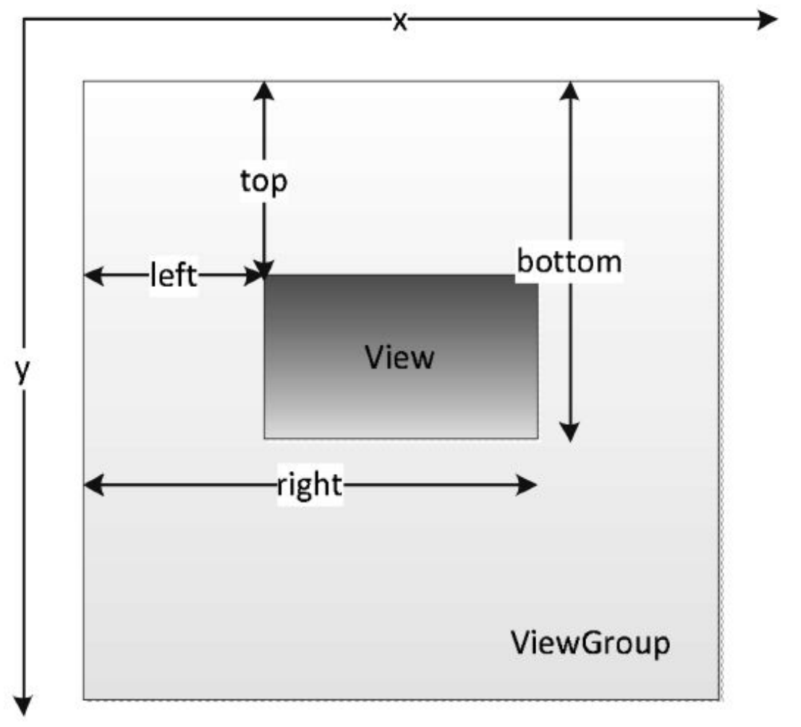

# 一、View 基础知识

**View是Android中所有控件的基类。**View是一种界面层的控件的一种抽象，它代表了一个控件。除了View，还有ViewGroup。在Android的设计中，ViewGroup也继承了View，这就意味着 View本身就可以是单个控件也可以是由多个控件组成的一组控件，通过这种关系就形成了View树的结构，这和Web前端中的DOM树的概念是相似的。Button显然是个View，而**LinearLayout不但是一个View而且还是一个ViewGroup**，而ViewGroup内部是可以有子View的，这个子View同样 还可以是ViewGroup，依此类推。

**View的位置**主要由它的四个顶点来决定，分别对应于View的四个属性：top、left、right、bottom，其中top是左上角纵坐标，left是左上角横坐标，right是右 下角横坐标，bottom是右下角纵坐标。需要注意的是，这些坐标都是相对于View的父容器来说的，因此它是一种相对坐标。

View增加了额外的几个参数：x、y、translationX和translationY，其中x和y是View左上角的坐标，而translationX和translationY是View左上 角相对于父容器的偏移量。

View在平移的过程中，top和left表示的是原始左上角的位置信息，其值并不会发生改变，此时发生改变的是x、y、translationX和 translationY这四个参数。

# 二、View 的滑动

通过三种方式可以实现View的滑动：第一种是通过View本身提供的scrollTo/scrollBy方法 来实现滑动；第二种是通过动画给View施加平移效果来实现滑动；第三种是通过改变View的LayoutParams使得View重新布局从而实现滑动。

第三种实现View滑动的方法，那就是改变布局参数，即改变LayoutParams。这个比较好理解了，比如我们想把一个Button向右平移100px，我 们只需要将这个Button的LayoutParams里的marginLeft参数的值增加100px即可。

**各种滑动方式的对比**

看scrollTo/scrollBy这种方式，它是View提供的原生方法，其作用是专门用于View的滑动，它可以比较方便地实现滑动效果并且不影响内部元素的单击 事件。但是它的缺点也是很显然的：它只能滑动View的内容，并不能滑动View本身。

在实际使用中，如果动画元素不需要响应用户的交互，那么使用动画来做滑动是比较 合适的，否则就不太适合。但是动画有一个很明显的优点，那就是一些复杂的效果必须要通过动画才能实现。

下改变布局这种方式，它除了使用起来麻烦点以外，也没有明显的缺点，它的主要适用对象是一些具有交互性的View，因为这些View需要和 用户交互，直接通过动画去实现会有问题。

scrollTo/scrollBy：操作简单，适合对View内容的滑动； 

动画：操作简单，主要适用于没有交互的View和实现复杂的动画效果； 

改变布局参数：操作稍微复杂，适用于有交互的View

# 三、弹性滑动

如何实现View的弹性滑动，比较生硬地滑动过去，这种方式的用户体验实在太差了，因此我们要实现渐近式滑动。实现方法有很多，但是它们都有一个共同思想：将一次大的滑动分成若干次小的滑动并在一个时间段内完成，弹性滑动的具体 实现方式有很多，比如通过Scroller、Handler#postDelayed以及Thread#sleep等。

# 四、View 事件分发机制

**点击事件的传递规则**

在介绍点击事件的传递规则之前，首先我们要明白这里要分析的对象就是MotionEvent，即点击事件。所谓点 击事件的事件分发，其实就是对MotionEvent事件的分发过程，即当一个MotionEvent产生了以后，系统需要把这个事件传递给一个具体的View，而这个传递的 过程就是分发过程。点击事件的分发过程由三个很重要的方法来共同完成：dispatchTouchEvent、onInterceptTouchEvent和onTouchEvent。 viewGroup中拥有这三个方法，而view没有onInterceptTouchEvent方法。

public boolean dispatchTouchEvent(MotionEvent ev) 用来进行事件的分发。如果事件能够传递给当前View，那么此方法一定会被调用，返回结果受当前View的onTouchEvent和下级View的dispatchTouchEvent 方法的影响，表示是否消耗当前事件。 

public boolean onInterceptTouchEvent(MotionEvent event) 在上述方法内部调用，用来判断是否拦截某个事件，如果当前View拦截了某个事件，那么在同一个事件序列当中，此方法不会被再次调用，返回结果表示是否拦截当前事件。 

public boolean onTouchEvent(MotionEvent event) 在dispatchTouchEvent方法中调用，用来处理点击事件，返回结果表示是否消耗当前事件，如果不消耗，则在同一个事件序列中，当前View无法再次接收 到事件。

大致了解点击事件的传递规则：对于一个根ViewGroup来说，点击事件 产生后，首先会传递给它，这时它的dispatchTouchEvent就会被调用，如果这个ViewGroup的onInterceptTouchEvent方法返回true就表示它要拦截当前事件，接着 事件就会交给这个ViewGroup处理，即它的onTouchEvent方法就会被调用；如果这个ViewGroup的onInterceptTouchEvent方法返回false就表示它不拦截当前事件， 这时当前事件就会继续传递给它的子元素，接着子元素的dispatchTouchEvent方法就会被调用，如此反复直到事件被最终处理。

当一个View需要处理事件时，如果它设置了OnTouchListener，那么OnTouchListener中的onTouch方法会被回调。这时事件如何处理还要看onTouch的返回 值，如果返回false，则当前View的onTouchEvent方法会被调用；如果返回true，那么onTouchEvent方法将不会被调用。由此可见，给View设置的 OnTouchListener，其优先级比onTouchEvent要高。在onTouchEvent方法中，如果当前设置的有OnClickListener，那么它的onClick方法会被调用。可以看出，平时 我们常用的OnClickListener，其优先级最低，即处于事件传递的尾端。

当一个点击事件产生后，它的传递过程遵循如下顺序：Activity -> Window -> View，即事件总是先传递给Activity，Activity再传递给Window，最后Window 再传递给顶级View。顶级View接收到事件后，就会按照事件分发机制去分发事件。考虑一种情况，如果一个View的onTouchEvent返回false，那么它的父容器 的onTouchEvent将会被调用，依此类推。如果所有的元素都不处理这个事件，那么这个事件将会最终传递给Activity处理，即Activity的onTouchEvent方法会被调 用。

**事件一定会经过Activity吗？**

不是的。我们的程序界面的顶层ViewGroup，也就是decorView中注册了Activity这个callBack，所以当程序的主界面接收到事件之后会先交给Activity。
 但是，如果是另外的控件树，如dialog、popupWindow等事件流是不会经过Activity的。只有自己界面的事件才会经Activity。

关于事件传递的机制，这里给出一些结论，根据这些结论可以更好地理解整个传递机制，如下所示

（1）同一个事件序列是指从手指接触屏幕的那一刻起，到手指离开屏幕的那一刻结束，在这个过程中所产生的一系列事件，这个事件序列以down事件 开始，中间含有数量不定的move事件，最终以up事件结束。 

（2）正常情况下，一个事件序列只能被一个View拦截且消耗。这一条的原因可以参考（3），因为一旦一个元素拦截了某此事件，那么同一个事件序列 内的所有事件都会直接交给它处理，因此同一个事件序列中的事件不能分别由两个View同时处理，但是通过特殊手段可以做到，比如一个View将本该自己处 理的事件通过onTouchEvent强行传递给其他View处理。（3）某个View一旦决定拦截，那么这一个事件序列都只能由它来处理（如果事件序列能够传递给它的话），并且它的onInterceptTouchEvent不会再被调 用。这条也很好理解，就是说当一个View决定拦截一个事件后，那么系统会把同一个事件序列内的其他方法都直接交给它来处理，因此就不用再调用这个 View的onInterceptTouchEvent去询问它是否要拦截了。

（4）某个View一旦开始处理事件，如果它不消耗ACTION_DOWN事件（onTouchEvent返回了false），那么同一事件序列中的其他事件都不会再交给它来 处理，并且事件将重新交由它的父元素去处理，即父元素的onTouchEvent会被调用。意思就是事件一旦交给一个View处理，那么它就必须消耗掉，否则同一 事件序列中剩下的事件就不再交给它来处理了，这就好比上级交给程序员一件事，如果这件事没有处理好，短期内上级就不敢再把事情交给这个程序员做 了，二者是类似的道理。

（5）如果View不消耗除ACTION_DOWN以外的其他事件，那么这个点击事件会消失，此时父元素的onTouchEvent并不会被调用，并且当前View可以持 续收到后续的事件，最终这些消失的点击事件会传递给Activity处理。

（6）ViewGroup默认不拦截任何事件。Android源码中ViewGroup的onInterceptTouch-Event方法默认返回false。 

（7）View没有onInterceptTouchEvent方法，一旦有点击事件传递给它，那么它的onTouchEvent方法就会被调用。

**事件分发的源码解析**

# 五、View 的滑动冲突

在界面中只要内外两层同时可以滑动，这个时候就会产 生滑动冲突。

**常见的滑动冲突场景**

场景1，主要是将ViewPager和Fragment配合使用所组成的页面滑动效果，主流应用几乎都会使用这个效果。在这种效果中，可以通过左右滑动来切 换页面，而每个页面内部往往又是一个ListView。本来这种情况下是有滑动冲突的，但是ViewPager内部处理了这种滑动冲突，因此采用ViewPager时我们无须 关注这个问题，如果我们采用的不是ViewPager而是ScrollView等，那就必须手动处理滑动冲突了，否则造成的后果就是内外两层只能有一层能够滑动，这是 因为两者之间的滑动事件有冲突。

再说场景2，这种情况就稍微复杂一些，当内外两层都在同一个方向可以滑动的时候，显然存在逻辑问题。因为当手指开始滑动的时候，系统无法知道 用户到底是想让哪一层滑动，所以当手指滑动的时候就会出现问题，要么只有一层能滑动，要么就是内外两层都滑动得很卡顿。在实际的开发中，这种场景 主要是指内外两层同时能上下滑动或者内外两层同时能左右滑动。

场景3是场景1和场景2两种情况的嵌套，因此场景3的滑动冲突看起来就更加复杂了。比如在许多应用中会有这么一个效果：内层有一 个场景1中的滑动效果，然后外层又有一个场景2中的滑动效果。具体说就是，外部有一个SlideMenu效果，然后内部有一个ViewPager，ViewPager的每一个页 面中又是一个ListView。虽然说场景3的滑动冲突看起来更复杂，但是它是几个单一的滑动冲突的叠加，因此只需要分别处理内层和中层、中层和外层之间的 滑动冲突即可，而具体的处理方法其实是和场景1、场景2相同的

**滑动冲突的处理规则**

**滑动冲突的解决方式**

# 六、View的工作原理

自定义View，也可以叫自定义控件，通过自定义View我们可以实现各种五花八门的效果。但是自定义View是有一定难度 的，尤其是复杂的自定义View，大部分时候我们仅仅了解基本控件的使用方法是无法做出复杂的自定义控件的。为了更好地自定义View，还需要掌握View的底层工作原理， 比如View的测量流程、布局流程以及绘制流程，掌握这几个基本流程后，我们就对View的底层更加了解，这样我们就可以做出一个比较完善的自定义View。

除了View的三大流程以外，View常见的回调方法也是需要熟练掌握的，比如构造方法、onAttach、onVisibilityChanged、onDetach等。另外对于一些具有滑动效果的自定义 View，我们还需要处理View的滑动，如果遇到滑动冲突就还需要解决相应的滑动冲突。

## 1、初识ViewRoot和DecorView

## 2、理解MeasureSpec

MeasureSpec 在很大程度上决定了一个View的尺寸规格，之所以说是很大程度上是因为这个过程还受父容器的影响，因为父容器影响View的MeasureSpec的创建过程。在测量过程中，系统 会将View的LayoutParams根据父容器所施加的规则转换成对应的MeasureSpec，然后再根据这个measureSpec来测量出View的宽/高。上面提到过，这里的宽/高是测量宽/高，不一 定等于View的最终宽/高。

**MeasureSpec**

**MeasureSpec和LayoutParams的对应关系**

系统内部是通过MeasureSpec来进行View的测量，但是正常情况下我们使用View指定MeasureSpec，尽管如此，但是我们可以给View设置LayoutParams。在View 测量的时候，系统会将LayoutParams在父容器的约束下转换成对应的MeasureSpec，然后再根据这个MeasureSpec来确定View测量后的宽/高。需要注意的是，MeasureSpec不是唯 一由LayoutParams决定的，LayoutParams需要和父容器一起才能决定View的MeasureSpec，从而进一步决定View的宽/高。另外，对于顶级View（即DecorView）和普通View来 说，MeasureSpec的转换过程略有不同。对于DecorView，其MeasureSpec由窗口的尺寸和其自身的LayoutParams来共同确定；对于普通View，其MeasureSpec由父容器的 MeasureSpec和自身的LayoutParams来共同决定，MeasureSpec一旦确定后，onMeasure中就可以确定View的测量宽/高。

## 3、View的工作流程

View的工作流程主要是指measure、layout、draw这三大流程，即测量、布局和绘制，其中measure确定View的测量宽/高，layout确定View的最终宽/高和四个顶点的位置，而 draw则将View绘制到屏幕上。

**measure过程**

1. **View的measure过程** View的measure过程由其measure方法来完成，measure方法是一个final类型的方法，这意味着子类不能重写此方法，在View的measure方法中会去调用View的onMeasure方法， 因此只需要看onMeasure的实现即可
2. **ViewGroup的measure过程** 对于ViewGroup来说，除了完成自己的measure过程以外，还会遍历去调用所有子元素的measure方法，各个子元素再递归去执行这个过程。和View不同的是，ViewGroup是 一个抽象类，因此它没有重写View的onMeasure方法，但是它提供了一个叫measureChildren的方法

View的measure过程是三大流程中最复杂的一个，measure完成以后，通过getMeasured-Width/Height方法就可以正确地获取到View的测量宽/高。需要注意的是，在某些极端 情况下，系统可能需要多次measure才能确定最终的测量宽/高，在这种情形下，在onMeasure方法中拿到的测量宽/高很可能是不准确的。一个比较好的习惯是在onLayout方法中 去获取View的测量宽/高或者最终宽/高

**layout过程**

Layout的作用是ViewGroup用来确定子元素的位置，当ViewGroup的位置被确定后，它在onLayout中会遍历所有的子元素并调用其layout方法，在layout方法中onLayout方法又 会被调用。Layout过程和measure过程相比就简单多了，layout方法确定View本身的位置，而onLayout方法则会确定所有子元素的位置。

在View的默认实现中，View的测量宽/高和最终宽/高是相等的，只不过测量宽/高形成于View 的measure过程，而最终宽/高形成于View的layout过程，即两者的赋值时机不同，测量宽/高的赋值时机稍微早一些。因此，在日常开发中，我们可以认为View的测量宽/高就等 于最终宽/高，但是的确存在某些特殊情况会导致两者不一致。

**draw过程**

Draw过程就比较简单了，它的作用是将View绘制到屏幕上面。View的绘制过程遵循如下几步： 

（1）绘制背景background.draw(canvas)。 

（2）绘制自己（onDraw）。 

（3）绘制children（dispatchDraw）。 

（4）绘制装饰（onDrawScrollBars）。

View绘制过程的传递是通过dispatchDraw来实现的，dispatchDraw会遍历调用所有子元素的draw方法，如此draw事件就一层层地传递了下去。

## 4、自定义View

**自定义View的分类**

1. 继承View重写onDraw方法 这种方法主要用于实现一些不规则的效果，即这种效果不方便通过布局的组合方式来达到，往往需要静态或者动态地显示一些不规则的图形。很显然这需要通过绘制的 方式来实现，即重写onDraw方法。采用这种方式需要自己支持wrap_content，并且padding也需要自己处理。 
2. 继承ViewGroup派生特殊的Layout 这种方法主要用于实现自定义的布局，即除了LinearLayout、RelativeLayout、FrameLayout这几种系统的布局之外，我们重新定义一种新布局，当某种效果看起来很像几种 View组合在一起的时候，可以采用这种方法来实现。采用这种方式稍微复杂一些，需要合适地处理ViewGroup的测量、布局这两个过程，并同时处理子元素的测量和布局过 程。 
3. 继承特定的View（比如TextView） 这种方法比较常见，一般是用于扩展某种已有的View的功能，比如TextView，这种方法比较容易实现。这种方法不需要自己支持wrap_content和padding等。
4. 继承特定的ViewGroup（比如LinearLayout） 这种方法也比较常见，当某种效果看起来很像几种View组合在一起的时候，可以采用这种方法来实现。采用这种方法不需要自己处理ViewGroup的测量和布局这两个过 程。需要注意这种方法和方法2的区别，一般来说方法2能实现的效果方法4也都能实现，两者的主要差别在于方法2更接近View的底层。

**自定义View须知**

自定义View过程中的一些注意事项，这些问题如果处理不好，有些会影响View的正常使用，而有些则会导致内存泄露等

1. 让View支持wrap_content 这是因为直接继承View或者ViewGroup的控件，如果不在onMeasure中对wrap_content做特殊处理，那么当外界在布局中使用wrap_content时就无法达到预期的效果
2. 如果有必要，让你的View支持padding 这是因为直接继承View的控件，如果不在draw方法中处理padding，那么padding属性是无法起作用的。另外，直接继承自ViewGroup的控件需要在onMeasure和onLayout中考 虑padding和子元素的margin对其造成的影响，不然将导致padding和子元素的margin失效。
3. 尽量不要在View中使用Handler，没必要 这是因为View内部本身就提供了post系列的方法，完全可以替代Handler的作用，当然除非你很明确地要使用Handler来发送消息
4. View中如果有线程或者动画，需要及时停止，参考View#onDetachedFromWindow 这一条也很好理解，如果有线程或者动画需要停止时，那么onDetachedFromWindow是一个很好的时机。当包含此View的Activity退出或者当前View被remove时，View的 onDetachedFromWindow方法会被调用，和此方法对应的是onAttachedToWindow，当包含此View的Activity启动时，View的onAttachedToWindow方法会被调用。同时，当View变得 不可见时我们也需要停止线程和动画，如果不及时处理这种问题，有可能会造成内存泄漏
5. View带有滑动嵌套情形时，需要处理好滑动冲突 如果有滑动冲突的话，那么要合适地处理滑动冲突，否则将会严重影响View的效果

**自定义View示例**

**自定义View的思想**
