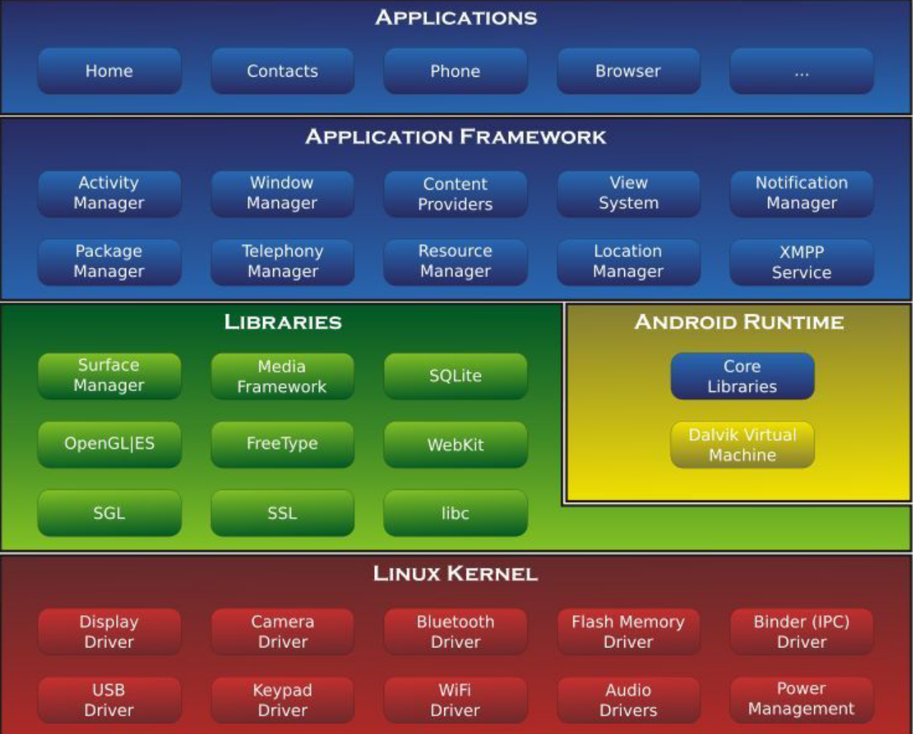
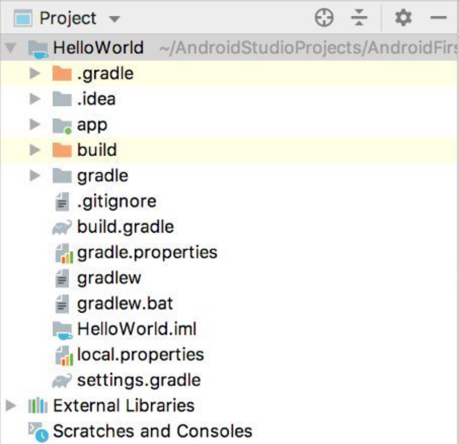
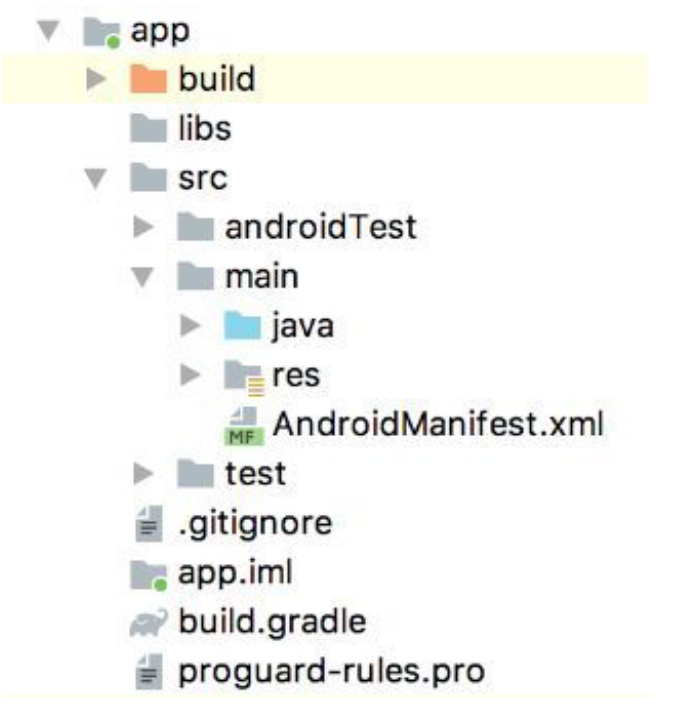

# Android 简介

## Android 系统架构

### Linux 内核层

Android系统基于Linux内核，这层为Android设备的各种硬件提供了底层的驱动，如显示、音频、相机、蓝牙、WiFi等驱动和电源管理。Linux层包含了Android系统的核心服务，包括硬件驱动、进程管理、安全系统，等等。

### 系统运行库层

系统运行库层通过C/C++库为Android系统提供了主要特性支持。如SQLite库提供了数据库支持，OpenGL|ES库提供了3D绘图支持，Webkit库提供了浏览器内核支持。
在这层还有Android运行时库,它主要提供了一些核心库,允许开发者使用Java语言来编写Android应用。另外,Android运行时库中还包含了Dalvik虚拟机(5.0系统之后改为ART运行环境) ,它使得每一个Android应用都能运行在独立的进程中,并且拥有一个自己的虚拟机实例。相较于Java虚拟机,Dalvik和ART都是专门为移动设备定制的,它针对手机内存、CPU性能有限等情况做了优化处理。

Dalvik包含了一整套的Android运行环境虚拟机，每个App都会分配Dalvik虚拟机来保证互相之间不受干扰，并保持独立。它的特点是在运行时编译。在Android 5.X版本开始，ART模式已经取代了Dalvik，ART采用的是安装时就进行编译，以后运行时就不用编译了。

### 应用框架层

这层提供了构建应用程序时用到的各种API，开发者可以使用这些API构建自己的应用。对于开发者来说，与Android系统最直接的接触就是SDK，应用开发者应当关注每个版本的SDK修改，从而提高应用的兼容性。如果站在Android设计者的角度上来看整个Android的架构，设计者希望Android的框架层能够起到承上启下的功能，让应用的各个组件之间解耦，并通过框架来进行统一的调度、管理。

### 应用层

所有安装在手机的应用程序都属于这一层。



## Android 开发环境

开发Android程序需要准备的工具：

- JDK：Java软件开发工具包，包含Java运行环境、工具集合、基础类库等
- Android SDK：Google提供的Android开发工具包，开发Android程序时，需要引入该工具包来使用Android相关API
- Android Studio

## Android 项目结构



### Project 模式的项目结构

- .gradle和.idea：两个目录下放置Android Studio自动生成的一些文件
- app：项目代码、资源等都是放置在这个目录
- gradle：该目录下包含gradle wrapper的配置文件
- .gitignore：该文件用来将指定目录或文件排除在版本控制之外的
- build.gradle：项目全局的gradle构建脚本
- gradle.properties：全局的gradle配置文件，配置的属性会影响到项目中所有的gradle编译脚本
- gradlew和gradlew.bat：命令行界面中执行gradle命令，gradlew在Linux或Mac使用，gradlew.bat在Windows使用
- iml：所有IntelliJ IDEA项目自动生成的一个文件
- local.properties：该文件用于指定本机中的Android SDK路径
- setting.gradle：用于指定项目中所有引入的模块



### app 目录下的项目结构

- build：和外层build目录相似，包含一些编译时自动生成的文件
- libs：使用到的第三方jar包，需要把jar包都放在libs目录下，放在这个目录下的jar包会被自动添加到项目的构建路径里
- androidTest：用来编写Android Test测试用例
- java：放置所有Java代码的地方
- res：项目中时用到的图片、布局、字符串都放在这个目录下。图片放在drawable、布局放在layout、字符串放在values
- AndroidManifest.xml：Android项目的配置文件，在这个文件注册定义的四大组件，给应用程序添加权限声明
- test：编写Unit Test测试用例
- .gitignore：
- app.iml
- build.gradle：app模块的gradle构建脚本
- proguard-rules.pro：用于指定项目代码的混淆规则

## 项目资源

### 使用项目资源

- 在代码中通过R.string.app_name可以获得该字符串的引用
- 在XML中通过@string/app_name可以获得该字符串的引用

string可以替换，引用的图片资源可以替换成drawable，应用图标替换成mipmap，布局文件替换成layout

# Android系统源代码目录与系统目录

Android源代码的目录中包含了Android系统所有的源代码，从底层驱动到上层应用，Android系统对所有文件都进行了详细管理。而在手机中，Android系统的目录与源代码的目录并不是一一对应的，而是与源代码编译之后，与打包生成的Image文件的结构相同。

## Android系统源代码目录

Android 源代码结构

```
- Makefile
- bionic       （bionic C库）
- bootable     （启动引导相关代码）
- build        （存放系统编译规则等基础开发包配置）
- cts          （Google兼容性测试标准）
- dalvik       （dalvik虚拟机）
- development  （应用程序开发相关）
- external     （android使用的一些开源的模块）
- frameworks   （Framework框架核心）
- hardware     （厂商硬件适配层HAL代码）
- out          （编译完成后的代码输出目录）
- packages     （应用程序包）
- prebuilt     （x86和arm架构下预编译资源）
- sdk          （sdk及模拟器）
- system       （底层文件系统库、应用及组件）
- vendor       （厂商定制代码）
```

## Android 系统目录

```
/system/app/	里面放的是一些系统的 APP
/system/bin/	主要放的是Linux自带的组件
/system/build.prop	记录的是系统的属性信息
/system/fonts/	系统字体存放目录root后可下载TTF格式字体替换原字体,达到修改系统字体的效果
/system/framework/	系统的核心文件、框架层
/system/lib/	存放几乎所有的共享库（.so）文件
/system/media/	保存系统提示音、系统铃声。/system/media/audio/目录，这里面保存着Android系统默认的铃声，alarms目录是闹铃提醒，notification目录是短信或提示音，ringtones目录是来电铃声，而ui目录则是一些界面音效
/system/usr/	保存用户的配置文件，如键盘布局、共享、时区文件等
/data/app/	data目录包含了用户的大部分数据信息。其中，/data/app/这个目录包含了用户安装的App或者升级的App
/data/data/		这个目录应该是开发者访问的最多的目录了，这里包含了App的数据信息、文件信息、数据库信息等，以包名的方式来区分各个应用
/data/system/	这个目录包含了手机的各项系统信息
/data/misc/		这个目录保存了大部分的Wi-Fi、VPN信息
```

# Android ADB

Android Debug Bridge。借助这样一个工具，我们可以用电脑来操纵手机。

ADB工具位于SDK的platform-tools目录下，因此在命令行中使用ABD的时候，需要通过cd命令，切换到该目录下，或者将platform-tools的路径添加到系统环境变量中，这样就可以直接使用了。

```shell
adb shell	//进入Shell后，可以使用很多Linux下的Shell命令，如ls | grep "data"

android list targets	//显示系统中全部Android平台

adb install -r应用程序.apk	//安装Apk程序之Install
adb install -r F:\Test.apk

adb push <local> <remote>	//安装Apk程序之Push
adb push D:\Test.apk /system/app/

Adb Install是将Apk安装到data/data目录下，作为普通的用户应用程序。而Adb Push则不是安装命令，它是将一个文件写入手机存储系统。因此，只要拥有相应的权限，就可以把任何Apk放到任何目录下，甚至是放到System目录下，成为一个系统应用程序。Adb Push不仅可以安装Apk，它最大的用处还是向手机写入文件。

adb push <local> <remote>	//向手机写入文件
adb push D:\file.txt /system/temp/
adb pull <remote> <local>	//从手机获取文件
adb push /system/temp/ D:\file.txt
其实这些东西，在Android的Android Device Monitor工具中都可以直接使用

adb shell	//查看Log
logcat | grep "abc"

//删除应用
adb remount 	//（重新挂载系统分区，使系统分区重新可写）。
adb shell
cd system/app rm *.apk

adb shell df	//查看系统盘符

adb shell pm list packages –f	//输出所有已经安装的应用
adb shell input keyevent 3	//模拟按键输入，最后面的数字就是要执行的Keyevent的Code
adb shell input touchscreen <x1> <y1> <x2> <y2>	//模拟滑动输入
查看运行状态

adb shell dumpsys	//可以列出很多运行状态
dumpsys activity activities | grep "tencent"	//列出Activity的运行状态，同时过滤“tencent”关键字

Package管理信息
pm list packages –f	//列出所有的Package。通过PM命令，可以看见Android中关于Package的各种相关信息。

AM管理信息
adb shell am start -n包名/包名＋类名	//启动一个Activity

adb shell screenrecord /sdcard/demo.mp4	//录制屏幕
adb reboot	//重新启动

```

