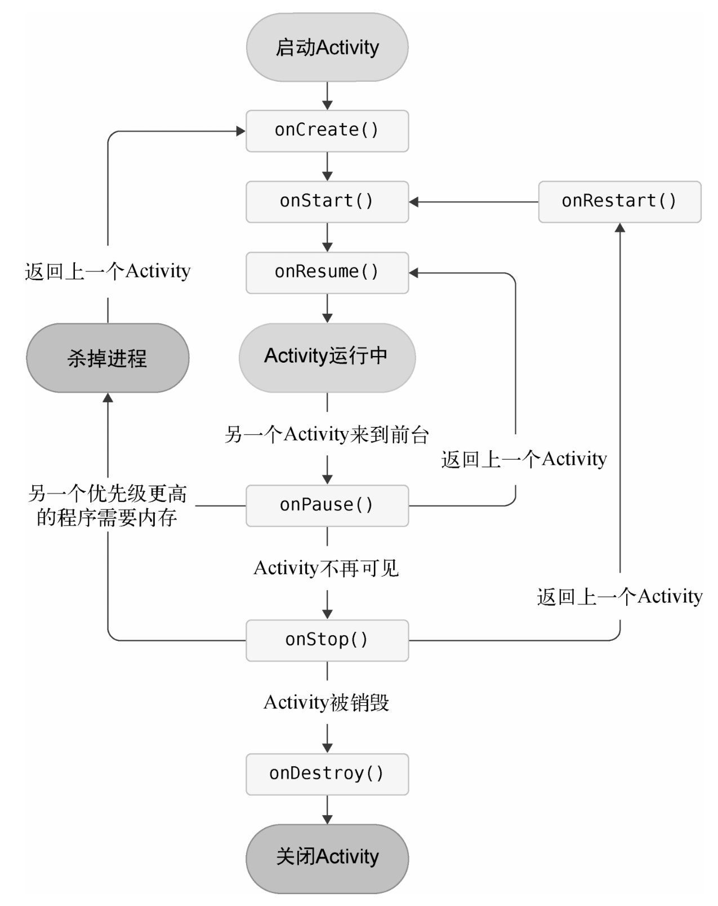

# Android四大组件如何协同工作

Activity作为人机交互的第一界面，负责向用户展示信息和处理结果，而这些信息的来源，可以是通过资源获取，也可以通过Content Provider来获取其他应用的信息，或是Service从后台计算、下载、处理的结果，当然也可以是通过BroadCast Reciever获取到的广播信息。同时，Android系统还提供了一个信使——Intent，作为信息传递的载体。组件与组件之间通过Intent来通信、传递信息、交换数据。

# 应用运行上下文对象

Android系统的上下文对象，即在Context中，为我们封装了这样一个“语境”。Activity、Service、Application都是继承自Context。

Android应用程序会在如下所示的几个时间点创建应用上下文Context。

- 创建Application

- 创建Activity

- 创建Service


创建Context的时机就是在创建Context的实现类的时候。当应用程序第一次启动时，Android系统都会创建一个Application对象，同时创建Application Context，所有的组件都共同拥有这样一个Context对象，这个应用上下文对象贯穿整个应用进程的生命周期，为应用全局提供了功能和环境支持。而创建Activity和Service组件时，系统也会给它们提供运行的上下文环境，即创建Activity实例、Service实例的Context对象。在Activity中获取Context对象时，可以直接使用this，而在匿名内部类中，就必须指定XXXXActivity.this才可以获得该Activity的Context对象。当然，你也可以通过getApplicationContext()方法来获取整个App的Context，但是通过getApplicationContext()方法获得的是整个应用的上下文引用，这与某个组件的上下文引用，在某些时候还是有区别的。


# Activity 基本用法

## 在 Activity 使用 Toast

- Kotlin

```kotlin
override fun onCreate (savedInstanceState: Bundle?) {
    supen.onCreate (savedInstanceState)
    setContentView(R. layout.first_layout)
    // findViewById()返回的是一个继承自View的泛型对象，Kotlin无法自动推导出是什么控件，要将button1变量显示声明成Button类型
    val buttonl: Button findViewById (R.id.buttonl)
    buttonl.setOnClickListener {
    Toast.makeText(this, "You clicked Button",Toast LENGTH SHORT), show ())
    }
}                
```

使用Kotlin编写的Android项目在app/build.gradle文件的头部默认引入了一个kotlin-android-extensions插件，这个插件会根据布局文件中定义的控件id自动生成一个具有相同名称的变量，我们可以在Activity里直接使用这个变量，而不用再调用findViewById()方法了

- Java

[View点击事件：三种方式实现OnClickListener接口_rongwenbin的博客-CSDN博客_onclicklistener接口](https://blog.csdn.net/rongwenbin/article/details/90767720)

```java
protected void onCreate(Bundle savedInstanceState) {
        super.onCreate(savedInstanceState);
        setContentView(R.layout.first_layout);
        Button button1 = findViewById(R.id.button1);
        button1.setOnClickListener(new View.OnClickListener() {
            @Override
            public void onClick(View view) {
                Toast.makeText(FirstActivity.this, "button1 Clicked.", Toast.LENGTH_SHORT).show();
            }
        });
    }
```


## 在 Activity 使用 Menu

- Kotlin

```kotlin
override fun onCreateOptionsMenu(menu: Menu?): Boolean {
    // 调用了getMenuInfater()得到MenuInflater对象，再调用inflate()给Activity创建菜单
    menuInflater.inflate(R.menu.main, menu)     
	return true 
}
override fun onOptionsItemSelected(item: MenuItem): Boolean {     
    when (item.itemId) {         
        R.id.add_item -> Toast.makeText(this, "You clicked Add",                             Toast.LENGTH_SHORT).show()         
        R.id.remove_item -> Toast.makeText(this, "You clicked Remove",                                Toast.LENGTH_SHORT).show()     
    }     
    return true
}
```

- Java

[Android 的 onCreateOptionsMenu() 创建菜单 Menu 详解 | 孟坤博客 (mkblog.cn)](https://mkblog.cn/881/)

```java
public boolean onCreateOptionsMenu(Menu menu) {
        getMenuInflater().inflate(R.menu.main,menu);
        return true;
}
// 菜单监听
public boolean onOptionsItemSelected(@NonNull MenuItem item) {
	switch (item.getItemId()){
		case R.id.add_item:
             Toast.makeText(this,"add_item",Toast.LENGTH_SHORT).show();
             break;
         case R.id.remove_item:
			Toast.makeText(this,"remove_item",Toast.LENGTH_SHORT).show();
             break;
    }
    return true;
}
```

# Intent

Intent是Android程序中各组件之间进行交互的一种重要方式，它不仅可以指明当前组件想要执行的动作，还可以在不同组件之间传递数据。Intent一般可用于启动Activity。

## 显式Intent和隐式Intent：

Intent有多个构造函数的重载，其中一个是Intent(Context packageContext, Class<?> cls)。这个构造函数接收两个参数：第一个参数Context要求提供一个启动Activity的上下文；第二个参数Class用于指定想要启动的目标Activity，通过这个构造函数就可以构建出Intent的“意图”。Activity类中提供了一个startActivity()方法，专门用于启动Activity，它接收一个Intent参数，这里我们将构建好的Intent传入startActivity()方法就可以启动目标Activity了。

## 隐式Intent

不明确指出想要启动哪一个Activity，而是指定了一系列更为抽象的action和category等信息，然后交由系统去分析这个Intent，并帮我们找出合适的Activity（可以响应这个隐式Intent的Activity）去启动。

通过在<activity>标签下配置<intent-filter>的内容，可以指定当前Activity能够响应的action和category，打开AndroidManifest.xml，添加如下代码：

```xml
<activity android:name=".SecondActivity" >     
<intent-filter>         
    <action android:name="com.example.activitytest.ACTION_START" />        <category android:name="android.intent.category.DEFAULT" />    
</intent-filter> 
</activity> 
```

在<action>标签中我们指明了当前Activity可以响应com.example.activitytest.ACTION_START这个action，而<category>标签则包含了一些附加信息，更精确地指明了当前Activity能够响应的Intent中还可能带有的category。只有<action>和<category>中的内容同时匹配Intent中指定的action和category时，这个Activity才能响应该Intent。

```kotlin
button1.setOnClickListener {     
val intent = Intent("com.example.activitytest.ACTION_START")    startActivity(intent) 
}
```

使用了Intent的另一个构造函数，直接将action的字符串传了进去，表明我们想要启动能够响应com.example.activitytest.ACTION_START这个action的Activity。前面不是说要<action>和<category>同时匹配才能响应吗？怎么没看到哪里有指定category呢？这是因为android.intent.category.DEFAULT是一种默认的category，在调用startActivity()方法的时候会自动将这个category添加到Intent中。每个Intent中只能指定一个action，但能指定多个category。

使用隐式Intent，不仅可以启动自己程序内的Activity，还可以启动其他程序的Activity，这就使多个应用程序之间的功能共享成为了可能。比如你的应用程序中需要展示一个网页，这时你没有必要自己去实现一个浏览器（事实上也不太可能），只需要调用系统的浏览器来打开这个网页就行了。

```kotlin
button1.setOnClickListener {     
    val intent = Intent(Intent.ACTION_VIEW)     
    intent.data = Uri.parse("https://www.baidu.com")     
    startActivity(intent) 
}
```

指定了Intent的action是Intent.ACTION_VIEW，这是一个Android系统内置的动作，其常量值为android.intent.action.VIEW。然后通过Uri.parse()方法将一个网址字符串解析成一个Uri对象，再调用Intent的setData()方法将这个Uri对象传递进去。setData()方法接收一个Uri对象，主要用于指定当前Intent正在操作的数据，而这些数据通常是以字符串形式传入Uri.parse()方法中解析产生的。与此对应，我们还可以在<intent-filter>标签中再配置一个<data>标签，用于更精确地指定当前Activity能够响应的数据。只有当<data>标签中指定的内容和Intent中携带的Data完全一致时，当前Activity才能够响应该Intent。

## 向下一个Activity传递数据

在启动Activity时传递数据的思路很简单，Intent中提供了一系列putExtra()方法的重载，可以把我们想要传递的数据暂存在Intent中，在启动另一个Activity后，只需要把这些数据从Intent中取出就可以了。

```kotlin
button1.setOnClickListener {     
val data = "Hello SecondActivity"     
val intent = Intent(this, SecondActivity::class.java)     intent.putExtra("extra_data", data)     
startActivity(intent) } 

class SecondActivity : AppCompatActivity() {     
    override fun onCreate(savedInstanceState: Bundle?) {         				super.onCreate(savedInstanceState)         								setContentView(R.layout.second_layout)         
		val extraData = intent.getStringExtra("extra_data")         			Log.d("SecondActivity", "extra data is $extraData")     
    } 
}
```

intent实际上调用的是父类的getIntent()方法，该方法会获取用于启动SecondActivity的Intent，然后调用getStringExtra()方法并传入相应的键值，就可以得到传递的数据了。这里由于我们传递的是字符串，所以使用getStringExtra()方法来获取传递的数据。

## 返回数据给上一个Activity

返回上一个Activity只需要按一下Back键就可以了，并没有一个用于启动Activity的Intent来传递数据，这该怎么办呢？其实Activity类中还有一个用于启动Activity的 startActivityForResult()方法，但它期望在Activity销毁的时候能够返回一个结果给上一个Activity。startActivityForResult()方法接收两个参数：第一个参数还是Intent；第二个参数是请求码，用于在之后的回调中判断数据的来源。但这个方法已经被废弃了很久，现在 Google 使用 registerForActivityResult() 方法来实现此功能。

```kotlin
button1.setOnClickListener {
    startActivityForResult(intent, 1)
}

override fun onActivityResult(requestCode: Int, resultCode: Int, data: Intent?) {
        super.onActivityResult(requestCode, resultCode, data)
        when (requestCode) {
            1 -> if (resultCode == RESULT_OK) {
                val returnData = data?.getStringExtra("data_return")
                Log.d("FirstActivity", "$returnData")
            }
        }
    }

button2.setOnClickListener{
    val intent = Intent()
    intent.putExtra("data_return", "返回数据")
    setResult(RESULT_OK, intent)
    finish()
}
```

构建了一个Intent，只不过这个Intent仅仅用于传递数据而已，它没有指定任何的“意图”。紧接着把要传递的数据存放在Intent中，然后调用了setResult()方法。这个方法非常重要，专门用于向上一个Activity返回数据。setResult()方法接收两个参数：第一个参数用于向上一个Activity返回处理结果，一般只使用RESULT_OK或RESULT_CANCELED这两个值；第二个参数则把带有数据的Intent传递回去。最后调用了finish()方法来销毁当前Activity。由于我们是使用startActivityForResult()方法来启动SecondActivity的，在SecondActivity被销毁之后会回调上一个Activity的onActivityResult()方法，因此我们需要在FirstActivity中重写这个方法来得到返回的数据。

onActivityResult()方法带有3个参数：第一个参数requestCode，即我们在启动Activity时传入的请求码；第二个参数resultCode，即我们在返回数据时传入的处理结果；第三个参数data，即携带着返回数据的Intent。由于在一个Activity中有可能调用startActivityForResult()方法去启动很多不同的Activity，每一个Activity返回的数据都会回调到onActivityResult()这个方法中，因此我们首先要做的就是通过检查requestCode的值来判断数据来源。确定数据是从SecondActivity返回的之后，我们再通过resultCode的值来判断处理结果是否成功。最后从data中取值并打印出来，这样就完成了向上一个Activity返回数据的工作。

通过按下Back键回到FirstActivity，这样数据不就没法返回了吗？可以通过在SecondActivity中重写onBackPressed()方法来解决这个问题

# Activity的生命周期

## 返回栈

Android是使用任务（task）来管理Activity的，一个任务就是一组存放在栈里的Activity的集合，这个栈也被称作返回栈（back stack）。在默认情况下，每当我们启动了一个新的Activity，它就会在返回栈中入栈，并处于栈顶的位置。而每当我们按下Back键或调用finish()方法去销毁一个Activity时，处于栈顶的Activity就会出栈，前一个入栈的Activity就会重新处于栈顶的位置。系统总是会显示处于栈顶的Activity给用户。

## Activity状态

### 运行状态

当一个Activity位于返回栈的栈顶时，Activity就处于运行状态。

### 暂停状态

当一个Activity不再处于栈顶位置，但仍然可见时，Activity就进入了暂停状态。这是因为并不是每一个Activity都会占满整个屏幕，比如对话框形式的Activity只会占用屏幕中间的部分区域。处于暂停状态的Activity仍然是完全存活着的，系统也不愿意回收这种Activity

### 停止状态

当一个Activity不再处于栈顶位置，并且完全不可见的时候，就进入了停止状态。系统仍然会为这种Activity保存相应的状态和成员变量，但是这并不是完全可靠的，当其他地方需要内存时，处于停止状态的Activity有可能会被系统回收。

### 销毁状态

一个Activity从返回栈中移除后就变成了销毁状态。系统最倾向于回收处于这种状态的Activity，以保证手机的内存充足。

## Activity的生存期

Activity类中定义了7个回调方法，覆盖了Activity生命周期的每一个环节

### onCreate()

在每个Activity中都重写了这个方法，它会在Activity第一次被创建的时候调用。你应该在这个方法中完成Activity的初始化操作，比如加载布局、绑定事件等。

### onStart()

在Activity由不可见变为可见的时候调用。

### onResume()

在Activity准备好和用户进行交互的时候调用。此时的Activity一定位于返回栈的栈顶，并且处于运行状态。

### onPause()

在系统准备去启动或者恢复另一个Activity的时候调用。我们通常会在这个方法中将一些消耗CPU的资源释放掉，以及保存一些关键数据，但这个方法的执行速度一定要快，不然会影响到新的栈顶Activity的使用

### onStop()

在Activity完全不可见的时候调用。它和onPause()方法的主要区别在于，如果启动的新Activity是一个对话框式的Activity，那么onPause()方法会得到执行，而onStop()方法并不会执行

### onDestroy()

在Activity被销毁之前调用，之后Activity的状态将变为销毁状态

### onRestart()

在Activity由停止状态变为运行状态之前调用，也就是Activity被重新启动了

完整生存期。Activity在onCreate()方法和onDestroy()方法之间所经历的就是完整生存期。一般情况下，一个Activity会在onCreate()方法中完成各种初始化操作，而在onDestroy()方法中完成释放内存的操作。

可见生存期。Activity在onStart()方法和onStop()方法之间所经历的就是可见生存期。在可见生存期内，Activity对于用户总是可见的，即便有可能无法和用户进行交互。我们可以通过这两个方法合理地管理那些对用户可见的资源。比如在onStart()方法中对资源进行加载，而在onStop()方法中对资源进行释放，从而保证处于停止状态的Activity不会占用过多内存。

前台生存期。Activity在onResume()方法和onPause()方法之间所经历的就是前台生存期。在前台生存期内，Activity总是处于运行状态，此时的Activity是可以和用户进行交互的，我们平时看到和接触最多的就是这个状态下的Activity

Activity 生命周期示意图



## Activity被回收了怎么办

MainActivity中如果有一个文本输入框，现在你输入了一段文字，然后启动NormalActivity，这时MainActivity由于系统内存不足被回收掉，过了一会你又点击了Back键回到MainActivity，你会发现刚刚输入的文字都没了，因为MainActivity被重新创建了

Activity中还提供了一个onSaveInstanceState()回调方法，这个方法可以保证在Activity被回收之前一定会被调用，因此我们可以通过这个方法来解决问题。onSaveInstanceState()方法会携带一个Bundle类型的参数，Bundle提供了一系列的方法用于保存数据，比如可以使用putString()方法保存字符串，使用putInt()方法保存整型数据，以此类推。每个保存方法需要传入两个参数，第一个参数是键，用于后面从Bundle中取值，第二个参数是真正要保存的内容

```kotlin
// 临时数据保存
override fun onSaveInstanceState(outState: Bundle) {     super.onSaveInstanceState(outState)     
val tempData = "Something you just typed"     
outState.putString("data_key", tempData) }

// 恢复
override fun onCreate(savedInstanceState: Bundle?) {     super.onCreate(savedInstanceState)     
Log.d(tag, "onCreate")                                         setContentView(R.layout.activity_main)     
if (savedInstanceState != null) {         
    val tempData = savedInstanceState.getString("data_key")         		Log.d(tag, "tempData is $tempData")     }     ... }

```

Intent还可以结合Bundle一起用于传递数据。首先我们可以把需要传递的数据都保存在Bundle对象中，然后再将Bundle对象存放在Intent里。到了目标Activity之后，先从Intent中取出Bundle，再从Bundle中一一取出数据。


# Activity的启动模式

## standard

standard是Activity默认的启动模式，在不进行显式指定的情况下，所有Activity都会自动使用这种启动模式。在standard模式下，每当启动一个新的Activity，它就会在返回栈中入栈，并处于栈顶的位置。对于使用standard模式的Activity，系统不会在乎这个Activity是否已经在返回栈中存在，每次启动都会创建一个该Activity的新实例。

## singleTop

当Activity的启动模式指定为singleTop，在启动Activity时如果发现返回栈的栈顶已经是该Activity，则认为可以直接使用它，不会再创建新的Activity实例。

## singleTask

让某个Activity在整个应用程序的上下文中只存在一个实例。当Activity的启动模式指定为singleTask，每次启动该Activity时，系统首先会在返回栈中检查是否存在该Activity的实例，如果发现已经存在则直接使用该实例，并把在这个Activity之上的所有其他Activity统统出栈，如果没有发现就会创建一个新的Activity实例。

## singleInstance

不同于以上3种启动模式，指定为singleInstance模式的Activity会启用一个新的返回栈来管理这个Activity（其实如果singleTask模式指定了不同的taskAffinity，也会启动一个新的返回栈）。

想象以下场景，假设我们的程序中有一个Activity是允许其他程序调用的，如果想实现其他程序和我们的程序可以共享这个Activity的实例，应该如何实现呢？使用前面3种启动模式肯定是做不到的，因为每个应用程序都会有自己的返回栈，同一个Activity在不同的返回栈中入栈时必然创建了新的实例。而使用singleInstance模式就可以解决这个问题，在这种模式下，会有一个单独的返回栈来管理这个Activity，不管是哪个应用程序来访问这个Activity，都共用同一个返回栈，也就解决了共享Activity实例的问题。

# Activity的最佳实践

## 知晓当前是在哪一个Activity

新建一个BaseActivity类，让BaseActivity继承自AppCompatActivity，并重写onCreate()方法。让BaseActivity成为ActivityTest项目中所有Activity的父类。Kotlin中的javaClass表示获取当前实例的Class对象，相当于在Java中调用getClass()方法；而Kotlin中的BaseActivity::class.java表示获取BaseActivity类的Class对象，相当于在Java中调用BaseActivity.class。

```kotlin
open class BaseActivity : AppCompatActivity() {     
override fun onCreate(savedInstanceState: Bundle?) {         super.onCreate(savedInstanceState)         
Log.d("BaseActivity", javaClass.simpleName)     
} 
}
```

## 随时随地退出程序

用一个专门的集合对所有的Activity进行管理。新建一个单例类ActivityCollector作为Activity的集合。

```kotlin
object ActivityCollector {
    private val activities = ArrayList<Activity>()
    fun addActivity(activity: Activity) {
        activities.add(activity)
    }

    fun removeActivity(activity: Activity) {
        activities.remove(activity)
    }

    fun finishAll() {
        for (activity in activities) {
            if (!activity.isFinishing) {
                activity.finish()
            }
        }
        activities.clear()
    }
}

// 修改BaseActivity
open class BaseActivity : AppCompatActivity() {
    override fun onCreate(savedInstanceState: Bundle?) {
        super.onCreate(savedInstanceState)
        Log.d("BaseActivity", javaClass.simpleName)
        ActivityCollector.addActivity(this)

    }

    override fun onDestroy() {
        super.onDestroy()
        ActivityCollector.removeActivity(this)
    }
}
```


## 启动Activity的最佳写法

需要传递多个数据。使用了一个新的语法结构companion object，并在companion object中定义了一个actionStart()方法。之所以要这样写，是因为Kotlin规定，所有定义在companion object中的方法都可以使用类似于Java静态方法的形式调用。

```kotlin
class SecondActivity : BaseActivity() {
    companion object {
        fun actionStart(context: Context, data1:String, data2: String) {
            val intent = Intent(context, SecondActivity::class.java)
            intent.putExtra("param1", data1)
            intent.putExtra("param2", data2)
            context.startAcivity(intent)
        }
    }
}

button1.setOnClickListener {
    SecondActivity.actionStart(this, "data1", "data2")
}
```


# Kotlin

findViewById()方法的作用就是获取布局文件中控件的实例，但是前面的例子比较简单，只有一个按钮，如果某个布局文件中有10个控件呢？没错，我们就需要调用10次findViewById()方法才行。这种写法虽然很正确，但是很笨拙，于是就滋生出了诸如ButterKnife之类的第三方开源库，来简化findViewById()方法的调用。不过，这个问题在Kotlin中就不复存在了，因为使用Kotlin编写的Android项目在app/build.gradle文件的头部默认引入了一个kotlin-android-extensions插件，这个插件会根据布局文件中定义的控件id自动生成一个具有相同名称的变量，我们可以在Activity里直接使用这个变量，而不用再调用findViewById()方法了

## 标准函数with、run和apply

## 定义静态方法

Kotlin却极度弱化了静态方法这个概念，提供了比静态方法更好用的语法特性，单例类。静态方法非常适合用于编写一些工具类的功能，因为工具类通常没有创建实例的必要，基本是全局通用的。

```kotlin
// 使用单例类的写法会将整个类中的所有方法全部变成类似于静态方法的调用方式
object Util {
	fun doAction() {
        ...
    }
}

// 希望让类中的某一个方法变成静态方法的调用方式,companion object
// 现在这两个方法就有了本质的区别，因为doAction1()方法是一定要先创建Util类的实例才能调用的，而doAction2()方法可以直接使用Util.doAction2()的方式调用。
// doAction2()方法其实也并不是静态方法，companion object这个关键字实际上会在Util类的内部创建一个伴生类，而doAction2()方法就是定义在这个伴生类里面的实例方法。只是Kotlin会保证Util类始终只会存在一个伴生类对象，因此调用Util.doAction2()方法实际上就是调用了Util类中伴生对象的doAction2()方法。
class Util {
    fun doAction1() {
        ...
    }
    
    companion object {
        fun doAction2() {
            ...
        }
    }
}
```

前面使用的单例类和companion object都只是在语法的形式上模仿了静态方法的调用方式，实际上它们都不是真正的静态方法。因此如果你在Java代码中以静态方法的形式去调用的话，你会发现这些方法并不存在。而如果我们给单例类或companion object中的方法加上@JvmStatic注解，那么Kotlin编译器就会将这些方法编译成真正的静态方法。@JvmStatic注解只能加在单例类或companion object中的方法上。

顶层方法指的是那些没有定义在任何类中的方法，Kotlin编译器会将所有的顶层方法全部编译成静态方法。创建File类型的kt文件，定义任何方法都是顶层方法。Java中没有顶层方法这个概念，所有的方法必须定义在类中。java调用，编译器会自动创建一个叫做文件名Kt的java类。

# 参考链接

- [View点击事件：三种方式实现OnClickListener接口_rongwenbin的博客-CSDN博客_onclicklistener接口](https://blog.csdn.net/rongwenbin/article/details/90767720)
- [Android 的 onCreateOptionsMenu() 创建菜单 Menu 详解 | 孟坤博客 (mkblog.cn)](https://mkblog.cn/881/)