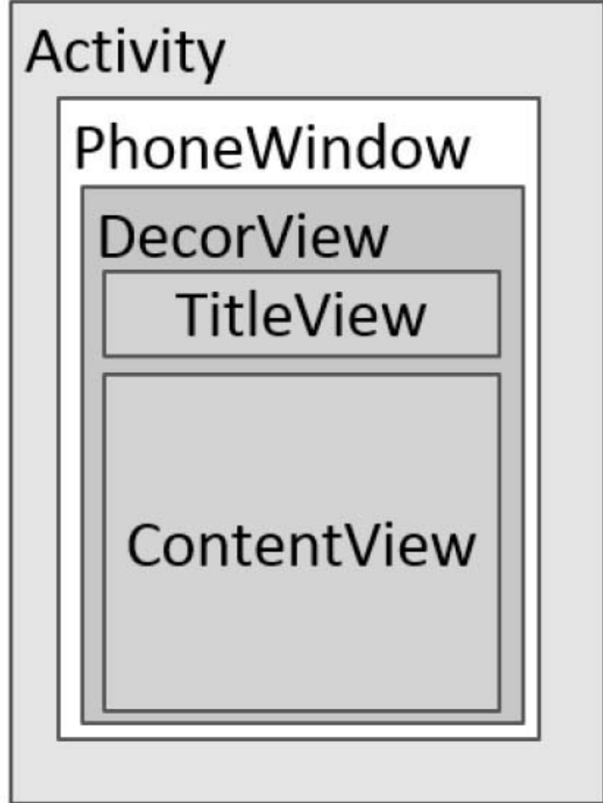
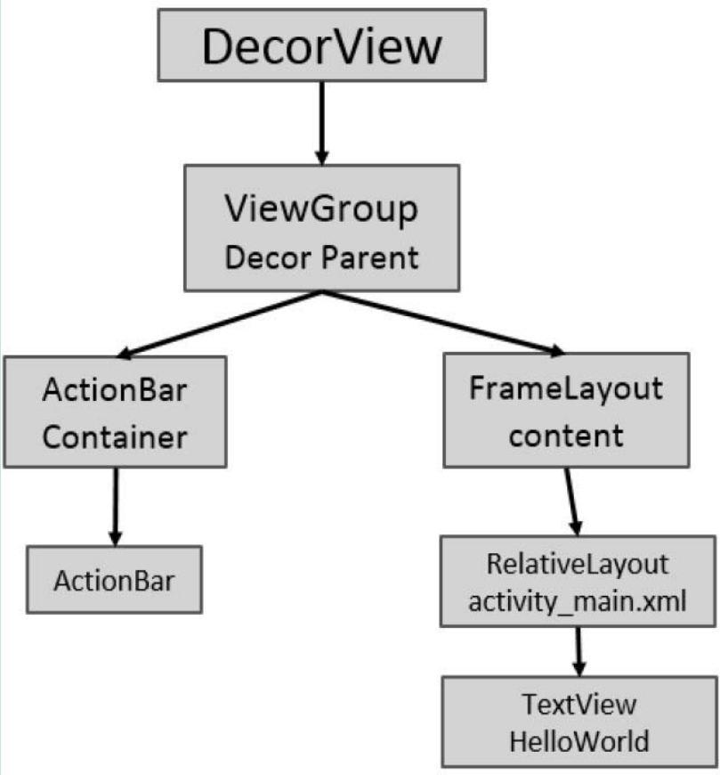
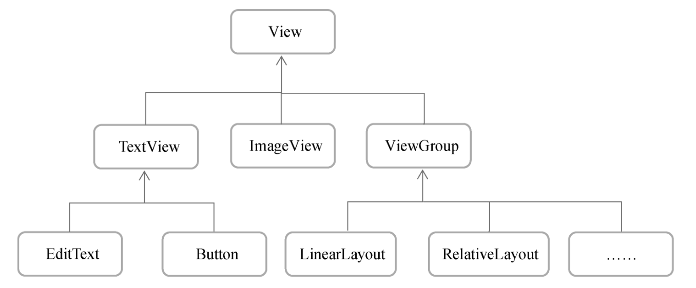

# Android控件架构与自定义控件详解

## Android控件架构

Android中的每个控件都会在界面中占得一块矩形的区域，而在Android中，控件大致被分为两类，即ViewGroup控件与View控件。ViewGroup控件作为父控件可以包含多个View控件，并管理其包含的View控件。通过ViewGroup，整个界面上的控件形成了一个树形结构，这也就是我们常说的控件树，上层控件负责下层子控件的测量与绘制，并传递交互事件。通常在Activity中使用的findViewById()方法，就是在控件树中以树的深度优先遍历来查找对应元素。在每棵控件树的顶部，都有一个ViewParent对象，这就是整棵树的控制核心，所有的交互管理事件都由它来统一调度和分配，从而可以对整个视图进行整体控制。



每个Activity都包含一个Window对象，在Android中Window对象通常由PhoneWindow来实现。PhoneWindow将一个DecorView设置为整个应用窗口的根View。DecorView作为窗口界面的顶层视图，封装了一些窗口操作的通用方法。可以说，DecorView将要显示的具体内容呈现在了PhoneWindow上，这里面的所有View的监听事件，都通过WindowManagerService来进行接收，并通过Activity对象来回调相应的onClickListener。在显示上，它将屏幕分成两部分，一个是TitleView，另一个是ContentView。看到这里，大家一定看见了一个非常熟悉的布局——ContentView。它是一个ID为content的Framelayout，activity_main.xml就是设置在这样一个Framelayout里。



视图树的第二层装载了一个LinearLayout，作为ViewGroup，这一层的布局结构会根据对应的参数设置不同的布局，如最常用的布局——上面显示TitleBar下面是Content这样的布局，也就是图3.3中所设置的布局。而如果用户通过设置requestWindowFeature（Window.FEATURE_ NO_TITLE)来设置全屏显示，视图树中的布局就只有Content了，这就解释了为什么调用requestWindowFeature()方法一定要在调用setContentView()方法之前才能生效的原因。不过这里要注意的是，由于每个Android版本对UI的修改都比较多。

在代码中，当程序在onCreate （ ）方法中调用setContentView()方法后，ActivityManagerService会回调onResume()方法，此时系统才会把整个DecorView添加到PhoneWindow中，并让其显示出来，从而最终完成界面的绘制。

## View的测量

Android系统在绘制View前，也必须对View进行测量，即告诉系统该画一个多大的View。这个过程在onMeasure()方法中进行。

Android系统给我们提供了一个设计短小精悍却功能强大的类——MeasureSpec类，通过它来帮助我们测量View。MeasureSpec是一个32位的int值，其中高2位为测量的模式，低30位为测量的大小，在计算中使用位运算的原因是为了提高并优化效率。

测量的模式可以为以下三种。

- EXACTLY

即精确值模式，当我们将控件的layout_width属性或layout_height属性指定为具体数值时，比如andorid:layout_width="100dp"，或者指定为match_parent属性时（占据父View的大小），系统使用的是EXACTLY模式。

- AT_MOST

即最大值模式，当控件的layout_width属性或layout_height属性指定为wrap_content时，控件大小一般随着控件的子空间或内容的变化而变化，此时控件的尺寸只要不超过父控件允许的最大尺寸即可。

- UNSPECIFIED

这个属性比较奇怪——它不指定其大小测量模式，View想多大就多大，通常情况下在绘制自定义View时才会使用。

View类默认的onMeasure()方法只支持EXACTLY模式，所以如果在自定义控件的时候不重写onMeasure()方法的话，就只能使用EXACTLY模式。控件可以响应你指定的具体宽高值或者是match_parent属性。而如果要让自定义View支持wrap_content属性，那么就必须重写onMeasure()方法来指定wrap_content时的大小。

通过MeasureSpec这一个类，我们就获取了View的测量模式和View想要绘制的大小。有了这些信息，我们就可以控制View最后显示的大小

## View的绘制

当测量好了一个View之后，我们就可以简单地重写onDraw()方法，并在Canvas对象上来绘制所需要的图形。要想在Android的界面中绘制相应的图像，就必须在Canvas上进行绘制。Canvas就像是一个画板，使用Paint就可以在上面作画了。一般情况下，可以使用重写View类中的onDraw()方法来绘图，onDraw()中有一个参数，就是Canvas canvas对象。使用这个Canvas对象就可以进行绘图了，而在其他地方，通常需要使用代码创建一个Canvas对象。

```
Canvas canvas = new Canvas(bitmap)
```

传进去的bitmap与通过这个bitmap创建的Canvas画布是紧紧联系在一起的，这个过程我们称之为装载画布。这个bitmap用来存储所有绘制在Canvas上的像素信息。所以当你通过这种方式创建了Canvas对象后，后面调用所有的Canvas.drawXXX方法都发生在这个bitmap上。

## ViewGroup的测量

ViewGroup会去管理其子View，其中一个管理项目就是负责子View的显示大小。当ViewGroup的大小为wrap_content时，ViewGroup就需要对子View进行遍历，以便获得所有子View的大小，从而来决定自己的大小。而在其他模式下则会通过具体的指定值来设置自身的大小。

ViewGroup在测量时通过遍历所有子View，从而调用子View的Measure方法来获得每一个子View的测量结果，前面所说的对View的测量，就是在这里进行的。

当子View测量完毕后，就需要将子View放到合适的位置，这个过程就是View的Layout过程。ViewGroup在执行Layout过程时，同样是使用遍历来调用子View的Layout方法，并指定其具体显示的位置，从而来决定其布局位置。

在自定义ViewGroup时，通常会去重写onLayout()方法来控制其子View显示位置的逻辑。同样，如果需要支持wrap_content属性，那么它还必须重写onMeasure()方法，这点与View是相同的。

## ViewGroup的绘制

ViewGroup通常情况下不需要绘制，因为它本身就没有需要绘制的东西，如果不是指定了ViewGroup的背景颜色，那么ViewGroup的onDraw()方法都不会被调用。ViewGroup会使用dispatchDraw()方法来绘制其子View，其过程同样是通过遍历所有子View，并调用子View的绘制方法来完成绘制工作。

## 自定义View

在自定义View时，我们通常会去重写onDraw()方法来绘制View的显示内容。如果该View还需要使用wrap_content属性，那么还必须重写onMeasure()方法。另外，通过自定义attrs属性，还可以设置新的属性配置值。

在View中通常有以下一些比较重要的回调方法。

- onFinishInflate()：从XML加载组件后回调。
- onSizeChanged()：组件大小改变时回调。
- onMeasure()：回调该方法来进行测量。
- onLayout()：回调该方法来确定显示的位置。
- onTouchEvent()：监听到触摸事件时回调。

当然，创建自定义View的时候，并不需要重写所有的方法，只需要重写特定条件的回调方法即可。这也是Android控件架构灵活性的体现。

通常情况下，有以下三种方法来实现自定义的控件。

- 对现有控件进行拓展
- 通过组合来实现新的控件
- 重写View来实现全新的控件

### 对现有控件进行拓展

这是一个非常重要的自定义View方法，它可以在原生控件的基础上进行拓展，增加新的功能、修改显示的UI等。一般来说，我们可以在onDraw()方法中对原生控件行为进行拓展。程序调用super.onDraw(canvas)方法来实现原生控件的功能，但是在调用super.onDraw()方法之前和之后，我们都可以实现自己的逻辑

### 创建复合控件

创建复合控件可以很好地创建出具有重用功能的控件集合。这种方式通常需要继承一个合适的ViewGroup，再给它添加指定功能的控件，从而组合成新的复合控件。

通常情况下，这些界面都会被抽象出来，形成一个共通的UI组件。所有需要添加标题栏的界面都会引用这样一个TopBar，而不是每个界面都在布局文件中写这样一个TopBar。同时，设计者还可以给TopBar增加相应的接口，让调用者能够更加灵活地控制TopBar，这样不仅可以提高界面的复用率，更能在需要修改UI时，做到快速修改，而不需要对每个页面的标题栏都进行修改。

1、定义属性

2、组合控件

```java
	//为组件元素设置相应的布局元素
    mLeftParams = new LayoutParams(
            LayoutParams.WRAP_CONTENT,
            LayoutParams.MATCH_PARENT);
    mLeftParams.addRule(RelativeLayout.ALIGN_PARENT_LEFT, TRUE);
    //添加到ViewGroup
    addView(mLeftButton, mLeftParams);
```

那么如何来给这两个左、右按钮设计点击事件呢？既然是UI模板，那么每个调用者所需要这些按钮能够实现的功能都是不一样的。因此，不能直接在UI模板中添加具体的实现逻辑，只能通过接口回调的思想，将具体的实现逻辑交给调用者，实现过程如下所示。

定义接口

```java
	//接口对象，实现回调机制，在回调方法中
    //通过映射的接口对象调用接口中的方法
    //而不用去考虑如何实现，具体的实现由调用者去创建
    public interface topbarClickListener {
        //左按钮点击事件
        void leftClick();
        //右按钮点击事件
        void rightClick();
    }
```

暴露接口给调用者

在模板方法中，为左、右按钮增加点击事件，但不去实现具体的逻辑，而是调用接口中相应的点击方法

```java
	//按钮的点击事件，不需要具体的实现，
    //只需调用接口的方法，回调的时候，会有具体的实现
    mRightButton.setOnClickListener(new OnClickListener() {
    
        @Override
        public void onClick(View v) {
            mListener.rightClick();
        }
    });
    
    mLeftButton.setOnClickListener(new OnClickListener() {
    
        @Override
        public void onClick(View v) {
            mListener.leftClick();
        }
    });
    
    //暴露一个方法给调用者来注册接口回调
    //通过接口来获得回调者对接口方法的实现
    
    public void setOnTopbarClickListener(topbarClickListener mListener) {
        this.mListener = mListener;
    }
```

实现接口回调

在调用者的代码中，调用者需要实现这样一个接口，并完成接口中的方法，确定具体的实现逻辑，并使用第二步中暴露的方法，将接口的对象传递进去，从而完成回调。通常情况下，可以使用匿名内部类的形式来实现接口中的方法，代码如下所示。

```java
mTopbar.setOnTopbarClickListener(
            new TopBar.topbarClickListener() {
    
                @Override
                public void rightClick() {
                    Toast.makeText(TopBarTest.this,
                            "right", Toast.LENGTH_SHORT)
                            .show();
                }
    
                @Override
                public void leftClick() {
                    Toast.makeText(TopBarTest.this,
                            "left", Toast.LENGTH_SHORT)
                            .show();
                }
            });
```

除了通过接口回调的方式来实现动态的控制UI模板，同样可以使用公共方法来动态地修改UI模板中的UI，这样就进一步提高了模板的可定制性，代码如下所示。

```java
/**
     *设置按钮的显示与否通过id区分按钮，flag区分是否显示
     *
     * @param id   id
     * @param flag是否显示
     * /
    public void setButtonVisable(int id, boolean flag) {
        if (flag) {
            if (id == 0) {
                mLeftButton.setVisibility(View.VISIBLE);
            } else {
                mRightButton.setVisibility(View.VISIBLE);
            }
        } else {
            if (id == 0) {
                mLeftButton.setVisibility(View.GONE);
            } else {
                mRightButton.setVisibility(View.GONE);
            }
        }
    }
    
     //控制topbar上组件的状态
    mTopbar.setButtonVisable(0, true);
    mTopbar.setButtonVisable(1, false);
```

3、引用UI模板

在需要使用的地方引用UI模板，在引用前，需要指定引用第三方控件的名字空间

```java
xmlns:android="http://schemas.android.com/apk/res/android"
```

使用自定义的View与系统原生的View最大的区别就是在申明控件时，需要指定完整的包名，而在引用自定义的属性时，需要使用自定义的xmlns名字。

### 重写View来实现全新的控件

通常需要继承View类，并重写它的onDraw()、onMeasure()等方法来实现绘制逻辑，同时通过重写onTouchEvent()等触控事件来实现交互逻辑。

对于这个简单的View，有一些方法可以让调用者来设置不同的状态值

invalidate()方法通知View进行重绘就可以了。

## 自定义ViewGroup

ViewGroup存在的目的就是为了对其子View进行管理，为其子View添加显示、响应的规则。因此，自定义ViewGroup通常需要重写onMeasure()方法来对子View进行测量，重写onLayout()方法来确定子View的位置，重写onTouchEvent()方法增加响应事件。

### 事件拦截机制分析

当Android系统捕获到用户的各种输入事件后，如何准确地传递给真正需要这个事件的控件呢？Android给我们提供了一整套完善的事件传递、处理机制，来帮助开发者完成准确的事件分配与处理。

触摸事件就是捕获触摸屏幕后产生的事件。当点击一个按钮时，通常就会产生两个或者三个事件——按钮按下，这是事件一；如果不小心滑动一点，这就是事件二；当手抬起，这是事件三。Android为触摸事件封装了一个类——MotionEvent，如果重写onTouchEvent()方法，你就会发现该方法的参数就是这样一个MotionEvent。其实，只要是重写触摸相关的方法，参数一般都含有MotionEvent，可见它的重要性。

在MotionEvent里面封装了不少好东西，比如触摸点的坐标，可以通过event.getX()方法和event.getRawX()方法取出坐标点；再比如获得点击的事件类型，可以通过不同的Action（如MotionEvent.ACTION_DOWN、MotionEvent.ACTION_MOVE）来进行区分，并实现不同的逻辑。

触摸事件还是比较简单的，其实就是一个动作类型加坐标而已。View放在一个ViewGroup里面，这个ViewGroup又放在另一个ViewGroup里面，甚至还有可能继续嵌套，一层层地叠起来。可我们的触摸事件就一个，到底该分给谁呢？同一个事件，子View和父ViewGroup都有可能想要进行处理。因此，这就产生了“事件拦截”。

事件传递的时候，先执行dispatchTouchEvent()方法，再执行onInterceptTouchEvent()方法。

事件传递的返回值非常容易理解：True，拦截，不继续；False，不拦截，继续流程。

事件处理的返回值也类似：True，处理了，不用审核了；False，给上级处理。

# ListView使用技巧（略）

## ListView常用优化技巧

### 使用ViewHolder模式提高效率

ViewHolder模式充分利用了ListView的视图缓存机制，避免了每次在调用getView()的时候都去通过findViewById()实例化控件。

# Android Scroll 分析（略）

# Android绘图机制与处理技巧（略）

# Android动画机制与使用技巧（略）

# Android系统信息与安全机制（略）

# Android性能优化（略）


# 常见控件的使用

## TextView

固定值表示表示给控件指定一个固定的尺寸，单位一般用dp，这是一种屏幕密度无关的尺寸单位，可以保证在不同分辨率的手机上显示效果尽可能地一致。

android:gravity来指定文字的对齐方式，可选值有top、bottom、start、end、center等，可以用“|”来同时指定多个值，这里我们指定的是"center"，效果等同于"center_vertical|center_horizontal"，表示文字在垂直和水平方向都居中对齐。

android:textSize属性可以指定文字的大小。文字大小要使用sp作为单位，这样当用户在系统中修改了文字显示尺寸时，应用程序中的文字大小也会跟着变化。

## Button

Android系统默认会将按钮上的英文字母全部转换成大写，可能是认为按钮上的内容都比较重要吧。如果这不是你想要的效果，可以在XML中添加android:textAllCaps="false"这个属性，这样系统就会保留你指定的原始文字内容了。

```kotlin
// 函数式API写法，监听点击事件
button.setOnClickListener {
	...
}

// 实现接口的方式注册监听器
button.setOnClickListener(this)

override fun onClick(v: View?) {
	when (v?.id) {
		R.id.button -> {
			...
		}
	}
}
```

## EditText

android:hint属性指定了一段提示性的文本

android:maxLines指定了EditText的最大行数

## ImageView

android:src属性给ImageView指定了一张图片

## ProgressBar

ProgressBar用于在界面上显示一个进度条，表示我们的程序正在加载一些数据。通过style属性可以将它指定成水平进度条，style="?android:attr/progressBarStyleHorizontal" 。android:max="100" 给进度条设置一个最大值。

Android控件的可见属性通过android:visibility进行指定，可选值有3种：visible、invisible和gone。visible表示控件是可见的，这个值是默认值，不指定android:visibility时，控件都是可见的。invisible表示控件不可见，但是它仍然占据着原来的位置和大小，可以理解成控件变成透明状态了。gone则表示控件不仅不可见，而且不再占用任何屏幕空间。

## AlertDialog

AlertDialog可以在当前界面弹出一个对话框，这个对话框是置顶于所有界面元素之上的，能够屏蔽其他控件的交互能力，因此AlertDialog一般用于提示一些非常重要的内容或者警告信息。

```kotlin
class MainActivity : AppCompatActivity(), View.OnClickListener {   ...     override fun onClick(v: View?) {         
    when (v?.id) {             
        R.id.button -> {                 
            AlertDialog.Builder(this).apply {                     
                setTitle("This is Dialog")                     
                setMessage("Something important.")                     
                setCancelable(false)                     
                setPositiveButton("OK") { dialog, which ->                 
                }                    
                setNegativeButton("Cancel") { dialog, which ->                    			}                     
                show()                 
            }             
        }         
    }     
} 
}
```

在apply函数中为这个对话框设置标题、内容、可否使用Back键关闭对话框等属性，接下来调用setPositiveButton()方法为对话框设置确定按钮的点击事件，调用setNegativeButton()方法设置取消按钮的点击事件，最后调用show()方法将对话框显示出来就可以了。

# 基本布局

## LinearLayout

android:layout_weight。这个属性允许我们使用比例的方式来指定控件的大小，它在手机屏幕的适配性方面可以起到非常重要的作用。

仅指定了EditText的android:layout_weight属性，并将Button的宽度改回了wrap_content。这表示Button的宽度仍然按照wrap_content来计算，而EditText则会占满屏幕所有的剩余空间。

## RelativeLayout

相对于父布局进行定位的android:layout_alignParentLeft

相对于控件进行定位，android:layout_above属性可以让一个控件位于另一个控件的上方，需要为这个属性指定相对控件id的引用

RelativeLayout中还有另外一组相对于控件进行定位的属性，android:layout_alignLeft表示让一个控件的左边缘和另一个控件的左边缘对齐

## FrameLayout

所有的控件都会默认摆放在布局的左上角

# 自定义控件

## 控件和布局的继承结构



所用的所有控件都是直接或间接继承自View的，所用的所有布局都是直接或间接继承自ViewGroup的。View是Android中最基本的一种UI组件，它可以在屏幕上绘制一块矩形区域，并能响应这块区域的各种事件，我们使用的各种控件其实就是在View的基础上又添加了各自特有的功能。而ViewGroup则是一种特殊的View，它可以包含很多子View和子ViewGroup，是一个用于放置控件和布局的容器。

## 创建自定义控件

自定义布局，include引入即可

如果布局中有一些控件要求能够响应事件，我们还是需要在每个Activity中为这些控件单独编写一次事件注册的代码。比如标题栏中的返回按钮，其实不管是在哪一个Activity中，这个按钮的功能都是相同的，即销毁当前Activity。而如果在每一个Activity中都需要重新注册一遍返回按钮的点击事件，无疑会增加很多重复代码，这种情况最好是使用自定义控件的方式来解决。

```kotlin
class TitleLayout(context: Context, attrs: AttributeSet) : LinearLayout(context, attrs) {
	init {
		LayoutInflater.from(context).inflate(R.layout.title, this)
		titleBack.setOnClickListener {
			val activity = context as Activity
			activity.finish()
		}
		titleEdit.setOnClickListener {
			
		}
	}
}

// 布局中添加自定义控件
<LinearLayout xmlns:android="http://schemas.android.com/apk/res/android" android:layout_width="match_parent"     android:layout_height="match_parent" >     
<com.example.uicustomviews.TitleLayout         
android:layout_width="match_parent"         
android:layout_height="wrap_content" /> 
</LinearLayout> 
```

在TitleLayout的主构造函数中声明了Context和AttributeSet这两个参数，在布局中引入TitleLayout控件时就会调用这个构造函数。然后在init结构体中需要对标题栏布局进行动态加载，这就要借助LayoutInflater来实现了。通过LayoutInflater的from()方法可以构建出一个LayoutInflater对象，然后调用inflate()方法就可以动态加载一个布局文件。inflate()方法接收两个参数：第一个参数是要加载的布局文件的id，这里我们传入R.layout.title；第二个参数是给加载好的布局再添加一个父布局，这里我们想要指定为TitleLayout，于是直接传入this。分别给返回和编辑这两个按钮注册了点击事件。TitleLayout中接收的context参数实际上是一个Activity的实例，在返回按钮的点击事件里，我们要先将它转换成Activity类型，然后再调用finish()方法销毁当前的Activity。Kotlin中的类型强制转换使用的关键字是as

# ListView

由于手机屏幕空间比较有限，能够一次性在屏幕上显示的内容并不多，当我们的程序中有大量的数据需要展示的时候，就可以借助ListView来实现。ListView允许用户通过手指上下滑动的方式将屏幕外的数据滚动到屏幕内，同时屏幕上原有的数据会滚动出屏幕。查看QQ聊天记录，翻阅微博最新消息

```kotlin
// 
class MainActivity : AppCompatActivity() {     
    private val data = listOf("Apple", "Banana", "Orange", "Watermelon",        "Pear", "Grape", "Pineapple", "Strawberry", "Cherry", "Mango",        "Apple", "Banana", "Orange", "Watermelon", "Pear", "Grape",        "Pineapple", "Strawberry", "Cherry", "Mango")
                                          
override fun onCreate(savedInstanceState: Bundle?) {         super.onCreate(savedInstanceState)         setContentView(R.layout.activity_main)         
val adapter = ArrayAdapter<String>(this,android.R.layout.simple_list_item_1,data)        
listView.adapter = adapter     } 
} 
```

集合中的数据是无法直接传递给ListView的，我们还需要借助适配器来完成。Android中提供了很多适配器的实现类，其中我认为最好用的就是ArrayAdapter。它可以通过泛型来指定要适配的数据类型，然后在构造函数中把要适配的数据传入。ArrayAdapter有多个构造函数的重载，你应该根据实际情况选择最合适的一种。由于我们这里提供的数据都是字符串，因此将ArrayAdapter的泛型指定为String，然后在ArrayAdapter的构造函数中依次传入Activity的实例、ListView子项布局的id，以及数据源。android.R.layout.simple_list_item_1作为ListView子项布局的id，这是一个Android内置的布局文件，里面只有一个TextView，可用于简单地显示一段文本。

## 定制 ListView 界面

```kotlin
// 定义一个实体类，作为ListView适配器的适配类型。imageId表示水果对应图片的资源id
class Fruit(val name:String, val imageId: Int) 

class FruitAdapter(activity: Activity, val resourceId: Int, data: List<Fruit>) : ArrayAdapter<Fruit>(activity, resourceId, data) {     
    override fun getView(position: Int, convertView: View?, parent: ViewGroup): View {      
        // 使用LayoutInflater来为这个子项加载我们传入的布局。false，表示只让我们在父布局中声明的layout属性生效，但不会为这个View添加父布局。因为一旦View有了父布局之后，它就不能再添加到ListView中了
        val view = LayoutInflater.from(context).inflate(resourceId, parent, false)        
        val fruitImage: ImageView = view.findViewById(R.id.fruitImage)        
        val fruitName: TextView = view.findViewById(R.id.fruitName)        
        val fruit = getItem(position) // 获取当前项的Fruit实例        
        if (fruit != null) {             
            fruitImage.setImageResource(fruit.imageId) 
            fruitName.text = fruit.name         
        }         
        return view     
    }
} 
    
class MainActivity : AppCompatActivity() {     
    private val fruitList = ArrayList<Fruit>()     
    override fun onCreate(savedInstanceState: Bundle?) {         
        super.onCreate(savedInstanceState)         
        setContentView(R.layout.activity_main)         
        initFruits() // 初始化水果数据        
        val adapter = FruitAdapter(this, R.layout.fruit_item, fruitList)     
        listView.adapter = adapter     
    }     
    private fun initFruits() {         
        repeat(2) {             
            fruitList.add(Fruit("Apple", R.drawable.apple_pic))            
            fruitList.add(Fruit("Banana", R.drawable.banana_pic))           
            fruitList.add(Fruit("Orange", R.drawable.orange_pic))           
        }     
    } 
}


```


## ListView优化

在FruitAdapter的getView()方法中，每次都将布局重新加载了一遍，当ListView快速滚动的时候，这就会成为性能的瓶颈。仔细观察你会发现，getView()方法中还有一个convertView参数，这个参数用于将之前加载好的布局进行缓存，以便之后进行重用，我们可以借助这个参数来进行性能优化。

```kotlin
class FruitAdapter(activity: Activity, val resourceId: Int, data: List<Fruit>) :        ArrayAdapter<Fruit>(activity, resourceId, data) {     
    override fun getView(position: Int, convertView: View?, parent: ViewGroup): View {        
        val view: View         
        if (convertView == null) {            
            view = LayoutInflater.from(context).inflate(resourceId, parent, false)        
        } else {             
            view = convertView         
        }         
        val fruitImage: ImageView = view.findViewById(R.id.fruitImage)        
        val fruitName: TextView = view.findViewById(R.id.fruitName)        
        val fruit = getItem(position) // 获取当前项的Fruit实例        
        if (fruit != null) {             
            fruitImage.setImageResource(fruit.imageId)             
            fruitName.text = fruit.name         
        }         
        return view     
    } 
} 
```

现在我们在getView()方法中进行了判断：如果convertView为null，则使用LayoutInflater去加载布局；如果不为null，则直接对convertView进行重用。这样就大大提高了ListView的运行效率，在快速滚动的时候可以表现出更好的性能。虽然现在已经不会再重复去加载布局，但是每次在getView()方法中仍然会调用View的findViewById()方法来获取一次控件的实例。我们可以借助一个ViewHolder来对这部分性能进行优化。

```kotlin
class FruitAdapter(activity: Activity, val resourceId: Int, data: List<Fruit>) :        ArrayAdapter<Fruit>(activity, resourceId, data) {     
    inner class ViewHolder(val fruitImage: ImageView, val fruitName: TextView)    
    override fun getView(position: Int, convertView: View?, parent: ViewGroup): View {        
        val view: View         
        val viewHolder: ViewHolder         
        if (convertView == null) {             
            view = LayoutInflater.from(context).inflate(resourceId, parent, false)           
            val fruitImage: ImageView = view.findViewById(R.id.fruitImage)
            val fruitName: TextView = view.findViewById(R.id.fruitName)            
            viewHolder = ViewHolder(fruitImage, fruitName)             
            view.tag = viewHolder         
        } else {             
            view = convertView             
            viewHolder = view.tag as ViewHolder        
        }         
        val fruit = getItem(position) // 获取当前项的Fruit实例        
        if (fruit != null) {             
            viewHolder.fruitImage.setImageResource(fruit.imageId)           
            viewHolder.fruitName.text = fruit.name         
        }         
        return view     
    }
}
```

新增了一个内部类ViewHolder，用于对ImageView和TextView的控件实例进行缓存，Kotlin中使用inner class关键字来定义内部类。当convertView为null的时候，创建一个ViewHolder对象，并将控件的实例存放在ViewHolder里，然后调用View的setTag()方法，将ViewHolder对象存储在View中。当convertView不为null的时候，则调用View的getTag()方法，把ViewHolder重新取出。这样所有控件的实例都缓存在了ViewHolder里，就没有必要每次都通过findViewById()方法来获取控件实例了。

## ListView点击事件

```kotlin
listView.setOnItemClickListener { parent, view, position, id ->            
                                 val fruit = fruitList[position]             
                                 Toast.makeText(this, fruit.name, Toast.LENGTH_SHORT).show()        
                                }
```


# RecyclerView

RecyclerView。它可以说是一个增强版的ListView，不仅可以轻松实现和ListView同样的效果，还优化了ListView存在的各种不足之处。Android官方更加推荐使用RecyclerView。RecyclerView属于新增控件，Google将RecyclerView控件定义在了AndroidX当中，我们只需要在项目的build.gradle中添加RecyclerView库的依赖，就能保证在所有Android系统版本上都可以使用RecyclerView控件了。由于RecyclerView并不是内置在系统SDK当中的，所以需要把完整的包路径写出来。

## RecyclerView 基本用法

为RecyclerView准备一个适配器，新建FruitAdapter类，让这个适配器继承自RecyclerView.Adapter，并将泛型指定为FruitAdapter.ViewHolder。其中，ViewHolder是我们在FruitAdapter中定义的一个内部类

```kotlin
class FruitAdapter(val fruitList: List<Fruit>) :         RecyclerView.Adapter<FruitAdapter.ViewHolder>() {     
    inner class ViewHolder(view: View) : RecyclerView.ViewHolder(view) {        
        val fruitImage: ImageView = view.findViewById(R.id.fruitImage)        
        val fruitName: TextView = view.findViewById(R.id.fruitName)    
    }     
    override fun onCreateViewHolder(parent: ViewGroup, viewType: Int): ViewHolder {        
        val view = LayoutInflater.from(parent.context).inflate(R.layout.fruit_item, parent, false)         
        return ViewHolder(view)     
    }     
    override fun onBindViewHolder(holder: ViewHolder, position: Int) {        
        val fruit = fruitList[position]         
        holder.fruitImage.setImageResource(fruit.imageId)         
        holder.fruitName.text = fruit.name     
    }     
    override fun getItemCount() = fruitList.size 
} 

```

重写onCreateViewHolder()、onBindViewHolder()和getItemCount()这3个方法。onCreateViewHolder()方法是用于创建ViewHolder实例的，我们在这个方法中将fruit_item布局加载进来，然后创建一个ViewHolder实例，并把加载出来的布局传入构造函数当中，最后将ViewHolder的实例返回。onBindViewHolder()方法用于对RecyclerView子项的数据进行赋值，会在每个子项被滚动到屏幕内的时候执行，这里我们通过position参数得到当前项的Fruit实例，然后再将数据设置到ViewHolder的ImageView和TextView当中即可。getItemCount()方法就非常简单了，它用于告诉RecyclerView一共有多少子项，直接返回数据源的长度就可以了。

```kotlin
override fun onCreate(savedInstanceState: Bundle?) {         
    super.onCreate(savedInstanceState)         
    setContentView(R.layout.activity_main)         
    initFruits() // 初始化水果数据        
    val layoutManager = LinearLayoutManager(this)         
    recyclerView.layoutManager = layoutManager         
    val adapter = FruitAdapter(fruitList)         
    recyclerView.adapter = adapter     
} 
```

在onCreate()方法中先创建了一个LinearLayoutManager对象，并将它设置到RecyclerView当中。LayoutManager用于指定RecyclerView的布局方式，这里使用的LinearLayoutManager是线性布局的意思，可以实现和ListView类似的效果。接下来我们创建了FruitAdapter的实例，并将水果数据传入FruitAdapter的构造函数中，最后调用RecyclerView的setAdapter()方法来完成适配器设置，这样RecyclerView和数据之间的关联就建立完成了。

## 实现横向滚动和瀑布流布局

## RecyclerView的点击事件

RecyclerView并没有提供类似于setOnItemClickListener()这样的注册监听器方法，而是需要我们自己给子项具体的View去注册点击事件

```kotlin
class FruitAdapter(val fruitList: List<Fruit>) :         RecyclerView.Adapter<FruitAdapter.ViewHolder>() {     
    ...     
    override fun onCreateViewHolder(parent: ViewGroup, viewType: Int): ViewHolder {        
        val view = LayoutInflater.from(parent.context).inflate(R.layout.fruit_item, parent, false)   
        val viewHolder = ViewHolder(view)         
        viewHolder.itemView.setOnClickListener {             
            val position = viewHolder.adapterPosition             
            val fruit = fruitList[position]             
            Toast.makeText(parent.context, "you clicked view ${fruit.name}",Toast.LENGTH_SHORT).show()         
        }         
        viewHolder.fruitImage.setOnClickListener {
            val position = viewHolder.adapterPosition             
            val fruit = fruitList[position]             
            Toast.makeText(parent.context, "you clicked image ${fruit.name}",                Toast.LENGTH_SHORT).show()         
        }         
        return viewHolder     
    }     ... 
} 
```

在onCreateViewHolder()方法中注册点击事件。上述代码分别为最外层布局和ImageView都注册了点击事件，itemView表示的就是最外层布局。RecyclerView的强大之处也在于此，它可以轻松实现子项中任意控件或布局的点击事件。

# 编写界面实践

## 制作9-Patch图片

## 编写聊天界面


# Kotlin

## 变量延迟初始化

Kotlin语言的许多特性，包括变量不可变，变量不可为空，等等。这些特性都是为了尽可能地保证程序安全而设计的，但是有些时候这些特性也会在编码时给我们带来不少的麻烦。比如，如果你的类中存在很多全局变量实例，为了保证它们能够满足Kotlin的空指针检查语法标准，你不得不做许多的非空判断保护才行，即使你非常确定它们不会为空。

延迟初始化使用的是lateinit关键字，它可以告诉Kotlin编译器，我会在晚些时候对这个变量进行初始化，这样就不用在一开始的时候将它赋值为null了。

```kotlin
class MainActivity : AppCompatActivity(), View.OnClickListener {    
    private lateinit var adapter: MsgAdapter     
    override fun onCreate(savedInstanceState: Bundle?) {
        // 通过代码来判断一个全局变量是否已经完成了初始化
        if (!::adapter.isInitialized) {             
            adapter = MsgAdapter(msgList)         
        }          
    }     
    override fun onClick(v: View?) {              
        adapter.notifyItemInserted(msgList.size - 1)         
    } 
} 
```

使用lateinit关键字也不是没有任何风险，如果我们在adapter变量还没有初始化的情况下就直接使用它，那么程序就一定会崩溃，并且抛出一个UninitializedPropertyAccessException异常。当你对一个全局变量使用了lateinit关键字时，请一定要确保它在被任何地方调用之前已经完成了初始化工作，否则Kotlin将无法保证程序的安全性。

## 使用密封类优化代码