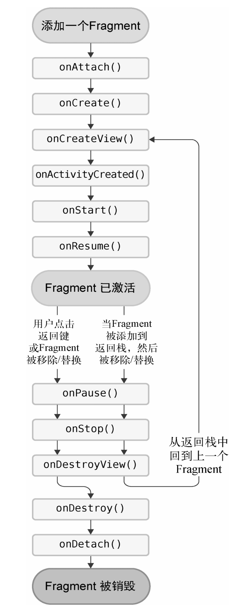

# Fragment 基本使用

Android自3.0版本开始引入了Fragment的概念，它可以让界面在平板上更好地展示。Fragment是一种可以嵌入在Activity当中的UI片段，它能让程序更加合理和充分地利用大屏幕的空间，因而在平板上应用得非常广泛。和Activity实在是太像了，同样都能包含布局，同样都有自己的生命周期。你甚至可以将Fragment理解成一个迷你型的Activity，虽然这个迷你型的Activity有可能和普通的Activity是一样大的。

更好的设计方案是将新闻标题列表界面和新闻详细内容界面分别放在两个Fragment中，然后在同一个Activity里引入这两个Fragment

新建一个LeftFragment类，并让它继承自Fragment

```kotlin
class LeftFragment : Fragment() {     
    override fun onCreateView(inflater: LayoutInflater, container: ViewGroup?, savedInstanceState: Bundle?): View? {         
        return inflater.inflate(R.layout.left_fragment, container, false)   
    } 
}
```

使用了<fragment>标签在布局中添加Fragment，其中指定的大多数属性你已经非常熟悉了，只不过这里还需要通过android:name属性来显式声明要添加的Fragment类名，注意一定要将类的包名也加上。

## 动态添加Fragment

```kotlin
class MainActivity : AppCompatActivity() {     
    override fun onCreate(savedInstanceState: Bundle?) {         
        super.onCreate(savedInstanceState)         
        setContentView(R.layout.activity_main)         
        button.setOnClickListener {             
            replaceFragment(AnotherRightFragment())         
        }         
        replaceFragment(RightFragment())     
    }     
    private fun replaceFragment(fragment: Fragment) {         
        val fragmentManager = supportFragmentManager         
        val transaction = fragmentManager.beginTransaction() 
        // R.id.rightLayout 一个FrameLayout
        transaction.replace(R.id.rightLayout, fragment)         
        transaction.commit()     
    } 
}
```

当点击左侧Fragment中的按钮时，又会调用replaceFragment()方法，将右侧Fragment替换成AnotherRightFragment。结合replaceFragment()方法中的代码可以看出，动态添加Fragment主要分为5步。(1) 创建待添加Fragment的实例。(2) 获取FragmentManager，在Activity中可以直接调用getSupportFragmentManager()方法获取。(3) 开启一个事务，通过调用beginTransaction()方法开启。(4) 向容器内添加或替换Fragment，一般使用replace()方法实现，需要传入容器的id和待添加的Fragment实例。(5) 提交事务，调用commit()方法来完成。

## Fragment中实现返回栈

FragmentTransaction中提供了一个addToBackStack()方法，可以用于将一个事务添加到返回栈中。

```kotlin
class MainActivity : AppCompatActivity() {     
    ...     
    private fun replaceFragment(fragment: Fragment) {         
        val fragmentManager = supportFragmentManager         
        val transaction = fragmentManager.beginTransaction()         
        transaction.replace(R.id.rightLayout, fragment)         
        transaction.addToBackStack(null)         
        transaction.commit()     
    } 
} 
```

## Fragment和Activity之间的交互

Fragment是嵌入在Activity中显示的，Fragment和Activity是各自存在于一个独立的类当中的，它们之间并没有那么明显的方式来直接进行交互。想要在Activity中调用Fragment里的方法，或者在Fragment中调用Activity里的方法。、

为了方便Fragment和Activity之间进行交互，FragmentManager提供了一个类似于findViewById()的方法，专门用于从布局文件中获取Fragment的实例，然后就能轻松地调用Fragment里的方法了。。

```kotlin
val fragment = supportFragmentManager.findFragmentById(R.id.leftFrag) as LeftFragment
```

在每个Fragment中都可以通过调用getActivity()方法来得到和当前Fragment相关联的Activity实例

```kotlin
if (activity != null) {     
	val mainActivity = activity as MainActivity
} 
```

getActivity()方法有可能返回null，因此我们需要先进行一个判空处理。有了Activity的实例，在Fragment中调用Activity里的方法就变得轻而易举了。另外当Fragment中需要使用Context对象时，也可以使用getActivity()方法，因为获取到的Activity本身就是一个Context对象。

不同的Fragment之间可不可以进行通信。基本思路非常简单：首先在一个Fragment中可以得到与它相关联的Activity，然后再通过这个Activity去获取另外一个Fragment的实例，这样就实现了不同Fragment之间的通信功能。

# Fragment的生命周期

## Fragment的状态和回调

### 运行状态

当一个Fragment所关联的Activity正处于运行状态时，该Fragment也处于运行状态。

### 暂停状态

当一个Activity进入暂停状态时（由于另一个未占满屏幕的Activity被添加到了栈顶），与它相关联的Fragment就会进入暂停状态。

### 停止状态

当一个Activity进入停止状态时，与它相关联的Fragment就会进入停止状态，或者通过调用FragmentTransaction的remove()、replace()方法将Fragment从Activity中移除，但在事务提交之前调用了addToBackStack()方法，这时的Fragment也会进入停止状态。总的来说，进入停止状态的Fragment对用户来说是完全不可见的，有可能会被系统回收。

### 销毁状态

Fragment总是依附于Activity而存在，因此当Activity被销毁时，与它相关联的Fragment就会进入销毁状态。或者通过调用FragmentTransaction的remove()、replace()方法将Fragment从Activity中移除，但在事务提交之前并没有调用addToBackStack()方法，这时的Fragment也会进入销毁状态。

**回调方法**

onAttach()：当Fragment和Activity建立关联时调用。

onCreateView()：为Fragment创建视图（加载布局）时调用。

onActivityCreated()：确保与Fragment相关联的Activity已经创建完毕时调用。

onDestroyView()：当与Fragment关联的视图被移除时调用。

onDetach()：当Fragment和Activity解除关联时调用。

### 生命周期图



在Fragment中你也可以通过onSaveInstanceState()方法来保存数据，因为进入停止状态的Fragment有可能在系统内存不足的时候被回收。保存下来的数据在onCreate()、onCreateView()和onActivityCreated()这3个方法中你都可以重新得到，它们都含有一个Bundle类型的savedInstanceState参数。

## 动态加载布局

### 使用限定符

那么怎样才能在运行时判断程序应该是使用双页模式还是单页模式呢？这就需要借助限定符（qualifier）来实现了。

### 使用最小宽度限定符

有时候我们希望可以更加灵活地为不同设备加载布局，不管它们是不是被系统认定为large，这时就可以使用最小宽度限定符（smallest-widthqualifier）。最小宽度限定符允许我们对屏幕的宽度指定一个最小值（以dp为单位），然后以这个最小值为临界点，屏幕宽度大于这个值的设备就加载一个布局，屏幕宽度小于这个值的设备就加载另一个布局。

# Fragment 实践

# Kotlin

## 扩展函数

扩展函数表示即使在不修改某个类的源码的情况下，仍然可以打开这个类，向该类添加新的函数。相比于定义一个普通的函数，定义扩展函数只需要在函数名的前面加上一个ClassName.的语法结构，就表示将该函数添加到指定类当中了。

```kotlin
fun ClassName.methodName(param1: Int, param2: Int): Int {     return 0 }
```

向哪个类中添加扩展函数，就定义一个同名的Kotlin文件。扩展函数也是可以定义在任何一个现有类当中的，并不一定非要创建新文件。通常来说，最好将它定义成顶层方法，这样可以让扩展函数拥有全局的访问域。

## 运算符重载

运算符重载使用的是operator关键字，只要在指定函数的前面加上operator关键字，就可以实现运算符重载的功能了。