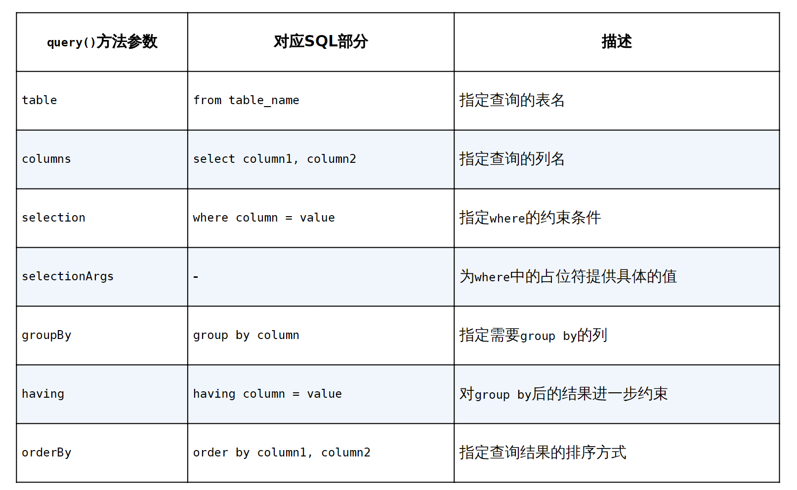

# 持久化技术简介

数据持久化就是指将那些内存中的瞬时数据保存到存储设备中，保证即使在手机或计算机关机的情况下，这些数据仍然不会丢失。保存在内存中的数据是处于瞬时状态的，而保存在存储设备中的数据是处于持久状态的。持久化技术提供了一种机制，可以让数据在瞬时状态和持久状态之间进行转换。Android系统中主要提供了3种方式用于简单地实现数据持久化功能：文件存储、SharedPreferences存储以及数据库存储。、

# 文件存储

## 将数据存储到文件中

文件存储是Android中最基本的数据存储方式，它不对存储的内容进行任何格式化处理，所有数据都是原封不动地保存到文件当中的，因而它比较适合存储一些简单的文本数据或二进制数据。如果你想使用文件存储的方式来保存一些较为复杂的结构化数据，就需要定义一套自己的格式规范，方便之后将数据从文件中重新解析出来。文件存储的方式并不适合用于保存一些较为复杂的结构型数据。

Context类中提供了一个openFileOutput()方法，可以用于将数据存储到指定的文件中。这个方法接收两个参数：第一个参数是文件名，在文件创建的时候使用，注意这里指定的文件名不可以包含路径，因为所有的文件都默认存储到/data/data/<package name>/files/目录下；第二个参数是文件的操作模式，主要有MODE_PRIVATE和MODE_APPEND两种模式可选，默认是MODE_PRIVATE，表示当指定相同文件名的时候，所写入的内容将会覆盖原文件中的内容，而MODE_APPEND则表示如果该文件已存在，就往文件里面追加内容，不存在就创建新文件。

openFileOutput()方法返回的是一个FileOutputStream对象，得到这个对象之后就可以使用Java流的方式将数据写入文件中了。

```kotlin
fun save(inputText: String) {
    try {
        val output = openFileOutput("data", Context.Mode_PRIVATE)
        val writer = BufferedWriter(OutputStreamWriter(output))
        writer.use{
            it.write(inputText)
        }
    } catch (e: IOExcetion) {
        e.printStackTrace()
    }
}
```

这里通过openFileOutput()方法能够得到一个FileOutputStream对象，然后借助它构建出一个OutputStreamWriter对象，接着再使用OutputStreamWriter构建出一个BufferedWriter对象，这样你就可以通过BufferedWriter将文本内容写入文件中了。use函数，这是Kotlin提供的一个内置扩展函数。它会保证在Lambda表达式中的代码全部执行完之后自动将外层的流关闭，这样就不需要我们再编写一个finally语句，手动去关闭流了，是一个非常好用的扩展函数。

Kotlin是没有异常检查机制（checked exception）的。这意味着使用Kotlin编写的所有代码都不会强制要求你进行异常捕获或异常抛出。上述代码中的try catch代码块是参照Java的编程规范添加的，即使你不写try catch代码块，在Kotlin中依然可以编译通过。

## 从文件中读取数据

Context类中还提供了一个openFileInput()方法，用于从文件中读取数据。这个方法要比openFileOutput()简单一些，它只接收一个参数，即要读取的文件名，然后系统会自动到/data/data/<package name>/files/目录下加载这个文件，并返回一个FileInputStream对象，得到这个对象之后，再通过流的方式就可以将数据读取出来了。这里从文件中读取数据使用了一个forEachLine函数，这也是Kotlin提供的一个内置扩展函数，它会将读到的每行内容都回调到Lambda表达式中，我们在Lambda表达式中完成拼接逻辑即可。

```kotlin
func load(): String {
    val content = StringBuilder()
    try {
        val input = openFileInput("data")
        val reader = BufferedReader(InputStreamReader(input))
        reader.use {
            reader.forEachLine {
                content.append(it)
            }
        }
    } catch (e: IOExcetion){
        e.printStackTrace
    }
    return content.toString()
}
```

# SharedPreferences存储

不同于文件的存储方式，SharedPreferences是使用键值对的方式来存储数据的。也就是说，当保存一条数据的时候，需要给这条数据提供一个对应的键，这样在读取数据的时候就可以通过这个键把相应的值取出来。而且SharedPreferences还支持多种不同的数据类型存储，如果存储的数据类型是整型，那么读取出来的数据也是整型的；如果存储的数据是一个字符串，那么读取出来的数据仍然是字符串。

## 将数据存储到SharedPreferences中

### Context类中的getSharedPreferences()方法

此方法接收两个参数：第一个参数用于指定SharedPreferences文件的名称，如果指定的文件不存在则会创建一个，SharedPreferences文件都是存放在/data/data/<packagename>/shared_prefs/目录下的；第二个参数用于指定操作模式，目前只有默认的MODE_PRIVATE这一种模式可选，它和直接传入0的效果是相同的，表示只有当前的应用程序才可以对这个SharedPreferences文件进行读写。其他几种操作模式均已被废弃

### Activity类中的getPreferences()方法

这个方法和Context中的getSharedPreferences()方法很相似，不过它只接收一个操作模式参数，因为使用这个方法时会自动将当前Activity的类名作为SharedPreferences的文件名。得到了SharedPreferences对象之后，就可以开始向SharedPreferences文件中存储数据了，主要可以分为3步实现。(1) 调用SharedPreferences对象的edit()方法获取一个SharedPreferences.Editor对象。(2) 向SharedPreferences.Editor对象中添加数据，比如添加一个布尔型数据就使用putBoolean()方法，添加一个字符串则使用putString()方法，以此类推。(3) 调用apply()方法将添加的数据提交，从而完成数据存储操作。

```kotlin
saveButton.setOnClickListener {
    val editor = getSharedPreferences("data", Context.MODE_PRIVATE).edit()
    editor.putString("name", "Tom")
    editor.putInt("age", 22)
    editor.putBoolean("married", false)
    editor.apply()
}
```

首先给按钮注册了一个点击事件，然后在点击事件中通过getSharedPreferences()方法指定SharedPreferences的文件名为data，并得到了SharedPreferences.Editor对象。接着向这个对象中添加了3条不同类型的数据，最后调用apply()方法进行提交，从而完成了数据存储的操作。进入/data/data/com.example.sharedpreferencestest/shared_prefs/目录下，可以看到生成了一个data.xml文件

## 从SharedPreferences中读取数据

SharedPreferences对象中提供了一系列的get方法，用于读取存储的数据，每种get方法都对应了SharedPreferences.Editor中的一种put方法，比如读取一个布尔型数据就使用getBoolean()方法，读取一个字符串就使用getString()方法。这些get方法都接收两个参数：第一个参数是键，传入存储数据时使用的键就可以得到相应的值了；第二个参数是默认值，即表示当传入的键找不到对应的值时会以什么样的默认值进行返回。

# SQLite数据库存储

文件存储和SharedPreferences存储毕竟只适用于保存一些简单的数据和键值对，当需要存储大量复杂的关系型数据的时候，你就会发现以上两种存储方式很难应付得了。SQLite是一款轻量级的关系型数据库，它的运算速度非常快，占用资源很少，通常只需要几百KB的内存就足够了，因而特别适合在移动设备上使用。SQLite不仅支持标准的SQL语法，还遵循了数据库的ACID事务，所以只要你以前使用过其他的关系型数据库，就可以很快地上手SQLite。而SQLite又比一般的数据库要简单得多，它甚至不用设置用户名和密码就可以使用。

## 创建数据库

Android为了让我们能够更加方便地管理数据库，专门提供了一个SQLiteOpenHelper帮助类，借助这个类可以非常简单地对数据库进行创建和升级。

SQLiteOpenHelper是一个抽象类，这意味着如果我们想要使用它，就需要创建一个自己的帮助类去继承它。SQLiteOpenHelper中有两个抽象方法：onCreate()和onUpgrade()。我们必须在自己的帮助类里重写这两个方法，然后分别在这两个方法中实现创建和升级数据库的逻辑。

SQLiteOpenHelper中还有两个非常重要的实例方法：getReadableDatabase()和getWritableDatabase()。这两个方法都可以创建或打开一个现有的数据库（如果数据库已存在则直接打开，否则要创建一个新的数据库），并返回一个可对数据库进行读写操作的对象。不同的是，当数据库不可写入的时候（如磁盘空间已满），getReadableDatabase()方法返回的对象将以只读的方式打开数据库，而getWritableDatabase()方法则将出现异常。

SQLiteOpenHelper中有两个构造方法可供重写，一般使用参数少一点的那个构造方法即可。这个构造方法中接收4个参数：第一个参数是Context，这个没什么好说的，必须有它才能对数据库进行操作；第二个参数是数据库名，创建数据库时使用的就是这里指定的名称；第三个参数允许我们在查询数据的时候返回一个自定义的Cursor，一般传入null即可；第四个参数表示当前数据库的版本号，可用于对数据库进行升级操作。构建出SQLiteOpenHelper的实例之后，再调用它的getReadableDatabase()或getWritableDatabase()方法就能够创建数据库了，数据库文件会存放在/data/data/<package name>/databases/目录下。此时，重写的onCreate()方法也会得到执行，所以通常会在这里处理一些创建表的逻辑。

SQLite不像其他的数据库拥有众多繁杂的数据类型，它的数据类型很简单：integer表示整型，real表示浮点型，text表示文本类型，blob表示二进制类型。另外，在上述建表语句中，我们还使用了primary key将id列设为主键，并用autoincrement关键字表示id列是自增长的。

```kotlin
create table Category (
	id integer primary key autoincrement
    category_name text,
    category_code integer
)

class MyDatabaseHelper(val context: Context, name: Stirng, version: Int): SQLiteOpenHelper(context, name, null , version) {
    private val createCategory = "create table Category (" + "id integer primary key autoincrement," + "category_name text," + "category_code integer)"
    
    override fun onCreate(db: SQLiteDatabase) {
        db.execSQL(createBook)
        db.execSQL(createCategory)
    }
    
    override fun onUpgrade(db: SQLiteDatabase, oldVersion: Int, newVersion: Int){
        db.execSQL("drop table if exists Book")
        db.execSQL("drop table if exists Category")
        onCreate(db)
    }
}

class MainActivity : AppCompatActivity() {     
    override fun onCreate(savedInstanceState: Bundle?) {         
        super.onCreate(savedInstanceState)         
        setContentView(R.layout.activity_main)         
        val dbHelper = MyDatabaseHelper(this, "BookStore.db", 2)        
        createDatabase.setOnClickListener {             
            dbHelper.writableDatabase         
        }     
    } 
}
```

点击事件里调用了getWritableDatabase()方法。这样当第一次点击“Create Database”按钮时，就会检测到当前程序中并没有BookStore.db这个数据库，于是会创建该数据库并调用MyDatabaseHelper中的onCreate()方法。接下来的问题就是如何让onUpgrade()方法能够执行了。还记得SQLiteOpenHelper的构造方法里接收的第四个参数吗？它表示当前数据库的版本号，之前我们传入的是1，现在只要传入一个比1大的数，就可以让onUpgrade()方法得到执行了。

## 添加数据

调用SQLiteOpenHelper的getReadableDatabase()或getWritableDatabase()方法是可以用于创建和升级数据库的，不仅如此，这两个方法还都会返回一个SQLiteDatabase对象，借助这个对象就可以对数据进行CRUD操作了。

SQLiteDatabase中提供了一个insert()方法，专门用于添加数据。它接收3个参数：第一个参数是表名，我们希望向哪张表里添加数据，这里就传入该表的名字；第二个参数用于在未指定添加数据的情况下给某些可为空的列自动赋值NULL，一般我们用不到这个功能，直接传入null即可；第三个参数是一个ContentValues对象，它提供了一系列的put()方法重载，用于向ContentValues中添加数据，只需要将表中的每个列名以及相应的待添加数据传入即可。

```kotlin
class MainActivity : AppCompatActivity() {
    override fun onCreate(savedInstanceState: Bundle?) {
        super.onCreate(savedInstanceState)
        setContentView()
        val dbHelper = MyDatabaseHelper(this, "BookStore.db", 2)
        ...
        addData.setOnClickListener{
            val db = dbHelper.writableDatabase
            val values1 = ContentValues().apply{
                put("name", "The Da Vinci Code")                 
                put("author", "Dan Brown")                 
                put("pages", 454)                 
                put("price", 16.96) 
            }
            db.insert("Book", null, values1) // 插入第一条数据
        }
    }
}
```

在添加数据按钮的点击事件里，我们先获取了SQLiteDatabase对象，然后使用ContentValues对要添加的数据进行组装。如果你比较细心的话，应该会发现这里只对Book表里其中4列的数据进行了组装，id那一列并没给它赋值。这是因为在前面创建表的时候，我们就将id列设置为自增长了，它的值会在入库的时候自动生成，所以不需要手动赋值了。接下来调用了insert()方法将数据添加到表当中。

## 更新数据

SQLiteDatabase中提供了一个非常好用的update()方法，用于对数据进行更新。这个方法接收4个参数：第一个参数和insert()方法一样，也是表名，指定更新哪张表里的数据；第二个参数是ContentValues对象，要把更新数据在这里组装进去；第三、第四个参数用于约束更新某一行或某几行中的数据，不指定的话默认会更新所有行。

```kotlin
updateData.setOnClickListener {             
    val db = dbHelper.writableDatabase             
    val values = ContentValues()             
    values.put("price", 10.99)             
    db.update("Book", values, "name = ?", arrayOf("The Da Vinci Code"))        
} 
```

更新数据按钮的点击事件里面构建了一个ContentValues对象，并且只给它指定了一组数据，说明我们只是想把价格这一列的数据更新成10.99。然后调用了SQLiteDatabase的update()方法执行具体的更新操作，可以看到，这里使用了第三、第四个参数来指定具体更新哪几行。第三个参数对应的是SQL语句的where部分，表示更新所有name等于?的行，而?是一个占位符，可以通过第四个参数提供的一个字符串数组为第三个参数中的每个占位符指定相应的内容，arrayOf()方法是Kotlin提供的一种用于便捷创建数组的内置方法。

## 删除数据

SQLiteDatabase中提供了一个delete()方法，专门用于删除数据。这个方法接收3个参数：第一个参数仍然是表名，这个没什么好说的；第二、第三个参数用于约束删除某一行或某几行的数据，不指定的话默认会删除所有行

```kotlin
val dbHelper = MyDatabaseHelper(this, "BookStore.db", 2)        
...         
deleteData.setOnClickListener {             
    val db = dbHelper.writableDatabase             
    db.delete("Book", "pages > ?", arrayOf("500"))         
} 
```

## 查询数据

SQLiteDatabase中还提供了一个query()方法用于对数据进行查询。这个方法的参数非常复杂，最短的一个方法重载也需要传入7个参数。第一个参数不用说，当然还是表名，表示我们希望从哪张表中查询数据。第二个参数用于指定去查询哪几列，如果不指定则默认查询所有列。第三、第四个参数用于约束查询某一行或某几行的数据，不指定则默认查询所有行的数据。第五个参数用于指定需要去group by的列，不指定则表示不对查询结果进行group by操作。第六个参数用于对group by之后的数据进行进一步的过滤，不指定则表示不进行过滤。第七个参数用于指定查询结果的排序方式，不指定则表示使用默认的排序方式。调用query()方法后会返回一个Cursor对象，查询到的所有数据都将从这个对象中取出。



```kotlin
val dbHelper = MyDatabaseHelper(this, "BookStore.db", 2)
queryData.setOnClickListener{
    val db = dbHelper.writableDatabasae
    val cursor = db.query("Book", null, null, null, null, null, null)            
    if (cursor.moveToFirst()) {                 
        do {                     
            // 遍历Cursor对象，取出数据并打印                    
            val name = cursor.getString(cursor.getColumnIndex("name"))                    
            val author = cursor.getString(cursor.getColumnIndex("author"))                    
            val pages = cursor.getInt(cursor.getColumnIndex("pages"))                    
            val price = cursor.getDouble(cursor.getColumnIndex("price"))                                                      
        } while (cursor.moveToNext())             
    }             
    cursor.close()         
}     

```

得到了一个Cursor对象，接着我们调用它的moveToFirst()方法，将数据的指针移动到第一行的位置，然后进入一个循环当中，去遍历查询到的每一行数据。在这个循环中可以通过Cursor的getColumnIndex()方法获取某一列在表中对应的位置索引，然后将这个索引传入相应的取值方法中，就可以得到从数据库中读取到的数据了。

# SQLite数据库的最佳实践

## 使用事务

SQLite数据库是支持事务的，事务的特性可以保证让一系列的操作要么全部完成，要么一个都不会完成。

```kotlin
val dbHelper = MyDatabaseHelper(this, "BookStore.db", 2)        
...         
replaceData.setOnClickListener {             
    val db = dbHelper.writableDatabase             
    db.beginTransaction() // 开启事务            
    try {                 
        db.delete("Book", null, null)  
        if (true) {                     
            // 手动抛出一个异常，让事务失败                    
            throw NullPointerException()                 
        }                 
        val values = ContentValues().apply {                     
            put("name", "Game of Thrones")                     
            put("author", "George Martin")                     
            put("pages", 720)                     
            put("price", 20.85)                 
        }                 
        db.insert("Book", null, values)                 
        db.setTransactionSuccessful() 
        // 事务已经执行成功            
    } catch (e: Exception) {                 
        e.printStackTrace()             
    } finally {                 
        db.endTransaction() // 结束事务            
    }         
}
```

上述代码就是Android中事务的标准用法，首先调用SQLiteDatabase的beginTransaction()方法开启一个事务，然后在一个异常捕获的代码块中执行具体的数据库操作，当所有的操作都完成之后，调用setTransactionSuccessful()表示事务已经执行成功了，最后在finally代码块中调用endTransaction()结束事务。注意观察，我们在删除旧数据的操作完成后手动抛出了一个NullPointerException，这样添加新数据的代码就执行不到了。不过由于事务的存在，中途出现异常会导致事务的失败，此时旧数据应该是删除不掉的。

## 升级数据库的最佳写法

# Kotlin

## 简化SharedPreferences的用法

使用高阶函数简化SharedPreferences的用法，新建一个SharedPreferences.kt文件，然后在里面加入如下代码：

```kotlin
fun SharedPreferences.open(block: SharedPreferences.Editor.() -> Unit) {    
    val editor = edit()     
    editor.block()     
    editor.apply() 
}
```

通过扩展函数的方式向SharedPreferences类中添加了一个open函数，并且它还接收一个函数类型的参数，因此open函数自然就是一个高阶函数了。由于open函数内拥有SharedPreferences的上下文，因此这里可以直接调用edit()方法来获取SharedPreferences.Editor对象。另外open函数接收的是一个SharedPreferences.Editor的函数类型参数，因此这里需要调用editor.block()对函数类型参数进行调用，我们就可以在函数类型参数的具体实现中添加数据了。最后还要调用editor.apply()方法来提交数据，从而完成数据存储操作。

定义好了open函数之后，我们以后在项目中使用SharedPreferences存储数据就会更加方便了，写法如下所示：

```kotlin
getSharedPreferences("data", Context.MODE_PRIVATE).open {     
    putString("name", "Tom")     
    putInt("age", 28)     
    putBoolean("married", false) 
} 
```

我们可以直接在SharedPreferences对象上调用open函数，然后在Lambda表达式中完成数据的添加操作。注意，现在Lambda表达式拥有的是SharedPreferences.Editor的上下文环境，因此这里可以直接调用相应的put方法来添加数据。最后我们也不再需要调用apply()方法来提交数据了，因为open函数会自动完成提交操作。

其实Google提供的KTX扩展库中已经包含了上述SharedPreferences的简化用法，将open函数换成了edit函数。

## 简化ContentValues的用法

新建一个ContentValues.kt文件，然后在里面定义一个cvOf()方法，如下所示：

这个方法的作用是构建一个ContentValues对象，有几点我需要解释一下。首先，cvOf()方法接收了一个Pair参数，也就是使用A to B语法结构创建出来的参数类型，但是我们在参数前面加上了一个vararg关键字，这是什么意思呢？其实vararg对应的就是Java中的可变参数列表，我们允许向这个方法传入0个、1个、2个甚至任意多个Pair类型的参数，这些参数都会被赋值到使用vararg声明的这一个变量上面，然后使用for-in循环可以将传入的所有参数遍历出来。再来看声明的Pair类型。由于Pair是一种键值对的数据结构，因此需要通过泛型来指定它的键和值分别对应什么类型的数据。值得庆幸的是，ContentValues的所有键都是字符串类型的，这里可以直接将Pair键的泛型指定成String。但ContentValues的值却可以有多种类型（字符串型、整型、浮点型，甚至是null），所以我们需要将Pair值的泛型指定成Any?。这是因为Any是Kotlin中所有类的共同基类，相当于Java中的Object，而Any?则表示允许传入空值。接下来我们开始为cvOf()方法实现功能逻辑，核心思路就是先创建一个ContentValues对象，然后遍历pairs参数列表，取出其中的数据并填入ContentValues中，最终将ContentValues对象返回即可。思路并不复杂，但是存在一个问题：Pair参数的值是Any?类型的，我们怎样让它和ContentValues所支持的数据类型对应起来呢？这个确实没有什么好的办法，只能使用when语句一一进行条件判断，并覆盖ContentValues所支持的所有数据类型。结合下面的代码来理解应该更加清楚一些：

```kotlin
fun cvOf(vararg pairs: Pair<String, Any?>): ContentValues {
    val cv = ContentValues()     
    for (pair in pairs) {         
        val key = pair.first         
        val value = pair.second         
        when (value) {             
            is Int -> cv.put(key, value)             
            is Long -> cv.put(key, value)             
            is Short -> cv.put(key, value)             
            is Float -> cv.put(key, value)             
            is Double -> cv.put(key, value)             
            is Boolean -> cv.put(key, value)             
            is String -> cv.put(key, value)             
            is Byte -> cv.put(key, value)             
            is ByteArray -> cv.put(key, value)             
            null -> cv.putNull(key)         
        }     
    }     
    return cv
} 
```

使用了Kotlin中的Smart Cast功能。比如when语句进入Int条件分支后，这个条件下面的value会被自动转换成Int类型，而不再是Any?类型，这样我们就不需要像Java中那样再额外进行一次向下转型了，这个功能在if语句中也同样适用。

有了这个cvOf()方法之后，我们使用ContentValues时就会变得更加简单了，比如向数据库中插入一条数据就可以这样写：现在我们可以使用类似于mapOf()函数的语法结构来构建ContentValues对象。

```kotlin
val values = cvOf("name" to "Game of Thrones", "author" to "George Martin",    "pages" to 720, "price" to 20.85) 
db.insert("Book", null, values) 
```

从功能性方面，cvOf()方法好像确实用不到高阶函数的知识，但是从代码实现方面，却可以结合高阶函数来进行进一步的优化。比如借助apply函数，cvOf()方法的实现将会变得更加优雅。由于apply函数的返回值就是它的调用对象本身，因此这里我们可以使用单行代码函数的语法糖，用等号替代返回值的声明。另外，apply函数的Lambda表达式中会自动拥有ContentValues的上下文，所以这里可以直接调用ContentValues的各种put方法。

KTX库中也提供了一个具有同样功能的contentValuesOf()方法，用法如下所示：

```kotlin
val values = contentValuesOf("name" to "Game of Thrones", "author" to "George Martin",    "pages" to 720, "price" to 20.85) 
db.insert("Book", null, values) 
```

