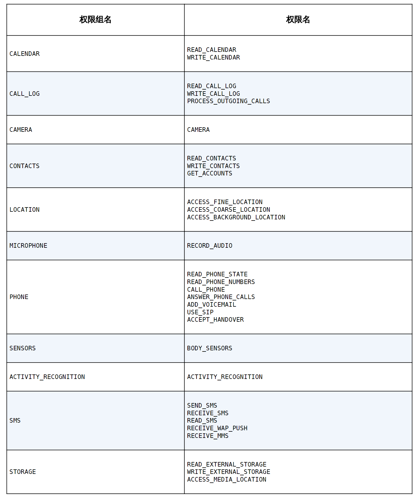
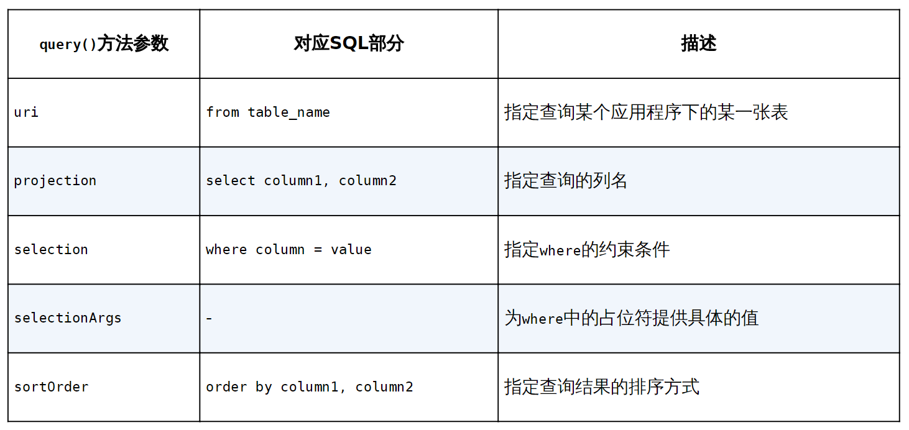

# ContentProvider简介

Android数据持久化技术，包括文件存储、SharedPreferences存储以及数据库存储。不知道你有没有发现，使用这些持久化技术所保存的数据只能在当前应用程序中访问。

ContentProvider主要用于在不同的应用程序之间实现数据共享的功能，它提供了一套完整的机制，允许一个程序访问另一个程序中的数据，同时还能保证被访问数据的安全性。目前，使用ContentProvider是Android实现跨程序共享数据的标准方式。不同于文件存储和SharedPreferences存储中的两种全局可读写操作模式，ContentProvider可以选择只对哪一部分数据进行共享，从而保证我们程序中的隐私数据不会有泄漏的风险。

# 运行时权限

在Android 6.0系统中加入了运行时权限功能。也就是说，用户不需要在安装软件的时候一次性授权所有申请的权限，而是可以在软件的使用过程中再对某一项权限申请进行授权。比如一款相机应用在运行时申请了地理位置定位权限，就算我拒绝了这个权限，也应该可以使用这个应用的其他功能，而不是像之前那样直接无法安装它。

并不是所有权限都需要在运行时申请，对于用户来说，不停地授权也很烦琐。Android现在将常用的权限大致归成了两类，一类是普通权限，一类是危险权限。准确地讲，其实还有一些特殊权限，不过这些权限使用得相对较少，因此不在本书的讨论范围之内。普通权限指的是那些不会直接威胁到用户的安全和隐私的权限，对于这部分权限申请，系统会自动帮我们进行授权，不需要用户手动操作，比如在BroadcastTest项目中申请的权限就是普通权限。危险权限则表示那些可能会触及用户隐私或者对设备安全性造成影响的权限，如获取设备联系人信息、定位设备的地理位置等，对于这部分权限申请，必须由用户手动授权才可以，否则程序就无法使用相应的功能。

## 到Android 10系统为止所有的危险权限



每当要使用一个权限时，可以先到这张表中查一下，如果是这张表中的权限，就需要进行运行时权限处理，否则，只需要在AndroidManifest.xml文件中添加一下权限声明就可以了。

表格中每个危险权限都属于一个权限组，我们在进行运行时权限处理时使用的是权限名。原则上，用户一旦同意了某个权限申请之后，同组的其他权限也会被系统自动授权。但是请谨记，不要基于此规则来实现任何功能逻辑，因为Android系统随时有可能调整权限的分组。

## 在程序运行时申请权限

错误信息中提醒我们“Permission Denial”，可以看出，这是由于权限被禁止所导致的，因为Android 6.0及以上系统在使用危险权限时必须进行运行时权限处理。

```kotlin
makeCall.setOnClickListener {
    if (ContextCompat.checkSelfPermission(this, Mainfest.permission.CALL_PHONE) != PackageManager.PERMISSION_GRANTED) {
        ActivityCompat.requestPermissions(this, arrayOf(Mainfest.permission.CALL_PHONE), 1)
    } else {
        call()
    }
}

override fun onRequestPermissionsResult(requsetCode: Int, permissions: Array<String>, grantResults: IntArray) {
    super.onRequestPermissionResult(requestCode, permissions, grantResults)
    when (requestCode) {
        1 -> {
            if (grantResults.isNotEmpty() && grantResults[0] == PackageManager.PERMISSION_GRANTED) {
                call()
            } else{
                
            }
        }
    }
}

private fun call() {
    try {             
        val intent = Intent(Intent.ACTION_CALL)             
        intent.data = Uri.parse("tel:10086")             
        startActivity(intent)         
    } catch (e: SecurityException) {             
        e.printStackTrace()         
    } 
}
```

运行时权限的核心就是在程序运行过程中由用户授权我们去执行某些危险操作，程序是不可以擅自做主去执行这些危险操作的。因此，第一步就是要先判断用户是不是已经给过我们授权了，借助的是ContextCompat.checkSelfPermission()方法。checkSelfPermission()方法接收两个参数：第一个参数是Context，这个没什么好说的；第二个参数是具体的权限名，比如打电话的权限名就是Manifest.permission.CALL_PHONE。然后我们使用方法的返回值和PackageManager.PERMISSION_GRANTED做比较，相等就说明用户已经授权，不等就表示用户没有授权。如果已经授权的话就简单了，直接执行拨打电话的逻辑操作就可以了，这里我们把拨打电话的逻辑封装到了call()方法当中。如果没有授权的话，则需要调用ActivityCompat.requestPermissions()方法向用户申请授权。requestPermissions()方法接收3个参数：第一个参数要求是Activity的实例；第二个参数是一个String数组，我们把要申请的权限名放在数组中即可；第三个参数是请求码，只要是唯一值就可以了，这里传入了1。

调用完requestPermissions()方法之后，系统会弹出一个权限申请的对话框，用户可以选择同意或拒绝我们的权限申请。不论是哪种结果，最终都会回调到onRequestPermissionsResult()方法中，而授权的结果则会封装在grantResults参数当中。这里我们只需要判断一下最后的授权结果：如果用户同意的话，就调用call()方法拨打电话；如果用户拒绝的话，我们只能放弃操作，并且弹出一条失败提示。

# 访问其他程序中的数据

ContentProvider的用法一般有两种：一种是使用现有的ContentProvider读取和操作相应程序中的数据；另一种是创建自己的ContentProvider，给程序的数据提供外部访问接口。

如果一个应用程序通过ContentProvider对其数据提供了外部访问接口，那么任何其他的应用程序都可以对这部分数据进行访问。Android系统中自带的通讯录、短信、媒体库等程序都提供了类似的访问接口，这就使得第三方应用程序可以充分地利用这部分数据实现更好的功能。

## ContentResolver的基本用法

对于每一个应用程序来说，如果想要访问ContentProvider中共享的数据，就一定要借助ContentResolver类，可以通过Context中的getContentResolver()方法获取该类的实例。ContentResolver中提供了一系列的方法用于对数据进行增删改查操作，其中insert()方法用于添加数据，update()方法用于更新数据，delete()方法用于删除数据，query()方法用于查询数据。

不同于SQLiteDatabase，ContentResolver中的增删改查方法都是不接收表名参数的，而是使用一个Uri参数代替，这个参数被称为内容URI。内容URI给ContentProvider中的数据建立了唯一标识符，它主要由两部分组成：authority和path。authority是用于对不同的应用程序做区分的，一般为了避免冲突，会采用应用包名的方式进行命名。比如某个应用的包名是com.example.app，那么该应用对应的authority就可以命名为com.example.app.provider。path则是用于对同一应用程序中不同的表做区分的，通常会添加到authority的后面。比如某个应用的数据库里存在两张表table1和table2，这时就可以将path分别命名为/table1和/table2，然后把authority和path进行组合，内容URI就变成了com.example.app.provider/table1和com.example.app.provider/table2。不过，目前还很难辨认出这两个字符串就是两个内容URI，我们还需要在字符串的头部加上协议声明。因此，内容URI最标准的格式如下：

```kotlin
content://com.example.app.provider/table1 content://com.example.app.provider/table2
```

内容URI可以非常清楚地表达我们想要访问哪个程序中哪张表里的数据。也正是因此，ContentResolver中的增删改查方法才都接收Uri对象作为参数。如果使用表名的话，系统将无法得知我们期望访问的是哪个应用程序里的表。在得到了内容URI字符串之后，我们还需要将它解析成Uri对象才可以作为参数传入。解析的方法也相当简单，只需要调用Uri.parse()方法，就可以将内容URI字符串解析成Uri对象了。

```kotlin
val uri = Uri.parse("content://com.example.app.provider/table1")
                    
// 使用这个Uri对象查询table1表中的数据
val cursor = contentResolver.query(     
    uri,     
    projection,     
    selection,     
    selectionArgs,     
    sortOrder)

// 查询完成后返回的仍然是一个Cursor对象，这时我们就可以将数据从Cursor对象中逐个读取出来了。读取的思路仍然是通过移动游标的位置遍历Cursor的所有行，然后取出每一行中相应列的数据
while (cursor.moveToNext()) {     
    val column1 = cursor.getString(cursor.getColumnIndex("column1"))    
    val column2 = cursor.getInt(cursor.getColumnIndex("column2"))
} 
cursor.close()

// 添加数据。将待添加的数据组装到ContentValues中，然后调用ContentResolver的insert()方法，将Uri和ContentValues作为参数传入即可。
val values = contentValuesOf("column1" to "text", "column2" to 1)
contentResolver.insert(uri, values)

// 更新这条新添加的数据，把column1的值清空，可以借助ContentResolver的update()方法实现。使用了selection和selectionArgs参数来对想要更新的数据进行约束，以防止所有的行都会受影响。
val values = contentValuesOf("column1" to "") 
contentResolver.update(uri, values, "column1 = ? and column2 = ?", arrayOf("text", "1"))

// 调用ContentResolver的delete()方法将这条数据删除掉
contentResolver.delete(uri, "column2 = ?", arrayOf("1"))
```



## 读取系统联系人

```kotlin
class MainActivity : AppCompatActivity() {
    private val contactsList = ArrayList<String>()     
    private lateinit var adapter: ArrayAdapter<String>     
    override fun onCreate(savedInstanceState: Bundle?) {         
        super.onCreate(savedInstanceState)         
        setContentView(R.layout.activity_main)         
        adapter = ArrayAdapter(this, android.R.layout.simple_list_item_1, contactsList)        
        contactsView.adapter = adapter         
        if (ContextCompat.checkSelfPermission(this, Manifest.permission.READ_CONTACTS) != PackageManager.PERMISSION_GRANTED) {
            ActivityCompat.requestPermissions(this,                 arrayOf(Manifest.permission.READ_CONTACTS), 1)         
        } else {             
            readContacts()         
        }     
    }
    
    private fun readContacts() {         
        // 查询联系人数据
contentResolver.query(ContactsContract.CommonDataKinds.Phone.CONTENT_URI,                null, null, null, null)?.apply {             
            while (moveToNext()) {                 
                // 获取联系人姓名                
                val displayName = getString(getColumnIndex(                 ContactsContract.CommonDataKinds.Phone.DISPLAY_NAME))                
                // 获取联系人手机号                
                val number = getString(getColumnIndex(                 ContactsContract.CommonDataKinds.Phone.NUMBER))                 
                contactsList.add("$displayName\n$number")             
            }             
            adapter.notifyDataSetChanged()             
            close()         
        }     
    }
}
```

将两个数据取出后进行拼接，并且在中间加上换行符，然后将拼接后的数据添加到ListView的数据源里，并通知刷新一下ListView，最后千万不要忘记将Cursor对象关闭。读取系统联系人的权限千万不能忘记声明。

# 创建自己的ContentProvider

些提供外部访问接口的应用程序都是如何实现这种功能的呢？它们又是怎样保证数据的安全，使得隐私数据不会泄漏出去？

## 创建ContentProvider的步骤

如果想要实现跨程序共享数据的功能，可以通过新建一个类去继承ContentProvider的方式来实现。ContentProvider类中有6个抽象方法，我们在使用子类继承它的时候，需要将这6个方法全部重写。

```kotlin
class MyProvider : ContentProvider() {     
    override fun onCreate(): Boolean {         
        return false     
    }     
    
    override fun query(uri: Uri, projection: Array<String>?, selection: String?, selectionArgs: Array<String>?, sortOrder: String?): Cursor? {       
        return null     
    }
    
    override fun insert(uri: Uri, values: ContentValues?): Uri? {        
        return null     
    }
    
    override fun update(uri: Uri, values: ContentValues?, selection: String?, selectionArgs: Array<String>?): Int {         
        return 0     
    }     
    
    override fun delete(uri: Uri, selection: String?, selectionArgs: Array<String>?): Int {        
        return 0     
    }     
    
    override fun getType(uri: Uri): String? {         
        return null     
    } 
}
```

(1) onCreate()。初始化ContentProvider的时候调用。通常会在这里完成对数据库的创建和升级等操作，返回true表示ContentProvider初始化成功，返回false则表示失败。

(2) query()。从ContentProvider中查询数据。uri参数用于确定查询哪张表，projection参数用于确定查询哪些列，selection和selectionArgs参数用于约束查询哪些行，sortOrder参数用于对结果进行排序，查询的结果存放在Cursor对象中返回。

(3) insert()。向ContentProvider中添加一条数据。uri参数用于确定要添加到的表，待添加的数据保存在values参数中。添加完成后，返回一个用于表示这条新记录的URI。

(4) update()。更新ContentProvider中已有的数据。uri参数用于确定更新哪一张表中的数据，新数据保存在values参数中，selection和selectionArgs参数用于约束更新哪些行，受影响的行数将作为返回值返回。

(5) delete()。从ContentProvider中删除数据。uri参数用于确定删除哪一张表中的数据，selection和selectionArgs参数用于约束删除哪些行，被删除的行数将作为返回值返回。

(6) getType()。根据传入的内容URI返回相应的MIME类型。

很多方法里带有uri这个参数，这个参数也正是调用ContentResolver的增删改查方法时传递过来的。而现在我们需要对传入的uri参数进行解析，从中分析出调用方期望访问的表和数据。

接着，我们再借助UriMatcher这个类就可以轻松地实现匹配内容URI的功能。UriMatcher中提供了一个addURI()方法，这个方法接收3个参数，可以分别把authority、path和一个自定义代码传进去。这样，当调用UriMatcher的match()方法时，就可以将一个Uri对象传入，返回值是某个能够匹配这个Uri对象所对应的自定义代码，利用这个代码，我们就可以判断出调用方期望访问的是哪张表中的数据了。

```kotlin
class MyProvider : ContentProvider() {     
    private val table1Dir = 0     
    private val table1Item = 1     
    private val table2Dir = 2     
    private val table2Item = 3     
    private val uriMatcher = UriMatcher(UriMatcher.NO_MATCH)     
    init {         
        uriMatcher.addURI("com.example.app.provider", "table1", table1Dir)   
        uriMatcher.addURI("com.example.app.provider ", "table1/#", table1Item)        
        uriMatcher.addURI("com.example.app.provider ", "table2", table2Dir) 
        uriMatcher.addURI("com.example.app.provider ", "table2/#", table2Item)    
    }     
    ...
    override fun query(uri: Uri, projection: Array<String>?, selection: String?, selectionArgs: Array<String>?, sortOrder: String?): Cursor? {        
        when (uriMatcher.match(uri)) {             
            table1Dir -> {                 
                // 查询table1表中的所有数据            
            }             
            table1Item -> {                 
                // 查询table1表中的单条数据            
            }             
            table2Dir -> {                 
                // 查询table2表中的所有数据            
            }             
            table2Item -> {                 
                // 查询table2表中的单条数据            
            }         
        }         
        ...     
    }     
    ... 
}
```

MyProvider中新增了4个整型变量，其中table1Dir表示访问table1表中的所有数据，table1Item表示访问table1表中的单条数据，table2Dir表示访问table2表中的所有数据，table2Item表示访问table2表中的单条数据。接着我们在MyProvider类实例化的时候立刻创建了UriMatcher的实例，并调用addURI()方法，将期望匹配的内容URI格式传递进去，注意这里传入的路径参数是可以使用通配符的。然后当query()方法被调用的时候，就会通过UriMatcher的match()方法对传入的Uri对象进行匹配，如果发现UriMatcher中某个内容URI格式成功匹配了该Uri对象，则会返回相应的自定义代码，然后我们就可以判断出调用方期望访问的到底是什么数据了。

getType()方法。它是所有的ContentProvider都必须提供的一个方法，用于获取Uri对象所对应的MIME类型。一个内容URI所对应的MIME字符串主要由3部分组成，Android对这3个部分做了如下格式规定。必须以vnd开头。如果内容URI以路径结尾，则后接android.cursor.dir/；如果内容URI以id结尾，则后接android.cursor.item/。最后接上vnd.<authority>.<path>。所以，对于content://com.example.app.provider/table1这个内容URI，它所对应的MIME类型就可以写成：vnd.android.cursor.dir/vnd.com.example.app.provider.table。对于content://com.example.app.provider/table1/1这个内容URI，它所对应的MIME类型就可以写成：vnd.android.cursor.item/vnd.com.example.app.provider.table1。

因为所有的增删改查操作都一定要匹配到相应的内容URI格式才能进行，而我们当然不可能向UriMatcher中添加隐私数据的URI，所以这部分数据根本无法被外部程序访问，安全问题也就不存在了。

## 实现跨程序数据共享

数据更新通知是很有必要的,比如我们在第二个应用程序中添加了一个联系人(接着上一篇文章例子),返回到显示主界面时,我们不会去更新列表数据,所以就没有刚刚添加的联系人信息,这样数据不同步,影响客户体验.不单单是第二个程序不会察觉到数据库里数据已经更新了,其他的客户端程序,这些程序都是共享第一个应用程序的数据的,也不会察觉到.因此,在第一个应用程序里面,我们需要做一件事,就是当本地数据库的数据更新时,就通知其他对该数据库数据感兴趣的客户端程序,好让它们及时更新数据.

# Kotlin

## 泛型的基本用法

在一般的编程模式下，我们需要给任何一个变量指定一个具体的类型，而泛型允许我们在不指定具体类型的情况下进行编程，这样编写出来的代码将会拥有更好的扩展性。

List是一个可以存放数据的列表，但是List并没有限制我们只能存放整型数据或字符串数据，因为它没有指定一个具体的类型，而是使用泛型来实现的。也正是如此，我们才可以使用List<Int>、List<String>之类的语法来构建具体类型的列表。

泛型主要有两种定义方式：一种是定义泛型类，另一种是定义泛型方法，使用的语法结构都是<T>。当然括号内的T并不是固定要求的，事实上你使用任何英文字母或单词都可以，但是通常情况下，T是一种约定俗成的泛型写法。

```kotlin
// MyClass就是一个泛型类，MyClass中的方法允许使用T类型的参数和返回值。
class MyClass<T> {
    fun method(param: T): T {
        return param
    }
}

// 调用MyClass类和method()方法的时候，就可以将泛型指定成具体的类型
val myClass = MyClass<Int>()
val result = myClass.method(123)

// 定义一个泛型方法
class MyClass {     
    fun <T> method(param: T): T {         
        return param     
    } 
} 

// Kotlin还允许我们对泛型的类型进行限制。通过指定上界的方式来对泛型的类型进行约束
class MyClass {     
    fun <T : Number> method(param: T): T {         
        return param     
    } 
}
```

在默认情况下，所有的泛型都是可以指定成可空类型的，这是因为在不手动指定上界的时候，泛型的上界默认是Any?。而如果想要让泛型的类型不可为空，只需要将泛型的上界手动指定成Any就可以了。

## 类委托和委托属性

委托是一种设计模式，它的基本理念是：操作对象自己不会去处理某段逻辑，而是会把工作委托给另外一个辅助对象去处理。这个概念对于Java程序员来讲可能相对比较陌生，因为Java对于委托并没有语言层级的实现，而像C#等语言就对委托进行了原生的支持。Kotlin中也是支持委托功能的，并且将委托功能分为了两种：类委托和委托属性。

委托，它的核心思想在于将一个类的具体实现委托给另一个类去完成。在前面的章节中，我们曾经使用过Set这种数据结构，它和List有点类似，只是它所存储的数据是无序的，并且不能存储重复的数据。Set是一个接口，如果要使用它的话，需要使用它具体的实现类，比如HashSet。而借助于委托模式，我们可以轻松实现一个自己的实现类。比如这里定义一个MySet，并让它实现Set接口，代码如下所示：

```kotlin
class MySet<T>(val helperSet: HashSet<T>) : Set<T> {     
    override val size: Int get() = helperSet.size     
    override fun contains(element: T) = helperSet.contains(element)    
    override fun containsAll(elements: Collection<T>) = helperSet.containsAll(elements)    
    override fun isEmpty() = helperSet.isEmpty()     
    override fun iterator() = helperSet.iterator() } 

```

MySet的构造函数中接收了一个HashSet参数，这就相当于一个辅助对象。然后在Set接口所有的方法实现中，我们都没有进行自己的实现，而是调用了辅助对象中相应的方法实现，这其实就是一种委托模式。那么，这种写法的好处是什么呢？既然都是调用辅助对象的方法实现，那还不如直接使用辅助对象得了。这么说确实没错，但如果我们只是让大部分的方法实现调用辅助对象中的方法，少部分的方法实现由自己来重写，甚至加入一些自己独有的方法，那么MySet就会成为一个全新的数据结构类，这就是委托模式的意义所在。

但是这种写法也有一定的弊端，如果接口中的待实现方法比较少还好，要是有几十甚至上百个方法的话，每个都去这样调用辅助对象中的相应方法实现，那可真是要写哭了。那么这个问题有没有什么解决方案呢？在Java中确实没有，但是在Kotlin中可以通过类委托的功能来解决。Kotlin中委托使用的关键字是by，我们只需要在接口声明的后面使用by关键字，再接上受委托的辅助对象，就可以免去之前所写的一大堆模板式的代码了。

如果我们要对某个方法进行重新实现，只需要单独重写那一个方法就可以了，其他的方法仍然可以享受类委托所带来的便利

```kotlin
class MySet<T>(val helperSet: HashSet<T>) : Set<T> by helperSet {    
    fun helloWorld() = println("Hello World")     
    override fun isEmpty() = false }
```


类委托的核心思想是将一个类的具体实现委托给另一个类去完成，而委托属性的核心思想是将一个属性（字段）的具体实现委托给另一个类去完成。

```kotlin
// 委托属性的语法结构
// 代表着将p属性的具体实现委托给了Delegate类去完成。当调用p属性的时候会自动调用Delegate类的getValue()方法，当给p属性赋值的时候会自动调用Delegate类的setValue()方法。
class MyClass {     
    var p by Delegate() 
} 


class Delegate {     
    var propValue: Any? = null     
    // getValue()方法要接收两个参数：第一个参数用于声明该Delegate类的委托功能可以在什么类中使用，这里写成MyClass表示仅可在MyClass类中使用；第二个参数KProperty<*>是Kotlin中的一个属性操作类，可用于获取各种属性相关的值，在当前场景下用不着，但是必须在方法参数上进行声明。
    operator fun getValue(myClass: MyClass, prop: KProperty<*>): Any? {     
        return propValue     
    }  
    
    // setValue()方法也是相似的，只不过它要接收3个参数。前两个参数和getValue()方法是相同的，最后一个参数表示具体要赋值给委托属性的值，这个参数的类型必须和getValue()方法返回值的类型保持一致。
    operator fun setValue(myClass: MyClass, prop: KProperty<*>, value: Any?) {        
        propValue = value     
    } 
}
```

## 实现一个自己的lazy函数

初始化uriMatcher变量的时候，我们使用了一种懒加载技术。把想要延迟执行的代码放到by lazy代码块中，这样代码块中的代码在一开始的时候就不会执行，只有当uriMatcher变量首次被调用的时候，代码块中的代码才会执行。