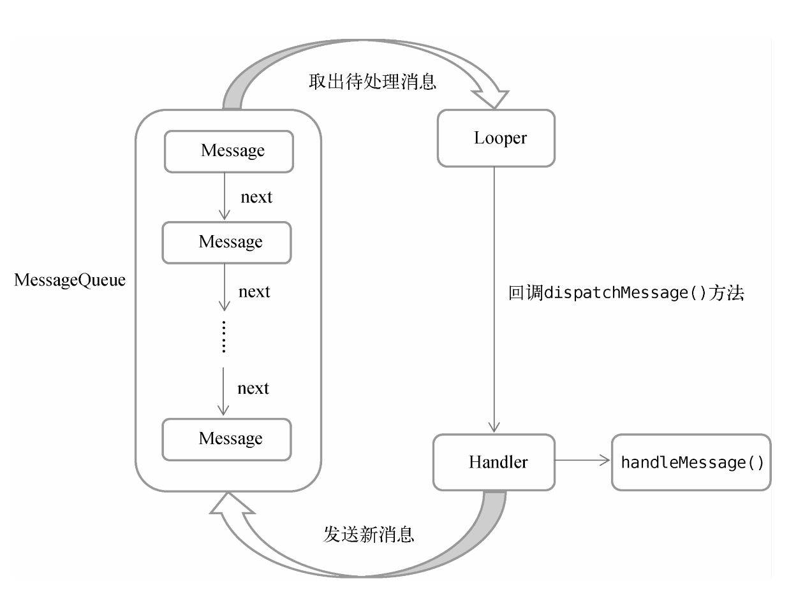

# Service

Service是Android中实现程序后台运行的解决方案，它非常适合执行那些不需要和用户交互而且还要求长期运行的任务。Service的运行不依赖于任何用户界面，即使程序被切换到后台，或者用户打开了另外一个应用程序，Service仍然能够保持正常运行。

Service并不是运行在一个独立的进程当中的，而是依赖于创建Service时所在的应用程序进程。当某个应用程序进程被杀掉时，所有依赖于该进程的Service也会停止运行。不要被Service的后台概念所迷惑，实际上Service并不会自动开启线程，所有的代码都是默认运行在主线程当中的。也就是说，我们需要在Service的内部手动创建子线程，并在这里执行具体的任务，否则就有可能出现主线程被阻塞的情况。

# Android多线程编程

当我们需要执行一些耗时操作，比如发起一条网络请求时，考虑到网速等其他原因，服务器未必能够立刻响应我们的请求，如果不将这类操作放在子线程里运行，就会导致主线程被阻塞，从而影响用户对软件的正常使用。

## 线程的基本用法

Android多线程编程其实并不比Java多线程编程特殊，基本是使用相同的语法。比如，定义一个线程只需要新建一个类继承自Thread，然后重写父类的run()方法，并在里面编写耗时逻辑即可。

使用继承的方式耦合性有点高，我们会更多地选择使用实现Runnable接口的方式来定义一个线程

```kotlin
class MyThread : Runnable {     
    override fun run() {         
        // 编写具体的逻辑    
    } 
}

// 启动线程
val myThread = MyThread() 
Thread(myThread).start()
```

Thread的构造函数接收一个Runnable参数，而我们创建的MyThread实例正是一个实现了Runnable接口的对象，所以可以直接将它传入Thread的构造函数里。接着调用Thread的start()方法，run()方法中的代码就会在子线程当中运行了

也可以使用Lambda的方式，这种写法更为常见

```kotlin
Thread {     
    // 编写具体的逻辑
}.start()
```

## 在子线程中更新UI

和许多其他的GUI库一样，Android的UI也是线程不安全的。也就是说，如果想要更新应用程序里的UI元素，必须在主线程中进行，否则就会出现异常。Android确实是不允许在子线程中进行UI操作的。但是有些时候，我们必须在子线程里执行一些耗时任务，然后根据任务的执行结果来更新相应的UI控件。

```kotlin
class MainActivity : AppComopatActivity() {
    val updateText = 1
    val handler = object : Handler(Looper.getMaininLooper()) {
        override fun handleMessage(msg: Message) {
            when (msg.what) {
                updateText -> textView.text = "nice to meet you"
            }
        }
    }
    
    override fun onCreate(savedInstanceState: Bundle?) {
        super.onCreate(savedInstanceState)         
        setContentView(R.layout.activity_main)
        changeTextBtn.setOnClickListener {
            thread{
                val msg = Message()
                msg.what = updateText
                handler.sendMessage(msg)
            }
        }
    }
}
```

定义了一个整型变量updateText，用于表示更新TextView这个动作。然后新增一个Handler对象，并重写父类的handleMessage()方法，在这里对具体的Message进行处理。如果发现Message的what字段的值等于updateText，就将TextView显示的内容改成“Nice to meet you”。下面再来看一下“Change Text”按钮的点击事件中的代码。可以看到，这次我们并没有在子线程里直接进行UI操作，而是创建了一个Message（android.os.Message）对象，并将它的what字段的值指定为updateText，然后调用Handler的sendMessage()方法将这条Message发送出去。很快，Handler就会收到这条Message，并在handleMessage()方法中对它进行处理。注意此时handleMessage()方法中的代码就是在主线程当中运行的了，所以我们可以放心地在这里进行UI操作。接下来对Message携带的what字段的值进行判断，如果等于updateText，就将TextView显示的内容改成“Nice to meet you”。

## 解析异步消息处理机制

Android中的异步消息处理主要由4个部分组成：Message、Handler、MessageQueue和Looper。

### Message

Message是在线程之间传递的消息，它可以在内部携带少量的信息，用于在不同线程之间传递数据。上一小节中我们使用到了Message的what字段，除此之外还可以使用arg1和arg2字段来携带一些整型数据，使用obj字段携带一个Object对象。

### Handler

Handler顾名思义也就是处理者的意思，它主要是用于发送和处理消息的。发送消息一般是使用Handler的sendMessage()方法、post()方法等，而发出的消息经过一系列地辗转处理后，最终会传递到Handler的handleMessage()方法中。

### MessageQueue

MessageQueue是消息队列的意思，它主要用于存放所有通过Handler发送的消息。这部分消息会一直存在于消息队列中，等待被处理。每个线程中只会有一个MessageQueue对象。

### Looper

Looper是每个线程中的MessageQueue的管家，调用Looper的loop()方法后，就会进入一个无限循环当中，然后每当发现MessageQueue中存在一条消息时，就会将它取出，并传递到Handler的handleMessage()方法中。每个线程中只会有一个Looper对象。

把异步消息处理的整个流程梳理一遍。首先需要在主线程当中创建一个Handler对象，并重写handleMessage()方法。然后当子线程中需要进行UI操作时，就创建一个Message对象，并通过Handler将这条消息发送出去。之后这条消息会被添加到MessageQueue的队列中等待被处理，而Looper则会一直尝试从MessageQueue中取出待处理消息，最后分发回Handler的handleMessage()方法中。由于Handler的构造函数中我们传入了Looper.getMainLooper()，所以此时handleMessage()方法中的代码也会在主线程中运行，于是我们在这里就可以安心地进行UI操作了。

### 异步消息处理机制流程示意图

## 

## 使用AsyncTask

不过为了更加方便我们在子线程中对UI进行操作，Android还提供了另外一些好用的工具，比如AsyncTask。借助AsyncTask，即使你对异步消息处理机制完全不了解，也可以十分简单地从子线程切换到主线程。当然，AsyncTask背后的实现原理也是基于异步消息处理机制的，只是Android帮我们做了很好的封装而已。

AsyncTask的基本用法。由于AsyncTask是一个抽象类，所以如果我们想使用它，就必须创建一个子类去继承它。在继承时我们可以为AsyncTask类指定3个泛型参数，这3个参数的用途如下。

1. Params。在执行AsyncTask时需要传入的参数，可用于在后台任务中使用。

2. Progress。在后台任务执行时，如果需要在界面上显示当前的进度，则使用这里指定的泛型作为进度单位。
3. Result。当任务执行完毕后，如果需要对结果进行返回，则使用这里指定的泛型作为返回值类型。

经常需要重写的方法有以下4个。

1. onPreExecute()这个方法会在后台任务开始执行之前调用，用于进行一些界面上的初始化操作，比如显示一个进度条对话框等。

2. doInBackground(Params...)这个方法中的所有代码都会在子线程中运行，我们应该在这里去处理所有的耗时任务。任务一旦完成，就可以通过return语句将任务的执行结果返回，如果AsyncTask的第三个泛型参数指定的是Unit，就可以不返回任务执行结果。注意，在这个方法中是不可以进行UI操作的，如果需要更新UI元素，比如说反馈当前任务的执行进度，可以调用publishProgress (Progress...)方法来完成。
3. onProgressUpdate(Progress...)当在后台任务中调用了publishProgress(Progress...)方法后，onProgressUpdate (Progress...)方法就会很快被调用，该方法中携带的参数就是在后台任务中传递过来的。在这个方法中可以对UI进行操作，利用参数中的数值就可以对界面元素进行相应的更新。
4. onPostExecute(Result)当后台任务执行完毕并通过return语句进行返回时，这个方法就很快会被调用。返回的数据会作为参数传递到此方法中，可以利用返回的数据进行一些UI操作，比如说提醒任务执行的结果，以及关闭进度条对话框等。

```kotlin
class DownloadTask : AsyncTask<Unit, Int, Boolean>() {     
    override fun onPreExecute() {         
        progressDialog.show() // 显示进度对话框    
    }     
    
    override fun doInBackground(vararg params: Unit?) = try {         
        while (true) {             
            val downloadPercent = doDownload() // 这是一个虚构的方法         
            publishProgress(downloadPercent)             
            if (downloadPercent >= 100) {                 
                break             }         
        }         
        true     
    } catch (e: Exception) {         
        false 
}     
    override fun onProgressUpdate(vararg values: Int?) {         
        // 在这里更新下载进度        
        progressDialog.setMessage("Downloaded ${values[0]}%")     
    }     
    
    override fun onPostExecute(result: Boolean) {         
        progressDialog.dismiss()// 关闭进度对话框        
        // 在这里提示下载结果        
        if (result) {             
            Toast.makeText(context, "Download succeeded", Toast.LENGTH_SHORT).show()        
        } else {             
            Toast.makeText(context, " Download failed", Toast.LENGTH_SHORT).show()        
        }     
    } 
}

// 启动任务
DownloadTask().execute()
```

在这个DownloadTask中，我们在doInBackground()方法里执行具体的下载任务。这个方法里的代码都是在子线程中运行的，因而不会影响主线程的运行。注意，这里虚构了一个doDownload()方法，用于计算当前的下载进度并返回，我们假设这个方法已经存在了。在得到了当前的下载进度后，下面就该考虑如何把它显示到界面上了，由于doInBackground()方法是在子线程中运行的，在这里肯定不能进行UI操作，所以我们可以调用publishProgress()方法并传入当前的下载进度，这样onProgressUpdate()方法就会很快被调用，在这里就可以进行UI操作了。

当下载完成后，doInBackground()方法会返回一个布尔型变量，这样onPostExecute()方法就会很快被调用，这个方法也是在主线程中运行的。然后，在这里我们会根据下载的结果弹出相应的Toast提示，从而完成整个DownloadTask任务。

使用AsyncTask的诀窍就是，在doInBackground()方法中执行具体的耗时任务，在onProgressUpdate()方法中进行UI操作，在onPostExecute()方法中执行一些任务的收尾工作。

# Service的基本用法

将类名定义成MyService，Exported属性表示是否将这个Service暴露给外部其他程序访问，Enabled属性表示是否启用这个Service。

```kotlin
// 1.定义一个Service
class MyService : Service() {
    // onBind()方法特别醒目。这个方法是Service中唯一的抽象方法，所以必须在子类里实现
    override fun onBind(intent: Intent): IBinder {
        TODO("Return the communication channel to the service.")
    }
    
    // onCreate()方法会在Service创建的时候调用，onStartCommand()方法会在每次Service启动的时候调用，onDestroy()方法会在Service销毁的时候调用
    override fun onCreate() {
        super.onCreate()
    }
    
    override fun onStartCommand(intent: Intent, flags: Int, startId: Int): Int {
     	return super.onStartCommand(intent, flags, startId)   
    }
    
    override fun onDestroy() {
        super.onDestroy()
    }
}

// 2.启动和停止Service
class MainActivity : AppCompatActivity() {     
    override fun onCreate(savedInstanceState: Bundle?) {         
        super.onCreate(savedInstanceState)         
        setContentView(R.layout.activity_main)         
        startServiceBtn.setOnClickListener {             
            val intent = Intent(this, MyService::class.java)             
            startService(intent) // 启动Service         
        }         
        stopServiceBtn.setOnClickListener {             
            val intent = Intent(this, MyService::class.java)             
            stopService(intent) // 停止Service         
        }     
    } 
}
```

onCreate()方法是在Service第一次创建的时候调用的，而onStartCommand()方法则在每次启动Service的时候都会调用。从Android 8.0系统开始，应用的后台功能被大幅削减。现在只有当应用保持在前台可见状态的情况下，Service才能保证稳定运行，一旦应用进入后台之后，Service随时都有可能被系统回收。如果你真的非常需要长期在后台执行一些任务，可以使用前台Service或者WorkManager。

在MyService里提供一个下载功能，然后在Activity中可以决定何时开始下载，以及随时查看下载进度。实现这个功能的思路是创建一个专门的Binder对象来对下载功能进行管理。

```kotlin
class MyService : Service() {     
    private val mBinder = DownloadBinder()     
    class DownloadBinder : Binder() {         
        fun startDownload() {             
            Log.d("MyService", "startDownload executed")         
        }         
        fun getProgress(): Int {             
            Log.d("MyService", "getProgress executed")             
            return 0         
        }     
    }     
    
    override fun onBind(intent: Intent): IBinder {         
        return mBinder     
    }     ... 
} 

```

新建了一个DownloadBinder类，并让它继承自Binder，然后在它的内部提供了开始下载以及查看下载进度的方法。接着，在MyService中创建了DownloadBinder的实例，然后在onBind()方法里返回了这个实例，这样MyService中的工作就全部完成了。

```kotlin
class MainActivity : AppCompatActivity() {     
    lateinit var downloadBinder: MyService.DownloadBinder     
    private val connection = object : ServiceConnection {         
        override fun onServiceConnected(name: ComponentName, service: IBinder) {            
            downloadBinder = service as MyService.DownloadBinder            
            downloadBinder.startDownload()             
            downloadBinder.getProgress()         
        }
        
        override fun onServiceDisconnected(name: ComponentName) {        
        }     
    }     
    override fun onCreate(savedInstanceState: Bundle?) {         
        ...         
        bindServiceBtn.setOnClickListener {             
            val intent = Intent(this, MyService::class.java)             
            bindService(intent, connection, Context.BIND_AUTO_CREATE) // 绑定Service         
        }
        unbindServiceBtn.setOnClickListener {             
            unbindService(connection) // 解绑Service         
        }     
    } 
}
```

首先创建了一个ServiceConnection的匿名类实现，并在里面重写了onServiceConnected()方法和onServiceDisconnected()方法。onServiceConnected()方法方法会在Activity与Service成功绑定的时候调用，而onServiceDisconnected()方法只有在Service的创建进程崩溃或者被杀掉的时候才会调用，这个方法不太常用。那么在onServiceConnected()方法中，我们又通过向下转型得到了DownloadBinder的实例，有了这个实例，Activity和Service之间的关系就变得非常紧密了。现在我们可以在Activity中根据具体的场景来调用DownloadBinder中的任何public方法，即实现了指挥Service干什么Service就去干什么的功能。

构建了一个Intent对象，然后调用bindService()方法将MainActivity和MyService进行绑定。bindService()方法接收3个参数，第一个参数就是刚刚构建出的Intent对象，第二个参数是前面创建出的ServiceConnection的实例，第三个参数则是一个标志位，这里传入BIND_AUTO_CREATE表示在Activity和Service进行绑定后自动创建Service。这会使得MyService中的onCreate()方法得到执行，但onStartCommand()方法不会执行。

任何一个Service在整个应用程序范围内都是通用的，即MyService不仅可以和MainActivity绑定，还可以和任何一个其他的Activity进行绑定，而且在绑定完成后，它们都可以获取相同的DownloadBinder实例。

# Service的生命周期

Service也有自己的生命周期，前面我们使用到的onCreate()、onStartCommand()、onBind()和onDestroy()等方法都是在Service的生命周期内可能回调的方法。

一旦在项目的任何位置调用了Context的startService()方法，相应的Service就会启动，并回调onStartCommand()方法。如果这个Service之前还没有创建过，onCreate()方法会先于onStartCommand()方法执行。Service启动了之后会一直保持运行状态，直到stopService()或stopSelf()方法被调用，或者被系统回收。注意，虽然每调用一次startService()方法，onStartCommand()就会执行一次，但实际上每个Service只会存在一个实例。所以不管你调用了多少次startService()方法，只需调用一次stopService()或stopSelf()方法，Service就会停止。

还可以调用Context的bindService()来获取一个Service的持久连接，这时就会回调Service中的onBind()方法。类似地，如果这个Service之前还没有创建过，onCreate()方法会先于onBind()方法执行。之后，调用方可以获取到onBind()方法里返回的IBinder对象的实例，这样就能自由地和Service进行通信了。只要调用方和Service之间的连接没有断开，Service就会一直保持运行状态，直到被系统回收。

当调用了startService()方法后，再去调用stopService()方法。这时Service中的onDestroy()方法就会执行，表示Service已经销毁了。类似地，当调用了bindService()方法后，再去调用unbindService()方法，onDestroy()方法也会执行，这两种情况都很好理解。但是需要注意，我们是完全有可能对一个Service既调用了startService()方法，又调用了bindService()方法的，在这种情况下该如何让Service销毁呢？根据Android系统的机制，一个Service只要被启动或者被绑定了之后，就会处于运行状态，必须要让以上两种条件同时不满足，Service才能被销毁。所以，这种情况下要同时调用stopService()和unbindService()方法，onDestroy()方法才会执行。

# Service的更多技巧

## 使用前台Service

从Android 8.0系统开始，只有当应用保持在前台可见状态的情况下，Service才能保证稳定运行，一旦应用进入后台之后，Service随时都有可能被系统回收。而如果你希望Service能够一直保持运行状态，就可以考虑使用前台Service。前台Service和普通Service最大的区别就在于，它一直会有一个正在运行的图标在系统的状态栏显示，下拉状态栏后可以看到更加详细的信息，非常类似于通知的效果。

# Kotlin

## 对泛型进行实化

在JDK 1.5之前，Java是没有泛型功能的，那个时候诸如List之类的数据结构可以存储任意类型的数据，取出数据的时候也需要手动向下转型才行，这不仅麻烦，而且很危险。比如说我们在同一个List中存储了字符串和整型这两种数据，但是在取出数据的时候却无法区分具体的数据类型，如果手动将它们强制转成同一种类型，那么就会抛出类型转换异常。

实际上，Java的泛型功能是通过类型擦除机制来实现的。什么意思呢？就是说泛型对于类型的约束只在编译时期存在，运行的时候仍然会按照JDK 1.5之前的机制来运行，JVM是识别不出来我们在代码中指定的泛型类型的。例如，假设我们创建了一个List<String>集合，虽然在编译时期只能向集合中添加字符串类型的元素，但是在运行时期JVM并不能知道它本来只打算包含哪种类型的元素，只能识别出来它是个List。

所有基于JVM的语言，它们的泛型功能都是通过类型擦除机制来实现的，其中当然也包括了Kotlin。这种机制使得我们不可能使用a is T或者T::class.java这样的语法，因为T的实际类型在运行的时候已经被擦除了。

Kotlin提供了一个内联函数的概念，内联函数中的代码会在编译的时候自动被替换到调用它的地方，这样的话也就不存在什么泛型擦除的问题了，因为代码在编译之后会直接使用实际的类型来替代内联函数中的泛型声明。
