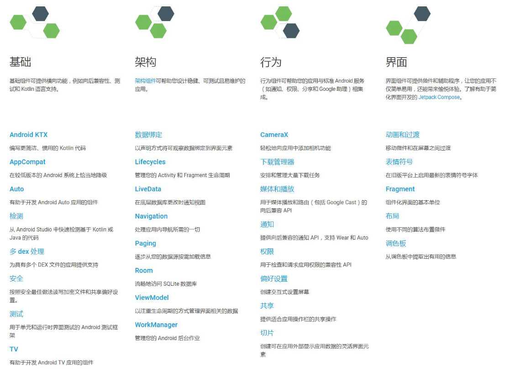

# Jetpack 简介

长久以来，Android官方并没有制定一个项目架构的规范，只要能够实现功能，代码怎么编写都是你的自由。但是不同的人技术水平不同，最终编写出来的代码质量是千差万别的。由于Android官方没有制定规范，为了追求更高的代码质量，慢慢就有第三方的社区和开发者将一些更加高级的项目架构引入到了Android平台上，如MVP、MVVM等。使用这些架构开发出来的应用程序，在代码质量、可读性、易维护性等方面都有着更加出色的表现，于是这些架构渐渐成为了主流。后来Google或许意识到了这个情况，终于在2017年，推出了一个官方的架构组件库——Architecture Components，旨在帮助开发者编写出更加符合高质量代码规范、更具有架构设计的应用程序。2018年，Google又推出了一个全新的开发组件工具集Jetpack，并将Architecture Components作为Jetpack的一部分纳入其中。当然，Jetpack并没有就此定版，2019年又有许多新的组件被加入Jetpack当中，未来的Jetpack还会不断地继续扩充。

Jetpack是一个开发组件工具集，它的主要目的是帮助我们编写出更加简洁的代码，并简化我们的开发过程。Jetpack中的组件有一个特点，它们大部分不依赖于任何Android系统版本，这意味着这些组件通常是定义在AndroidX库当中的，并且拥有非常好的向下兼容性。

Jetpack主要由基础、架构、行为、界面这4个部分组成。事实上，在这么多的组件当中，最需要我们关注的其实还是架构组件。目前Android官方最为推荐的项目架构就是MVVM，因而Jetpack中的许多架构组件是专门为MVVM架构量身打造的。