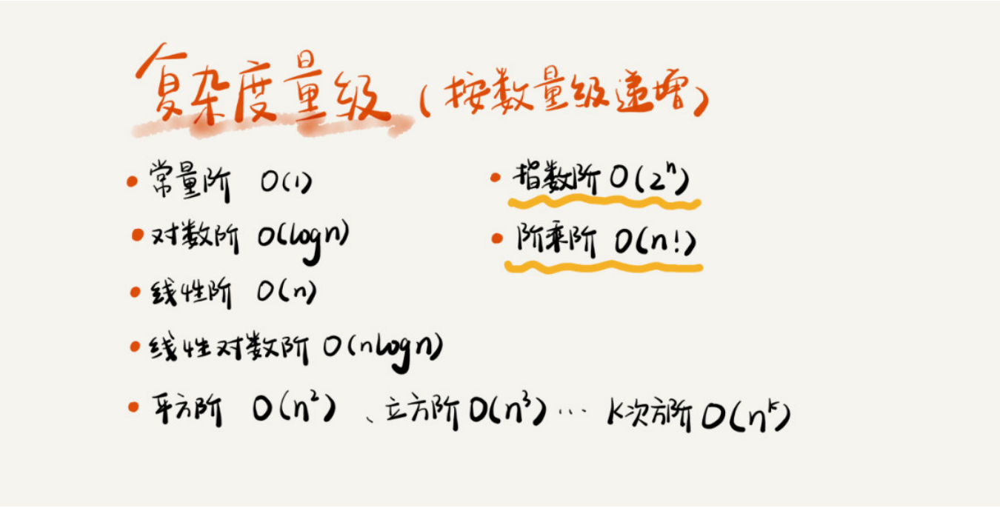
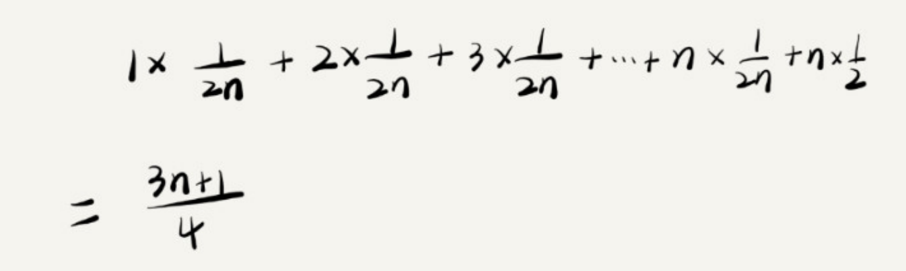

# 一、抓住重点

从广义上讲，数据结构就是指一组数据的存储结构。算法就是操作数据的一组方法。

数据结构是为算法服务的，算法要作用在特定的 数据结构之上。 

比如，因为数组具有随机访问的特点，常用的二分查找算法需要用数组来存储数据。但如果 我们选择链表这种数据结构，二分查找算法就无法工作了，因为链表并不支持随机访问。

**20 个最常用的、最基础数据结构与算法**

10 个数据结构：数组、链表、栈、队列、散列表、二叉树、堆、跳表、图、Trie 树；10 个算法：递归、排序、二分查找、搜索、哈希算法、贪心算法、分治算法、回溯算法、动态规划、字符串匹配算法。

在学习数据结构和算法的过程中，不要只是死记硬背，不要为了学习而学习，而是**要学习它的“来历”“自身的特点”“适合解决的问题”以及“实际的应用场景”**。

# 二、复杂度分析

我们需要一个不用具体的测试数据来测试，就可以粗略地估计算法的执行效率的方法。这就是今天要讲的时间、空间复杂度分析方法。

## 1、大 O 复杂度表示法

T(n) 我们已经讲过了，它表示代码执行的时间；n 表 示数据规模的大小；f(n) 表示每行代码执行的次数总和。因为这是一个公式，所以用 f(n) 来表示。公式中的 O，表示代码的执行时间 T(n) 与 f(n) 表达式成正比。大 O 时间复杂度实际上并不具体表示代码真正的执行时间，而是 表示代码执行时间随数据规模增长的变化趋势，所以，也叫作渐进时间复杂度 （asymptotic time complexity），简称时间复杂度。 当 n 很大时，你可以把它想象成 10000、100000。而公式中的低阶、常量、系数三部分并 不左右增长趋势，所以都可以忽略。我们只需要记录一个最大量级就可以了，如果用大 O 表示法表示刚讲的那两段代码的时间复杂度，就可以记为：T(n) = O(n)； T(n) = O(n )。

## 2、时间复杂度分析

1. 只关注循环执行次数最多的一段代码
2. 加法法则：总复杂度等于量级最大的那段代码的复杂度
3. 乘法法则：嵌套代码的复杂度等于嵌套内外代码复杂度的乘积

## 3、常见时间复杂度实例分析

1. O(1)

2. O(logn)、O(nlogn)

   对数之间是可以互相转换的，log n 就等于 log 2 * log n，所以 O(log n) = O(C * log n)，其中 C=log 2 是一个常量。基于我们前面的一个理论：在采用大 O 标记复 杂度的时候，可以忽略系数，即 O(Cf(n)) = O(f(n))。所以，O(log n) 就等于 O(log n)。 因此，在对数阶时间复杂度的表示方法里，我们忽略对数的“底”，统一表示为 O(logn)。 如果你理解了我前面讲的 O(logn)，那 O(nlogn) 就很容易理解了。还记得我们刚讲的乘法 法则吗？如果一段代码的时间复杂度是 O(logn)，我们循环执行 n 遍，时间复杂度就是 O(nlogn) 了。而且，O(nlogn) 也是一种非常常见的算法时间复杂度。比如，归并排序、 快速排序的时间复杂度都是 O(nlogn)。

3. O(m+n)、O(m*n)

   代码的复杂度由两个数据的规模来决定。for (; i < m; ++i) 、for (; j < n; ++j) 

## 4、空间复杂度分析

时间复杂度的全称是渐进时间复杂度，表示算法的执行时间与数据规模之间的 增长关系。类比一下，空间复杂度全称就是渐进空间复杂度（asymptotic space complexity），表示算法的存储空间与数据规模之间的增长关系。

常见的空间复杂度就是 O(1)、O(n)、O(n )，像 O(logn)、O(nlogn) 这样的对数阶复 杂度平时都用不到。

# 三、最好、最坏、平均、均摊时间复杂度

## 1、最好、最坏情况时间复杂度

## 2、平均情况时间复杂度

要查找的变量 x 在数组中的位置，有 n+1 种情况：在数组的 0～n-1 位置中和不在数组 中。我们把每种情况下，查找需要遍历的元素个数累加起来，然后再除以 n+1，就可以得 到需要遍历的元素个数的平均值。时间复杂度的大 O 标记法中，可以省略掉系数、低阶、常量，所以，咱们把刚 刚这个公式简化之后，得到的平均时间复杂度就是 O(n)

要查找的变量 x，要么在数组里，要么就不在数组里。这两种情况对应的概率统 计起来很麻烦，为了方便你理解，我们假设在数组中与不在数组中的概率都为 1/2。另外， 要查找的数据出现在 0～n-1 这 n 个位置的概率也是一样的，为 1/n。所以，根据概率乘法 法则，要查找的数据出现在 0～n-1 中任意位置的概率就是 1/(2n)。

这个值就是概率论中的加权平均值，也叫作期望值，所以平均时间复杂度的全称应该叫加权 平均时间复杂度或者期望时间复杂度。

## 3、均摊时间复杂度