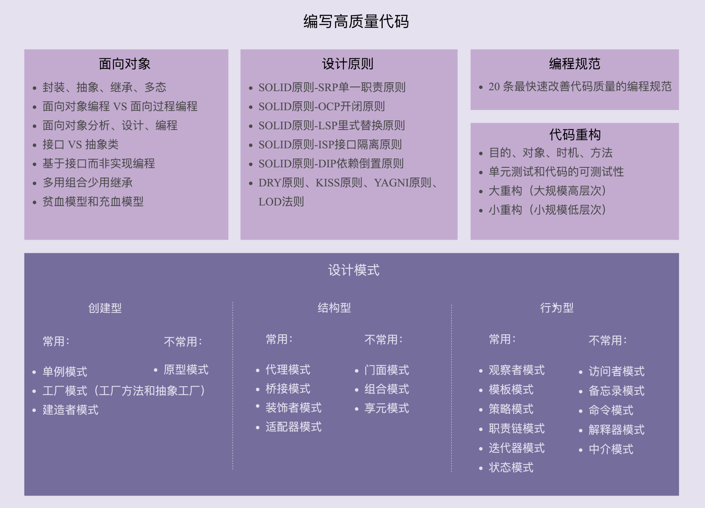

**《设计模式之美》**

# 设计模式学习导读

设计模式讲的是如何写出可扩展、可读、可维护的高质量代码

如何分层、分模块？应该怎么划分类？每个类应该具有哪些属性、方法？怎么设计类之间的 交互？该用继承还是组合？该使用接口还是抽象类？怎样做到解耦、高内聚低耦合？该用单 例模式还是静态方法？用工厂模式创建对象还是直接 new 出来？如何避免引入设计模式提 高扩展性的同时带来的降低可读性问题？

优秀的开源项目、框架、中间件，代码量、类的个数都会比较多，类结构、类之间的关系极 其复杂，常常调用来调用去。所以，为了保证代码的扩展性、灵活性、可维护性等，代码中 会使用到很多设计模式、设计原则或者设计思想。如果你不懂这些设计模式、原则、思想， 在看代码的时候，你可能就会琢磨不透作者的设计思路，对于一些很明显的设计思路，你可 能要花费很多时间才能参悟。

## 从哪些维度评判代码质量的好坏？如何具备写出高质量代码的能 力？

如何评价代码质量的高低？

描述代码质量的所有常用词汇，你可以看一看。 灵活性（flexibility）、可扩展性（extensibility）、可维护性（maintainability）、可 读性（readability）、可理解性（understandability）、易修改性（changeability）、 可复用（reusability）、可测试性（testability）、模块化（modularity）、高内聚低耦 合（high cohesion loose coupling）、高效（high effciency）、高性能（high performance）、安全性（security）、兼容性（compatibility）、易用性 （usability）、整洁（clean）、清晰（clarity）、简单（simple）、直接 （straightforward）、少即是多（less code is more）、文档详尽（welldocumented）、分层清晰（well-layered）、正确性（correctness、bug free）、健 壮性（robustness）、鲁棒性（robustness）、可用性（reliability）、可伸缩性 （scalability）、稳定性（stability）、优雅（elegant）、好（good）、坏（bad）

最常用的、最重要的评价标准，来详 细讲解，其中就包括：可维护性、可读性、可扩展性、灵活性、简洁性（简单、复杂）、可 复用性、可测试性。

有一条非常著名的设计原则，你一定听过，那就是 KISS 原则：“Keep It Simple， Stupid”。这个原则说的意思就是，尽量保持代码简单。代码简单、逻辑清晰，也就意味 着易读、易维护。我们在编写代码的时候，往往也会把简单、清晰放到首位。 不过，很多编程经验不足的程序员会觉得，简单的代码没有技术含量，喜欢在项目中引入一 些复杂的设计模式，觉得这样才能体现自己的技术水平。实际上，思从深而行从简，真正的 高手能云淡风轻地用最简单的方法解决最复杂的问题。这也是一个编程老手跟编程新手的本 质区别之一。

要写出高质量代码，我们就需要掌握一些更加细化、更加能落地的编程方法论，这就包含面 向对象设计思想、设计原则、设计模式、编码规范、重构技巧等等

##  面向对象、设计原则、设计模式、编程规范、重构，这五者有何 关系？

现在，主流的编程范式或者是编程风格有三种，它们分别是面向过程、面向对象和函数式编 程。面向对象这种编程风格又是这其中最主流的。现在比较流行的编程语言大部分都是面向 对象编程语言。大部分项目也都是基于面向对象编程风格开发的。面向对象编程因为其具有 丰富的特性（封装、抽象、继承、多态），可以实现很多复杂的设计思路，是很多设计原 则、设计模式编码实现的基础。

在专栏的最开始，我们会详细地讲解面向对象编程的相关的知识，为学习后面的内容 做铺垫。对于这部分内容，你需要掌握下面这 7 个大的知识点。

面向对象的四大特性：封装、抽象、继承、多态 

面向对象编程与面向过程编程的区别和联系 

面向对象分析、面向对象设计、面向对象编程 

接口和抽象类的区别以及各自的应用场景 

基于接口而非实现编程的设计思想 

多用组合少用继承的设计思想 

面向过程的贫血模型和面向对象的充血模型

### 设计原则

对于每一种设计原则，我们需要掌握它的设计初衷，能解决哪些编程问题，有哪些应用场景。

对于这一部分内容，你需要透彻理解并且掌握，如何应用下面这样几个常用的设计原则。

SOLID 原则 -SRP 单一职责原则 

SOLID 原则 -OCP 开闭原则 

SOLID 原则 -LSP 里式替换原则 

SOLID 原则 -ISP 接口隔离原则

SOLID 原则 -DIP 依赖倒置原则 DRY 原则、KISS 原则、YAGNI 原则、LOD 法则

### 设计模式

设计模式是针对软件开发中经常遇到的一些设计问题，总结出来的一套解决方案或者设计思 路。大部分设计模式要解决的都是代码的可扩展性问题。这一块的学习难点是了解它们 都能解决哪些问题，掌握典型的应用场景，并且懂得不过度应用。

1. 创建型 

   常用的有：单例模式、工厂模式（工厂方法和抽象工厂）、建造者模式。 

   不常用的有：原型模式。 

2. 结构型 

   常用的有：代理模式、桥接模式、装饰者模式、适配器模式。 

   不常用的有：门面模式、组合模式、享元模式。 

3. 行为型 

   常用的有：观察者模式、模板模式、策略模式、职责链模式、迭代器模式、状态模式。 

   不常用的有：访问者模式、备忘录模式、命令模式、解释器模式、中介模式。

### 编程规范

编程规范主要解决的是代码的可读性问题。编码规范相对于设计原则、设计模式，更加具体、更加偏重代码细节。

### 代码重构

在软件开发中，只要软件在不停地迭代，就没有一劳永逸的设计。随着需求的变化，代码的不停堆砌，原有的设计必定会存在这样那样的问题。针对这些问题，我们就需要进行代码重构。重构是软件开发中非常重要的一个环节。持续重构是保持代码质量不下降的有效手段， 能有效避免代码腐化到无可救药的地步。

虽然使用设计模式可以提高代码的可扩展性，但过度不恰当地使用，也会增加代码的复杂度，影响代码的可读性。在开发初期，除非特别必须，我们一定不要过度设计，应用复杂的设计模式。而是当代码出现问题的时候，我们再针对问题，应用原则和模式进行 重构。这样就能有效避免前期的过度设计。

对于重构这部分内容，你需要掌握以下几个知识点：

​	重构的目的（why）、对象（what）、时机（when）、方法（how）；

​	保证重构不出错的技术手段：单元测试和代码的可测试性；

​	两种不同规模的重构：大重构（大规模高层次）和小重构（小规模低层次）。

不仅仅是掌握一些重构技巧、套路，更重要的是建立持续重构 意识，把重构当作开发的一部分，融入到日常的开发中。

### 五者之间的联系

面向对象编程因为其具有丰富的特性（封装、抽象、继承、多态），可以实现很多复杂的设计思路，是很多设计原则、设计模式等编码实现的基础。 

设计原则是指导我们代码设计的一些经验总结，对于某些场景下，是否应该应用某种设计模式，具有指导意义。比如，“开闭原则”是很多设计模式（策略、模板等）的指导 原则。 

设计模式是针对软件开发中经常遇到的一些设计问题，总结出来的一套解决方案或者设 计思路。应用设计模式的主要目的是提高代码的可扩展性。从抽象程度上来讲，设计原 则比设计模式更抽象。设计模式更加具体、更加可执行。 

编程规范主要解决的是代码的可读性问题。编码规范相对于设计原则、设计模式，更加 具体、更加偏重代码细节、更加能落地。持续的小重构依赖的理论基础主要就是编程规 范。 

重构作为保持代码质量不下降的有效手段，利用的就是面向对象、设计原则、设计模 式、编码规范这些理论。

实际上，面向对象、设计原则、设计模式、编程规范、代码重构，这五者都是保持或者提高代码质量的方法论，本质上都是服务于编写高质量代码这一件事的。当我们追本逐源，看清 这个本质之后，很多事情怎么做就清楚了，很多选择怎么选也清楚了。比如，在某个场景 下，该不该用这个设计模式，那就看能不能提高代码的可扩展性；要不要重构，那就看重代 码是否存在可读、可维护问题等。

