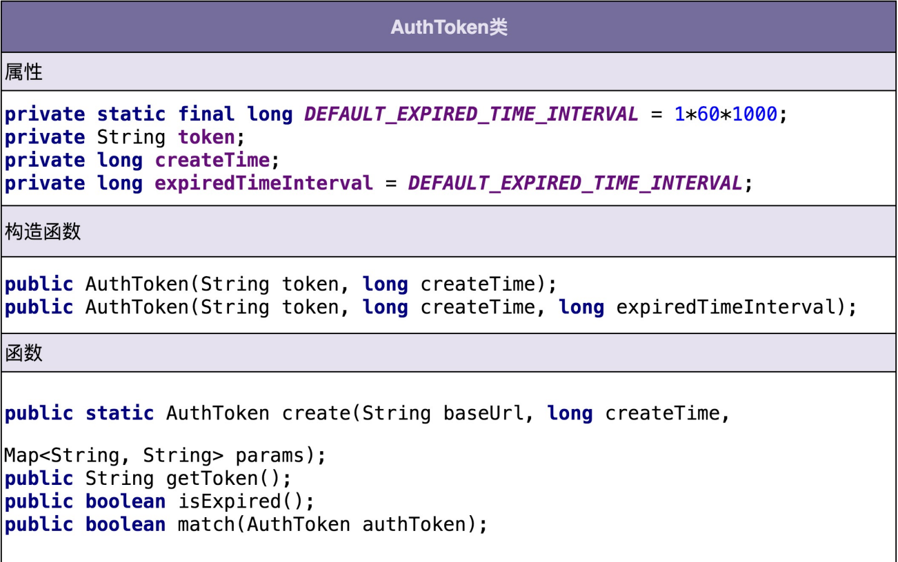
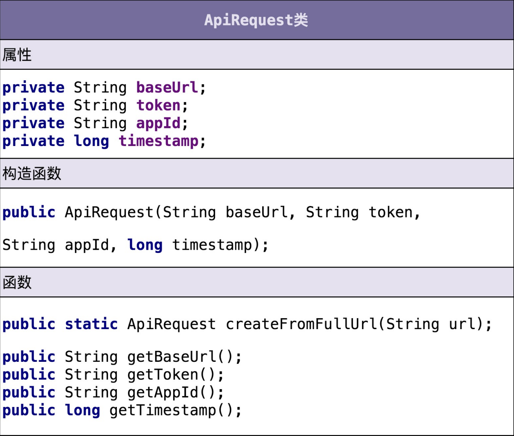
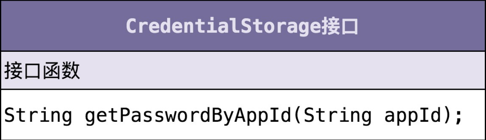
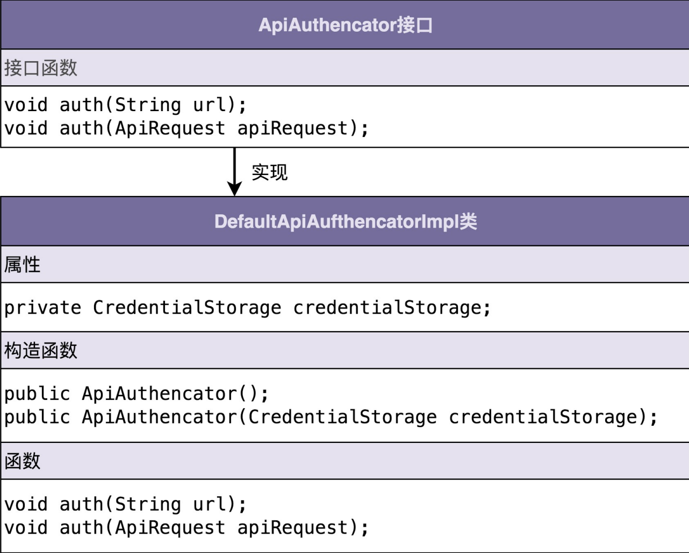

# 实战二（上）：如何对接口鉴权这样一个功能开发做面向对象分析？

## 案例介绍和难点剖析

参与开发一个微服务。微服务通过 HTTP 协议暴露接口给其他系统调用，说 直白点就是，其他系统通过 URL 来调用微服务的接口。有一天，你的 leader 找到你 说，“为了保证接口调用的安全性，我们希望设计实现一个接口调用鉴权功能，只有经过认 证之后的系统才能调用我们的接口，没有认证过的系统调用我们的接口会被拒绝。我希望由 你来负责这个任务的开发，争取尽快上线。”

相比单纯的业务 CRUD 开发，鉴权这个开发任务，要更有难度。鉴权作为一个跟具体业务 无关的功能，我们完全可以把它开发成一个独立的框架，集成到很多业务系统中。而作为被 很多系统复用的通用框架，比起普通的业务代码，我们对框架的代码质量要求要更高。

尽管针对框架、组件、类库等非业务系统的开发，我们一定要有组件化意识、框架意识、抽 象意识，开发出来的东西要足够通用，不能局限于单一的某个业务需求，但这并不代表我们 就可以脱离具体的应用场景，闷头拍脑袋做需求分析

1. 第一轮基础分析 对于如何做鉴权这样一个问题，最简单的解决方案就是，通过用户名加密码来做认证。我们 给每个允许访问我们服务的调用方，派发一个应用名（或者叫应用 ID、AppID）和一个对 应的密码（或者叫秘钥）。调用方每次进行接口请求的时候，都携带自己的 AppID 和密 码。微服务在接收到接口调用请求之后，会解析出 AppID 和密码，跟存储在微服务端的
2. 第二轮分析优化 不过，这样的验证方式，每次都要明文传输密码。密码很容易被截获，是不安全的。那如果 我们借助加密算法（比如 SHA），对密码进行加密之后，再传递到微服务端验证，是不是 就可以了呢？实际上，这样也是不安全的，因为加密之后的密码及 AppID，照样可以被未 认证系统（或者说黑客）截获，未认证系统可以携带这个加密之后的密码以及对应的 AppID，伪装成已认证系统来访问我们的接口。这就是典型的“重放攻击”。对于刚刚这个问题，我们可以 借助 OAuth 的验证思路来解决。调用方将请求接口的 URL 跟 AppID、密码拼接在一起， 然后进行加密，生成一个 token。调用方在进行接口请求的的时候，将这个 token 及 AppID，随 URL 一块传递给微服务端。微服务端接收到这些数据之后，根据 AppID 从数 据库中取出对应的密码，并通过同样的 token 生成算法，生成另外一个 token。用这个新 生成的 token 跟调用方传递过来的 token 对比。如果一致，则允许接口调用请求；否则， 就拒绝接口调用请求。
3. 第三轮分析优化 不过，这样的设计仍然存在重放攻击的风险，还是不够安全。每个 URL 拼接上 AppID、密 码生成的 token 都是固定的。未认证系统截获 URL、token 和 AppID 之后，还是可以通 过重放攻击的方式，伪装成认证系统，调用这个 URL 对应的接口。 为了解决这个问题，我们可以进一步优化 token 生成算法，引入一个随机变量，让每次接 口请求生成的 token 都不一样。我们可以选择时间戳作为随机变量。原来的 token 是对 URL、AppID、密码三者进行加密生成的，现在我们将 URL、AppID、密码、时间戳四者 进行加密来生成 token。调用方在进行接口请求的时候，将 token、AppID、时间戳，随 URL 一并传递给微服务端。 微服务端在收到这些数据之后，会验证当前时间戳跟传递过来的时间戳，是否在一定的时间 窗口内（比如一分钟）。如果超过一分钟，则判定 token 过期，拒绝接口请求。如果没有 超过一分钟，则说明 token 没有过期，就再通过同样的 token 生成算法，在服务端生成新第三轮分析优化 不过，这样的设计仍然存在重放攻击的风险，还是不够安全。每个 URL 拼接上 AppID、密 码生成的 token 都是固定的。未认证系统截获 URL、token 和 AppID 之后，还是可以通 过重放攻击的方式，伪装成认证系统，调用这个 URL 对应的接口。 为了解决这个问题，我们可以进一步优化 token 生成算法，引入一个随机变量，让每次接 口请求生成的 token 都不一样。我们可以选择时间戳作为随机变量。原来的 token 是对 URL、AppID、密码三者进行加密生成的，现在我们将 URL、AppID、密码、时间戳四者 进行加密来生成 token。调用方在进行接口请求的时候，将 token、AppID、时间戳，随 URL 一并传递给微服务端。 微服务端在收到这些数据之后，会验证当前时间戳跟传递过来的时间戳，是否在一定的时间 窗口内（比如一分钟）。如果超过一分钟，则判定 token 过期，拒绝接口请求。如果没有 超过一分钟，则说明 token 没有过期，就再通过同样的 token 生成算法，在服务端生成新的 token，与调用方传递过来的 token 比对，看是否一致。如果一致，则允许接口调用请求；否则，就拒绝接口调用请求。
4. 第四轮分析优化 不过，你可能会说，这样还是不够安全啊。未认证系统还是可以在这一分钟的 token 失效 窗口内，通过截获请求、重放请求，来调用我们的接口啊！ 你说得没错。不过，攻与防之间，本来就没有绝对的安全。我们能做的就是，尽量提高攻击 的成本。这个方案虽然还有漏洞，但是实现起来足够简单，而且不会过度影响接口本身的性 能（比如响应时间）。所以，权衡安全性、开发成本、对系统性能的影响，这个方案算是比 较折中、比较合理的了。实际上，还有一个细节我们没有考虑到，那就是，如何在微服务端存储每个授权调用方的 AppID 和密码。当然，这个问题并不难。最容易想到的方案就是存储到数据库里，比如 MySQL。不过，开发像鉴权这样的非业务功能，最好不要与具体的第三方系统有过度的耦 合。针对 AppID 和密码的存储，我们最好能灵活地支持各种不同的存储方式，比如 ZooKeeper、本地配置文件、自研配置中心、MySQL、Redis 等。我们不一定针对每种存 储方式都去做代码实现，但起码要留有扩展点，保证系统有足够的灵活性和扩展性，能够在 我们切换存储方式的时候，尽可能地减少代码的改动。
5. 最终确定需求  调用方进行接口请求的时候，将 URL、AppID、密码、时间戳拼接在一起，通过加密算 法生成 token，并且将 token、AppID、时间戳拼接在 URL 中，一并发送到微服务端。 微服务端在接收到调用方的接口请求之后，从请求中拆解出 token、AppID、时间戳。 微服务端首先检查传递过来的时间戳跟当前时间，是否在 token 失效时间窗口内。如果 已经超过失效时间，那就算接口调用鉴权失败，拒绝接口调用请求。 如果 token 验证没有过期失效，微服务端再从自己的存储中，取出 AppID 对应的密 码，通过同样的 token 生成算法，生成另外一个 token，与调用方传递过来的 token 进 行匹配；如果一致，则鉴权成功，允许接口调用，否则就拒绝接口调用。

# 实战二（下）：如何利用面向对象设计和编程开发接口鉴权功 能？

## 如何进行面向对象设计？

### 1. 划分职责进而识别出有哪些类

类是现实世界中事物的一个建模。但是，并不是每个需求 都能映射到现实世界，也并不是每个类都与现实世界中的事物一一对应。对于一些抽象的概 念，我们是无法通过映射现实世界中的事物的方式来定义类的。 

另外一种识别类的方法，那就是把需求描述中 的名词罗列出来，作为可能的候选类，然后再进行筛选。对于没有经验的初学者来说，这个 方法比较简单、明确，可以直接照着做。

个人更喜欢另外一种方法，那就是根据需求描述，把其中涉及的功能点，一个一个 罗列出来，然后再去看哪些功能点职责相近，操作同样的属性，可否应该归为同一个类。我 们来看一下，针对鉴权这个例子，具体该如何来做。

调用方进行接口请求的时候，将 URL、AppID、密码、时间戳拼接在一起，通过加密算 法生成 token，并且将 token、AppID、时间戳拼接在 URL 中，一并发送到微服务端。 微服务端在接收到调用方的接口请求之后，从请求中拆解出 token、AppID、时间戳。 微服务端首先检查传递过来的时间戳跟当前时间，是否在 token 失效时间窗口内。如果 已经超过失效时间，那就算接口调用鉴权失败，拒绝接口调用请求。 如果 token 验证没有过期失效，微服务端再从自己的存储中，取出 AppID 对应的密 码，通过同样的 token 生成算法，生成另外一个 token，与调用方传递过来的 token 进 行匹配。如果一致，则鉴权成功，允许接口调用；否则就拒绝接口调用。

首先，我们要做的是逐句阅读上面的需求描述，拆解成小的功能点，一条一条罗列下来。注 意，拆解出来的每个功能点要尽可能的小。每个功能点只负责做一件很小的事情（专业叫法 是“单一职责”）。下面是我逐句拆解上述需求描述之后，得到的 功能点列表：

1. 把 URL、AppID、密码、时间戳拼接为一个字符串； 
2. 对字符串通过加密算法加密生成 token； 
3. 将 token、AppID、时间戳拼接到 URL 中，形成新的 URL； 
4. 解析 URL，得到 token、AppID、时间戳等信息； 
5.  从存储中取出 AppID 和对应的密码； 
6. 根据时间戳判断 token 是否过期失效； 
7. 验证两个 token 是否匹配

1、2、6、7 都是跟 token 有关，负责 token 的生成、 验证；3、4 都是在处理 URL，负责 URL 的拼接、解析；5 是操作 AppID 和密码，负责从 存储中读取 AppID 和密码。所以，我们可以粗略地得到三个核心的类：AuthToken、 Url、CredentialStorage。AuthToken 负责实现 1、2、6、7 这四个操作；Url 负责 3、4 两个操作；CredentialStorage 负责 5 这个操作。 当然，这是一个初步的类的划分，其他一些不重要的、边边角角的类，我们可能暂时没法一 下子想全，但这也没关系，面向对象分析、设计、编程本来就是一个循环迭代、不断优化的 过程。根据需求，我们先给出一个粗糙版本的设计方案，然后基于这样一个基础，再去迭代 优化，会更加容易一些，思路也会更加清晰一些。

如果我们面对的是更加大型的软件开发、更加 复杂的需求开发，涉及的功能点可能会很多，对应的类也会比较多，像刚刚那样根据需求逐 句罗列功能点的方法，最后会得到一个长长的列表，就会有点凌乱、没有规律。针对这种复 杂的需求开发，我们首先要做的是进行模块划分，将需求先简单划分成几个小的、独立的功能模块，然后再在模块内部，应用我们刚刚讲的方法，进行面向对象设计。而模块的划分和识别，跟类的划分和识别，是类似的套路。

### 2. 定义类及其属性和方法

三个核心的类，它们分别是 AuthToken、Url 和 CredentialStorage。现在我们来看下，每个类都有哪些属性和方法。

**AuthToken 类相关的功能点有四个：**

把 URL、AppID、密码、时间戳拼接为一个字符串； 

对字符串通过加密算法加密生成 token； 

根据时间戳判断 token 是否过期失效； 

验证两个 token 是否匹配。

识别出需求描述中的动 词，作为候选的方法，再进一步过滤筛选。类比一下方法的识别，我们可以把功能点中涉及 的名词，作为候选属性，然后同样进行过滤筛选。 我们可以借用这个思路，根据功能点描述，识别出来 AuthToken 类的属性和方法



第一个细节：并不是所有出现的名词都被定义为类的属性，比如 URL、AppID、密码、 时间戳这几个名词，我们把它作为了方法的参数。 第二个细节：我们还需要挖掘一些没有出现在功能点描述中属性，比如 createTime， expireTimeInterval，它们用在 isExpired() 函数中，用来判定 token 是否过期。 第三个细节：我们还给 AuthToken 类添加了一个功能点描述中没有提到的方法 getToken()。

第一个细节告诉我们，从业务模型上来说，不应该属于这个类的属性和方法，不应该被放到 这个类里。比如 URL、AppID 这些信息，从业务模型上来说，不应该属于 AuthToken， 所以我们不应该放到这个类中。 第二、第三个细节告诉我们，在设计类具有哪些属性和方法的时候，不能单纯地依赖当下的 需求，还要分析这个类从业务模型上来讲，理应具有哪些属性和方法。这样可以一方面保证 类定义的完整性，另一方面不仅为当下的需求还为未来的需求做些准备。

**Url 类相关的功能点有两个：** 

将 token、AppID、时间戳拼接到 URL 中，形成新的 URL； 

解析 URL，得到 token、AppID、时间戳等信息。

虽然需求描述中，我们都是以 URL 来代指接口请求，但是，接口请求并不一定是以 URL 的形式来表达，还有可能是 dubbo RPC 等其他形式。为了让这个类更加通用，命名更加贴切，我们接下来把它命名为 ApiRequest。下面是我根据功能点描述设计的 ApiRequest 类。



**CredentialStorage 类相关的功能点有一个：**

从存储中取出 AppID 和对应的密码。

CredentialStorage 类非常简单，类图如下所示。为了做到抽象封装具体的存储方式，我们 将 CredentialStorage 设计成了接口，基于接口而非具体的实现编程。



### 3. 定义类与类之间的交互关系 

类与类之间都哪些交互关系呢？UML 统一建模语言中定义了六种类之间的关系。它们分别 是：泛化、实现、关联、聚合、组合、依赖。关系比较多，而且有些还比较相近，比如聚合 和组合，接下来我就逐一讲解一下。 

**泛化**（Generalization）可以简单理解为继承关系。具体到 Java 代码就是下面这样：

```java
public class A {...}
public class B extends A {...}
```

**实现** （Realization）一般是指接口和实现类之间的关系。

```java
public interface A {...}
public class B implement A {...}
```

**聚合** （Aggregation）是一种包含关系，A 类对象包含 B 类对象，B 类对象的生命周期可 以不依赖 A 类对象的生命周期，也就是说可以单独销毁 A 类对象而不影响 B 对象，比如课 程与学生之间的关系。

```java
public class A {
	private B b;
	public A(B b) {
		this.b = b;
	}
}
```

**组合**（Composition）也是一种包含关系。A 类对象包含 B 类对象，B 类对象的生命周期 跟依赖 A 类对象的生命周期，B 类对象不可单独存在，比如鸟与翅膀之间的关系。

```java
public class A {
    private B b;
    publci A() {
        this.b = new B();
    }
}
```

**关联**（Association）是一种非常弱的关系，包含聚合、组合两种关系。具体到代码层面， 如果 B 类对象是 A 类的成员变量，那 B 类和 A 类就是关联关系。

```java
public class A {
	private B b;
	public A(B b) {
		this.b = b;
	}
}
或者
public class A {
    private B b;
    publci A() {
        this.b = new B();
    }
}
```

依赖（Dependency）是一种比关联关系更加弱的关系，包含关联关系。不管是 B 类对象 是 A 类对象的成员变量，还是 A 类的方法使用 B 类对象作为参数或者返回值、局部变量， 只要 B 类对象和 A 类对象有任何使用关系，我们都称它们有依赖关系。

```java
public class A {
	private B b;
	public A(B b) {
		this.b = b;
	}
}
或者
public class A {
    private B b;
    publci A() {
        this.b = new B();
    }
}
或者
public class A {
    public void func(B b) {...}
}
```

贴近编程的角度，对类 与类之间的关系做了调整，只保留了四个关系：泛化、实现、组合、依赖。

泛化、实现、依赖的定义不变，组合关系替代 UML 中组合、聚合、关联三个概念， 也就相当于重新命名关联关系为组合关系，并且不再区分 UML 中的组合和聚合两个概念。 之所以这样重新命名，是为了跟我们前面讲的“多用组合少用继承”设计原则中的“组 合”统一含义。只要 B 类对象是 A 类对象的成员变量，那我们就称，A 类跟 B 类是组合关 系。

### 4. 将类组装起来并提供执行入口

类定义好了，类之间必要的交互关系也设计好了，接下来我们要将所有的类组装在一起，提 供一个执行入口。这个入口可能是一个 main() 函数，也可能是一组给外部用的 API 接口。 通过这个入口，我们能触发整个代码跑起来。 

接口鉴权并不是一个独立运行的系统，而是一个集成在系统上运行的组件，所以，我们封装 所有的实现细节，设计了一个最顶层的 ApiAuthencator 接口类，暴露一组给外部调用者 使用的 API 接口，作为触发执行鉴权逻辑的入口。具体的类的设计如下所示：



**如何进行面向对象编程？**

面向对象设计完成之后，我们已经定义清晰了类、属性、方法、类之间的交互，并且将所有 的类组装起来，提供了统一的执行入口。接下来，面向对象编程的工作，就是将这些设计思 路翻译成代码实现。有了前面的类图，这部分工作相对来说就比较简单了。所以，这里我只 给出比较复杂的 ApiAuthencator 的实现。 

对于 AuthToken、ApiRequest、CredentialStorage 这三个类，在这里我就不给出具体的 代码实现了。

```java
public interface ApiAuthencator {
    void auth(String url);
    void auth(ApiRequest apiRequest);
}

public class DefaultApiAuthencatorImpl implements ApiAuthencator {
    private CredentialStorage credentialStorage;
    
    public ApiAuthencator() {
        this.credentialStorage = new MysqlCredentialStorage();
    }
    
    public ApiAuthencator(CredentialStorage credentialStorage) {
        this.credentialStorage = credentialStorage;
    }
    
    public void auth(String url) {
        ApiRequeest apiRequest = ApiRequest.boidFromUrl(url);
        auth(apiRequest);
    }
    
    public void auth(ApiRequest apiRequest) {
        String appId = apiRequest.getAppId();
        String token = apiRequest.getToken();
        long timestamp = apiRequest.getTimestamp();
        String originalUrl = apiRequest.getOriginalUrl();
        
        AuthToken clientAuthToken = new AuthToken(token, timestamp);
        if (clientAuthToken.isExpired()) {
            throw new RuntimeException("Token is expired");
        }
        
        String password = credentialStorage.getPasswordByAppId(appId);
        AuthToken serverAuthToken = AuthToken.generate(originalUrl, appId, password, timestamp);
        if (!serverAuthToken.match(clientAuthToken)) {
            throw new RuntimeException("Token verfication fialed")
        }
    }
}
```

## 重点回顾 

面向对象分析的产出是详细的需求描述。面向对象设计的产出是类。在面向对象设计这一环 节中，我们将需求描述转化为具体的类的设计。这个环节的工作可以拆分为下面四个部分。 

1. 划分职责进而识别出有哪些类 根据需求描述，我们把其中涉及的功能点，一个一个罗列出来，然后再去看哪些功能点职责 相近，操作同样的属性，可否归为同一个类。 
2. 定义类及其属性和方法 我们识别出需求描述中的动词，作为候选的方法，再进一步过滤筛选出真正的方法，把功能 点中涉及的名词，作为候选属性，然后同样再进行过滤筛选。 
3. 定义类与类之间的交互关系 UML 统一建模语言中定义了六种类之间的关系。它们分别 是：泛化、实现、关联、聚合、 组合、依赖。我们从更加贴近编程的角度，对类与类之间的关系做了调整，保留四个关系： 泛化、实现、组合、依赖。 
4. 将类组装起来并提供执行入口 我们要将所有的类组装在一起，提供一个执行入口。这个入口可能是一个 main() 函数，也 可能是一组给外部用的 API 接口。通过这个入口，我们能触发整个代码跑起来。