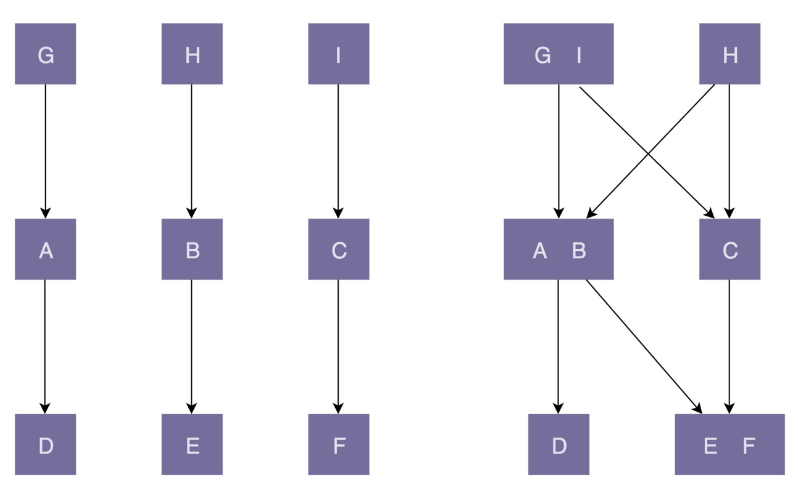

# 理论一：对于单一职责原则，如何判定某个类的职责是否够“单 一”？

如何理解单一职责原则（SRP）？ 文章的开头我们提到了 SOLID 原则，实际上，SOLID 原则并非单纯的 1 个原则，而是由 5 个设计原则组成的，它们分别是：单一职责原则、开闭原则、里式替换原则、接口隔离原则 和依赖反转原则，依次对应 SOLID 中的 S、O、L、I、D 这 5 个英文字母。我们今天要学 习的是 SOLID 原则中的第一个原则：单一职责原则。

单一职责原则的英文是 Single Responsibility Principle，缩写为 SRP。这个原则的英文描 述是这样的：A class or module should have a single reponsibility。如果我们把它翻译 成中文，那就是：一个类或者模块只负责完成一个职责（或者功能）。 

这个原则描述的对象包含两个，一个是类（class），一个是模块（module）。关于 这两个概念，在专栏中，有两种理解方式。一种理解是：把模块看作比类更加抽象的概念， 类也可以看作模块。另一种理解是：把模块看作比类更加粗粒度的代码块，模块中包含多个 类，多个类组成一个模块。

接下来我只从“类”设计的角度，来讲解如何应用这个设计原则。对于“模 块”来说，你可以自行引申。

单一职责原则的定义描述非常简单，也不难理解。一个类只负责完成一个职责或者功能。也 就是说，不要设计大而全的类，要设计粒度小、功能单一的类。换个角度来讲就是，一个类 包含了两个或者两个以上业务不相干的功能，那我们就说它职责不够单一，应该将它拆分成 多个功能更加单一、粒度更细的类。

比如，一个类里既包含订单的一些操作，又包含用户的一些操 作。而订单和用户是两个独立的业务领域模型，我们将两个不相干的功能放到同一个类中， 那就违反了单一职责原则。为了满足单一职责原则，我们需要将这个类拆分成两个粒度更 细、功能更加单一的两个类：订单类和用户类。

## 如何判断类的职责是否足够单一？

在真实的软件开发中，对于一个类是否职责 单一的判定，是很难拿捏的。

在一个社交产品中，我们用下面的 UserInfo 类来记录用户的信息。UserInfo 类的 设计是否满足单一职责原则呢？对于这个问题，有两种不同的观点。一种观点是，UserInfo 类包含的都是跟用户相关的信 息，所有的属性和方法都隶属于用户这样一个业务模型，满足单一职责原则；另一种观点 是，地址信息在 UserInfo 类中，所占的比重比较高，可以继续拆分成独立的 UserAddress  类，UserInfo 只保留除 Address 之外的其他信息，拆分之后的两个类的职责更加单一。

实际上，要从中做出选择，我们不能脱离具体的应用场景。如果在这个社 交产品中，用户的地址信息跟其他信息一样，只是单纯地用来展示，那 UserInfo 现在的设 计就是合理的。但是，如果这个社交产品发展得比较好，之后又在产品中添加了电商的模 块，用户的地址信息还会用在电商物流中，那我们最好将地址信息从 UserInfo 中拆分出 来，独立成用户物流信息（或者叫地址信息、收货信息等）。

如果做这个社交产品的公司发展得越来越好，公司内部又开发出了 跟多其他产品（可以理解为其他 App）。公司希望支持统一账号系统，也就是用户一个账号可以在公司内部的所有产品中登录。这个时候，我们就需要继续对 UserInfo 进行拆分， 将跟身份认证相关的信息（比如，email、telephone 等）抽取成独立的类。 

从刚刚这个例子，我们可以总结出，不同的应用场景、不同阶段的需求背景下，对同一个类 的职责是否单一的判定，可能都是不一样的。在某种应用场景或者当下的需求背景下，一个 类的设计可能已经满足单一职责原则了，但如果换个应用场景或着在未来的某个需求背景 下，可能就不满足了，需要继续拆分成粒度更细的类。

除此之外，从不同的业务层面去看待同一个类的设计，对类是否职责单一，也会有不同的认 识。比如，例子中的 UserInfo 类。如果我们从“用户”这个业务层面来看，UserInfo 包含 的信息都属于用户，满足职责单一原则。如果我们从更加细分的“用户展示信息”“地址信 息”“登录认证信息”等等这些更细粒度的业务层面来看，那 UserInfo 就应该继续拆分。

综上所述，评价一个类的职责是否足够单一，我们并没有一个非常明确的、可以量化的标 准，可以说，这是件非常主观、仁者见仁智者见智的事情。实际上，在真正的软件开发中， 我们也没必要过于未雨绸缪，过度设计。所以，**我们可以先写一个粗粒度的类，满足业务需 求。随着业务的发展，如果粗粒度的类越来越庞大，代码越来越多，这个时候，我们就可以 将这个粗粒度的类，拆分成几个更细粒度的类。这就是所谓的持续重构。**

我这 里还有一些小技巧，能够很好地帮你，从侧面上判定一个类的职责是否够单一。而且，我个 人觉得，下面这几条判断原则，比起很主观地去思考类是否职责单一，要更有指导意义、更 具有可执行性：

1. 类中的代码行数、函数或属性过多，会影响代码的可读性和可维护性，我们就需要考虑 对类进行拆分； 
2. 类依赖的其他类过多，或者依赖类的其他类过多，不符合高内聚、低耦合的设计思想， 我们就需要考虑对类进行拆分； 
3. 私有方法过多，我们就要考虑能否将私有方法独立到新的类中，设置为 public 方法，供 更多的类使用，从而提高代码的复用性； 
4. 比较难给类起一个合适名字，很难用一个业务名词概括，或者只能用一些笼统的 Manager、Context 之类的词语来命名，这就说明类的职责定义得可能不够清晰；
5. 类中大量的方法都是集中操作类中的某几个属性，比如，在 UserInfo 例子中，如果一半的方法都是在操作 address 信息，那就可以考虑将这几个属性和对应的方法拆分出来。

实际上， 从另一个角度来看，当一个类的代码，读起来让你头大了，实现某个功能时不知 道该用哪个函数了，想用哪个函数翻半天都找不到了，只用到一个小功能要引入整个类（类 中包含很多无关此功能实现的函数）的时候，这就说明类的行数、函数、属性过多了。实际 上，等你做多项目了，代码写多了，在开发中慢慢“品尝”，自然就知道什么是“放盐少 许”了，这就是所谓的“专业第六感”。

## 类的职责是否设计得越单一越好？ 

为了满足单一职责原则，是不是把类拆得越细就越好呢？答案是否定的。我们还是通过一个 例子来解释一下。Serialization 类实现了一个简单协议的序列化和反序列功能，具体代码 如下：

```java
/**
 * Protocol format: identifier-string;{gson string}
 * For example: UEUEUE;{"a":"A","b":"B"}
 */
public class Serialization {
 private static final String IDENTIFIER_STRING = "UEUEUE;";
 private Gson gson;
 
    public Serialization() {
     this.gson = new Gson();
	}
    
    public String serialize(Map<String, String> object) {
    StringBuilder textBuilder = new StringBuilder();
    textBuilder.append(IDENTIFIER_STRING);
    textBuilder.append(gson.toJson(object));
    return textBuilder.toString();
	}
    
    public Map<String, String> deserialize(String text) {
    if (!text.startsWith(IDENTIFIER_STRING)) {
    	return Collections.emptyMap();
    }
    String gsonStr = text.substring(IDENTIFIER_STRING.length());
    return gson.fromJson(gsonStr, Map.class);
    }
}
```

如果我们想让类的职责更加单一，我们对 Serialization 类进一步拆分，拆分成一个只负责 序列化工作的 Serializer 类和另一个只负责反序列化工作的 Deserializer 类。拆分后的具 体代码如下所示：

```java
public class Serializer {
    private static final String IDENTIFIER_STRING = "UEUEUE;";
    private Gson gson;
    public Serializer() {
    	this.gson = new Gson();
	}
    public String serialize(Map<String, String> object) {
        StringBuilder textBuilder = new StringBuilder();
        textBuilder.append(IDENTIFIER_STRING);
        textBuilder.append(gson.toJson(object));
        return textBuilder.toString();
    }
}

public class Deserializer {
    private static final String IDENTIFIER_STRING = "UEUEUE;";
    private Gson gson;
        
    public Deserializer() {
    this.gson = new Gson();
    }
	public Map<String, String> deserialize(String text) {
    if (!text.startsWith(IDENTIFIER_STRING)) {
    	return Collections.emptyMap();
    }
    
    String gsonStr = text.substring(IDENTIFIER_STRING.length());
    return gson.fromJson(gsonStr, Map.class);
    }
}

    

```

虽然经过拆分之后，Serializer 类和 Deserializer 类的职责更加单一了，但也随之带来了新 的问题。如果我们修改了协议的格式，数据标识从“UEUEUE”改为“DFDFDF”，或者序 列化方式从 JSON 改为了 XML，那 Serializer 类和 Deserializer 类都需要做相应的修改， 代码的内聚性显然没有原来 Serialization 高了。而且，如果我们仅仅对 Serializer 类做了 协议修改，而忘记了修改 Deserializer 类的代码，那就会导致序列化、反序列化不匹配， 程序运行出错，也就是说，拆分之后，代码的可维护性变差了。 

实际上，不管是应用设计原则还是设计模式，最终的目的还是提高代码的可读性、可扩展 性、复用性、可维护性等。我们在考虑应用某一个设计原则是否合理的时候，也可以以此作 为最终的考量标准。

## 重点回顾

**1. 如何理解单一职责原则（SRP）？** 

一个类只负责完成一个职责或者功能。不要设计大而全的类，要设计粒度小、功能单一的 类。单一职责原则是为了实现代码高内聚、低耦合，提高代码的复用性、可读性、可维护 性。 内聚和耦合其实是对一个意思（即合在一块）从相反方向的两种阐述。 2，内聚是从功能相关来谈，主张高内聚。把功能高度相关的内容不必要地分离开。

**2. 如何判断类的职责是否足够单一？** 

不同的应用场景、不同阶段的需求背景、不同的业务层面，对同一个类的职责是否单一，可 能会有不同的判定结果。实际上，一些侧面的判断指标更具有指导意义和可执行性，比如， 出现下面这些情况就有可能说明这类的设计不满足单一职责原则：

- 类中的代码行数、函数或者属性过多； 
- 类依赖的其他类过多，或者依赖类的其他类过多； 
- 私有方法过多； 比较难给类起一个合适的名字； 
- 类中大量的方法都是集中操作类中的某几个属性。

**3. 类的职责是否设计得越单一越好？** 

单一职责原则通过避免设计大而全的类，避免将不相关的功能耦合在一起，来提高类的内聚 性。同时，类职责单一，类依赖的和被依赖的其他类也会变少，减少了代码的耦合性，以此 来实现代码的高内聚、低耦合。但是，如果拆分得过细，实际上会适得其反，反倒会降低内 聚性，也会影响代码的可维护性。

[内聚与耦合_cyyJames的博客](https://blog.csdn.net/weixin_40562161/article/details/90240954)


# 理论二：如何做到“对扩展开放、修改关闭”？扩展和修改各指什么？

SOLID 中的第二个原则：开 闭原则。我个人觉得，开闭原则是 SOLID 中最难理解、最难掌握，同时也是最有用的一条 原则。 之所以说这条原则难理解，那是因为，“怎样的代码改动才被定义为‘扩展’？怎样的代码 改动才被定义为‘修改’？怎么才算满足或违反‘开闭原则’？修改代码就一定意味着违 反‘开闭原则’吗？”等等这些问题，都比较难理解。

之所以说这条原则难掌握，那是因为，“如何做到‘对扩展开发、修改关闭’？如何在项目 中灵活地应用‘开闭原则’，以避免在追求扩展性的同时影响到代码的可读性？”等等这些 问题，都比较难掌握。 之所以说这条原则最有用，那是因为，扩展性是代码质量最重要的衡量标准之一。在 23 种 经典设计模式中，大部分设计模式都是为了解决代码的扩展性问题而存在的，主要遵从的设 计原则就是开闭原则。

## 如何理解“对扩展开放、修改关闭”？

开闭原则的英文全称是 Open Closed Principle，简写为 OCP。它的英文描述是： software entities (modules, classes, functions, etc.) should be open for extension , but closed for modification。我们把它翻译成中文就是：软件实体（模块、类、方法等） 应该“对扩展开放、对修改关闭”

这个描述比较简略，如果我们详细表述一下，那就是，添加一个新的功能应该是，在已有代码基础上扩展代码（新增模块、类、方法等），而非修改已有代码（修改模块、类、方法等）。

举一个例子来进一步解释一下。这是一段 API 接口监控 告警的代码。 其中，AlertRule 存储告警规则，可以自由设置。Notification 是告警通知类，支持邮件、 短信、微信、手机等多种通知渠道。NotificationEmergencyLevel 表示通知的紧急程度， 包括 SEVERE（严重）、URGENCY（紧急）、NORMAL（普通）、TRIVIAL（无关紧 要），不同的紧急程度对应不同的发送渠道。

```java
public class Alert {
    private AlertRule rule;
    private Notification notification;
    
    public Alert(AlertRule rule, Notification notification) {
        this.rule = rule;
        this.notification = notification;
    }
    
    public void check(String api, long requestCount, long errorCount, long durationOfSeconds) {
        long tps = requestCount / durationOfSeconds;
        if (tps > rule.getMatchedRule(api).getMaxTps()) {
            notification.notify(NotificationEmergencyLevel.URGENCY, "...");
        }
        
        if  (errorCount > 				rule.getMatchedRule(api).getMaxErrorCount()) {
			notification.notify(NotificationEmergencyLevel.SEVERE, "...");
		}
    }
}
```

业务逻辑主要集中在 check() 函数中。当接口的 TPS 超过某个预 先设置的最大值时，以及当接口请求出错数大于某个最大允许值时，就会触发告警，通知接 口的相关负责人或者团队。 

现在，如果我们需要添加一个功能，当每秒钟接口超时请求个数，超过某个预先设置的最大 阈值时，我们也要触发告警发送通知。这个时候，我们该如何改动代码呢？主要的改动有两 处：第一处是修改 check() 函数的入参，添加一个新的统计数据 timeoutCount，表示超时 接口请求数；第二处是在 check() 函数中添加新的告警逻辑。具体的代码改动如下所示：

```java
public class Alert {
// ... 省略 AlertRule/Notification 属性和构造函数...
// 改动一：添加参数 timeoutCount
    public void check(String api, long requestCount, long errorCount, long timeou
    long tps = requestCount / durationOfSeconds;
    if (tps > rule.getMatchedRule(api).getMaxTps()) {
    notification.notify(NotificationEmergencyLevel.URGENCY, "...");
    }
    if (errorCount > rule.getMatchedRule(api).getMaxErrorCount()) {
    notification.notify(NotificationEmergencyLevel.SEVERE, "...");
    }
    // 改动二：添加接口超时处理逻辑
    long timeoutTps = timeoutCount / durationOfSeconds;
    if (timeoutTps > rule.getMatchedRule(api).getMaxTimeoutTps()) {
    notification.notify(NotificationEmergencyLevel.URGENCY, "...");
		}
	}
}
```

这样的代码修改实际上存在挺多问题的。一方面，我们对接口进行了修改，这就意味着调用 这个接口的代码都要做相应的修改。另一方面，修改了 check() 函数，相应的单元测试都需 要修改（关于单元测试的内容我们在重构那部分会详细介绍）。

上面的代码改动是基于“修改”的方式来实现新功能的。如果我们遵循开闭原则，也就 是“对扩展开放、对修改关闭”。那如何通过“扩展”的方式，来实现同样的功能呢？

我们先重构一下之前的 Alert 代码，让它的扩展性更好一些。重构的内容主要包含两部分：

第一部分是将 check() 函数的多个入参封装成 ApiStatInfo 类； 

第二部分是引入 handler 的概念，将 if 判断逻辑分散在各个 handler 中。

```java
public class Alert {
    private List<AlertHandler> alertHandlers = new ArrayList<>();
    
    public clas addAlertHandler(AlertHandler alerthandler) {
        this.alertHandlers.add(alertHandler);
    }
    
    public void check(ApiStatInfo apiStatInfo) {
        for (AlertHandler handler : alertHandlers) {
            handler.check(apiStatInfo);
        }
    }
}

public class ApiStatInfo {// 省略 constructor/getter/setter 方法
    private String api;
    private long requestCount;
    private long errorCount;
    private long durationOfSeconds;
}

public abstract class AlertHandler {
    protected AlertRule rule;
    protected Notification notification;
    public AlertHandler(AlertRule rule, Notification notification) {
        this.rule = rule;
        this.notification = notificaiton;
    }
    public abstract void check(ApiStatInfo apiStatInfo);
}

public class TpsAlertHandler extends AlertHandler {
    public TpsAlertHandler(AlertRule rule, Notification notificaiton) {
        super(rule, notification);
    }
    
    @Override
    public void check(ApiStatInfo apiStatInfo) {
        long tps = apiStatInfo.getRequestCount() / apiStatInfo.getDurationOfSeconds;
        if (tps > rule.getMatchedRule(apiStatInfo.getApi()).getMaxTps()) 		{
			notification.notify(NotificationEmergencyLevel.URGENCY, "...");
		}
    }
}

public class ErrorAlertHandler extends AlertHandler {
    public ErrorAlertHandler(AlertRule rule, Notification notification){
    super(rule, notification);
    }
    @Override
    public void check(ApiStatInfo apiStatInfo) {
        if (apiStatInfo.getErrorCount() > rule.getMatchedRule(apiStatInfo.getApi()){
        	notification.notify(NotificationEmergencyLevel.SEVERE, "...");
        }
    }
}
```

重构之后的 Alert 该如何使用呢？具体的使 用代码我也写在这里了。 其中，ApplicationContext 是一个单例类，负责 Alert 的创建、组装（alertRule 和 notification 的依赖注入）、初始化（添加 handlers）工作。

```java
public class ApplicationContext {
    private AlertRule alertRule;
    private Notification notification;
    private Alert alert;
    
    public void initializeBeans() {
        alertRule = new AlertRule(/*. 省略参数.*/); // 省略一些初始化代码
		notification = new Notification(/*. 省略参数.*/); // 省略一些初始化代码
        alert = new Alert();
        alert.addAlertHandler(new TpsAlertHandler(alertRule, notificaiton));
        alert.addAlertHandler(new ErrorAlertHandler(alertRule, notification));
    }
    public Alert getAlert() { return alert; }
    
    // 饿汉式单例
    private static final ApplicationContext instance = new ApplicationContext();
    private ApplicationContext() {
        instance.initializeBeans();
    }
    public static ApplicationContext getInstance() {
        return instance;
    }
}

public class Demo {
    public static void main(String[] args) {
        ApiStatInfo apiStatInfo = new ApiStatInfo();
        // ... 省略设置 apiStatInfo 数据值的代码
        Application.getInstance().getAlert().check(apiStatInfo);
    }
}
```

基于重构之后的代码，如果再添加上面讲到的那个新功能，每秒钟接 口超时请求个数超过某个最大阈值就告警，我们又该如何改动代码呢？主要的改动有

第一处改动是：在 ApiStatInfo 类中添加新的属性 timeoutCount。 

第二处改动是：添加新的 TimeoutAlertHander 类。 

第三处改动是：在 ApplicationContext 类的 initializeBeans() 方法中，往 alert 对象中 注册新的 timeoutAlertHandler。 

第四处改动是：在使用 Alert 类的时候，需要给 check() 函数的入参 apiStatInfo 对象设 置 timeoutCount 的值。

```java
public class ApiStatInfo {// 省略 constructor/getter/setter 方法
private String api;
private long requestCount;
private long errorCount;
private long durationOfSeconds;
private long timeoutCount; // 改动一：添加新字段
}
public abstract class AlertHandler { // 代码未改动... }
public class TpsAlertHandler extends AlertHandler {// 代码未改动...}
public class ErrorAlertHandler extends AlertHandler {// 代码未改动...}
// 改动二：添加新的 handler
public class TimeoutAlertHandler extends AlertHandler {// 省略代码...}
public class ApplicationContext {
private AlertRule alertRule;
private Notification notification;
private Alert alert;
public void initializeBeans() {
alertRule = new AlertRule(/*. 省略参数.*/); // 省略一些初始化代码
notification = new Notification(/*. 省略参数.*/); // 省略一些初始化代码
alert = new Alert();
alert.addAlertHandler(new TpsAlertHandler(alertRule, notification));
alert.addAlertHandler(new ErrorAlertHandler(alertRule, notification));
// 改动三：注册 handler
alert.addAlertHandler(new TimeoutAlertHandler(alertRule, notification));
}
//... 省略其他未改动代码...
}
public class Demo {
public static void main(String[] args) {
ApiStatInfo apiStatInfo = new ApiStatInfo();
// ... 省略 apiStatInfo 的 set 字段代码
apiStatInfo.setTimeoutCount(289); // 改动四：设置 tiemoutCount 值
ApplicationContext.getInstance().getAlert().check(apiStatInfo);
}

```

重构之后的代码更加灵活和易扩展。如果我们要想添加新的告警逻辑，只需要基于扩展的方 式创建新的 handler 类即可，不需要改动原来的 check() 函数的逻辑。而且，我们只需要 为新的 handler 类添加单元测试，老的单元测试都不会失败，也不用修改。

## 修改代码就意味着违背开闭原则吗？

看了上面重构之后的代码，你可能还会有疑问：在添加新的告警逻辑的时候，尽管改动二 （添加新的 handler 类）是基于扩展而非修改的方式来完成的，但改动一、三、四貌似不是基于扩展而是基于修改的方式来完成的，那改动一、三、四不就违背了开闭原则吗？

我们先来分析一下改动一：往 ApiStatInfo 类中添加新的属性 timeoutCount。 实际上，我们不仅往 ApiStatInfo 类中添加了属性，还添加了对应的 getter/setter 方法。 那这个问题就转化为：给类中添加新的属性和方法，算作“修改”还是“扩展”？ 我们再一块回忆一下开闭原则的定义：软件实体（模块、类、方法等）应该“对扩展开放、 对修改关闭”。从定义中，我们可以看出，开闭原则可以应用在不同粒度的代码中，可以是 模块，也可以类，还可以是方法（及其属性）。同样一个代码改动，在粗代码粒度下，被认 定为“修改”，在细代码粒度下，又可以被认定为“扩展”。比如，改动一，添加属性和方 法相当于修改类，在类这个层面，这个代码改动可以被认定为“修改”；但这个代码改动并 没有修改已有的属性和方法，在方法（及其属性）这一层面，它又可以被认定为“扩展”。

实际上，我们也没必要纠结某个代码改动是“修改”还是“扩展”，更没必要太纠结它是否 违反“开闭原则”。我们回到这条原则的设计初衷：只要它没有破坏原有的代码的正常运 行，没有破坏原有的单元测试，我们就可以说，这是一个合格的代码改动。

分析一下改动三和改动四：在 ApplicationContext 类的 initializeBeans() 方法 中，往 alert 对象中注册新的 timeoutAlertHandler；在使用 Alert 类的时候，需要给 check() 函数的入参 apiStatInfo 对象设置 timeoutCount 的值。

这两处改动都是在方法内部进行的，不管从哪个层面（模块、类、方法）来讲，都不能算 是“扩展”，而是地地道道的“修改”。不过，有些修改是在所难免的，是可以被接受的。 为什么这么说呢？我来解释一下。 在重构之后的 Alert 代码中，我们的核心逻辑集中在 Alert 类及其各个 handler 中，当我们 在添加新的告警逻辑的时候，Alert 类完全不需要修改，而只需要扩展一个新 handler 类。 如果我们把 Alert 类及各个 handler 类合起来看作一个“模块”，那模块本身在添加新的 功能的时候，完全满足开闭原则。

我们要认识到，添加一个新功能，不可能任何模块、类、方法的代码都不“修改”， 这个是做不到的。类需要创建、组装、并且做一些初始化操作，才能构建成可运行的的程序，这部分代码的修改是在所难免的。我们要做的是尽量让修改操作更集中、更少、更上 层，尽量让最核心、最复杂的那部分逻辑代码满足开闭原则。

## 如何做到“对扩展开放、修改关闭”？

在讲具体的方法论之前，我们先来看一些更加偏向顶层的指导思想。为了尽量写出扩展性好 的代码，我们要时刻具备扩展意识、抽象意识、封装意识。这些“潜意识”可能比任何开发 技巧都重要。 

在写代码的时候后，我们要多花点时间往前多思考一下，这段代码未来可能有哪些需求变 更、如何设计代码结构，事先留好扩展点，以便在未来需求变更的时候，不需要改动代码整 体结构、做到最小代码改动的情况下，新的代码能够很灵活地插入到扩展点上，做到“对扩 展开放、对修改关闭”。

还有，在识别出代码可变部分和不可变部分之后，我们要将可变部分封装起来，隔离变化， 提供抽象化的不可变接口，给上层系统使用。当具体的实现发生变化的时候，我们只需要基 于相同的抽象接口，扩展一个新的实现，替换掉老的实现即可，上游系统的代码几乎不需要 修改。

代码的扩展性是代码质量评判的最重要的标准之一。实际上，我们整个专栏 的大部分知识点都是围绕扩展性问题来讲解的。专栏中讲到的很多设计原则、设计思想、设 计模式，都是以提高代码的扩展性为最终目的的。特别是 23 种经典设计模式，大部分都是 为了解决代码的扩展性问题而总结出来的，都是以开闭原则为指导原则的。 

在众多的设计原则、思想、模式中，最常用来提高代码扩展性的方法有：多态、依赖注入、 基于接口而非实现编程，以及大部分的设计模式（比如，装饰、策略、模板、职责链、状态 等）。

实际上，多态、依赖注入、基于接口而非实现编程，以及前面提到的抽象意识，说的都是同 一种设计思路，只是从不同的角度、不同的层面来阐述而已。这也体现了“很多设计原则、 思想、模式都是相通的”这一思想。

通过一个例子来解释一下，如何利用这几个设计思想或原则来实现“对扩展开 放、对修改关闭”。注意，依赖注入后面会讲到，如果你对这块不了解，可以暂时先忽略这 个概念，只关注多态、基于接口而非实现编程以及抽象意识。 

比如，我们代码中通过 Kafka 来发送异步消息。对于这样一个功能的开发，我们要学会将 其抽象成一组跟具体消息队列（Kafka）无关的异步消息接口。所有上层系统都依赖这组 抽象的接口编程，并且通过依赖注入的方式来调用。当我们要替换新的消息队列的时候，比 如将 Kafka 替换成 RocketMQ，可以很方便地拔掉老的消息队列实现，插入新的消息队列 实现。具体代码如下所示：

```java
// 这一部分体现了抽象意识
public interface MessageQueue { //... }
public class KafkaMessageQueue implements MessageQueue { //... }
public class RocketMQMessageQueue implements MessageQueue {//...}
public interface MessageFromatter { //... }
public class JsonMessageFromatter implements MessageFromatter {//...}
public class ProtoBufMessageFromatter implements MessageFromatter {//...}
public class Demo {
private MessageQueue msgQueue; // 基于接口而非实现编程
public Demo(MessageQueue msgQueue) { // 依赖注入
this.msgQueue = msgQueue;
}
// msgFormatter：多态、依赖注入
public void sendNotification(Notification notification, MessageFormatter msg{
//...
}
}
                            
```

## 如何在项目中灵活应用开闭原则？

写出支持“对扩展开放、对修改关闭”的代码的关键是预留扩展点。那问题 是如何才能识别出所有可能的扩展点呢？ 

如果你开发的是一个业务导向的系统，比如金融系统、电商系统、物流系统等，要想识别出 尽可能多的扩展点，就要对业务有足够的了解，能够知道当下以及未来可能要支持的业务需 求。如果你开发的是跟业务无关的、通用的、偏底层的系统，比如，框架、组件、类库，你 需要了解“它们会被如何使用？今后你打算添加哪些功能？使用者未来会有哪些更多的功能 需求？”等问题。

最合理的做法是，对于一些比较确定的、短期内可能就会扩展，或者需求改动对代码结构影 响比较大的情况，或者实现成本不高的扩展点，在编写代码的时候之后，我们就可以事先做 些扩展性设计。但对于一些不确定未来是否要支持的需求，或者实现起来比较复杂的扩展 点，我们可以等到有需求驱动的时候，再通过重构代码的方式来支持扩展的需求。 

而且，开闭原则也并不是免费的。有些情况下，代码的扩展性会跟可读性相冲突。比如，我 们之前举的 Alert 告警的例子。为了更好地支持扩展性，我们对代码进行了重构，重构之后 的代码要比之前的代码复杂很多，理解起来也更加有难度。很多时候，我们都需要在扩展性 和可读性之间做权衡。在某些场景下，代码的扩展性很重要，我们就可以适当地牺牲一些代码的可读性；在另一些场景下，代码的可读性更加重要，那我们就适当地牺牲一些代码的可 扩展性。

Alert 告警的例子中，如果告警规则并不是很多、也不复杂，那 check() 函 数中的 if 语句就不会很多，代码逻辑也不复杂，代码行数也不多，那最初的第一种代码实 现思路简单易读，就是比较合理的选择。相反，如果告警规则很多、很复杂，check() 函数 的 if 语句、代码逻辑就会很多、很复杂，相应的代码行数也会很多，可读性、可维护性就 会变差，那重构之后的第二种代码实现思路就是更加合理的选择了。总之，这里没有一个放 之四海而皆准的参考标准，全凭实际的应用场景来决定。

## 重点回顾

1. 如何理解“对扩展开放、对修改关闭”？ 添加一个新的功能，应该是通过在已有代码基础上扩展代码（新增模块、类、方法、属性 等），而非修改已有代码（修改模块、类、方法、属性等）的方式来完成。关于定义，我们 有两点要注意。第一点是，开闭原则并不是说完全杜绝修改，而是以最小的修改代码的代价 来完成新功能的开发。第二点是，同样的代码改动，在粗代码粒度下，可能被认定为“修 改”；在细代码粒度下，可能又被认定为“扩展”。 
2. 如何做到“对扩展开放、修改关闭”？ 我们要时刻具备扩展意识、抽象意识、封装意识。在写代码的时候，我们要多花点时间思考 一下，这段代码未来可能有哪些需求变更，如何设计代码结构，事先留好扩展点，以便在未 来需求变更的时候，在不改动代码整体结构、做到最小代码改动的情况下，将新的代码灵活 地插入到扩展点上。 很多设计原则、设计思想、设计模式，都是以提高代码的扩展性为最终目的的。特别是 23 种经典设计模式，大部分都是为了解决代码的扩展性问题而总结出来的，都是以开闭原则为 指导原则的。最常用来提高代码扩展性的方法有：多态、依赖注入、基于接口而非实现编 程，以及大部分的设计模式（比如，装饰、策略、模板、职责链、状态）。

对拓展开放是为了应对变化(需求)，对修改关闭是为了保证已有代码的稳定性；最终结果是 为了让系统更有弹性！

# 理论三：里式替换（LSP）跟多态有何区别？哪些代码违背了 LSP？

SOLID 中的“L”对应的原则：里式替换原则。这个设计原则是比较简单、容易理解和掌握的。今天我主要通过几个反例，带 你看看，哪些代码是违反里式替换原则的？我们该如何将它们改造成满足里式替换原则？除 此之外，这条原则从定义上看起来，跟我们之前讲过的“多态”有点类似。所以，我今天也 会讲一下，它跟多态的区别。

## 如何理解“里式替换原则”？ 

里式替换原则的英文翻译是：Liskov Substitution Principle，缩写为 LSP。

我们综合两者的描述，将这条原则用中文描述出来，是这样的：子类对象（object of subtype/derived class）能够替换程序（program）中父类对象（object of base/parent class）出现的任何地方，并且保证原来程序的逻辑行为（behavior）不变及正确性不被破 坏。

通过一个例子来解释一下。如下代码中，父类 Transporter 使 用 org.apache.http 库中的 HttpClient 类来传输网络数据。子类 SecurityTransporter 继 承父类 Transporter，增加了额外的功能，支持传输 appId 和 appToken 安全认证信息。

```java
public class Transporter {
    private HttpClient httpClient;
    public Transporter(HttpClient httpClient) {
    this.httpClient = httpClient;
    }
    public Response sendRequest(Request request) {
    // ...use httpClient to send request
    }
}
public class SecurityTransporter extends Transporter {
    private String appId;
    private String appToken;
    public SecurityTransporter(HttpClient httpClient, String appId, String appTok
    super(httpClient);
    this.appId = appId;
    this.appToken = appToken;
    }
    @Override
    public Response sendRequest(Request request) {
    if (StringUtils.isNotBlank(appId) && StringUtils.isNotBlank(appToken)) {
    request.addPayload("app-id", appId);
    request.addPayload("app-token", appToken);
    }
    return super.sendRequest(request);
    }
}
public class Demo {
    public void demoFunction(Transporter transporter) {
    Reuqest request = new Request();
    //... 省略设置 request 中数据值的代码...
    Response response = transporter.sendRequest(request);
    //... 省略其他逻辑...
    }
}
// 里式替换原则
Demo demo = new Demo();
demo.demofunction(new SecurityTransporter(/* 省略参数 */););

```

在上面的代码中，子类 SecurityTransporter 的设计完全符合里式替换原则，可以替换父类 出现的任何位置，并且原来代码的逻辑行为不变且正确性也没有被破坏。 

不过，你可能会有这样的疑问，刚刚的代码设计不就是简单利用了面向对象的多态特性吗？ 多态和里式替换原则说的是不是一回事呢？从刚刚的例子和定义描述来看，里式替换原则跟 多态看起来确实有点类似，但实际上它们完全是两回事。为什么这么说呢？ 

我们还是通过刚才这个例子来解释一下。不过，我们需要对 SecurityTransporter 类中 sendRequest() 函数稍加改造一下。改造前，如果 appId 或者 appToken 没有设置，我们 就不做校验；改造后，如果 appId 或者 appToken 没有设置，则直接抛出 NoAuthorizationRuntimeException 未授权异常。改造前后的代码对比如下所示：

在改造之后的代码中，如果传递进 demoFunction() 函数的是父类 Transporter 对象，那 demoFunction() 函数并不会有异常抛出，但如果传递给 demoFunction() 函数的是子类 SecurityTransporter 对象，那 demoFunction() 有可能会有异常抛出。尽管代码中抛出的 是运行时异常（Runtime Exception），我们可以不在代码中显式地捕获处理，但子类替换 父类传递进 demoFunction 函数之后，整个程序的逻辑行为有了改变。 

虽然改造之后的代码仍然可以通过 Java 的多态语法，动态地用子类 SecurityTransporter 来替换父类 Transporter，也并不会导致程序编译或者运行报错。但是，从设计思路上来 讲，SecurityTransporter 的设计是不符合里式替换原则的。 

好了，我们稍微总结一下。虽然从定义描述和代码实现上来看，多态和里式替换有点类似， 但它们关注的角度是不一样的。多态是面向对象编程的一大特性，也是面向对象编程语言的 一种语法。它是一种代码实现的思路。而里式替换是一种设计原则，是用来指导继承关系中

## 哪些代码明显违背了 LSP？

实际上，里式替换原则还有另外一个更加能落地、更有指导意义的描述，那就是“Design By Contract”，中文翻译就是“按照协议来设计”。 

看起来比较抽象，我来进一步解读一下。子类在设计的时候，要遵守父类的行为约定（或者 叫协议）。父类定义了函数的行为约定，那子类可以改变函数的内部实现逻辑，但不能改变 函数原有的行为约定。这里的行为约定包括：函数声明要实现的功能；对输入、输出、异常 的约定；甚至包括注释中所罗列的任何特殊说明。实际上，定义中父类和子类之间的关系， 也可以替换成接口和实现类之间的关系。 

为了更好地理解这句话，我举几个违反里式替换原则的例子来解释一下。

1. **子类违背父类声明要实现的功能** 父类中提供的 sortOrdersByAmount() 订单排序函数，是按照金额从小到大来给订单排序 的，而子类重写这个 sortOrdersByAmount() 订单排序函数之后，是按照创建日期来给订 单排序的。那子类的设计就违背里式替换原则。 
2. **子类违背父类对输入、输出、异常的约定** 在父类中，某个函数约定：运行出错的时候返回 null；获取数据为空的时候返回空集合 （empty collection）。而子类重载函数之后，实现变了，运行出错返回异常 （exception），获取不到数据返回 null。那子类的设计就违背里式替换原则。 在父类中，某个函数约定，输入数据可以是任意整数，但子类实现的时候，只允许输入数据 是正整数，负数就抛出，也就是说，子类对输入的数据的校验比父类更加严格，那子类的设 计就违背了里式替换原则。 在父类中，某个函数约定，只会抛出 ArgumentNullException 异常，那子类的设计实现 中只允许抛出 ArgumentNullException 异常，任何其他异常的抛出，都会导致子类违背里式替换原则。
3. **子类违背父类注释中所罗列的任何特殊说明** 父类中定义的 withdraw() 提现函数的注释是这么写的：“用户的提现金额不得超过账户余 额……”，而子类重写 withdraw() 函数之后，针对 VIP 账号实现了透支提现的功能，也就 是提现金额可以大于账户余额，那这个子类的设计也是不符合里式替换原则的。 以上便是三种典型的违背里式替换原则的情况。除此之外，判断子类的设计实现是否违背里 式替换原则，还有一个小窍门，那就是拿父类的单元测试去验证子类的代码。如果某些单元 测试运行失败，就有可能说明，子类的设计实现没有完全地遵守父类的约定，子类有可能违 背了里式替换原则。 实际上，你有没有发现，里式替换这个原则是非常宽松的。一般情况下，我们写的代码都不 怎么会违背它。所以，只要你能看懂我今天讲的这些，这个原则就不难掌握，也不难应用。

## 重点回顾

里式替换原则是用来指导，继承关系中子类该如何设计的一个原则。理解里式替换原则，最 核心的就是理解“design by contract，按照协议来设计”这几个字。父类定义了函数 的“约定”（或者叫协议），那子类可以改变函数的内部实现逻辑，但不能改变函数原有 的“约定”。这里的约定包括：函数声明要实现的功能；对输入、输出、异常的约定；甚至 包括注释中所罗列的任何特殊说明。 

理解这个原则，我们还要弄明白里式替换原则跟多态的区别。虽然从定义描述和代码实现上 来看，多态和里式替换有点类似，但它们关注的角度是不一样的。多态是面向对象编程的一 大特性，也是面向对象编程语言的一种语法。它是一种代码实现的思路。而里式替换是一种 设计原则，用来指导继承关系中子类该如何设计，子类的设计要保证在替换父类的时候，不 改变原有程序的逻辑及不破坏原有程序的正确性。

# 理论四：接口隔离原则有哪三种应用？原则中的“接口”该如何理解？

接口隔离原则。它对应 SOLID 中的英文字母“I”。

## 如何理解“接口隔离原则”？

接口隔离原则的英文翻译是“ Interface Segregation Principle”，缩写为 ISP。Robert Martin 在 SOLID 原则中是这样定义它的：“Clients should not be forced to depend upon interfaces that they do not use。”直译成中文的话就是：客户端不应该强迫依赖 它不需要的接口。其中的“客户端”，可以理解为接口的调用者或者使用者。

实际上，“接口”这个名词可以用在很多场合中。生活中我们可以用它来指插座接口等。在 软件开发中，我们既可以把它看作一组抽象的约定，也可以具体指系统与系统之间的 API 接口，还可以特指面向对象编程语言中的接口等。

前面我提到，理解接口隔离原则的关键，就是理解其中的“接口”二字。在这条原则中，我 们可以把“接口”理解为下面三种东西：

一组 API 接口集合 

单个 API 接口或函数 

OOP 中的接口概念

**把“接口”理解为一组 API 接口集合** 我们还是结合一个例子来讲解。微服务用户系统提供了一组跟用户相关的 API 给其他系统 使用，比如：注册、登录、获取用户信息等。具体代码如下所示：

我们的后台管理系统要实现删除用户的功能，希望用户系统提供一个删除用户的接 口。这个时候我们该如何来做呢？你可能会说，这不是很简单吗，我只需要在 UserService  中新添加一个 deleteUserByCellphone() 或 deleteUserById() 接口就可以了。这个方法可 以解决问题，但是也隐藏了一些安全隐患。 删除用户是一个非常慎重的操作，我们只希望通过后台管理系统来执行，所以这个接口只限 于给后台管理系统使用。如果我们把它放到 UserService 中，那所有使用到 UserService  的系统，都可以调用这个接口。不加限制地被其他业务系统调用，就有可能导致误删用户。 当然，最好的解决方案是从架构设计的层面，通过接口鉴权的方式来限制接口的调用。不 过，如果暂时没有鉴权框架来支持，我们还可以从代码设计的层面，尽量避免接口被误用。 我们参照接口隔离原则，调用者不应该强迫依赖它不需要的接口，将删除接口单独放到另外 一个接口 RestrictedUserService 中，然后将 RestrictedUserService 只打包提供给后台管 理系统来使用。

**把“接口”理解为单个 API 接口或函数** 把接口理解为单个接口或函数（以下为了方便讲解，我都简称 为“函数”）。那接口隔离原则就可以理解为：函数的设计要功能单一，不要将多个不同的 功能逻辑在一个函数中实现。count() 函数的功能不够单一，包含很多不同的统计功能，比如，求最大 值、最小值、平均值等等。按照接口隔离原则，我们应该把 count() 函数拆成几个更小粒 度的函数，每个函数负责一个独立的统计功能。

如果在项目中，对每个统计需求，Statistics 定义的那几个统计信息都有涉及，那 count() 函数的设计就是合理的。相反，如果每个统计需求只涉及 Statistics 罗列的统计信息中一部 分，比如，有的只需要用到 max、min、average 这三类统计信息，有的只需要用到 average、sum。而 count() 函数每次都会把所有的统计信息计算一遍，就会做很多无用功，势必影响代码的性能，特别是在需要统计的数据量很大的时候。所以，在这个应用场景 下，count() 函数的设计就有点不合理了，我们应该按照第二种设计思路，将其拆分成粒度 更细的多个统计函数。 

不过，你应该已经发现，接口隔离原则跟单一职责原则有点类似，不过稍微还是有点区别。 单一职责原则针对的是模块、类、接口的设计。而接口隔离原则相对于单一职责原则，一方 面它更侧重于接口的设计，另一方面它的思考的角度不同。它提供了一种判断接口是否职责 单一的标准：通过调用者如何使用接口来间接地判定。如果调用者只使用部分接口或接口的 部分功能，那接口的设计就不够职责单一。

**把“接口”理解为 OOP 中的接口概念** 我们还可以把“接口”理解为 OOP 中的接口概念，比如 Java 中的 interface。我还是通过一个例子来给你解释。 假设我们的项目中用到了三个外部系统：Redis、MySQL、Kafka。每个系统都对应一系列 配置信息，比如地址、端口、访问超时时间等。为了在内存中存储这些配置信息，供项目中 的其他模块来使用，我们分别设计实现了三个 Configuration 类：RedisConfig、 MysqlConfig、KafkaConfig。具体的代码实现如下所示。注意，这里我只给出了 RedisConfig 的代码实现，另外两个都是类似的，我这里就不贴了。

热更新和监控的需求我们就都实现了。我们来回顾一下这个例子的设计思想。 我们设计了两个功能非常单一的接口：Updater 和 Viewer。ScheduledUpdater 只依赖 Updater 这个跟热更新相关的接口，不需要被强迫去依赖不需要的 Viewer 接口，满足接 口隔离原则。同理，SimpleHttpServer 只依赖跟查看信息相关的 Viewer 接口，不依赖不 需要的 Updater 接口，也满足接口隔离原则。

如果我们不遵守接口隔离原则，不设计 Updater 和 Viewer 两个小接口，而 是设计一个大而全的 Config 接口，让 RedisConfig、KafkaConfig、MysqlConfig 都实现 这个 Config 接口，并且将原来传递给 ScheduledUpdater 的 Updater 和传递给 SimpleHttpServer 的 Viewer，都替换为 Config，那会有什么问题呢？

首先，第一种设计思路更加灵活、易扩展、易复用。因为 Updater、Viewer 职责更加单 一，单一就意味了通用、复用性好。比如，我们现在又有一个新的需求，开发一个 Metrics 性能统计模块，并且希望将 Metrics 也通过 SimpleHttpServer 显示在网页上，以方便查 看。这个时候，尽管 Metrics 跟 RedisConfig 等没有任何关系，但我们仍然可以让 Metrics 类实现非常通用的 Viewer 接口，复用 SimpleHttpServer 的代码实现。

其次，第二种设计思路在代码实现上做了一些无用功。因为 Config 接口中包含两类不相关 的接口，一类是 update()，一类是 output() 和 outputInPlainText()。理论上， KafkaConfig 只需要实现 update() 接口，并不需要实现 output() 相关的接口。同理， MysqlConfig 只需要实现 output() 相关接口，并需要实现 update() 接口。但第二种设计 思路要求 RedisConfig、KafkaConfig、MySqlConfig 必须同时实现 Config 的所有接口 函数（update、output、outputInPlainText）。除此之外，如果我们要往 Config 中继续 添加一个新的接口，那所有的实现类都要改动。相反，如果我们的接口粒度比较小，那涉及 改动的类就比较少。

## 重点回顾

1. **如何理解“接口隔离原则”？** 理解“接口隔离原则”的重点是理解其中的“接口”二字。这里有三种不同的理解。 如果把**“接口”理解为一组接口集合**，可以是某个微服务的接口，也可以是某个类库的接口 等。如果部分接口只被部分调用者使用，我们就需要将这部分接口隔离出来，单独给这部分调用者使用，而不强迫其他调用者也依赖这部分不会被用到的接口。 如果把**“接口”理解为单个 API 接口或函数**，部分调用者只需要函数中的部分功能，那我 们就需要把函数拆分成粒度更细的多个函数，让调用者只依赖它需要的那个细粒度函数。 如果把**“接口”理解为 OOP 中的接口**，也可以理解为面向对象编程语言中的接口语法。那 接口的设计要尽量单一，不要让接口的实现类和调用者，依赖不需要的接口函数。
2. **接口隔离原则与单一职责原则的区别** 单一职责原则针对的是模块、类、接口的设计。接口隔离原则相对于单一职责原则，一方面 更侧重于接口的设计，另一方面它的思考角度也是不同的。接口隔离原则提供了一种判断接 口的职责是否单一的标准：通过调用者如何使用接口来间接地判定。如果调用者只使用部分 接口或接口的部分功能，那接口的设计就不够职责单一。

# 理论五：控制反转、依赖反转、依赖注入，这三者有何区别和联 系？

最后一个原则：依赖反转原则。“依赖反转”这个概念指的是“谁跟谁”的“什么依赖”被反转了？“反转”两个字该 如何理解？“控制反转”和“依赖注入”。这两个概念跟“依赖反 转”有什么区别和联系呢？它们说的是同一个事情吗？ 如果你熟悉 Java 语言，那 Spring 框架中的 IOC 跟这些概念又有什么关系呢？

## 控制反转（IOC）

控制反转的英文翻译是 Inversion Of Control，缩写为 IOC。此处我要强调一下，如果你是 Java 工程师的话，暂 时别把这个“IOC”跟 Spring 框架的 IOC 联系在一起。先通过一个例子来看一下，什么是控制反转。

```java
public class UserServiceTest {
    public static boolean doTest() {
    // ...
    }
    public static void main(String[] args) {// 这部分逻辑可以放到框架中
        if (doTest()) {
        	System.out.println("Test succeed.");
        } else {
        	System.out.println("Test failed.");
        }
    }
}
```

在上面的代码中，所有的流程都由程序员来控制。如果我们抽象出一个下面这样一个框架， 我们再来看，如何利用框架来实现同样的功能。具体的代码实现如下所示：

```java
public abstract class TestCase {
    public vodi run() {
        if (doTest()) {
            System.out.println("Test succeed")
        }else {
			System.out.println("Test failed.");
		}
	}
	public abstract void doTest();
}

public class JunitApplication {
    private static final List<TestCase> testCases = new ArrayList<>();
    public static void register(TestCase testCase) {
        testCases.add(testCase);
    }
    public static final void main(String[] args) {
        for (TestCase case: testCases) {
            case.run();
        }
    }
}
```

把这个简化版本的测试框架引入到工程中之后，我们只需要在框架预留的扩展点，也就是 TestCase 类中的 doTest() 抽象函数中，填充具体的测试代码就可以实现之前的功能了， 完全不需要写负责执行流程的 main() 函数了。 具体的代码如下所示：

```java
public class UserServiceTest extends TestCase {
    @Override
    public boolean doTest() {
        //...
    }
}

//注册操作还可以通过配置的方式来实现，不需要程序员显示调用 register()
JunitApplication.register(new UserServiceTest();
```

举的这个例子，就是典型的通过框架来实现“控制反转”的例子。框架提供了一个可扩 展的代码骨架，用来组装对象、管理整个执行流程。程序员利用框架进行开发的时候，只需 要往预留的扩展点上，添加跟自己业务相关的代码，就可以利用框架来驱动整个程序流程的执行。

这里的“控制”指的是对程序执行流程的控制，而“反转”指的是在没有使用框架之前，程序员自己控制整个程序的执行。在使用框架之后，整个程序的执行流程可以通过框架来控制。流程的控制权从程序员“反转”到了框架。

实际上，实现控制反转的方法有很多，除了刚才例子中所示的类似于模板设计模式的方法之 外，还有马上要讲到的依赖注入等方法，所以，控制反转并不是一种具体的实现技巧，而是 一个比较笼统的设计思想，一般用来指导框架层面的设计。

## 依赖注入（DI）

依赖注入跟控制反转恰恰相反，它是一种具体的编码技巧。 依赖注入的英文翻译是 Dependency Injection，缩写为 DI。对于这个概念，有一个非常 形象的说法，那就是：依赖注入是一个标价 25 美元，实际上只值 5 美分的概念。也就是 说，这个概念听起来很“高大上”，实际上，理解、应用起来非常简单。

那到底什么是依赖注入呢？我们用一句话来概括就是：不通过 new() 的方式在类内部创建依赖类对象，而是将依赖的类对象在外部创建好之后，通过构造函数、函数参数等方式传递 （或注入）给类使用。

是通过一个例子来解释一下。在这个例子中，Notification 类负责消息推送，依赖 MessageSender 类实现推送商品促销、验证码等消息给用户。我们分别用依赖注入和非依赖注入两种方式来实现一下。具体的实现代码如下所示：

```java
// 非依赖注入实现方式
public class Notification {
    private MessageSender messageSender;
    
    public Notification() {
    	this.messageSender = new MessageSender(); // 此处有点像 hardcode
    }
    
    public void sendMessage(String cellphone, String message) {
        //... 省略校验逻辑等...
        this.messageSender.send(cellphone, message);
    }
}
public class MessageSender {
	public void send(String cellphone, String message) {
    //....
    }
}
// 使用 Notification
Notification notification = new Notification();

// 依赖注入的实现方式
public class Notification {
    private MessageSender messageSender;
    // 通过构造函数将 messageSender 传递进来
    public Notification(MessageSender messageSender) {
    	this.messageSender = messageSender;
    }
    public void sendMessage(String cellphone, String message) {
        //... 省略校验逻辑等...
        this.messageSender.send(cellphone, message);
    }
}
// 使用 Notification
MessageSender messageSender = new MessageSender();
Notification notification = new Notification(messageSender);
```

通过依赖注入的方式来将依赖的类对象传递进来，这样就提高了代码的扩展性，我们可以灵 活地替换依赖的类。这一点在我们之前讲“开闭原则”的时候也提到过。当然，上面代码还 有继续优化的空间，我们还可以把 MessageSender 定义成接口，基于接口而非实现编 程。改造后的代码如下所示：

```java
public class Notification {
    private MessageSender messageSender;
    public Notification(MessageSender messageSender) {
    	this.messageSender = messageSender;
    }
    public void sendMessage(String cellphone, String message) {
    	this.messageSender.send(cellphone, message);
    }
}
public interface MessageSender {
	void send(String cellphone, String message);
}
// 短信发送类
public class SmsSender implements MessageSender {
    @Override
    public void send(String cellphone, String message) {
    	//....
    }
}
// 站内信发送类
public class InboxSender implements MessageSender {
    @Override
    public void send(String cellphone, String message) {
    	//....
    }
}
// 使用 Notification
MessageSender messageSender = new SmsSender();
Notification notification = new Notification(messageSender);
```

实际上，你只需要掌握刚刚举的这个例子，就等于完全掌握了依赖注入。尽管依赖注入非常 简单，但却非常有用，在后面的章节中，我们会讲到，它是编写可测试性代码最有效的手段。

## 依赖注入框架（DI Framework）

什么是“依赖注入框架”。我们还是借用刚 刚的例子来解释。 在采用依赖注入实现的 Notification 类中，虽然我们不需要用类似 hard code 的方式，在 类内部通过 new 来创建 MessageSender 对象，但是，这个创建对象、组装（或注入）对 象的工作仅仅是被移动到了更上层代码而已，还是需要我们程序员自己来实现。具体代码如下所示：

在实际的软件开发中，一些项目可能会涉及几十、上百、甚至几百个类，类对象的创建和依 赖注入会变得非常复杂。如果这部分工作都是靠程序员自己写代码来完成，容易出错且开发 成本也比较高。而对象创建和依赖注入的工作，本身跟具体的业务无关，我们完全可以抽象 成框架来自动完成。

这个框架就是“依赖注入框架”。我们只需要通过依赖注入框架提供的扩 展点，简单配置一下所有需要创建的类对象、类与类之间的依赖关系，就可以实现由框架来自动创建对象、管理对象的生命周期、依赖注入等原本需要程序员来做的事情。 

实际上，现成的依赖注入框架有很多，比如 Google Guice、Java Spring、Pico Container、Butterfly Container 等。不过，如果你熟悉 Java Spring 框架，你可能会 说，Spring 框架自己声称是控制反转容器（Inversion Of Control Container）。

实际上，这两种说法都没错。只是控制反转容器这种表述是一种非常宽泛的描述，DI 依赖 注入框架的表述更具体、更有针对性。因为我们前面讲到实现控制反转的方式有很多，除了 依赖注入，还有模板模式等，而 Spring 框架的控制反转主要是通过依赖注入来实现的。不过这点区分并不是很明显，也不是很重要，你稍微了解一下就可以了。

## 依赖反转原则（DIP）

前面讲了控制反转、依赖注入、依赖注入框架，现在，我们来讲一讲今天的主角：依赖反转 原则。依赖反转原则的英文翻译是 Dependency Inversion Principle，缩写为 DIP。中文 翻译有时候也叫依赖倒置原则。

大概意思就是：高层模块（high-level modules）不要依赖低层模块（low-level）。高层模块和低层模块应该通过抽象（abstractions）来互相依赖。除此 之外，抽象（abstractions）不要依赖具体实现细节（details），具体实现细节 （details）依赖抽象（abstractions）。

所谓高层模块和低层模块的划分，简单来说就是，在调用链上，调用者属于高层，被调用者 属于低层。在平时的业务代码开发中，高层模块依赖底层模块是没有任何问题的。实际上， **这条原则主要还是用来指导框架层面的设计**，跟前面讲到的控制反转类似。我们拿 Tomcat 这个 Servlet 容器作为例子来解释一下。

Tomcat 是运行 Java Web 应用程序的容器。我们编写的 Web 应用程序代码只需要部署在 Tomcat 容器下，便可以被 Tomcat 容器调用执行。按照之前的划分原则，Tomcat 就是高 层模块，我们编写的 Web 应用程序代码就是低层模块。Tomcat 和应用程序代码之间并没 有直接的依赖关系，两者都依赖同一个“抽象”，也就是 Sevlet 规范。Servlet 规范不依 赖具体的 Tomcat 容器和应用程序的实现细节，而 Tomcat 容器和应用程序依赖 Servlet 规范。

## 重点回顾

1. 控制反转 实际上，控制反转是一个比较笼统的设计思想，并不是一种具体的实现方法，一般用来指导 框架层面的设计。这里所说的“控制”指的是对程序执行流程的控制，而“反转”指的是在 没有使用框架之前，程序员自己控制整个程序的执行。在使用框架之后，整个程序的执行流 程通过框架来控制。流程的控制权从程序员“反转”给了框架。
2. 依赖注入 依赖注入和控制反转恰恰相反，它是一种具体的编码技巧。我们不通过 new 的方式在类内 部创建依赖类的对象，而是将依赖的类对象在外部创建好之后，通过构造函数、函数参数等 方式传递（或注入）给类来使用。
3. 依赖注入框架 我们通过依赖注入框架提供的扩展点，简单配置一下所有需要的类及其类与类之间依赖关 系，就可以实现由框架来自动创建对象、管理对象的生命周期、依赖注入等原本需要程序员 来做的事情
4. 依赖反转原则 依赖反转原则也叫作依赖倒置原则。这条原则跟控制反转有点类似，主要用来指导框架层面的设计。高层模块不依赖低层模块，它们共同依赖同一个抽象。抽象不要依赖具体实现细节，具体实现细节依赖抽象。

“基于接口而非实现编程”与“依赖注入”的联系是二者都是从外部传入依赖对象而不是 在内部去new一个出来。 区别是“基于接口而非实现编程”强调的是“接口”，强调依赖的对象是接口，而不是具 体的实现类；而“依赖注入”不强调这个，类或接口都可以，只要是从外部传入不是在…

1.依赖注入是一种具体编程技巧，关注的是对象创建和类之间关系，目的提高了代码的扩 展性，我们可以灵活地替换依赖的类。 2.基于接口而非实现编程是一种设计原则，关注抽象和实现，上下游调用稳定性，目的是 降低耦合性，提高扩展性。…

# 理论六：我为何说KISS、YAGNI原则看似简单，却经常被用错？

我们学习了经典的 SOLID 原则。今天，我们讲两个设计原则：KISS 原则和 YAGNI 原则。其中，KISS 原则比较经典，耳熟能详，但 YAGNI 你可能没怎么听过，不过 它理解起来也不难。

理解这两个原则时候，经常会有一个共同的问题，那就是，看一眼就感觉懂了，但深究的 话，又有很多细节问题不是很清楚。比如，怎么理解 KISS 原则中“简单”两个字？什么样的代码才算“简单”？怎样的代码才算“复杂”？如何才能写出“简单”的代码？YAGNI 原则跟 KISS 原则说的是一回事吗？

## 如何理解“KISS 原则”？

尽量保持简 单。 KISS 原则算是一个万金油类型的设计原则，可以应用在很多场景中。它不仅经常用来指导 软件开发，还经常用来指导更加广泛的系统设计、产品设计等，比如，冰箱、建筑、 iPhone 手机的设计等等。不过，咱们的专栏是讲代码设计的，所以，接下来，我还是重点讲解如何在编码开发中应用这条原则。

代码的可读性和可维护性是衡量代码质量非常重要的两个标准。而 KISS 原则就 是保持代码可读和可维护的重要手段。代码足够简单，也就意味着很容易读懂，bug 比较 难隐藏。即便出现 bug，修复起来也比较简单。 

不过，这条原则只是告诉我们，要保持代码“Simple and Stupid”，但并没有讲到，什么 样的代码才是“Simple and Stupid”的，更没有给出特别明确的方法论，来指导如何开发 出“Simple and Stupid”的代码。

**代码行数越少就越“简单”吗？** 

我们先一起看一个例子。下面这三段代码可以实现同样一个功能：检查输入的字符串 ipAddress 是否是合法的 IP 地址。 一个合法的 IP 地址由四个数字组成，并且通过“.”来进行分割。每组数字的取值范围是 0~255。第一组数字比较特殊，不允许为 0。对比这三段代码，你觉得哪一段代码最符合 KISS 原则呢？如果让你来实现这个功能，你会选择用哪种实现方法呢？

```java
// 第一种实现方式: 使用正则表达式
public boolean isValidIpAddressV1(String ipAddress) {
    if (StringUtils.isBlank(ipAddress)) return false;
    String regex = "^(1\\d{2}|2[0-4]\\d|25[0-5]|[1-9]\\d|[1-9])\\."
    + "(1\\d{2}|2[0-4]\\d|25[0-5]|[1-9]\\d|\\d)\\."
    + "(1\\d{2}|2[0-4]\\d|25[0-5]|[1-9]\\d|\\d)\\."
    + "(1\\d{2}|2[0-4]\\d|25[0-5]|[1-9]\\d|\\d)$";
    return ipAddress.matches(regex);
}

// 第二种实现方式: 使用现成的工具类
public boolean isValidIpAddressV2(String ipAddress) {
    if (StringUtils.isBlank(ipAddress)) return false;
    String[] ipUnits = StringUtils.split(ipAddress, '.');
    if (ipUnits.length != 4) {
    return false;
    }
    for (int i = 0; i < 4; ++i) {
    int ipUnitIntValue;
    try {
    ipUnitIntValue = Integer.parseInt(ipUnits[i]);
    } catch (NumberFormatException e) {
    return false;
    }
    if (ipUnitIntValue < 0 || ipUnitIntValue > 255) {
    return false;
    }
    if (i == 0 && ipUnitIntValue == 0) {
    return false;
    }
    }
    return true;
}

// 第三种实现方式: 不使用任何工具类
public boolean isValidIpAddressV3(String ipAddress) {
    char[] ipChars = ipAddress.toCharArray();
    int length = ipChars.length;
    int ipUnitIntValue = -1;
    boolean isFirstUnit = true;
    int unitsCount = 0;
    for (int i = 0; i < length; ++i) {
    char c = ipChars[i];
    if (c == '.') {
    if (ipUnitIntValue < 0 || ipUnitIntValue > 255) return false;
    if (isFirstUnit && ipUnitIntValue == 0) return false;
    if (isFirstUnit) isFirstUnit = false;
    ipUnitIntValue = -1;
    unitsCount++;
    continue;
    }
    if (c < '0' || c > '9') {
    return false;
    }
    if (ipUnitIntValue == -1) ipUnitIntValue = 0;
    ipUnitIntValue = ipUnitIntValue * 10 + (c - '0');
    }
    if (ipUnitIntValue < 0 || ipUnitIntValue > 255) return false;
    if (unitsCount != 3) return false;
    return true;
}
```

第一种实现方式利用的是正则表达式，只用三行代码就把这个问题搞定了。虽然代码行数最少，看似最简单，实 际上却很复杂。这正是因为它使用了正则表达式。 一方面，正则表达式本身是比较复杂的，写出完全没有 bug 的正则表达本身就比较有挑 战；另一方面，并不是每个程序员都精通正则表达式。对于不怎么懂正则表达式的同事来 说，看懂并且维护这段正则表达式是比较困难的。这种实现方式会导致代码的可读性和可维 护性变差，所以，从 KISS 原则的设计初衷上来讲，这种实现方式并不符合 KISS 原则。

第二种实现方式使用了 StringUtils 类、Integer 类提供的一些现成的工具函数，来处理 IP 地址字符串。第三种实现方式，不使用任何工具函数，而是通过逐一处理 IP 地址中的字 符，来判断是否合法。从代码行数上来说，这两种方式差不多。但是，第三种要比第二种更 加有难度，更容易写出 bug。从可读性上来说，第二种实现方式的代码逻辑更清晰、更好 理解。所以，在这两种实现方式中，第二种实现方式更加“简单”，更加符合 KISS 原则。

不过，你可能会说，第三种实现方式虽然实现起来稍微有点复杂，但性能要比第二种实现方 式高一些啊。从性能的角度来说，选择第三种实现方式是不是更好些呢？为什么说第三种实现方式性能会更高一些。一般来 说，工具类的功能都比较通用和全面，所以，在代码实现上，需要考虑和处理更多的细节， 执行效率就会有所影响。而第三种实现方式，完全是自己操作底层字符，只针对 IP 地址这 一种格式的数据输入来做处理，没有太多多余的函数调用和其他不必要的处理逻辑，所以， 在执行效率上，这种类似定制化的处理代码方式肯定比通用的工具类要高些。 不过，尽管第三种实现方式性能更高些，但我还是更倾向于选择第二种实现方法。那是因为 第三种实现方式实际上是一种过度优化。除非 isValidIpAddress() 函数是影响系统性能的 瓶颈代码，否则，这样优化的投入产出比并不高，增加了代码实现的难度、牺牲了代码的可 读性，性能上的提升却并不明显。

**代码逻辑复杂就违背 KISS 原则吗？**

 刚刚我们提到，并不是代码行数越少就越“简单”，还要考虑逻辑复杂度、实现难度、代码 的可读性等。那如果一段代码的逻辑复杂、实现难度大、可读性也不太好，是不是就一定违 背 KISS 原则呢？在回答这个问题之前，我们先来看下面这段代码：

```java
// KMP algorithm: a, b 分别是主串和模式串；n, m 分别是主串和模式串的长度。
public static int kmp(char[] a, int n, char[] b, int m) {
    int[] next = getNexts(b, m);
    int j = 0;
    for (int i = 0; i < n; ++i) {
    while (j > 0 && a[i] != b[j]) { // 一直找到 a[i] 和 b[j]
    j = next[j - 1] + 1;
    }
    if (a[i] == b[j]) {
    ++j;
    }
    if (j == m) { // 找到匹配模式串的了
    return i - m + 1;
    }
    }
    return -1;
}
// b 表示模式串，m 表示模式串的长度
private static int[] getNexts(char[] b, int m) {
    int[] next = new int[m];
    next[0] = -1;
    int k = -1;
    for (int i = 1; i < m; ++i) {
    while (k != -1 && b[k + 1] != b[i]) {
    k = next[k];
    }
    if (b[k + 1] == b[i]) {
    ++k;
    }
    next[i] = k;
    }
    return next;
}
```

《数据结构与算法之美》中KMP 字符串匹配算法的代码实 现。这段代码完全符合我们刚提到的逻辑复杂、实现难度大、可读性差的特点，但它并不违 反 KISS 原则。KMP 算法以快速高效著称。当我们需要处理长文本字符串匹配问题（几百 MB 大小文本内 容的匹配），或者字符串匹配是某个产品的核心功能（比如 Vim、Word 等文本编辑 器），又或者字符串匹配算法是系统性能瓶颈的时候，我们就应该选择尽可能高效的 KMP 算法。而 KMP 算法本身具有逻辑复杂、实现难度大、可读性差的特点。本身就复杂的问 题，用复杂的方法解决，并不违背 KISS 原则。

不过，平时的项目开发中涉及的字符串匹配问题，大部分都是针对比较小的文本。在这种情 况下，直接调用编程语言提供的现成的字符串匹配函数就足够了。如果非得用 KMP 算法、 BM 算法来实现字符串匹配，那就真的违背 KISS 原则了。也就是说，同样的代码，在某个 业务场景下满足 KISS 原则，换一个应用场景可能就不满足了。

## **如何写出满足 KISS 原则的代码？**

不要使用同事可能不懂的技术来实现代码。比如前面例子中的正则表达式，还有一些编 程语言中过于高级的语法等。 

不要重复造轮子，要善于使用已经有的工具类库。经验证明，自己去实现这些类库，出 bug 的概率会更高，维护的成本也比较高.

不要过度优化。不要过度使用一些奇技淫巧（比如，位运算代替算术运算、复杂的条件 语句代替 if-else、使用一些过于底层的函数等）来优化代码，牺牲代码的可读性。

## YAGNI 跟 KISS 说的是一回事吗？

YAGNI 原则的英文全称是：You Ain’t Gonna Need It。直译就是：你不会需要它。这条 原则也算是万金油了。当用在软件开发中的时候，它的意思是：不要去设计当前用不到的功 能；不要去编写当前用不到的代码。实际上，这条原则的核心思想就是：不要做过度设计。

比如，我们的系统暂时只用 Redis 存储配置信息，以后可能会用到 ZooKeeper。根据 YAGNI 原则，在未用到 ZooKeeper 之前，我们没必要提前编写这部分代码。当然，这并 不是说我们就不需要考虑代码的扩展性。我们还是要预留好扩展点，等到需要的时候，再去 实现 ZooKeeper 存储配置信息这部分代码。

再比如，我们不要在项目中提前引入不需要依赖的开发包。对于 Java 程序员来说，我们经 常使用 Maven 或者 Gradle 来管理依赖的类库（library）。我发现，有些同事为了避免开 发中 library 包缺失而频繁地修改 Maven 或者 Gradle 配置文件，提前往项目里引入大量 常用的 library 包。实际上，这样的做法也是违背 YAGNI 原则的。

从刚刚的分析我们可以看出，YAGNI 原则跟 KISS 原则并非一回事儿。KISS 原则讲的 是“如何做”的问题（尽量保持简单），而 YAGNI 原则说的是“要不要做”的问题（当前 不需要的就不要做）。

## 重点回顾

KISS 原则是保持代码可读和可维护的重要手段。KISS 原则中的“简单”并不是以代码行数 来考量的。代码行数越少并不代表代码越简单，我们还要考虑逻辑复杂度、实现难度、代码 的可读性等。而且，本身就复杂的问题，用复杂的方法解决，并不违背 KISS 原则。除此之 外，同样的代码，在某个业务场景下满足 KISS 原则，换一个应用场景可能就不满足了。

对于如何写出满足 KISS 原则的代码，我还总结了下面几条指导原则：

不要使用同事可能不懂的技术来实现代码； 

不要重复造轮子，要善于使用已经有的工具类库； 

不要过度优化。

# 理论七：重复的代码就一定违背DRY吗？如何提高代码的复用性？

 KISS 原则和 YAGNI 原则，KISS 原则可以说是人尽皆知。今天， 我们再学习一个你肯定听过的原则，那就是 DRY 原则。它的英文描述为：Don’t Repeat Yourself。中文直译为：不要重复自己。将它应用在编程中，可以理解为：不要写重复的代码。

实际上，重复的代码不一定违反 DRY 原则，而且有些看似不重复的代码也有可能违反 DRY 原 则。

## DRY 原则（Don’t Repeat Yourself） 

DRY 原则的定义非常简单，我就不再过度解读。今天，我们主要讲三种典型的代码重复情 况，它们分别是：**实现逻辑重复、功能语义重复和代码执行重复**。这三种代码重复，有的看似违反 DRY，实际上并不违反；有的看似不违反，实际上却违反了。

**实现逻辑重复** 

我们先来看下面这样一段代码是否违反了 DRY 原则。如果违反了，你觉得应该如何重构， 才能让它满足 DRY 原则？如果没有违反，那又是为什么呢？

在代码中，有两处非常明显的重复的代码片段： isValidUserName() 函数和 isValidPassword() 函数。重复的代码被敲了两遍，或者简单 copy-paste 了一下，看起来明显违反 DRY 原则。为了移除重复的代码，我们对上面的代 码做下重构，将 isValidUserName() 函数和 isValidPassword() 函数，合并为一个更通用 的函数 isValidUserNameOrPassword()。重构后的代码如下所示：

```java
public class UserAuthenticatorV2 {
    public void authenticate(String userName, String password) {
    if (!isValidUsernameOrPassword(userName)) {
    // ...throw InvalidUsernameException...
    }
    if (!isValidUsernameOrPassword(password)) {
    // ...throw InvalidPasswordException...
    }
    }
    private boolean isValidUsernameOrPassword(String usernameOrPassword) 	{
    // 省略实现逻辑
    // 跟原来的 isValidUsername() 或 isValidPassword() 的实现逻辑一样...
    return true;
    }
}
```

经过重构之后，代码行数减少了，也没有重复的代码了，是不是更好了呢？答案是否定的， 这可能跟你预期的不一样，我来解释一下为什么。 

单从名字上看，我们就能发现，合并之后的 isValidUserNameOrPassword() 函数，负责 两件事情：验证用户名和验证密码，违反了“单一职责原则”和“接口隔离原则”。实际 上，即便将两个函数合并成 isValidUserNameOrPassword()，代码仍然存在问题。

因为 isValidUserName() 和 isValidPassword() 两个函数，虽然从代码实现逻辑上看起来 是重复的，但是从语义上并不重复。所谓“语义不重复”指的是：从功能上来看，这两个函 数干的是完全不重复的两件事情，一个是校验用户名，另一个是校验密码。尽管在目前的设 计中，两个校验逻辑是完全一样的，但如果按照第二种写法，将两个函数的合并，那就会存 在潜在的问题。在未来的某一天，如果我们修改了密码的校验逻辑，比如，允许密码包含大 写字符，允许密码的长度为 8 到 64 个字符，那这个时候，isValidUserName() 和 isValidPassword() 的实现逻辑就会不相同。我们就要把合并后的函数，重新拆成合并前的 那两个函数。

尽管代码的实现逻辑是相同的，但语义不同，我们判定它并不违反 DRY 原则。对于包含重 复代码的问题，我们可以通过抽象成更细粒度函数的方式来解决。比如将校验只包含 a~z、0~9、dot 的逻辑封装成 boolean onlyContains(String str, String charlist); 函数。

**功能语义重复**

现在我们再来看另外一个例子。在同一个项目代码中有下面两个函数：isValidIp() 和 checkIfIpValid()。尽管两个函数的命名不同，实现逻辑不同，但功能是相同的，都是用来 判定 IP 地址是否合法的。 之所以在同一个项目中会有两个功能相同的函数，那是因为这两个函数是由两个不同的同事 开发的，其中一个同事在不知道已经有了 isValidIp() 的情况下，自己又定义并实现了同样 用来校验 IP 地址是否合法的 checkIfIpValid() 函数。

上一个例子是代码实现逻辑重复，但语义不重复，我们并不 认为它违反了 DRY 原则。而在这个例子中，尽管两段代码的实现逻辑不重复，但语义重 复，也就是功能重复，我们认为它违反了 DRY 原则。我们应该在项目中，统一一种实现思 路，所有用到判断 IP 地址是否合法的地方，都统一调用同一个函数。

假设我们不统一实现思路，那有些地方调用了 isValidIp() 函数，有些地方又调用了 checkIfIpValid() 函数，这就会导致代码看起来很奇怪，相当于给代码“埋坑”，给不熟悉 这部分代码的同事增加了阅读的难度。同事有可能研究了半天，觉得功能是一样的，但又有 点疑惑，觉得是不是有更高深的考量，才定义了两个功能类似的函数，最终发现居然是代码 设计的问题。 除此之外，如果哪天项目中 IP 地址是否合法的判定规则改变了，比如：255.255.255.255 不再被判定为合法的了，相应地，我们对 isValidIp() 的实现逻辑做了相应的修改，但却忘 记了修改 checkIfIpValid() 函数。又或者，我们压根就不知道还存在一个功能相同的 checkIfIpValid() 函数，这样就会导致有些代码仍然使用老的 IP 地址判断逻辑，导致出现 一些莫名其妙的 bug。

**代码执行重复** 

前两个例子一个是实现逻辑重复，一个是语义重复，我们再来看第三个例子。其中， UserService 中 login() 函数用来校验用户登录是否成功。如果失败，就返回异常；如果成功，就返回用户信息。具体代码如下所示：

```java
public class UserService {
    private UserRepo userRepo;// 通过依赖注入或者 IOC 框架注入
    public User login(String email, String password) {
    boolean existed = userRepo.checkIfUserExisted(email, password);
    if (!existed) {
    // ... throw AuthenticationFailureException...
    }
    User user = userRepo.getUserByEmail(email);
    return user;
    }
    }
    public class UserRepo {
    public boolean checkIfUserExisted(String email, String password) {
    if (!EmailValidation.validate(email)) {
    // ... throw InvalidEmailException...
    }
    if (!PasswordValidation.validate(password)) {
    // ... throw InvalidPasswordException...
    }
    //...query db to check if email&password exists...
    }
    public User getUserByEmail(String email) {
    if (!EmailValidation.validate(email)) {
    // ... throw InvalidEmailException...
    }
    //...query db to get user by email...
    }
}
```

上面这段代码，既没有逻辑重复，也没有语义重复，但仍然违反了 DRY 原则。这是因为代 码中存在“执行重复”。我们一块儿来看下，到底哪些代码被重复执行了？ 重复执行最明显的一个地方，就是在 login() 函数中，email 的校验逻辑被执行了两次。一 次是在调用 checkIfUserExisted() 函数的时候，另一次是调用 getUserByEmail() 函数的时 候。这个问题解决起来比较简单，我们只需要将校验逻辑从 UserRepo 中移除，统一放到 UserService 中就可以了。

除此之外，代码中还有一处比较隐蔽的执行重复，不知道你发现了没有？实际上，login() 函数并不需要调用 checkIfUserExisted() 函数，只需要调用一次 getUserByEmail() 函数， 从数据库中获取到用户的 email、password 等信息，然后跟用户输入的 email、 password 信息做对比，依次判断是否登录成功。实际上，这样的优化是很有必要的。因为 checkIfUserExisted() 函数和 getUserByEmail() 函数都需要查询数据库，而数据库这类的 I/O 操作是比较耗时的。我们在写代码的时候， 应当尽量减少这类 I/O 操作。

按照刚刚的修改思路，我们把代码重构一下，移除“重复执行”的代码，只校验一次 email 和 password，并且只查询一次数据库。重构之后的代码如下所示：

```java
public class UserService {
    private UserRepo userRepo;// 通过依赖注入或者 IOC 框架注入
    public User login(String email, String password) {
    if (!EmailValidation.validate(email)) {
    // ... throw InvalidEmailException...
    }
    if (!PasswordValidation.validate(password)) {
    // ... throw InvalidPasswordException...
    }
    User user = userRepo.getUserByEmail(email);
    if (user == null || !password.equals(user.getPassword()) {
    // ... throw AuthenticationFailureException...
    }
    return user;
    }
}
public class UserRepo {
    public boolean checkIfUserExisted(String email, String password) {
    //...query db to check if email&password exists
    }
    public User getUserByEmail(String email) {
    //...query db to get user by email...
    }
}
```

## 代码复用性（Code Reusability）

代码的复用性是评判代码质量的一个非常重要的标准。什么是代码的复用性？ 我们首先来区分三个概念：代码复用性（Code Reusability）、代码复用（Code Resue） 和 DRY 原则。

代码复用表示一种行为：我们在开发新功能的时候，尽量复用已经存在的代码。代码的可复 用性表示一段代码可被复用的特性或能力：我们在编写代码的时候，让代码尽量可复用。 DRY 原则是一条原则：不要写重复的代码。从定义描述上，它们好像有点类似，但深究起 来，三者的区别还是蛮大的。

首先，“不重复”并不代表“可复用”。在一个项目代码中，可能不存在任何重复的代码， 但也并不表示里面有可复用的代码，不重复和可复用完全是两个概念。所以，从这个角度来 说，DRY 原则跟代码的可复用性讲的是两回事。

其次，“复用”和“可复用性”关注角度不同。代码“可复用性”是从代码开发者的角度来 讲的，“复用”是从代码使用者的角度来讲的。比如，A 同事编写了一个 UrlUtils 类，代 码的“可复用性”很好。B 同事在开发新功能的时候，直接“复用”A 同事编写的 UrlUtils 类。

尽管复用、可复用性、DRY 原则这三者从理解上有所区别，但实际上要达到的目的都是类似的，都是为了减少代码量，提高代码的可读性、可维护性。除此之外，复用已经经过测试的老代码，bug 会比从零重新开发要少。 

“复用”这个概念不仅可以指导细粒度的模块、类、函数的设计开发，实际上，一些框架、 类库、组件等的产生也都是为了达到复用的目的。比如，Spring 框架、Google Guava 类 库、UI 组件等等。

## 怎么提高代码复用性？

讲到过很多提高代码可复用性的手段，今天算是集中总结一下，我总 结了 7 条，具体如下。

1. **减少代码耦合** 对于高度耦合的代码，当我们希望复用其中的一个功能，想把这个功能的代码抽取出来成为 一个独立的模块、类或者函数的时候，往往会发现牵一发而动全身。移动一点代码，就要牵 连到很多其他相关的代码。所以，高度耦合的代码会影响到代码的复用性，我们要尽量减少 代码耦合。
2. **满足单一职责原则** 我们前面讲过，如果职责不够单一，模块、类设计得大而全，那依赖它的代码或者它依赖的 代码就会比较多，进而增加了代码的耦合。根据上一点，也就会影响到代码的复用性。相 反，越细粒度的代码，代码的通用性会越好，越容易被复用。
3. **模块化** 这里的“模块”，不单单指一组类构成的模块，还可以理解为单个类、函数。我们要善于将 功能独立的代码，封装成模块。独立的模块就像一块一块的积木，更加容易复用，可以直接 拿来搭建更加复杂的系统。
4. **业务与非业务逻辑分离** 越是跟业务无关的代码越是容易复用，越是针对特定业务的代码越难复用。所以，为了复用 跟业务无关的代码，我们将业务和非业务逻辑代码分离，抽取成一些通用的框架、类库、组 件等。
5. **通用代码下沉** 从分层的角度来看，越底层的代码越通用、会被越多的模块调用，越应该设计得足够可复 用。一般情况下，在代码分层之后，为了避免交叉调用导致调用关系混乱，我们只允许上层 代码调用下层代码及同层代码之间的调用，杜绝下层代码调用上层代码。所以，通用的代码 我们尽量下沉到更下层。
6. **继承、多态、抽象、封装** 在讲面向对象特性的时候，我们讲到，利用继承，可以将公共的代码抽取到父类，子类复用 父类的属性和方法。利用多态，我们可以动态地替换一段代码的部分逻辑，让这段代码可复 用。除此之外，抽象和封装，从更加广义的层面、而非狭义的面向对象特性的层面来理解的 话，越抽象、越不依赖具体的实现，越容易复用。代码封装成模块，隐藏可变的细节、暴露 不变的接口，就越容易复用。
7. **应用模板等设计模式** 一些设计模式，也能提高代码的复用性。比如，模板模式利用了多态来实现，可以灵活地替 换其中的部分代码，整个流程模板代码可复用。关于应用设计模式提高代码复用性这一部 分，我们留在后面慢慢来讲解。

除了刚刚我们讲到的几点，还有一些跟编程语言相关的特性，也能提高代码的复用性，比如 泛型编程等。实际上，除了上面讲到的这些方法之外，复用意识也非常重要。在写代码的时 候，我们要多去思考一下，这个部分代码是否可以抽取出来，作为一个独立的模块、类或者 函数供多处使用。在设计每个模块、类、函数的时候，要像设计一个外部 API 那样，去思 考它的复用性。 

## 辩证思考和灵活应用

实际上，编写可复用的代码并不简单。如果我们在编写代码的时候，已经有复用的需求场 景，那根据复用的需求去开发可复用的代码，可能还不算难。但是，如果当下并没有复用的 需求，我们只是希望现在编写的代码具有可复用的特点，能在未来某个同事开发某个新功能 的时候复用得上。在这种没有具体复用需求的情况下，我们就需要去预测将来代码会如何复 用，这就比较有挑战了。

实际上，除非有非常明确的复用需求，否则，为了暂时用不到的复用需求，花费太多的时 间、精力，投入太多的开发成本，并不是一个值得推荐的做法。这也违反我们之前讲到的 YAGNI 原则。

除此之外，有一个著名的原则，叫作“Rule of Three”。这条原则可以用在很多行业和场 景中，你可以自己去研究一下。如果把这个原则用在这里，那就是说，我们在第一次写代码 的时候，如果当下没有复用的需求，而未来的复用需求也不是特别明确，并且开发可复用代 码的成本比较高，那我们就不需要考虑代码的复用性。在之后我们开发新的功能的时候，发 现可以复用之前写的这段代码，那我们就重构这段代码，让其变得更加可复用。 

也就是说，第一次编写代码的时候，我们不考虑复用性；第二次遇到复用场景的时候，再进 行重构使其复用。需要注意的是，“Rule of Three”中的“Three”并不是真的就指确切 的“三”，这里就是指“二”。

## 重点回顾

1. **DRY 原则** 讲了三种代码重复的情况：实现逻辑重复、功能语义重复、代码执行重复。实现逻 辑重复，但功能语义不重复的代码，并不违反 DRY 原则。实现逻辑不重复，但功能语义重 复的代码，也算是违反 DRY 原则。除此之外，代码执行重复也算是违反 DRY 原则。
2. **代码复用性** 讲到提高代码可复用性的一些方法，有以下 7 点。减少代码耦合； 满足单一职责原则； 模块化； 业务与非业务逻辑分离； 通用代码下沉； 继承、多态、抽象、封装； 应用模板等设计模式。实际上，除了上面讲到的这些方法之外，复用意识也非常重要。在设计每个模块、类、函数 的时候，要像设计一个外部 API 一样去思考它的复用性。我们在第一次写代码的时候，如果当下没有复用的需求，而未来的复用需求也不是特别明 确，并且开发可复用代码的成本比较高，那我们就不需要考虑代码的复用性。在之后开发新 的功能的时候，发现可以复用之前写的这段代码，那我们就重构这段代码，让其变得更加可 复用。 相比于代码的可复用性，DRY 原则适用性更强一些。我们可以不写可复用的代码，但一定不能写重复的代码。

# 理论八：如何用迪米特法则（LOD）实现“高内聚、松耦合”？

迪米特法则。尽管它不像 SOLID、KISS、DRY 原则那 样，人尽皆知，但它却非常实用。

什么是“高内聚、松耦合”？ 如何利用迪米特法则来实现“高内聚、松耦合”？ 有哪些代码设计是明显违背迪米特法则的？对此又该如何重构？

## 何为“高内聚、松耦合”？

“高内聚、松耦合”是一个非常重要的设计思想，能够有效地提高代码的可读性和可维护 性，缩小功能改动导致的代码改动范围。实际上，在前面的章节中，我们已经多次提到过这 个设计思想。很多设计原则都以实现代码的“高内聚、松耦合”为目的，比如单一职责原则、基于接口而非实现编程等。 

实际上，“高内聚、松耦合”是一个比较通用的设计思想，可以用来指导不同粒度代码的设 计与开发，比如系统、模块、类，甚至是函数，也可以应用到不同的开发场景中，比如微服 务、框架、组件、类库等。为了方便我讲解，接下来我以“类”作为这个设计思想的应用对 象来展开讲解，其他应用场景你可以自行类比。 

在这个设计思想中，“高内聚”用来指导类本身的设计，“松耦合”用来指导类与类之间依 赖关系的设计。不过，这两者并非完全独立不相干。高内聚有助于松耦合，松耦合又需要高内聚的支持。

那到底什么是“高内聚”呢？ 所谓高内聚，就是指相近的功能应该放到同一个类中，不相近的功能不要放到同一个类中。 相近的功能往往会被同时修改，放到同一个类中，修改会比较集中，代码容易维护。实际 上，我们前面讲过的单一职责原则是实现代码高内聚非常有效的设计原则。

我们再来看一下，什么是“松耦合”？ 所谓松耦合是说，在代码中，类与类之间的依赖关系简单清晰。即使两个类有依赖关系，一个类的代码改动不会或者很少导致依赖类的代码改动。实际上，我们前面讲的依赖注入、接 口隔离、基于接口而非实现编程，以及今天讲的迪米特法则，都是为了实现代码的松耦合。



图中左边部分的代码设计中，类的粒度比较小，每个类的职责都比较单一。相近的功能都放 到了一个类中，不相近的功能被分割到了多个类中。这样类更加独立，代码的内聚性更好。 因为职责单一，所以每个类被依赖的类就会比较少，代码低耦合。一个类的修改，只会影响 到一个依赖类的代码改动。我们只需要测试这一个依赖类是否还能正常工作就行了。 

图中右边部分的代码设计中，类粒度比较大，低内聚，功能大而全，不相近的功能放到了一 个类中。这就导致很多其他类都依赖这个类。当我们修改这个类的某一个功能代码的时候， 会影响依赖它的多个类。我们需要测试这三个依赖类，是否还能正常工作。这也就是所谓 的“牵一发而动全身”。 除此之外，从图中我们也可以看出，高内聚、低耦合的代码结构更加简单、清晰，相应地， 在可维护性和可读性上确实要好很多。

## “迪米特法则”理论描述

迪米特法则的英文翻译是：Law of Demeter，缩写是 LOD。单从这个名字上来看，我们完 全猜不出这个原则讲的是什么。不过，它还有另外一个更加达意的名字，叫作最小知识原 则，英文翻译为：The Least Knowledge Principle。

每个模块（unit）只应该了解那些与它关系密切的模块（units: only units “closely” related to the current unit）的有限知识（knowledge）。或者说，每个模块只和自己 的朋友“说话”（talk），不和陌生人“说话”（talk）。

注意，为了统一讲解，我把定义描述中的“模块”替 换成了“类”。不该有直接依赖关系的类之间，不要有依赖；有依赖关系的类之间，尽量只依赖必要的接口（也就是定义中的“有限知识”）。

## 理论解读与代码实战一

“不该有直接依赖关系的类之间，不要有依赖”。我举 个例子解释一下。 这个例子实现了简化版的搜索引擎爬取网页的功能。代码中包含三个主要的类。其中， NetworkTransporter 类负责底层网络通信，根据请求获取数据；HtmlDownloader 类用来通过 URL 获取网页；Document 表示网页文档，后续的网页内容抽取、分词、索引都是 以此为处理对象。具体的代码实现如下所示：

```java
public class NetworkTransporter {
// 省略属性和其他方法...
    public Byte[] send(HtmlRequest htmlRequest) {
    //...
    }
}
public class HtmlDownloader {
    private NetworkTransporter transporter;// 通过构造函数或 IOC 注入
    public Html downloadHtml(String url) {
        Byte[] rawHtml = transporter.send(new HtmlRequest(url));
        return new Html(rawHtml);
    }
}
public class Document {
    private Html html;
    private String url;
    public Document(String url) {
        this.url = url;
        HtmlDownloader downloader = new HtmlDownloader();
        this.html = downloader.downloadHtml(url);
    }
    //...
}

```

这段代码虽然“能用”，能实现我们想要的功能，但是它不够“好用”，有比较多的设计缺陷。首先，我们来看 NetworkTransporter 类。作为一个底层网络通信类，我们希望它的功能 尽可能通用，而不只是服务于下载 HTML，所以，我们不应该直接依赖太具体的发送对象 HtmlRequest。从这一点上讲，NetworkTransporter 类的设计违背迪米特法则，依赖了 不该有直接依赖关系的 HtmlRequest 类。

```java
public class NetworkTransporter {
// 省略属性和其他方法...
public Byte[] send(String address, Byte[] data) {
//...
}
}
```

再来看 HtmlDownloader 类。这个类的设计没有问题。不过，我们修改了 NetworkTransporter 的 send() 函数的定义，而这个类用到了 send() 函数，所以我们需 要对它做相应的修改，修改后的代码如下所示：

```java
public class HtmlDownloader {
private NetworkTransporter transporter;// 通过构造函数或 IOC 注入
// HtmlDownloader 这里也要有相应的修改
public Html downloadHtml(String url) {
HtmlRequest htmlRequest = new HtmlRequest(url);
Byte[] rawHtml = transporter.send(
htmlRequest.getAddress(), htmlRequest.getContent().getBytes());
return new Html(rawHtml);
}
}

```

最后，我们来看下 Document 类。这个类的问题比较多，主要有三点。第一，构造函数中 的 downloader.downloadHtml() 逻辑复杂，耗时长，不应该放到构造函数中，会影响代 码的可测试性。代码的可测试性我们后面会讲到，这里你先知道有这回事就可以了。第二， HtmlDownloader 对象在构造函数中通过 new 来创建，违反了基于接口而非实现编程的 设计思想，也会影响到代码的可测试性。第三，从业务含义上来讲，Document 网页文档 没必要依赖 HtmlDownloader 类，违背了迪米特法则。虽然 Document 类的问题很多，但修改起来比较简单，只要一处改动就可以解决所有问 题。修改之后的代码如下所示：

```java
public class Document {
private Html html;
private String url;
public Document(String url, Html html) {
this.html = html;
this.url = url;
}
//...
}
// 通过一个工厂方法来创建 Document
public class DocumentFactory {
private HtmlDownloader downloader;
public DocumentFactory(HtmlDownloader downloader) {
this.downloader = downloader;
}
public Document createDocument(String url) {
Html html = downloader.downloadHtml(url);
return new Document(url, html);
}
}

```

## 理论解读与代码实战二 

现在，我们再来看一下这条原则中的后半部分：“有依赖关系的类之间，尽量只依赖必要的 接口”。我们还是结合一个例子来讲解。下面这段代码非常简单，Serialization 类负责对象的序列化和反序列化。

```java
public class Serialization {
public String serialize(Object object) {
String serializedResult = ...;
//...
return serializedResult;
}
public Object deserialize(String str) {
Object deserializedResult = ...;
//...
return deserializedResult;
}
}
```

单看这个类的设计，没有一点问题。不过，如果我们把它放到一定的应用场景里，那就还有 继续优化的空间。假设在我们的项目中，有些类只用到了序列化操作，而另一些类只用到反 序列化操作。那基于迪米特法则后半部分“有依赖关系的类之间，尽量只依赖必要的接 口”，只用到序列化操作的那部分类不应该依赖反序列化接口。同理，只用到反序列化操作 的那部分类不应该依赖序列化接口。 

根据这个思路，我们应该将 Serialization 类拆分为两个更小粒度的类，一个只负责序列化 （Serializer 类），一个只负责反序列化（Deserializer 类）。拆分之后，使用序列化操作 的类只需要依赖 Serializer 类，使用反序列化操作的类只需要依赖 Deserializer 类。拆分 之后的代码如下所示：

```java
public class Serializer {
public String serialize(Object object) {
String serializedResult = ...;
...
return serializedResult;
}
}
public class Deserializer {
public Object deserialize(String str) {
Object deserializedResult = ...;
...
return deserializedResult;
}
}
```

尽管拆分之后的代码更能满足迪米特法则，但却违背了高内聚的设 计思想。高内聚要求相近的功能要放到同一个类中，这样可以方便功能修改的时候，修改的 地方不至于过于分散。对于刚刚这个例子来说，如果我们修改了序列化的实现方式，比如从 JSON 换成了 XML，那反序列化的实现逻辑也需要一并修改。在未拆分的情况下，我们只需要修改一个类即可。在拆分之后，我们需要修改两个类。显然，这种设计思路的代码改动 范围变大了。 如果我们既不想违背高内聚的设计思想，也不想违背迪米特法则，那我们该如何解决这个问 题呢？实际上，通过引入两个接口就能轻松解决这个问题，具体的代码如下所示。

```java
public interface Serializable {
String serialize(Object object);
}
public interface Deserializable {
Object deserialize(String text);
}
public class Serialization implements Serializable, Deserializable {
@Override
public String serialize(Object object) {
String serializedResult = ...;
...
return serializedResult;
}
@Override
public Object deserialize(String str) {
Object deserializedResult = ...;
...
return deserializedResult;
}
}
public class DemoClass_1 {
private Serializable serializer;
public Demo(Serializable serializer) {
this.serializer = serializer;
}
//...
}
public class DemoClass_2 {
private Deserializable deserializer;
public Demo(Deserializable deserializer) {
this.deserializer = deserializer;
}
//...
}
```

尽管我们还是要往 DemoClass_1 的构造函数中，传入包含序列化和反序列化的 Serialization 实现类，但是，我们依赖的 Serializable 接口只包含序列化操作， DemoClass_1 无法使用 Serialization 类中的反序列化接口，对反序列化操作无感知，这 也就符合了迪米特法则后半部分所说的“依赖有限接口”的要求。

实际上，上面的的代码实现思路，也体现了“基于接口而非实现编程”的设计原则，结合迪 米特法则，我们可以总结出一条新的设计原则，那就是“基于最小接口而非最大实现编 程”。

## 辩证思考与灵活应用

对于实战二最终的设计思路，你有没有什么不同的观点呢？ 整个类只包含序列化和反序列化两个操作，只用到序列化操作的使用者，即便能够感知到仅 有的一个反序列化函数，问题也不大。那为了满足迪米特法则，我们将一个非常简单的类， 拆分出两个接口，是否有点过度设计的意思呢。

设计原则本身没有对错，只有能否用对之说。不要为了应用设计原则而应用设计原则，我们 在应用设计原则的时候，一定要具体问题具体分析。 对于刚刚这个 Serialization 类来说，只包含两个操作，确实没有太大必要拆分成两个接 口。但是，如果我们对 Serialization 类添加更多的功能，实现更多更好用的序列化、反序 列化函数，我们来重新考虑一下这个问题。修改之后的具体的代码如下：

```java
public class Serializer { // 参看 JSON 的接口定义
public String serialize(Object object) { //... }
public String serializeMap(Map map) { //... }
public String serializeList(List list) { //... }
public Object deserialize(String objectString) { //... }
public Map deserializeMap(String mapString) { //... }
public List deserializeList(String listString) { //... }
}
```

在这种场景下，第二种设计思路要更好些。因为基于之前的应用场景来说，大部分代码只需 要用到序列化的功能。对于这部分使用者，没必要了解反序列化的“知识”，而修改之后的 Serialization 类，反序列化的“知识”，从一个函数变成了三个。一旦任一反序列化操作 有代码改动，我们都需要检查、测试所有依赖 Serialization 类的代码是否还能正常工作。 为了减少耦合和测试工作量，我们应该按照迪米特法则，将反序列化和序列化的功能隔离开来。

## 重点回顾

1. 如何理解“高内聚、松耦合”？ “高内聚、松耦合”是一个非常重要的设计思想，能够有效提高代码的可读性和可维护性， 缩小功能改动导致的代码改动范围。“高内聚”用来指导类本身的设计，“松耦合”用来指 导类与类之间依赖关系的设计。 所谓高内聚，就是指相近的功能应该放到同一个类中，不相近的功能不要放到同一类中。相 近的功能往往会被同时修改，放到同一个类中，修改会比较集中。所谓松耦合指的是，在代 码中，类与类之间的依赖关系简单清晰。即使两个类有依赖关系，一个类的代码改动也不会 或者很少导致依赖类的代码改动。 
2. 如何理解“迪米特法则”？ 不该有直接依赖关系的类之间，不要有依赖；有依赖关系的类之间，尽量只依赖必要的接 口。迪米特法则是希望减少类之间的耦合，让类越独立越好。每个类都应该少了解系统的其 他部分。一旦发生变化，需要了解这一变化的类就会比较少。

