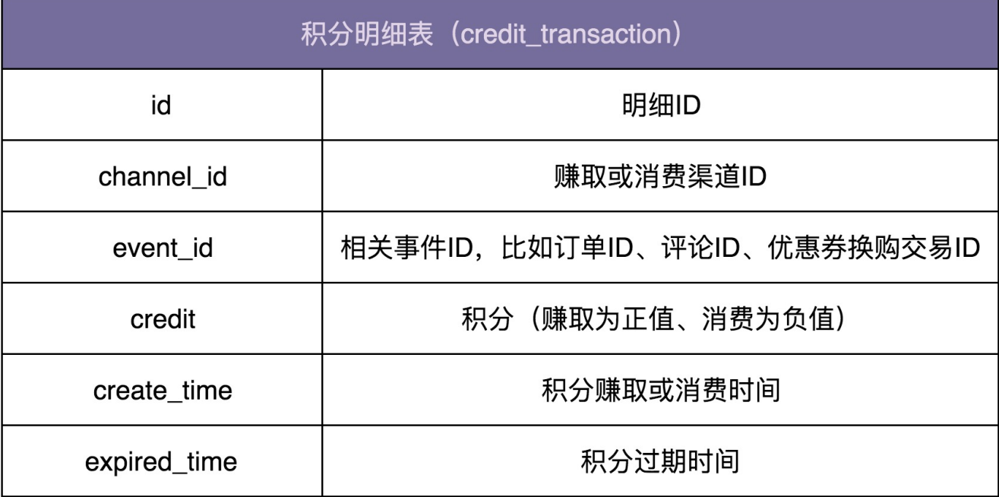
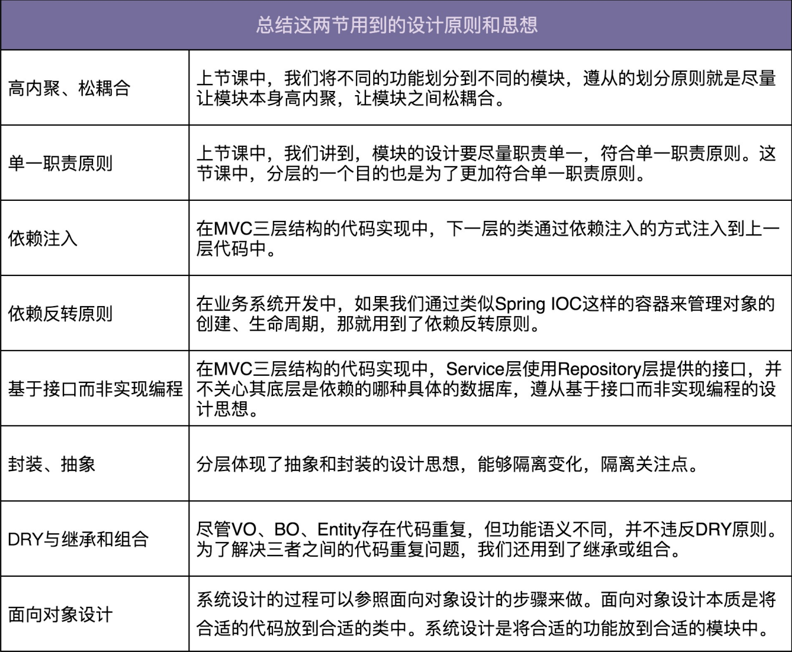
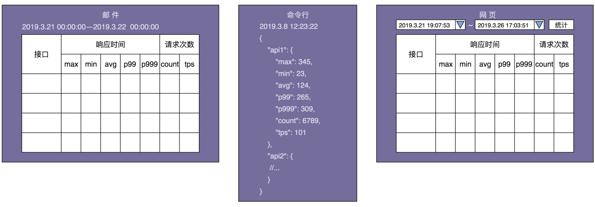

# 实战一（上）：针对业务系统的开发，如何做需求分析和设计？

对于一个工程师来说，如果要追求长远发展，你就不能一直只把自己放在执行者的角色，不 能只是一个代码实现者，你还要有独立负责一个系统的能力，能端到端（end to end）开 发一个完整的系统。这其中的工作就包括：前期的需求沟通分析、中期的代码设计实现、后 期的系统上线维护等。 前面我们还提到过，大部分工程师都是做业务开发的。很多工程师都觉得，做业务开发没啥 技术含量，没有成长，就是简单的 CRUD，翻译业务逻辑，根本用不上专栏中讲的设计原 则、思想、模式。

所以，针对这两个普遍的现象，今天，我通过一个积分兑换系统的开发实战，一方面给你展 示一个业务系统从需求分析到上线维护的整个开发套路，让你能举一反三地应用到所有其他 系统的开发中，另一方面也给你展示在看似没有技术含量的业务开发中，实际上都蕴含了哪 些设计原则、思想、模式。

## 需求分析

积分是一种常见的营销手段，很多产品都会通过它来促进消费、增加用户粘性，比如淘宝积 分、信用卡积分、商场消费积分等等。假设你是一家类似淘宝这样的电商平台的工程师，平 台暂时还没有积分系统。Leader 希望由你来负责开发这样一个系统，你会如何来做呢？ 你可能会说，只要产品经理给我产品设计文档（PRD）、线框图，我照着实现就可以了。 我觉得，这种想法有点狭隘。我认为，技术人员应该更多地参与到产品设计中。在 Google 工作的时候，我很明显能感受到，Google 工程师跟其他公司工程师有一个很大区别，那就 是大部分人都具备产品思维，并不是完全的“技术控”。所以，Google 很多产品的初期设 计都是工程师来完成的，在产品发展壮大到一定程度的时候，才会引入产品经理的角色。

作为技术人，我该怎么做产品设计呢？首先，一定不要自己一个人闷头 想。一方面，这样做很难想全面。另一方面，从零开始设计也比较浪费时间。所以，我们要 学会“借鉴”。爱因斯坦说过，“创造的一大秘诀是要懂得如何隐藏你的来源”。你看大师 都含蓄地表达了“借鉴”的重要性，我们也没有必要因为“借鉴”而感到不好意思了。 我们可以找几个类似的产品，比如淘宝，看看它们是如何设计积分系统的，然后借鉴到我们 的产品中。你可以自己亲自用用淘宝，看看积分是怎么使用的，也可以直接百度一下“淘宝 积分规则”。基于这两个输入，我们基本上就大致能摸清楚积分系统该如何设计了。除此之 外，我们还要充分了解自己公司的产品，将借鉴来的东西糅合在我们自己的产品中，并做适 当的微创新。

笼统地来讲，积分系统无外乎就两个大的功能点，一个是赚取积分，另一个是消费积分。赚 取积分功能包括积分赚取渠道，比如下订单、每日签到、评论等；还包括积分兑换规则，比 如订单金额与积分的兑换比例，每日签到赠送多少积分等。消费积分功能包括积分消费渠 道，比如抵扣订单金额、兑换优惠券、积分换购、参与活动扣积分等；还包括积分兑换规 则，比如多少积分可以换算成抵扣订单的多少金额，一张优惠券需要多少积分来兑换等等

我刚刚给出的只是非常笼统、粗糙的功能需求。在实际情况中，肯定还有一些业务细节需要 考虑，比如积分的有效期问题。对于这些业务细节，还是那句话，闷头拍脑袋想是想不全面 的。以防遗漏，我们还是要有方法可寻。那除了刚刚讲的“借鉴”的思路之外，我还喜欢通 过产品的线框图、用户用例（user case ）或者叫用户故事（user story）来细化业务流 程，挖掘一些比较细节的、不容易想到的功能点。 线框图对你来说应该不陌生，我就不赘述了，我这里重点说一下用户用例。用户用例有点儿 类似我们后面要讲的单元测试用例。它侧重情景化，其实就是模拟用户如何使用我们的产 品，描述用户在一个特定的应用场景里的一个完整的业务操作流程。所以，它包含更多的细 节，且更加容易被人理解。比如，有关积分有效期的用户用例，我们可以进行如下的设计：

用户在获取积分的时候，会告知积分的有效期； 

用户在使用积分的时候，会优先使用快过期的积分； 

用户在查询积分明细的时候，会显示积分的有效期和状态（是否过期）； 

用户在查询总可用积分的时候，会排除掉过期的积分

积分系统的需求实际上并不复 杂，我总结罗列了一下，如下所示。

1. 积分赚取和兑换规则 积分的赚取渠道包括：下订单、每日签到、评论等。对于积分的有效期，我们可以根据不同渠道，设置不同的有效期。积分到期之后会作废；在 消费积分的时候，优先使用快到期的积分。
2. 积分消费和兑换规则 积分的消费渠道包括：抵扣订单金额、兑换优惠券、积分换购、参与活动扣积分等。
3. 积分及其明细查询 查询用户的总积分，以及赚取积分和消费积分的历史记录。

## 系统设计

面向对象设计聚焦在代码层面（主要是针对类），那系统设计就是聚焦在架构层面（主要是 针对模块），两者有很多相似之处。很多设计原则和思想不仅仅可以应用到代码设计中，还 能用到架构设计中。还记得面向对象设计的四个步骤吗？实际上，我们也可以借鉴那个过程 来做系统设计。

**1.合理地将功能划分到不同模块** 前面讲到面向对象设计的时候，我们提到，面向对象设计的本质就是把合适的代码放到合适 的类中。合理地划分代码可以实现代码的高内聚、低耦合，类与类之间的交互简单清晰，代 码整体结构一目了然，那代码的质量就不会差到哪里去。类比面向对象设计，系统设计实际 上就是将合适的功能放到合适的模块中。合理地划分模块也可以做到模块层面的高内聚、低 耦合，架构整洁清晰。

对于前面罗列的所有功能点，我们有下面三种模块划分方法。 第一种划分方式是：积分赚取渠道及兑换规则、消费渠道及兑换规则的管理和维护（增删改 查），不划分到积分系统中，而是放到更上层的营销系统中。这样积分系统就会变得非常简 单，只需要负责增加积分、减少积分、查询积分、查询积分明细等这几个工作。 我举个例子解释一下。比如，用户通过下订单赚取积分。订单系统通过异步发送消息或者同 步调用接口的方式，告知营销系统订单交易成功。营销系统根据拿到的订单信息，查询订单 对应的积分兑换规则（兑换比例、有效期等），计算得到订单可兑换的积分数量，然后调用 积分系统的接口给用户增加积分。 

第二种划分方式是：积分赚取渠道及兑换规则、消费渠道及兑换规则的管理和维护，分散在 各个相关业务系统中，比如订单系统、评论系统、签到系统、换购商城、优惠券系统等。还是刚刚那个下订单赚取积分的例子，在这种情况下，用户下订单成功之后，订单系统根据商 品对应的积分兑换比例，计算所能兑换的积分数量，然后直接调用积分系统给用户增加积 分。

第三种划分方式是：所有的功能都划分到积分系统中，包括积分赚取渠道及兑换规则、消费 渠道及兑换规则的管理和维护。还是同样的例子，用户下订单成功之后，订单系统直接告知 积分系统订单交易成功，积分系统根据订单信息查询积分兑换规则，给用户增加积分。

怎么判断哪种模块划分合理呢？实际上，我们可以反过来通过看它是否符合高内聚、低耦合 特性来判断。如果一个功能的修改或添加，经常要跨团队、跨项目、跨系统才能完成，那说 明模块划分的不够合理，职责不够清晰，耦合过于严重。

除此之外，为了避免业务知识的耦合，让下层系统更加通用，一般来讲，我们不希望下层系 统（也就是被调用的系统）包含太多上层系统（也就是调用系统）的业务信息，但是，可以 接受上层系统包含下层系统的业务信息。比如，订单系统、优惠券系统、换购商城等作为调 用积分系统的上层系统，可以包含一些积分相关的业务信息。但是，反过来，积分系统中最 好不要包含太多跟订单、优惠券、换购等相关的信息。 

所以，综合考虑，我们更倾向于第一种和第二种模块划分方式。但是，不管选择这两种中的 哪一种，积分系统所负责的工作是一样的，只包含积分的增、减、查询，以及积分明细的记 录和查询。

**2.设计模块与模块之间的交互关系** 在面向对象设计中，类设计好之后，我们需要设计类之间的交互关系。类比到系统设计，系 统职责划分好之后，接下来就是设计系统之间的交互，也就是确定有哪些系统跟积分系统之 间有交互以及如何进行交互。 

比较常见的系统之间的交互方式有两种，一种是同步接口调用，另一种是利用消息中间件异 步调用。第一种方式简单直接，第二种方式的解耦效果更好。

比如，用户下订单成功之后，订单系统推送一条消息到消息中间件，营销系统订阅订单成功 消息，触发执行相应的积分兑换逻辑。这样订单系统就跟营销系统完全解耦，订单系统不需 要知道任何跟积分相关的逻辑，而营销系统也不需要直接跟订单系统交互。

除此之外，上下层系统之间的调用倾向于通过同步接口，同层之间的调用倾向于异步消息调 用。比如，营销系统和积分系统是上下层关系，它们之间就比较推荐使用同步接口调用。

**3.设计模块的接口、数据库、业务模型**

再来看，模块本身如何来设 计。实际上，业务系统本身的设计无外乎有这样三方面的工作要做：接口设计、数据库设计 和业务模型设计。这部分的具体内容我们放到下一下节课中跟实现一块进行讲解。

## 重点回顾

技术人也要有一些产品思维。对于产品设计、需求分析，我们要学会“借鉴”，一定不要自 己闷头想。一方面这样做很难想全面，另一方面从零开始设计也比较浪费时间。除此之外， 我们还可以通过线框图和用户用例来细化业务流程，挖掘一些比较细节的、不容易想到的功能点。

面向对象设计聚焦在代码层面（主要是针对类），那系统设计就是聚焦在架构层面（主要是 针对模块），两者有很多相似之处。很多设计原则和思想不仅仅可以应用到代码设计中，还 能用到架构设计中。实际上，我们可以借鉴面向对象设计的步骤，来做系统设计。

面向对象设计的本质就是把合适的代码放到合适的类中。合理地划分代码可以实现代码的高 内聚、低耦合，类与类之间的交互简单清晰，代码整体结构一目了然。类比面向对象设计， 系统设计实际上就是将合适的功能放到合适的模块中。合理地划分模块也可以做到模块层面 的高内聚、低耦合，架构整洁清晰。在面向对象设计中，类设计好之后，我们需要设计类之 间的交互关系。类比到系统设计，系统职责划分好之后，接下来就是设计系统之间的交互 了。

# 实战一（下）：如何实现一个遵从设计原则的积分兑换系统？

今天讲解的重点，并不是教你如何来实现积分系统的每个功能、每个接口，更不 是教你如何编写 SQL 语句来增删改查数据，而是给你展示一些更普适的开发思想。比如，为什么要分 MVC 三层来开发？为什么要针对每层定义不同的数据对象？最后，我还会总结 这其中都蕴含哪些设计原则和思想，让你知其然知其所以然，做到真正地透彻理解。

## 业务开发包括哪些工作？ 

实际上，我们平时做业务系统的设计与开发，无外乎有这样三方面的工作要做：接口设计、 数据库设计和业务模型设计（也就是业务逻辑）。 

数据库和接口的设计非常重要，一旦设计好并投入使用之后，这两部分都不能轻易改动。改 动数据库表结构，需要涉及数据的迁移和适配；改动接口，需要推动接口的使用者作相应的 代码修改。这两种情况，即便是微小的改动，执行起来都会非常麻烦。因此，我们在设计接 口和数据库的时候，一定要多花点心思和时间，切不可过于随意。相反，业务逻辑代码侧重 内部实现，不涉及被外部依赖的接口，也不包含持久化的数据，所以对改动的容忍性更大

针对积分系统，我们先来看，如何设计数据库。 数据库的设计比较简单。实际上，我们只需要一张记录积分流水明细的表就可以了。表中记 录积分的赚取和消费流水。用户积分的各种统计数据，比如总积分、总可用积分等，都可以 通过这张表来计算得到



再来看，如何设计积分系统的接口。 接口设计要符合单一职责原则，粒度越小通用性就越好。但是，接口粒度太小也会带来一些 问题。比如，一个功能的实现要调用多个小接口，一方面如果接口调用走网络（特别是公 网），多次远程接口调用会影响性能；另一方面，本该在一个接口中完成的原子操作，现在 分拆成多个小接口来完成，就可能会涉及分布式事务的数据一致性问题（一个接口执行成功 了，但另一个接口执行失败了）。所以，为了兼顾易用性和性能，我们可以借鉴 facade（外观）设计模式，在职责单一的细粒度接口之上，再封装一层粗粒度的接口给外 部使用。对于积分系统来说，我们需要设计如下这样几个接口。


最后，我们来看业务模型的设计。 前面我们讲到，从代码实现角度来说，大部分业务系统的开发都可以分为 Controller、 Service、Repository 三层。Controller 层负责接口暴露，Repository 层负责数据读写， Service 层负责核心业务逻辑，也就是这里说的业务模型。

最后，我们来看业务模型的设计。 前面我们讲到，从代码实现角度来说，大部分业务系统的开发都可以分为 Controller、 Service、Repository 三层。Controller 层负责接口暴露，Repository 层负责数据读写， Service 层负责核心业务逻辑，也就是这里说的业务模型。

从开发的角度来说，我们可以把积分系统作为一个独立的项目，来独立开发，也可以跟其他 业务代码（比如营销系统）放到同一个项目中进行开发。从运维的角度来说，我们可以将它 跟其他业务一块部署，也可以作为一个微服务独立部署。具体选择哪种开发和部署方式，我 们可以参考公司当前的技术架构来决定。 实际上，积分系统业务比较简单，代码量也不多，我更倾向于将它跟营销系统放到一个项目 中开发部署。只要我们做好代码的模块化和解耦，让积分相关的业务代码跟其他业务代码之 间边界清晰，没有太多耦合，后期如果需要将它拆分成独立的项目来开发部署，那也并不困难

## 为什么要分 MVC 三层开发？

大部分业务系统的开发都可以分为三层：Contoller 层、Service 层、 Repository 层。对于这种分层方式，我相信大部分人都很认同，甚至成为了一种开发习 惯，但你有没有想过，为什么我们要分层开发？很多业务都比较简单，一层代码搞定所有的 数据读取、业务逻辑、接口暴露不好吗？

**1.分层能起到代码复用的作用** 同一个 Repository 可能会被多个 Service 来调用，同一个 Service 可能会被多个 Controller 调用。比如，UserService 中的 getUserById() 接口封装了通过 ID 获取用户信 息的逻辑，这部分逻辑可能会被 UserController 和 AdminController 等多个 Controller 使用。如果没有 Service 层，每个 Controller 都要重复实现这部分逻辑，显然会违反 DRY 原则。

**2.分层能起到隔离变化的作用** 分层体现了一种抽象和封装的设计思想。比如，Repository 层封装了对数据库访问的操作，提供了抽象的数据访问接口。基于接口而非实现编程的设计思想，Service 层使用 Repository 层提供的接口，并不关心其底层依赖的是哪种具体的数据库。当我们需要替换数据库的时候，比如从 MySQL 到 Oracle，从 Oracle 到 Redis，只需要改动 Repository 层的代码，Service 层的代码完全不需要修改。

除此之外，Controller、Service、Repository 三层代码的稳定程度不同、引起变化的原因 不同，所以分成三层来组织代码，能有效地隔离变化。比如，Repository 层基于数据库 表，而数据库表改动的可能性很小，所以 Repository 层的代码最稳定，而 Controller 层 提供适配给外部使用的接口，代码经常会变动。分层之后，Controller 层中代码的频繁改 动并不会影响到稳定的 Repository 层

**3.分层能起到隔离关注点的作用** Repository 层只关注数据的读写。Service 层只关注业务逻辑，不关注数据的来源。 Controller 层只关注与外界打交道，数据校验、封装、格式转换，并不关心业务逻辑。三 层之间的关注点不同，分层之后，职责分明，更加符合单一职责原则，代码的内聚性更好。

**4.分层能提高代码的可测试性** 后面讲单元测试的时候，我们会讲到，单元测试不依赖不可控的外部组件，比如数据库。分层之后，Repsitory 层的代码通过依赖注入的方式供 Service 层使用，当要测试包含核心业 务逻辑的 Service 层代码的时候，我们可以用 mock 的数据源替代真实的数据库，注入到 Service 层代码中。代码的可测试性和单元测试我们后面会讲到，这里你稍微了解即可。 

**5.分层能应对系统的复杂性** 所有的代码都放到一个类中，那这个类的代码就会因为需求的迭代而无限膨胀。我们知道， 当一个类或一个函数的代码过多之后，可读性、可维护性就会变差。那我们就要想办法拆 分。拆分有垂直和水平两个方向。水平方向基于业务来做拆分，就是模块化；垂直方向基于流程来做拆分，就是这里说的分层。 还是那句话，不管是分层、模块化，还是 OOP、DDD，以及各种设计模式、原则和思想， 都是为了应对复杂系统，应对系统的复杂性。对于简单系统来说，其实是发挥不了作用的， 就是俗话说的“杀鸡焉用牛刀”。

## BO、VO、Entity 存在的意义是什么？ 

在前面的章节中，我们提到，针对 Controller、Service、Repository 三层，每层都会定义 相应的数据对象，它们分别是 VO（View Object）、BO（Business Object）、Entity， 例如 UserVo、UserBo、UserEntity。在实际的开发中，VO、BO、Entity 可能存在大量的 重复字段，甚至三者包含的字段完全一样。在开发的过程中，我们经常需要重复定义三个几 乎一样的类，显然是一种重复劳动。

**相对于每层定义各自的数据对象来说，是不是定义一个公共的数据对象更好些呢？**实际上，我更加推荐每层都定义各自的数据对象这种设计思路，主要有以下 3 个方面的原因

VO、BO、Entity 并非完全一样。比如，我们可以在 UserEntity、UserBo 中定义 Password 字段，但显然不能在 UserVo 中定义 Password 字段，否则就会将用户的密 码暴露出去。 

VO、BO、Entity 三个类虽然代码重复，但功能语义不重复，从职责上讲是不一样的。 所以，也并不能算违背 DRY 原则。在前面讲到 DRY 原则的时候，针对这种情况，如果 合并为同一个类，那也会存在后期因为需求的变化而需要再拆分的问题。 

为了尽量减少每层之间的耦合，把职责边界划分明确，每层都会维护自己的数据对象， 层与层之间通过接口交互。数据从下一层传递到上一层的时候，将下一层的数据对象转 化成上一层的数据对象，再继续处理。虽然这样的设计稍微有些繁琐，每层都需要定义 各自的数据对象，需要做数据对象之间的转化，但是分层清晰。对于非常大的项目来 说，结构清晰是第一位的

**既然 VO、BO、Entity 不能合并，那如何解决代码重复的问题呢？**

从设计的角度来说，VO、BO、Entity 的设计思路并不违反 DRY 原则，为了分层清晰、减 少耦合，多维护几个类的成本也并不是不能接受的。但是，如果你真的有代码洁癖，对于代 码重复的问题，我们也有一些办法来解决。 

我们前面讲到，继承可以解决代码重复问题。我们可以将公共的字段定义在父类中，让 VO、BO、Entity 都继承这个父类，各自只定义特有的字段。因为这里的继承层次很浅，也 不复杂，所以使用继承并不会影响代码的可读性和可维护性。后期如果因为业务的需要，有 些字段需要从父类移动到子类，或者从子类提取到父类，代码改起来也并不复杂。 

前面在讲“多用组合，少用继承”设计思想的时候，我们提到，组合也可以解决代码重复的 问题，所以，这里我们还可以将公共的字段抽取到公共的类中，VO、BO、Entity 通过组合 关系来复用这个类的代码。

**代码重复问题解决了，那不同分层之间的数据对象该如何互相转化呢？**

当下一层的数据通过接口调用传递到上一层之后，我们需要将它转化成上一层对应的数据对 象类型。比如，Service 层从 Repository 层获取的 Entity 之后，将其转化成 BO，再继续 业务逻辑的处理。所以，整个开发的过程会涉及“Entity 到 BO”和“BO 到 VO”这两种 转化。

最简单的转化方式是手动复制。自己写代码在两个对象之间，一个字段一个字段的赋值。但 这样的做法显然是没有技术含量的低级劳动。Java 中提供了多种数据对象转化工具，比如 BeanUtils、Dozer 等，可以大大简化繁琐的对象转化工作。如果你是用其他编程语言来做 开发，也可以借鉴 Java 这些工具类的设计思路，自己在项目中实现对象转化工具类。

VO、BO、Entity 都是基于贫血模型的，而且为了兼容框架或开发库（比如 MyBatis、 Dozer、BeanUtils），我们还需要定义每个字段的 set 方法。这些都违背 OOP 的封装特 性，会导致数据被随意修改。那到底该怎么办好呢？ 

前面我们也提到过，Entity 和 VO 的生命周期是有限的，都仅限在本层范围内。而对应的 Repository 层和 Controller 层也都不包含太多业务逻辑，所以也不会有太多代码随意修改 数据，即便设计成贫血、定义每个字段的 set 方法，相对来说也是安全的。 

不过，Service 层包含比较多的业务逻辑代码，所以 BO 就存在被任意修改的风险了。但 是，设计的问题本身就没有最优解，只有权衡。为了使用方便，我们只能做一些妥协，放弃 BO 的封装特性，由程序员自己来负责这些数据对象的不被错误使用。

## 总结用到的设计原则和思想

## 重点回顾

1.为什么要分 MVC 三层开发？分层能起到代码复用的作用 分层能起到隔离变化的作用 分层能起到隔离关注点的作用 分层能提高代码的可测试性 分层能应对系统的复杂性

2.BO、VO、Entity 存在的意义是什么？ 从设计的角度来说，VO、BO、Entity 的设计思路并不违反 DRY 原则，为了分层清晰、减 少耦合，多维护几个类的成本也并不是不能接受的。但是，如果你真的有代码洁癖，对于代 码重复的问题，我们可以通过继承或者组合来解决。 如何进行数据对象之间的转化？最简单的方式就是手动复制。当然，你也可以使用 Java 中 提供了数据对象转化工具，比如 BeanUtils、Dozer 等，可以大大简化繁琐的对象转化工 作。 尽管 VO、BO、Entity 的设计违背 OOP 的封装特性，有被随意修改的风险。但 Entity 和 VO 的生命周期是有限的，都仅限在本层范围内，相对来说是安全的。Service 层包含比较 多的业务逻辑代码，所以 BO 就存在被任意修改的风险了。为了使用方便，我们只能做一 些妥协，放弃 BO 的封装特性，由程序员自己来负责这些数据对象的不被错误使用。

3.总结用到的设计原则和思想 从表面上看，做业务开发可能并不是特别有技术挑战，但是实际上，如果你要做到知其然 知其所以然，做到透彻理解、真的懂，并不是件容易的事情。深挖一下，你会发现这其中还 是蕴含了很多设计原则、思想和模式的。

# 实战二（上）：针对非业务的通用框架开发，如何做需求分析和 设计？

再结合一个支持 各种统计规则的性能计数器项目，学习针对一个非业务的通用框架开发，如何来做需求分 析、设计和实现，同时学习如何灵活应用各种设计原则。

## 项目背景

开发一个小的框架，能够获取接口调用的各种统计信息，比如，响应时间的最 大值（max）、最小值（min）、平均值（avg）、百分位值（percentile）、接口调用次 数（count）、频率（tps） 等，并且支持将统计结果以各种显示格式（比如：JSON 格 式、网页格式、自定义显示格式等）输出到各种终端（Console 命令行、HTTP 网页、 Email、日志文件、自定义输出终端等），以方便查看。

如果让你来负责开发这样一个通用的框架，应用 到各种业务系统中，支持实时计算、查看数据的统计信息，你会如何设计和实现呢？

## 需求分析

性能计数器作为一个跟业务无关的功能，我们完全可以把它开发成一个独立的框架或者类 库，集成到很多业务系统中。而作为可被复用的框架，除了功能性需求之外，非功能性需求 也非常重要。所以，接下来，我们从这两个方面来做需求分析。

**1.功能性需求分析** 相对于一大长串的文字描述，人脑更容易理解短的、罗列的比较规整、分门别类的列表信 息。显然，刚才那段需求描述不符合这个规律。我们需要把它拆解成一个一个的“干条 条”。拆解之后我写在下面了，是不是看起来更加清晰、有条理？

接口统计信息：包括接口响应时间的统计信息，以及接口调用次数的统计信息等。 

统计信息的类型：max、min、avg、percentile、count、tps 等。 

统计信息显示格式：Json、Html、自定义显示格式。 

统计信息显示终端：Console、Email、HTTP 网页、日志、自定义显示终端。

除此之外，我们还可以借助设计产品的时候，经常用到的线框图，把最终数据的显示样式画出来，会更加一目了然。具体的线框图如下所示：



实际上，从线框图中，我们还能挖掘出了下面几个隐藏的需求。

统计触发方式：包括主动和被动两种。主动表示以一定的频率定时统计数据，并主动推 送到显示终端，比如邮件推送。被动表示用户触发统计，比如用户在网页中选择要统计 的时间区间，触发统计，并将结果显示给用户。 

统计时间区间：框架需要支持自定义统计时间区间，比如统计最近 10 分钟的某接口的 tps、访问次数，或者统计 12 月 11 日 00 点到 12 月 12 日 00 点之间某接口响应时间 的最大值、最小值、平均值等。 

统计时间间隔：对于主动触发统计，我们还要支持指定统计时间间隔，也就是多久触发 一次统计显示。比如，每间隔 10s 统计一次接口信息并显示到命令行中，每间隔 24 小 时发送一封统计信息邮件。

**2.非功能性需求分析** 对于这样一个通用的框架的开发，我们还需要考虑很多非功能性的需求。具体来讲，我总结 了以下几个比较重要的方面。

易用性，听起来更像是一个评判产品的标准。没错，我们在开发这样一个技术框架的时候，也 要有产品意识。框架是否易集成、易插拔、跟业务代码是否松耦合、提供的接口是否够灵活 等等，都是我们应该花心思去思考和设计的。有的时候，文档写得好坏甚至都有可能决定一 个框架是否受欢迎。

性能，对于需要集成到业务系统的框架来说，我们不希望框架本身的代码执行效率，对业务系统有 太多性能上的影响。对于性能计数器这个框架来说，一方面，我们希望它是低延迟的，也就 是说，统计代码不影响或很少影响接口本身的响应时间；另一方面，我们希望框架本身对内 存的消耗不能太大。

扩展性，这里说的扩展性跟之前讲到的代码的扩展性有点类似，都是指在不修改或尽量少修改代码的 情况下添加新的功能。但是这两者也有区别。之前讲到的扩展是从框架代码开发者的角度来 说的。这里所说的扩展是从框架使用者的角度来说的，特指使用者可以在不修改框架源码， 甚至不拿到框架源码的情况下，为框架扩展新的功能。这就有点类似给框架开发插件。关于 这一点，我举一个例子来解释一下。

feign 是一个 HTTP 客户端框架，我们可以在不修改框架源码的情况下，用如下方式来扩展 我们自己的编解码方式、日志、拦截器等。

```java
Feign feign = Feign.builder()
.logger(new CustomizedLogger())
.encoder(new FormEncoder(new JacksonEncoder()))
.decoder(new JacksonDecoder())
.errorDecoder(new ResponseErrorDecoder())
.requestInterceptor(new RequestHeadersInterceptor()).build();

public class RequestHeadersInterceptor implements RequestInterceptor {
@Override
public void apply(RequestTemplate template) {
template.header("appId", "...");
template.header("version", "...");
template.header("timestamp", "...");
template.header("token", "...");
template.header("idempotent-token", "...");
template.header("sequence-id", "...");
}
public class CustomizedLogger extends feign.Logger {
//...
}
public class ResponseErrorDecoder implements ErrorDecoder {
@Override
public Exception decode(String methodKey, Response response) {
//...
}
}
```

容错性这一点也非常重要。对于性能计数器框架来说，不能因为框架本身的异常导致接口请 求出错。所以，我们要对框架可能存在的各种异常情况都考虑全面，对外暴露的接口抛出的 所有运行时、非运行时异常都进行捕获处理。

为了提高框架的复用性，能够灵活应用到各种场景中。框架在设计的时候，要尽可能通用。 我们要多去思考一下，除了接口统计这样一个需求，还可以适用到其他哪些场景中，比如是 否还可以处理其他事件的统计信息，比如 SQL 请求时间的统计信息、业务统计信息（比如 支付成功率）等。

## 框架设计

如何针对需求做框架设计。 对于稍微复杂系统的开发，很多人觉得不知从何开始。我个人喜欢借鉴 TDD（测试驱动开 发）和 Prototype（最小原型）的思想，先聚焦于一个简单的应用场景，基于此设计实现 一个简单的原型。尽管这个最小原型系统在功能和非功能特性上都不完善，但它能够看得 见、摸得着，比较具体、不抽象，能够很有效地帮助我缕清更复杂的设计思路，是迭代设计 的基础。

这就好比做算法题目。当我们想要一下子就想出一个最优解法时，可以先写几组测试数据， 找找规律，再先想一个最简单的算法去解决它。虽然这个最简单的算法在时间、空间复杂度 上可能都不令人满意，但是我们可以基于此来做优化，这样思路就会更加顺畅。

对于性能计数器这个框架的开发来说，我们可以先聚焦于一个非常具体、简单的应用场景， 比如统计用户注册、登录这两个接口的响应时间的最大值和平均值、接口调用次数，并且将统计结果以 JSON 的格式输出到命令行中。现在这个需求简单、具体、明确，设计实现起 来难度降低了很多。

先给出应用场景的代码。具体如下所示：

```java
// 应用场景：统计下面两个接口 (注册和登录）的响应时间和访问次数
public class UserController {
public void register(UserVo user) {
//...
}
public UserVo login(String telephone, String password) {
//...
}
}
```

要输出接口的响应时间的最大值、平均值和接口调用次数，我们首先要采集每次接口请求的 响应时间，并且存储起来，然后按照某个时间间隔做聚合统计，最后才是将结果输出。在原 型系统的代码实现中，我们可以把所有代码都塞到一个类中，暂时不用考虑任何代码质量、 线程安全、性能、扩展性等等问题，怎么简单怎么来就行。 最小原型的代码实现如下所示。其中，recordResponseTime() 和 recordTimestamp() 两 个函数分别用来记录接口请求的响应时间和访问时间。startRepeatedReport() 函数以指定 的频率统计数据并输出结果。

```java
public class Metrics {
    // Map 的 key 是接口名称，value 对应接口请求的响应时间或时间戳；
    private Map<String, List<Double>> responseTimes = new HashMap<>();
    private Map<String, List<Double>> timestamps = new HashMap<>();
    private ScheduledExecutorService executor = Executors.newSingleThreadSchedule
    public void recordResponseTime(String apiName, double responseTime) {
    responseTimes.putIfAbsent(apiName, new ArrayList<>());
    responseTimes.get(apiName).add(responseTime);
    }
    public void recordTimestamp(String apiName, double timestamp) {
    timestamps.putIfAbsent(apiName, new ArrayList<>());
    timestamps.get(apiName).add(timestamp);
    }
    public void startRepeatedReport(long period, TimeUnit unit){
    executor.scheduleAtFixedRate(new Runnable() {
    @Override
    public void run() {
    Gson gson = new Gson();
    Map<String, Map<String, Double>> stats = new HashMap<>();
    for (Map.Entry<String, List<Double>> entry : responseTimes.entrySet())
    String apiName = entry.getKey();
    List<Double> apiRespTimes = entry.getValue();
    stats.putIfAbsent(apiName, new HashMap<>());
    stats.get(apiName).put("max", max(apiRespTimes));
    stats.get(apiName).put("avg", avg(apiRespTimes));
    }
    for (Map.Entry<String, List<Double>> entry : timestamps.entrySet()) {
    String apiName = entry.getKey();
    List<Double> apiTimestamps = entry.getValue();
    stats.putIfAbsent(apiName, new HashMap<>());
    stats.get(apiName).put("count", (double)apiTimestamps.size());
    }
    System.out.println(gson.toJson(stats));
    }
    }, 0, period, unit);
    }
    private double max(List<Double> dataset) {// 省略代码实现}
    private double avg(List<Double> dataset) {// 省略代码实现}
}

```

不到 50 行代码就实现了最小原型。接下来，我们再来看，如何用它来统计注册、 登录接口的响应时间和访问次数。具体的代码如下所示：

```java
// 应用场景：统计下面两个接口 (注册和登录）的响应时间和访问次数
public class UserController {
private Metrics metrics = new Metrics();
public UserController() {
metrics.startRepeatedReport(60, TimeUnit.SECONDS);
}
public void register(UserVo user) {
long startTimestamp = System.currentTimeMillis();
metrics.recordTimestamp("regsiter", startTimestamp);
//...
long respTime = System.currentTimeMillis() - startTimestamp;
metrics.recordResponseTime("register", respTime);
}
public UserVo login(String telephone, String password) {
long startTimestamp = System.currentTimeMillis();
metrics.recordTimestamp("login", startTimestamp);
//...
long respTime = System.currentTimeMillis() - startTimestamp;
metrics.recordResponseTime("login", respTime);
}
}
```

最小原型的代码实现虽然简陋，但它却帮我们将思路理顺了很多，我们现在就基于它做最终 的框架设计。下面是我针对性能计数器框架画的一个粗略的系统设计图。图可以非常直观地 体现设计思想，并且能有效地帮助我们释放更多的脑空间，来思考其他细节问题。


如图所示，我们把整个框架分为四个模块：数据采集、存储、聚合统计、显示。每个模块负责的工作简单罗列如下。

数据采集：负责打点采集原始数据，包括记录每次接口请求的响应时间和请求时间。数据采集过程要高度容错，不能影响到接口本身的可用性。除此之外，因为这部分功能是暴露给框架的使用者的，所以在设计数据采集 API 的时候，我们也要尽量考虑其易用性。 

存储：负责将采集的原始数据保存下来，以便后面做聚合统计。数据的存储方式有多 种，比如：Redis、MySQL、HBase、日志、文件、内存等。数据存储比较耗时，为了 尽量地减少对接口性能（比如响应时间）的影响，采集和存储的过程异步完成。 

聚合统计：负责将原始数据聚合为统计数据，比如：max、min、avg、pencentile、 count、tps 等。为了支持更多的聚合统计规则，代码希望尽可能灵活、可扩展

显示：负责将统计数据以某种格式显示到终端，比如：输出到命令行、邮件、网页、自 定义显示终端等。

前面讲到面向对象分析、设计和实现的时候，我们讲到设计阶段最终输出的是类的设计，同 时也讲到，软件设计开发是一个迭代的过程，分析、设计和实现这三个阶段的界限划分并不 明显。所以，今天我们只给出了比较粗略的模块划分，至于更加详细的设计，我们留在下一 节课中跟实现一块来讲解。

## 重点回顾 

对于非业务通用框架的开发，我们在做需求分析的时候，除了功能性需求分析之外，还需要考虑框架的非功能性需求。比如，框架的易用性、性能、扩展性、容错性、通用性等。 

对于复杂框架的设计，很多人往往觉得无从下手。今天我们分享了几个小技巧，其中包括： 画产品线框图、聚焦简单应用场景、设计实现最小原型、画系统设计图等。这些方法的目的 都是为了让问题简化、具体、明确，提供一个迭代设计开发的基础，逐步推进。 

实际上，不仅仅是软件设计开发，不管做任何事情，如果我们总是等到所有的东西都想好了 再开始，那这件事情可能永远都开始不了。有句老话讲：万事开头难，所以，先迈出第一步 很重要。

# 实战二（下）：如何实现一个支持各种统计规则的性能计数器？

在上一节课中，我们对计数器框架做了需求分析和粗略的模块划分。今天这节课，我们利用 面向对象设计、实现方法，并结合之前学过的设计思想、设计原则来看一下，如何编写灵 活、可扩展的、高质量的代码实现。

## 小步快跑、逐步迭代

虽然上一节课的最小原型为我们奠定了迭代开发的基础，但离我们最终期望的框架的样子还 有很大的距离。我自己在写这篇文章的时候，试图去实现上面罗列的所有功能需求，希望写 出一个完美的框架，发现这是件挺烧脑的事情，在写代码的过程中，一直有种“脑子不够 使”的感觉。我这个有十多年工作经验的人尚且如此，对于没有太多经验的开发者来说，想 一下子把所有需求都实现出来，更是一件非常有挑战的事情。一旦无法顺利完成，你可能就 会有很强的挫败感，就会陷入自我否定的情绪中。

即便你有能力将所有需求都实现，可能也要花费很大的设计精力和开发时间，迟迟没 有产出，你的 leader 会因此产生很强的不可控感。对于现在的互联网项目来说，小步快 跑、逐步迭代是一种更好的开发模式。所以，我们应该分多个版本逐步完善这个框架。第一个版本可以先实现一些基本功能，对于更高级、更复杂的功能，以及非功能性需求不做过高 的要求，在后续的 v2.0、v3.0……版本中继续迭代优化。

针对这个框架的开发，我们在 v1.0 版本中，暂时只实现下面这些功能。剩下的功能留在 v2.0、v3.0 版本，也就是我们后面的第 39 节和第 40 节课中再来讲解。

数据采集：负责打点采集原始数据，包括记录每次接口请求的响应时间和请求时间。 

存储：负责将采集的原始数据保存下来，以便之后做聚合统计。数据的存储方式有很多 种，我们暂时只支持 Redis 这一种存储方式，并且，采集与存储两个过程同步执行。 

聚合统计：负责将原始数据聚合为统计数据，包括响应时间的最大值、最小值、平均 值、99.9 百分位值、99 百分位值，以及接口请求的次数和 tps。 

显示：负责将统计数据以某种格式显示到终端，暂时只支持主动推送给命令行和邮件。 命令行间隔 n 秒统计显示上 m 秒的数据（比如，间隔 60s 统计上 60s 的数据）。邮件每日统计上日的数据

## 面向对象设计与实现

在第 13 节和第 14 节课中，我们把面向对象设计与实现分开来讲解，界限划分比较明显。在实际的软件开发中，这两个过程往往是交叉进行的。一般是先有一个粗糙的设计，然 后着手实现，实现的过程发现问题，再回过头来补充修改设计。所以，对于这个框架的开发 来说，我们把设计和实现放到一块来讲解。 回顾上一节课中的最小原型的实现，所有的代码都耦合在一个类中，这显然是不合理的。接 下来，我们就按照之前讲的面向对象设计的几个步骤，来重新划分、设计类。

**1.划分职责进而识别出有哪些类** 根据需求描述，我们先大致识别出下面几个接口或类。

MetricsCollector 类负责提供 API，来采集接口请求的原始数据。我们可以为 MetricsCollector 抽象出一个接口，但这并不是必须的，因为暂时我们只能想到一个 MetricsCollector 的实现方式。

 MetricsStorage 接口负责原始数据存储，RedisMetricsStorage 类实现 MetricsStorage 接口。这样做是为了今后灵活地扩展新的存储方法，比如用 HBase 来 存储。 

Aggregator 类负责根据原始数据计算统计数据。 

ConsoleReporter 类、EmailReporter 类分别负责以一定频率统计并发送统计数据到命令行和邮件。至于 ConsoleReporter 和 EmailReporter 是否可以抽象出可复用的抽象 类，或者抽象出一个公共的接口，我们暂时还不能确定

**2.定义类及类与类之间的关系** 定义类及属性和方法，定义类与类之间的关系。这两步没法分得很开，所以，我 们今天将它们合在一起来讲解。

大致地识别出几个核心的类之后，我的习惯性做法是，先在 IDE 中创建好这几个类，然后 开始试着定义它们的属性和方法。在设计类、类与类之间交互的时候，我会不断地用之前学 过的设计原则和思想来审视设计是否合理，比如，是否满足单一职责原则、开闭原则、依赖 注入、KISS 原则、DRY 原则、迪米特法则，是否符合基于接口而非实现编程思想，代码是 否高内聚、低耦合，是否可以抽象出可复用代码等等。

MetricsCollector 类的定义非常简单，具体代码如下所示。对比上一节课中最小原型的代 码，MetricsCollector 通过引入 RequestInfo 类来封装原始数据信息，用一个采集函数代 替了之前的两个函数。

```java
public class MetricsCollector {
    private MetricsStorage metricsStorageg;;// 基于接口而非实现编程
    // 依赖注入
    public MetricsCollector(MetricsStorage metricsStorage) {
    this.metricsStorage = metricsStorage;
    }
    // 用一个函数代替了最小原型中的两个函数
    public void recordRequest(RequestInfo requestInfo) {
    if (requestInfo == null || StringUtils.isBlank(requestInfo.getApiName())) {
    return;
    }
    metricsStorage.saveRequestInfo(requestInfo);
    }
}

public class RequestInfo {
private String apiName;
private double responseTime;
private long timestamp;
//... 省略 constructor/getter/setter 方法...
}
```

MetricsStorage 类和 RedisMetricsStorage 类的属性和方法也比较明确。具体的代码实现 如下所示。注意，一次性取太长时间区间的数据，可能会导致拉取太多的数据到内存中，有 可能会撑爆内存。对于 Java 来说，就有可能会触发 OOM（Out Of Memory）。而且， 即便不出现 OOM，内存还够用，但也会因为内存吃紧，导致频繁的 Full GC，进而导致 系统接口请求处理变慢，甚至超时。

```java
public interface MetricsStorage {
void saveRequestInfo(RequestInfo requestInfo);
List<RequestInfo> getRequestInfos(String apiName, long startTimeInMillis, lon
Map<String, List<RequestInfo>> getRequestInfos(long startTimeInMillis, long endTimeInMillis);
}
                                  
public class RedisMetricsStorage implements MetricsStorage {
//... 省略属性和构造函数等...
@Override
public void saveRequestInfo(RequestInfo requestInfo) {
//...
}
@Override
public List<RequestInfo> getRequestInfos(String apiName, long startTimestamp
//...
}
@Override
public Map<String, List<RequestInfo>> getRequestInfos(long startTimestamp, lo
//...
}
}

```

MetricsCollector 类和 MetricsStorage 类的设计思路比较简单，不同的人给出的设计结果 应该大差不差。但是，统计和显示这两个功能就不一样了，可以有多种设计思路。实际上， 如果我们把统计显示所要完成的功能逻辑细分一下的话，主要包含下面 4 点：

1. 根据给定的时间区间，从数据库中拉取数据； 
2. 根据原始数据，计算得到统计数据；
3. 将统计数据显示到终端（命令行或邮件）；
4. 定时触发以上 3 个过程的执行。

一句话总结一下的话，面向对象设计和实现要做的事情，就是把合适的代码 放到合适的类中。所以，我们现在要做的工作就是，把以上的 4 个功能逻辑划分到几个类 中。划分的方法有很多种，比如，我们可以把前两个逻辑放到一个类中，第 3 个逻辑放到 另外一个类中，第 4 个逻辑作为上帝类（God Class）组合前面两个类来触发前 3 个逻辑 的执行。当然，我们也可以把第 2 个逻辑单独放到一个类中，第 1、3、4 都放到另外一个 类中。

到底选择哪种排列组合方式，判定的标准是，让代码尽量地满足低耦合、高内聚、单一 职责、对扩展开放对修改关闭等之前讲到的各种设计原则和思想，尽量地让设计满足代码易 复用、易读、易扩展、易维护。

暂时选择把第 1、3、4 逻辑放到 ConsoleReporter 或 EmailReporter 类中，把第 2 个逻辑放到 Aggregator 类中。其中，Aggregator 类负责的逻辑比较简单，我们把它设计 成只包含静态方法的工具类。具体的代码实现如下所示：

```java
public class Aggregator {
    public static RequestStat aggregate(List<RequestInfo> requestInfos, long dura
        double maxRespTime = Double.MIN_VALUE;
        double minRespTime = Double.MAX_VALUE;
        double avgRespTime = -1;
        double p999RespTime = -1;
        double p99RespTime = -1;
        double sumRespTime = 0;
        long count = 0;
        for (RequestInfo requestInfo : requestInfos) {
        ++count;
        double respTime = requestInfo.getResponseTime();
        if (maxRespTime < respTime) {
        maxRespTime = respTime;
        }
        if (minRespTime > respTime) {
        minRespTime = respTime;
        }
        sumRespTime += respTime;
        }
        if (count != 0) {
        avgRespTime = sumRespTime / count;
        }
        long tps = (long)(count / durationInMillis * 1000);
        Collections.sort(requestInfos, new Comparator<RequestInfo>() {
        @Override
            public int compare(RequestInfo o1, RequestInfo o2) {
                double diff = o1.getResponseTime() - o2.getResponseTime();
                if (diff < 0.0) {
                	return -1;
                } else if (diff > 0.0) {
               		return 1;
                } else {
                	return 0;
            }
        }
    });
    int idx999 = (int)(count * 0.999);
    int idx99 = (int)(count * 0.99);
    if (count != 0) {
        p999RespTime = requestInfos.get(idx999).getResponseTime();
        p99RespTime = requestInfos.get(idx99).getResponseTime();
    }
    RequestStat requestStat = new RequestStat();
    requestStat.setMaxResponseTime(maxRespTime);
    requestStat.setMinResponseTime(minRespTime);
    requestStat.setAvgResponseTime(avgRespTime);
    requestStat.setP999ResponseTime(p999RespTime);
    requestStat.setP99ResponseTime(p99RespTime);
    requestStat.setCount(count);
    requestStat.setTps(tps);
    return requestStat;
    }
}
public class RequestStat {
    private double maxResponseTime;
    private double minResponseTime;
    private double avgResponseTime;
    private double p999ResponseTime;
    private double p99ResponseTime;
    private long count;
    private long tps;
    //... 省略 getter/setter 方法...
}
```

ConsoleReporter 类相当于一个上帝类，定时根据给定的时间区间，从数据库中取出数 据，借助 Aggregator 类完成统计工作，并将统计结果输出到命令行。具体的代码实现如下所示：

```java
public class ConsoleReporter {
    private MetricsStorage metricsStorage;
    private ScheduledExecutorService executor;
    public ConsoleReporter(MetricsStorage metricsStorage) {
        this.metricsStorage = metricsStorage;
        this.executor = Executors.newSingleThreadScheduledExecutor();
    }
    // 第 4 个代码逻辑：定时触发第 1、2、3 代码逻辑的执行；
    public void startRepeatedReport(long periodInSeconds, long durationInSeconds)
    executor.scheduleAtFixedRate(new Runnable() {
        @Override
        public void run() {
        // 第 1 个代码逻辑：根据给定的时间区间，从数据库中拉取数据；
            long durationInMillis = durationInSeconds * 1000;
            long endTimeInMillis = System.currentTimeMillis();
            long startTimeInMillis = endTimeInMillis - durationInMillis;
            Map<String, List<RequestInfo>> requestInfos =
            metricsStorage.getRequestInfos(startTimeInMillis, endTimeInMill);
            Map<String, RequestStat> stats = new HashMap<>();
            for (Map.Entry<String, List<RequestInfo>> entry : requestInfos.entrySet
                String apiName = entry.getKey();
                List<RequestInfo> requestInfosPerApi = entry.getValue();
                // 第 2 个代码逻辑：根据原始数据，计算得到统计数据；
                RequestStat requestStat = Aggregator.aggregate(requestInfosPerApi, du
                stats.put(apiName, requestStat);
            }
            // 第 3 个代码逻辑：将统计数据显示到终端（命令行或邮件）；
            System.out.println("Time Span: [" + startTimeInMillis + ", " + endTimeI
            Gson gson = new Gson();
            System.out.println(gson.toJson(stats));
			}
        }, 0, periodInSeconds, TimeUnit.SECONDS);
    }
}
                                                            
public class EmailReporter {
    private static final Long DAY_HOURS_IN_SECONDS = 86400L;
    private MetricsStorage metricsStorage;
    private EmailSender emailSender;
    private List<String> toAddresses = new ArrayList<>();
    public EmailReporter(MetricsStorage metricsStorage) {
    	this(metricsStorage, new EmailSender(/* 省略参数 */));
    }
    public EmailReporter(MetricsStorage metricsStorage, EmailSender emailSender)
        this.metricsStorage = metricsStorage;
        this.emailSender = emailSender;
    }
    public void addToAddress(String address) {
    	toAddresses.add(address);
    }
    public void startDailyReport() {
        Calendar calendar = Calendar.getInstance();
        calendar.add(Calendar.DATE, 1);
        calendar.set(Calendar.HOUR_OF_DAY, 0);
        calendar.set(Calendar.MINUTE, 0);
        calendar.set(Calendar.SECOND, 0);
        calendar.set(Calendar.MILLISECOND, 0);
        Date firstTime = calendar.getTime();
        Timer timer = new Timer();
        timer.schedule(new TimerTask() {
            @Override
            public void run() {
                long durationInMillis = DAY_HOURS_IN_SECONDS * 1000;
                long endTimeInMillis = System.currentTimeMillis();
                long startTimeInMillis = endTimeInMillis - durationInMillis;
                Map<String, List<RequestInfo>> requestInfos =
                metricsStorage.getRequestInfos(startTimeInMillis, endTimeInMill
                Map<String, RequestStat> stats = new HashMap<>();
                for (Map.Entry<String, List<RequestInfo>> entry : requestInfos.entrySet
                String apiName = entry.getKey();
                    List<RequestInfo> requestInfosPerApi = entry.getValue();
                    RequestStat requestStat = Aggregator.aggregate(requestInfosPerApi, du
                    stats.put(apiName, requestStat);
                }
                // TODO: 格式化为 html 格式，并且发送邮件
			}
		}, firstTime, DAY_HOURS_IN_SECONDS * 1000);
	}
}

```

**3.将类组装起来并提供执行入口** 

因为这个框架稍微有些特殊，有两个执行入口：一个是 MetricsCollector 类，提供了一组 API 来采集原始数据；另一个是 ConsoleReporter 类和 EmailReporter 类，用来触发统计 显示。框架具体的使用方式如下所示：

```java
public class Demo {
    public static void main(String[] args) {
        MetricsStorage storage = new RedisMetricsStorage();
        ConsoleReporter consoleReporter = new ConsoleReporter(storage);
        consoleReporter.startRepeatedReport(60, 60);
        EmailReporter emailReporter = new EmailReporter(storage);
        emailReporter.addToAddress("wangzheng@xzg.com");
        emailReporter.startDailyReport();
        MetricsCollector collector = new MetricsCollector(storage);
        collector.recordRequest(new RequestInfo("register", 123, 10234));
        collector.recordRequest(new RequestInfo("register", 223, 11234));
        collector.recordRequest(new RequestInfo("register", 323, 12334));
        collector.recordRequest(new RequestInfo("login", 23, 12434));
        collector.recordRequest(new RequestInfo("login", 1223, 14234));
        try {
        	Thread.sleep(100000);
        } catch (InterruptedException e) {
        	e.printStackTrace();
        }
    }
}
```

## Review 设计与实现

前面讲到了 SOLID、KISS、DRY、YAGNI、LOD 等设计原则，基于接口而非实现编 程、多用组合少用继承、高内聚低耦合等设计思想。我们现在就来看下，上面的代码实现是 否符合这些设计原则和思想。

MetricsCollector 负责采集和存储数据，职责相对来说还算比较单一。它基于接口而非实现编程，通过依赖注入的方式来传递 MetricsStorage 对象，可以在不需要修改代码的情况 下，灵活地替换不同的存储方式，满足开闭原则。 

MetricsStorage 和 RedisMetricsStorage 的设计比较简单。当我们需要实现新的存储方式 的时候，只需要实现 MetricsStorage 接口即可。因为所有用到 MetricsStorage 和 RedisMetricsStorage 的地方，都是基于相同的接口函数来编程的，所以，除了在组装类 的地方有所改动（从 RedisMetricsStorage 改为新的存储实现类），其他接口函数调用的 地方都不需要改动，满足开闭原则。

Aggregator 类是一个工具类，里面只有一个静态函数，有 50 行左右的代码量，负责各种 统计数据的计算。当需要扩展新的统计功能的时候，需要修改 aggregate() 函数代码，并 且一旦越来越多的统计功能添加进来之后，这个函数的代码量会持续增加，可读性、可维护 性就变差了。所以，从刚刚的分析来看，这个类的设计可能存在职责不够单一、不易扩展等 问题，需要在之后的版本中，对其结构做优化。 

ConsoleReporter 和 EmailReporter 中存在代码重复问题。在这两个类中，从数据库中取数据、做统计的逻辑都是相同的，可以抽取出来复用，否则就违反了 DRY 原则。而且整个 类负责的事情比较多，职责不是太单一。特别是显示部分的代码，可能会比较复杂（比如 Email 的展示方式），最好是将显示部分的代码逻辑拆分成独立的类。除此之外，因为代码 中涉及线程操作，并且调用了 Aggregator 的静态函数，所以代码的可测试性不好。

今天我们给出的代码实现还是有诸多问题的，我们会慢慢优化，给你展示整个设计演进的过程，这比直接给你最终的最优方案要有意义得多！实际 上，优秀的代码都是重构出来的，复杂的代码都是慢慢堆砌出来的 。所以，当你看到那些 优秀而复杂的开源代码或者项目代码的时候，也不必自惭形秽，觉得自己写不出来。毕竟罗 马不是一天建成的，这些优秀的代码也是靠几年的时间慢慢迭代优化出来的。

## 重点回顾

写代码的过程本就是一个修修改改、不停调整的过程，肯定不是一气呵成的。你看到的那些 大牛开源项目的设计和实现，也都是在不停优化、修改过程中产生的。比如，我们熟悉的 Unix 系统，第一版很简单、粗糙，代码不到 1 万行。所以，迭代思维很重要，不要刚开始 就追求完美。 

面向对象设计和实现要做的事情，就是把合适的代码放到合适的类中。至于到底选择哪种划 分方法，判定的标准是让代码尽量地满足低耦合、高内聚、单一职责、对扩展开放对修改关 闭等之前讲的各种设计原则和思想，尽量地做到代码可复用、易读、易扩展、易维护。