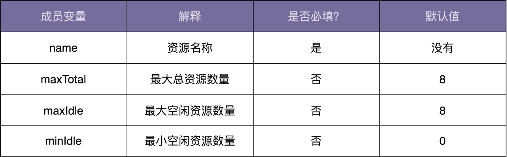

# 一、单例模式

## 1、为什么要使用单例

一个类只允许创建一个对象（实例），这个类就是单例类。即单例模式

### 1）处理资源访问冲突

一个往文件中打印日志的Logger类

```java
public class Logger {
    private FileWriter writer;
    
    public Logger() {
        File file = new File("/Users/log.txt");
        writer = new FileWriter(file, true);
    }
    
    public void log(String message) {
        writer.write(message);
    }
}

public class UserController {
    private Logger logger = new Logger();
    
    public void login(String username, String password) {
        // ...业务逻辑代码...
        logger.log(user + "logined");
    }
}

public class OrderController {
    private Logger logger = new logger();
    
    public void create(Order order) {
        // ...
        logger.log("Create an order:" + order.toString);
    }
}
```

所有日志写入同一个文件。在 UserController 和OrderController 中，分别创建了两个对象。在 Web 容器的 Servlet 多线程环境下，如果两个 Servlet 线程同时分别执行 login 和 create 两个函数，并同时写日志到 log.txt 文件中，就有可能存在日志信息互相覆盖的情况。

首先想到通过加锁的方式：给 log 函数加互斥锁，同一时刻只允许一个线程调用执行 log 函数

```java
public void log(String message) {
    synchronized(this) {
        writer.write(message);
    }
}
```

但是，这并不能解决多线程写入日志时相互覆盖的问题。这种锁是一个对象级别的锁，一个对象在不同线程下同时调用 log 函数，会被强制要求按顺序执行。但是，不同对象之间并不共享同一把锁。在不同线程下，不同对象调用执行 log 函数，锁并不会执行作用，有可能存在写入日志相互覆盖情况。其实 FileWriter 就是线程安全的，它内部实现中就加了对象级别的锁，在调用 write 函数的时候，再加对象级别的锁多此一举。因为不同的 Logger 对象不共享 FileWriter 对象。

要解决这个问题，需要使用类级别的锁，让所有的对象都共享同一把锁。

```java
public void log(String message) {
    synchronized(Logger.class) {
        writer.write(message);
    }
}
```

除了使用类级别锁外，分布式锁、并发队列（多个线程往并发队列写日志，一个单独线程将并发队列中的数据写入日志文件）等也可以解决资源竞争。单例模式思路更简单。相对类级别锁的好处是，不用创建那么多 Logger 对象，节省内存，另外节省系统文件句柄。

将 Logger 设计成一个单例类，只允许创建一个 Logger 对象，所有线程共享使用这个 Logger 对象，共享一个 FileWriter 对象，FileWriter 本身是对象级别线程安全的，避免了多线程情况下写日志会互相覆盖。

```java
public class Logger {
    private static final Logger instance  = new Logger();
    
    public static Logger getInstance() {
        return instance;
    }
}

// Logger类使用示例
public class OrderController {
    public void create(Order order) {
        Logger.getInstance().log("Created a order:" + order.toString());
    }
}
```

### 2）表示全局唯一类

数据在系统中只保存一份，适合设计为单例类。比如配置信息类，在系统中只有一个配置文件，当配置文件被加载到内存后，以对象形式存在也应只有一份。

唯一递增 ID 号码生成器，若程序有两个对象，就会存在生成重复 ID 的情况。所以，我们应该将 ID 生成器类设计为单例。

```java
public class IdGenerator {
    // AtomicLong 是一个java并发库中提供的一个原子变量类型
    // 将一些线程不安全需要加锁的复合操作封装为线程安全的原子操作
    // 如incrementAndGet()
    private AtomicLong id = new AtomicLong(0);
    private static final IdGenerator instance = new IdGenerator();
    private IdGenrator() {}
    public static IdGenerator getInstance() {
        return instance;
    }
    
    public long getId() {
        return id.incrementAndGet();
    }
}

// 使用
long id = IdGenerator.getInstance().getId();
```

## 2、如何实现一个单例

**实现一个单例的关注点**

- 构造函数需要 private 访问权限，避免外部通过 new 创建实例
- 对象创建时的线程安全问题
- 是否支持延迟加载
- getInstance() 性能是否高 （是否加锁）

### 1）饿汉式

在类加载的时候，instance 静态实例就已经创建并初始化好了。所以，instance 实例创建过程是线程安全的。不支持延迟加载。

```java
public class IdGenerator {
    private AtomicLong id = new AtomicLong(0);
    private static final IdGenerator instance = new IdGenerator();
    private IdGenrator() {}
    public static IdGenerator getInstance() {
        return instance;
    }
    
    public long getId() {
        return id.incrementAndGet();
    }
}
```

### 2）懒汉式

懒汉式支持延迟加载

```java
public class IdGenerator {
    private AtomicLong id = new AtomicLong(0);
    private static final IdGenerator instance;
    private IdGenrator() {}
    public static synchronized IdGenerator getInstance() {
        if (null == instance) {
        	instance = new IdGenerator();
        }
        return instance;
    }
    
    public long getId() {
        return id.incrementAndGet();
    }
}
```

getInstance 方法加了一把锁，导致函数并发度很低。这个函数在单例使用期间，一直会被调用。如果频繁调用，频繁加锁、释放锁及并发度低的问题，会导致性能瓶颈。

### 3）双重检测

饿汉式不支持延迟加载，懒汉式有性能问题，不支持高并发。双重检测实现方式，既支持延迟加载、又支持高并发的单例实现。

这种实现方式中，只要 instance 被创建后，即便再调用 getInstance 函数也不会再进入到加锁逻辑中。

```java
public class IdGenerator {
    public static IdGenerator getInstance() {
        if (null == instance) {
            synchronized(IdGenerator.class) {
                if (null == instance) {
                    instance = new IdGenerator();
                }
            }
        }
        return instance;
    }
}
```

低版本的 Java 因为指令重排序，可能会导致 IdGenerator 对象被 new 出来并赋值给 instance 后，还没来得及初始化（执行构造函数中的代码逻辑），就被另一个线程使用了。

[Java volatile如何防止指令重排序 - 简书 (jianshu.com)](https://www.jianshu.com/p/a67dc1c11088)

要解决这个问题，需要给 instance 成员变量加上 volatile 关键字，禁止指令重排序。高本版在 JDK 内部实现解决了这个问题（把对象 new 操作和初始化操作设计为原子操作，就能禁止指令重排序）。

### 4）静态内部类

```java
public class IdGenerator {
    private static class SingletonHolder{
        private static final IdGenerator instance = new IdGenerator();
    }
    
    public static IdGenerator getInstance() {
        return SingletonHolder.instance;
    }
}
```

SingletonHolder 是一个静态内部类，当外部类 IdGenerator 被加载的时候，不会创建 SingletonHolder 实例。当调用 getInstance 方法时，SingletonHolder 才会被加载，这时候才会创建 instance。

### 5）枚举

```java
public enum IdGenerator {
    INSTANCE;
    private AtomicLong id = new AtomicLong(0);
    
    public long getId() {
        return id.incrementAndget();
    }
}
```

基于枚举类型的单例实现。保证了实例创建的线程安全性和实例唯一性。

## 2、单例存在哪些问题

项目中使用单例，都是用它表示一些全局唯一类，比如配置信息类、连接池类、ID 生成器类。但是，这种使用方法类似硬编码，会带来诸多问题。

### 1）单例对 OOP 特性的支持不友好

IdGenerator 的使用方式违背了基于接口而非实现的设计原则，也就违背了广义上理解的 OOP 的抽象特性。如果未来某一天，我们希望针对不同的业务采用不同的 ID 生成算法。 比如，订单 ID 和用户 ID 采用不同的 ID 生成器来生成。为了应对这个需求变化，我们需要 修改所有用到 IdGenerator 类的地方，这样代码的改动就会比较大。

此外，单例对继承、多态特性支持不友好。单例类也可以被继承、也可以实现多态，只是 实现起来会非常奇怪，会导致代码的可读性变差。一旦你选择将某个类设计成到单例类，也就意味着放弃了继承和多 态这两个强有力的面向对象特性，也就相当于损失了可以应对未来需求变化的扩展性。

### 2）单例会隐藏类之间的依赖关系

通过构造函数、参数传递等方式声明的类之间的依赖关系，我们通过查看函数的定义，就能 很容易识别出来。但是，单例类不需要显示创建、不需要依赖参数传递，在函数中直接调用 就可以了。如果代码比较复杂，这种调用关系就会非常隐蔽。在阅读代码的时候，我们就需 要仔细查看每个函数的代码实现，才能知道这个类到底依赖了哪些单例类。

### 3）单例对代码的扩展性不友好

单例类只能有一个对象实例。如果未来某一天，我们需要在代码中创建两个实例 或多个实例，那就要对代码有比较大的改动。

在系统设计初期，我们觉得系统中只应该有一个数据库连接池，这样能方便我们控制对数据 库连接资源的消耗。所以，我们把数据库连接池类设计成了单例类。但之后我们发现，系统 中有些 SQL 语句运行得非常慢。这些 SQL 语句在执行的时候，长时间占用数据库连接资 源，导致其他 SQL 请求无法响应。为了解决这个问题，我们希望将慢 SQL 与其他 SQL 隔 离开来执行。为了实现这样的目的，我们可以在系统中创建两个数据库连接池，慢 SQL 独 享一个数据库连接池，其他 SQL 独享另外一个数据库连接池，这样就能避免慢 SQL 影响到 其他 SQL 的执行。

单例 类在某些情况下会影响代码的扩展性、灵活性。所以，数据库连接池、线程池这类的资源 池，最好还是不要设计成单例类。实际上，一些开源的数据库连接池、线程池也确实没有设 计成单例类。

### 4）单例对代码的可测试性不友好

### 5）单例不支持有参数的构造函数

解决思路：将参数放到另一个全局变量中。里面的值既可以像下面的代码那样通过静态常量定义，也可以从配置文件中加载得到。

## 3、单例与静态类的区别

1）首先单例模式会提供给你一个全局唯一的对象，静态类只是提供给你很多静态方法，这些方法不用创建对象，通过类就可以直接调用；

2）***单例模式的灵活性更高，方法可以被override，因为静态类都是静态方法，所以不能被override；***

3）如果是一个非常重的对象，单例模式可以懒加载，静态类就无法做到；

应该用静态类，什么时候应该用单例模式呢？首先如果你只是想使用一些工具方法，那么最好用静态类，***静态类比单例类更快***，因为静态的绑定是在编译期进行的。***如果你要维护状态信息，或者访问资源时，应该选用单例模式。***还可以这样说，当你需要面向对象的能力时（比如继承、多态）时，选用单例类，当你仅仅是提供一些方法时选用静态类。

## 4、替代单例的解决方案

为了保证全局唯一，除了使用单例，我们还可以用静态方法来实现。不过，静态方法这种实 现思路，并不能解决我们之前提到的问题。如果要完全解决这些问题，我们可能要从根上， 寻找其他方式来实现全局唯一类了。比如，通过工厂模式、IOC 容器（比如 Spring IOC 容器）来保证，由过程序员自己来保证（自己在编写代码的时候自己保证不要创建两个类对 象）。

如果单例类并没有后续扩展的需求，并且不依赖外部系统，那设计成单例类就没有太大问题。对于一些全局的类，我们在其他地方 new 的话，还要在类之间传来传去，不如直接做成单例类，使用起来简洁方便。

## 5、单例模式中的唯一性

单例模式创建的对象是进程唯一的。

我们编写的代码，通过编译、链接，组织在一起，就构成了一个操作系统可以执行的文件， 也就是我们平时所说的“可执行文件”（比如 Windows 下的 exe 文件）。可执行文件实 际上就是代码被翻译成操作系统可理解的一组指令，你完全可以简单地理解为就是代码本 身。

当我们使用命令行或者双击运行这个可执行文件的时候，操作系统会启动一个进程，将这个 执行文件从磁盘加载到自己的进程地址空间（可以理解操作系统为进程分配的内存存储区， 用来存储代码和数据）。接着，进程就一条一条地执行可执行文件中包含的代码。比如，当 进程读到代码中的 User user = new User(); 这条语句的时候，它就在自己的地址空间中创 建一个 user 临时变量和一个 User 对象。

进程之间是不共享地址空间的，如果我们在一个进程中创建另外一个进程（比如，代码中有 一个 fork() 语句，进程执行到这条语句的时候会创建一个新的进程），操作系统会给新进 程分配新的地址空间，并且将老进程地址空间的所有内容，重新拷贝一份到新进程的地址空 间中，这些内容包括代码、数据（比如 user 临时变量、User 对象）。

所以，单例类在老进程中存在且只能存在一个对象，在新进程中也会存在且只能存在一个对 象。而且，这两个对象并不是同一个对象，这也就说，单例类中对象的唯一性的作用范围是 进程内的，在进程间是不唯一的。

**实际上，对于 Java 语言来说，单例类 对象的唯一性的作用范围并非进程，而是类加载器（Class Loader）**

Java中，两个类来源于同一个Class文件，被同一个虚拟机加载，只要加载它们的类加载器不同，那这两个类就必定不相等。 单例类对象的唯一性前提也必须保证该类被同一个类加载器加载

## 6、实现线程唯一的单例

假设 IdGenerator 是一个线程唯一的单例类。在线程 A 内，我们可以创建一个单例对象 a。因为线程内唯一，在线程 A 内就不能再创建新的 IdGenerator 对象了，而线程间可以 不唯一，所以，在另外一个线程 B 内，我们还可以重新创建一个新的单例对象 b。 

通过一个 HashMap 来存储对象，其中 key 是线程 ID，value 是对象。这样我们就可以做到，不同的线程对应不同的对象，同一个线程只能对应一个对象。实际上，Java 语言本 身提供了 ThreadLocal 工具类，可以更加轻松地实现线程唯一单例。不过，ThreadLocal 底层实现原理也是基于下面代码中所示的 HashMap。

```java
public class IdGenerator {
	private static final ConCurrentHashMap<Long, IdGenerator> instances 
        = new ConCurrentHashMap<>();
    
    private IdGenerator() {}
    
    public static IdGenerator getInstance() {
        Long currentThreadId = Thread.currentThread().getId();
        instances.putIfAbsent(currentThreadId, new IdGenerator());
        return instance.get(currentThreadId);
    }
}
```

## 7、实现集群环境下的单例

集群相当于多个进程构成的一个集合，“集群唯一”就相当于是进程内唯一、进程间也唯一。也就是说，不同的进程间共享同一个对象，不能创建同一个类的多个对象。

那集群唯一的单例实现起来就有点难度了。 具体来说，我们需要把这个单例对象序列化并存储到外部共享存储区（比如文件）。进程在 使用这个单例对象的时候，需要先从外部共享存储区中将它读取到内存，并反序列化成对 象，然后再使用，使用完成之后还需要再存储回外部共享存储区。

为了保证任何时刻，在进程间都只有一份对象存在，一个进程在获取到对象之后，需要对对 象加锁，避免其他进程再将其获取。在进程使用完这个对象之后，还需要显式地将对象从内 存中删除，并且释放对对象的加锁。

## 8、如何实现一个多例模式

“单例”指的是，一个类只能创建一个对象。对应地，“多例”指的就是，一个类可以创建 多个对象，但是个数是有限制的，比如只能创建 3 个对象。多例的实现也比较简单，通过一个Map 来存储对象类型和对象之间的对应关系，来控制对象的个数。

多例模式的理解方式有点类似工厂模式。它跟工厂模式的不同之处是，多例模式创建的 对象都是同一个类的对象，而工厂模式创建的是不同子类的对象。

# 二、工厂模式

## 1、简单工厂

根据配置文件后缀，选择不同的解析器，将存储在文件中的配置解析成内存对象 RuleConfig

```java
public class RuleConfigSource {
    public RuleConfig load(String ruleConfigFilePath) {
        String ruleConfigFileExtension = 
            getFileExtension(ruleConfigFilePath);
        IRuleConfigParser parser = null;
        if ("json".equalsIgnoreCase(ruleConfigFileExtension)) {
        	parser = new JsonRuleConfigParser();
        } else if ("xml".equalsIgnoreCase(ruleConfigFileExtension)) {
        	parser = new XmlRuleConfigParser();
        } else if ("yaml".equalsIgnoreCase(ruleConfigFileExtension)) {
        	parser = new YamlRuleConfigParser();
        } else if ("properties".equalsIgnoreCase(ruleConfigFileExtension)) {
        	parser = new PropertiesRuleConfigParser();
        } else {
        	throw new InvalidRuleConfigException(
        "Rule config file format is not supported: " + ruleConfigFilePath)
        }
    }
    String configText = "";
    // 从文件读取配置文本到configText中
    RuleConfig ruleConfig = parser.parse(configText);
    return ruleConfig;
}

private String getFileExtension(String filePath) {
    // 解析文件名获取扩展名，如rule.json，返回json
    return "json";
}
```

善于将功能独立的代码块封装成函数。将parser创建的部分逻辑剥离出来，抽象成createParser()函数。进一步将createParser函数剥离到一个独立类中，让这个类只负责对象的创建。这个类就是要讲的简单工厂模式类

```java
public class RuleConfigSource {
    public RuleConfig load(String ruleConfigFilePath) {
        String ruleConfigExtension = 
            getFileExtension(ruleConfigFilePath);
        IRuleConfigParser parser = 
            RuleConfigParserFactory.createParser(ruleConfigExtension);
        if (null == parser) {
            throw new InvalidRuleConfigException(
                "Rule config file format is not supported: " + 
                ruleConfigFilePath)
        }
        
        String configText = "";
        // 从文件读取配置文本到configText中
        RuleConfig ruleConfig = parser.parse(configText);
        return ruleConfig;
    }
}

public class RuleConfigParserFactory {
    public static IRuleConfigParser createParser(String configFormat) {
        IRuleConfigParser parser = null;
        if ("json".equalsIgnoreCase(ruleConfigFileExtension)) {
        	parser = new JsonRuleConfigParser();
        } else if ("xml".equalsIgnoreCase(ruleConfigFileExtension)) {
        	parser = new XmlRuleConfigParser();
        } else if ("yaml".equalsIgnoreCase(ruleConfigFileExtension)) {
        	parser = new YamlRuleConfigParser();
        } 
        return parser;
    }
}
```

大部分工厂类都是以“Factory”这个单词结尾的，但也不是必须的，比如 Java 中的 DateFormat、Calender。除此之外，工厂类中创建对象的方法一般都是 create 开头，比 如代码中的 createParser()，但有的也命名为 getInstance()、createInstance()、newInstance()，有的甚至命名为 valueOf()（比如 Java String 类的 valueOf() 函数）等 等，这个我们根据具体的场景和习惯来命名就好。

在上面的代码实现中，我们每次调用 RuleConfigParserFactory 的 createParser() 的时 候，都要创建一个新的 parser。实际上，如果 parser 可以复用，为了节省内存和对象创建 的时间，我们可以将 parser 事先创建好缓存起来。当调用 createParser() 函数的时候，我 们从缓存中取出 parser 对象直接使用。

这有点类似单例模式和简单工厂模式的结合，具体的代码实现如下所示。在接下来的讲解 中，我们把上一种实现方法叫作简单工厂模式的第一种实现方法，把下面这种实现方法叫作 简单工厂模式的第二种实现方法。

```java
public class RuleConfigParserFactory {
    private static final Map<String, RuleConfigParser> cachedParsers = new HashMap<>();
    static {
        cachedParsers.put("json", new JsonRuleConfigParser());
        cachedParsers.put("xml", new XmlRuleConfigParser());
        cachedParsers.put("yaml", new YamlRuleConfigParser());
        cachedParsers.put("properties", new 
                          PropertiesRuleConfigParser());

    }
    
    public static IRuleConfigParser creatParser(String configFormat) {
        if (configFormat == null || configFormat.isEmpty()) {
            return null;
        }
        IRuleCofnigParser parser = 
            cachedParsers.get(configFormat.toLowerCase());
        return parser;
    }
}
```

对于上面两种简单工厂模式的实现方法，如果我们要添加新的 parser，那势必要改动到 RuleConfigParserFactory 的代码，那这是不是违反开闭原则呢？实际上，如果不是需要 频繁地添加新的 parser，只是偶尔修改一下 RuleConfigParserFactory 代码，稍微不符合 开闭原则，也是完全可以接受的。

## 2、工厂方法

如果我们非得要将 if 分支逻辑去掉，那该怎么办呢？比较经典处理方法就是利用多态。按 照多态的实现思路，对上面的代码进行重构。

```java
public interface IRuleConfigParserFactory {
IRuleConfigParser createParser();
}
public class JsonRuleConfigParserFactory implements IRuleConfigParserFactory {
@Override
public IRuleConfigParser createParser() {
return new JsonRuleConfigParser();
}
}
public class XmlRuleConfigParserFactory implements IRuleConfigParserFactory {
@Override
public IRuleConfigParser createParser() {
return new XmlRuleConfigParser();
}
}
public class YamlRuleConfigParserFactory implements IRuleConfigParserFactory {
@Override
public IRuleConfigParser createParser() {
return new YamlRuleConfigParser();
}
}
public class PropertiesRuleConfigParserFactory implements IRuleConfigParserFact
@Override
public IRuleConfigParser createParser() {
return new PropertiesRuleConfigParser();
}
}

```

这就是工厂方法模式的典型代码实现。这样当我们新增一种 parser 的时候，只需 要新增一个实现了 IRuleConfigParserFactory 接口的 Factory 类即可。所以，工厂方法模 式比起简单工厂模式更加符合开闭原则。

但是用这种工厂类来实现RuleConfigSource的load函数，存在工厂类对象的创建逻辑又耦合进了 load() 函数中的问题。

我们可以为工厂类再创建一个简单工厂，也就是工厂的工厂，用来创建工厂类对象。RuleConfigParserFactoryMap 类是创建工厂对象的工厂类，getParserFactory() 返回的 是缓存好的单例工厂对象。

```java
// 工厂类只包含方法，不包含变量，完全可以复用
// 不需要每次创建新的工厂类对象，简单工厂模式的第二种实现思路更加合适
public class RuleConfigParserFactoryMap {
    private static final Map<String, IRuleConfigParserFactory> = cacheFatories = new HashMap<>();
    static {
        cachedFactories.put("json", new JsonRuleConfigParserFactory());
        cachedFactories.put("xml", new XmlRuleConfigParserFactory());
        cachedFactories.put("yaml", new YamlRuleConfigParserFactory());
        cachedFactories.put("properties", new 
                    PropertiesRuleConfigParserFactory());
    }
    
public static IRuleConfigParserFactory getParserFactory(String type) 	
{
    if (type == null || type.isEmpty()) {
    	return null;
    }
    IRuleConfigParserFactory parserFactory = 
        cachedFactories.get(type.toLowerCase());
    return parserFactory;
}
```

当我们需要添加新的规则配置解析器的时候，我们只需要创建新的 parser 类和 parser factory 类，并且在 RuleConfigParserFactoryMap 类中，将新的 parser factory 对象添 加到 cachedFactories 中即可。代码的改动非常少，基本上符合开闭原则。 实际上，对于规则配置文件解析这个应用场景来说，工厂模式需要额外创建诸多 Factory 类，也会增加代码的复杂性，而且，每个 Factory 类只是做简单的 new 操作，功能非常单 薄（只有一行代码），也没必要设计成独立的类，所以，在这个应用场景下，简单工厂模式 简单好用，比工方法厂模式更加合适。

**那什么时候该用工厂方法模式，而非简单工厂模式呢？**

当对象的创建逻辑比较复杂，不只是简单的 new 一下就可以，而是要 组合其他类对象，做各种初始化操作的时候，我们推荐使用工厂方法模式，将复杂的创建逻 辑拆分到多个工厂类中，让每个工厂类都不至于过于复杂。而使用简单工厂模式，将所有的 创建逻辑都放到一个工厂类中，会导致这个工厂类变得很复杂。

## 3、抽象工厂

在简单工厂和工厂方法中，类只有一种分类方式。比如，在规则配置解析那个例子中，解析 器类只会根据配置文件格式（Json、Xml、Yaml……）来分类。但是，如果类有两种分类方 式，比如，我们既可以按照配置文件格式来分类，也可以按照解析的对象（Rule 规则配置 还是 System 系统配置）来分类，那就会对应下面这 8 个 parser 类

```
针对规则配置的解析器：基于接口IRuleConfigParser
JsonRuleConfigParser
XmlRuleConfigParser
YamlRuleConfigParser
PropertiesRuleConfigParser
针对系统配置的解析器：基于接口ISystemConfigParser
JsonSystemConfigParser
XmlSystemConfigParser
YamlSystemConfigParser
PropertiesSystemConfigParser
```

过多的类 也会让系统难维护。这个问题该怎么解决呢？ 抽象工厂就是针对这种非常特殊的场景而诞生的。我们可以让一个工厂负责创建多个不同类 型的对象（IRuleConfigParser、ISystemConfigParser 等），而不是只创建一种 parser 对象。这样就可以有效地减少工厂类的个数。

```java
public interface IConfigParserFactory {
IRuleConfigParser createRuleParser();
ISystemConfigParser createSystemParser();
//此处可以扩展新的parser类型，比如IBizConfigParser
}
public class JsonConfigParserFactory implements IConfigParserFactory {
@Override
public IRuleConfigParser createRuleParser() {
return new JsonRuleConfigParser();
}
@Override
public ISystemConfigParser createSystemParser() {
return new JsonSystemConfigParser();
}
}
public class XmlConfigParserFactory implements IConfigParserFactory {
@Override
public IRuleConfigParser createRuleParser() {
return new XmlRuleConfigParser();
}
@Override
public ISystemConfigParser createSystemParser() {
return new XmlSystemConfigParser();
}
}

```

简单工厂和工厂方法比较常用，抽象工厂的应用场景比较特殊，所以很少用到。当创建逻辑比较复杂，是一个“大工程”的时候，我们就考虑使用工厂模式，封装对象的创建过程，将对象的创建和使用相分离。

第一种情况：类似规则配置解析的例子，代码中存在 if-else 分支判断，动态地根据不同 的类型创建不同的对象。针对这种情况，我们就考虑使用工厂模式，将这一大坨 if-else 创建对象的代码抽离出来，放到工厂类中。 还有一种情况，尽管我们不需要根据不同的类型创建不同的对象，但是，单个对象本身 的创建过程比较复杂，比如前面提到的要组合其他类对象，做各种初始化操作。在这种 情况下，我们也可以考虑使用工厂模式，将对象的创建过程封装到工厂类中。

## 4、实现一个依赖注入框架

一个创建对象的“大工程”，依赖注入框架，或者叫依赖注入容器 （Dependency Injection Container），简称 DI 容器。

**工厂模式和 DI 容器有何区别？**

DI 容器底层最基本的设计思路就是基于工厂模式的。DI 容器相当于一个大的工厂 类，负责在程序启动的时候，根据配置（要创建哪些类对象，每个类对象的创建需要依赖哪 些其他类对象）事先创建好对象。当应用程序需要使用某个类对象的时候，直接从容器中获 取即可。正是因为它持有一堆对象，所以这个框架才被称为“容器”。

**DI 容器的核心功能有哪些？** 

一个简单的 DI 容器的核心功能一般有三个：配置解析、对象创建和对象生命周期管理。

1. 配置解析

   工厂模式中，工厂类要创建哪个类对象是事先确定好的，并且是写死在工厂类 代码中的。作为一个通用的框架来说，框架代码跟应用代码应该是高度解耦的，DI 容器事 先并不知道应用会创建哪些对象，不可能把某个应用要创建的对象写死在框架代码中。所 以，我们需要通过一种形式，让应用告知DI 容器要创建哪些对象。这种形式就是我们要讲的配置。

   需要由 DI 容器来创建的类对象和创建类对象的必要信息（使用哪个构造函数以及对 应的构造函数参数都是什么等等），放到配置文件中。容器读取配置文件，根据配置文件提 供的信息来创建对象。

   ```java
   public class RateLimiter {
   private RedisCounter redisCounter;
   public RateLimiter(RedisCounter redisCounter) {
   this.redisCounter = redisCounter;
   }
   public void test() {
   System.out.println("Hello World!");
   }
   //...
   }
   public class RedisCounter {
   private String ipAddress;
   private int port;
   public RedisCounter(String ipAddress, int port) {
   this.ipAddress = ipAddress;
   this.port = port;
   }
   //...
   }
   配置文件beans.xml：
   <beans>
   <bean id="rateLimiter" class="com.xzg.RateLimiter">
   <constructor-arg ref="redisCounter"/>
   </bean>
   <bean id="redisCounter" class="com.xzg.redisCounter">
   <constructor-arg type="String" value="127.0.0.1">
   <constructor-arg type="int" value=1234>
   </bean>
   </beans>
   
   ```

   

2. 对象创建

   下面是一个典型的 Spring 容器的配置文件。Spring 容器读取这个配置文件，解析出要创 建的两个对象：rateLimiter 和 redisCounter，并且得到两者的依赖关系：rateLimiter 依 赖 redisCounter。

   在 DI 容器中，如果我们给每个类都对应创建一个工厂类，那项目中类的个数会成倍增加， 这会增加代码的维护成本。要解决这个问题并不难。我们只需要将所有类对象的创建都放到 一个工厂类中完成就可以了，比如 BeansFactory。

   如果要创建的类对象非常多，BeansFactory 中的代码会不会线性膨胀（代码 量跟创建对象的个数成正比）呢？实际上并不会。待会讲到 DI 容器的具体实现的时候，我 们会讲“反射”这种机制，它能在程序运行的过程中，动态地加载类、创建对象，不需要事 先在代码中写死要创建哪些对象。所以，不管是创建一个对象还是十个对象， BeansFactory 工厂类代码都是一样的。

3. 对象声明周期管理

   简单工厂模式有两种实现方式，一种是每次都返回新创建的对象，另一 种是每次都返回同一个事先创建好的对象，也就是所谓的单例对象。在 Spring 框架中，我 们可以通过配置 scope 属性，来区分这两种不同类型的对象。scope=prototype 表示返 回新创建的对象，scope=singleton 表示返回单例对象。

   还可以配置对象是否支持懒加载。如果 lazy-init=true，对象在真正被使用 到的时候（比如：BeansFactory.getBean(“userService”)）才被被创建；如果 lazyinit=false，对象在应用启动的时候就事先创建好。

   还可以配置对象的 init-method 和 destroy-method 方法，比如 initmethod=loadProperties()，destroy-method=updateConfigFile()。DI 容器在创建好对 象之后，会主动调用 init-method 属性指定的方法来初始化对象。在对象被最终销毁之 前，DI 容器会主动调用 destroy-method 属性指定的方法来做一些清理工作，比如释放数据库连接池、关闭文件。

**实现一个简单的 DI 容器**

1. 最小原型设计

   在最小原型中，我们只支持下面配置文件中涉及的配置语法。

   ```xml
   配置文件beans.xml
   <beans>
    <bean id="rateLimiter" class="com.xzg.RateLimiter">
    <constructor-arg ref="redisCounter"/>
    </bean>
    <bean id="redisCounter" class="com.xzg.redisCounter" scope="singleton" lazy-
    <constructor-arg type="String" value="127.0.0.1">
    <constructor-arg type="int" value=1234>
    </bean>
   </bean
   
   ```

   使用方式

   ```java
   public class Demo {
   	public static void main(String[] args) {
           ApplicationContext applicationContext = new 
               ClassPathXmlApplicationContext("bean.xml");
           RateLimiter ratelimiter = (RateLimiter) 
               applicationContext.getBean("rateLimiter");
           rateLimiter.test();
       }
   }
   ```

   

2. 提供执行入口

   面向对象设计的最后一步是：组装类并提供执行入口。在这里，执行入口就是一组暴露给外部使用的接口和类。

   通过刚刚的最小原型使用示例代码，我们可以看出，执行入口主要包含两部分： ApplicationContext 和 ClassPathXmlApplicationContext。其中，ApplicationContext 是接口，ClassPathXmlApplicationContext 是接口的实现类。

   ```java
   public interface ApplicatonContext {
       Object getBean(String beanId);
   }
   
   public class ClassPathXmlApplicationContext implements ApplicationContext {
       private BeansFactory beansFactory;
       private BeanConfigParser beanConfigParser;
       
       public ClassPathXmlApplicationContext(String configLocation) {
           this.beansFactory = new BeansFactory();
           this.beanConfigParser = new XmlBeanConfigParser();
           loadBeanDefinitions(configLocation);
   	}
   	private void loadBeanDefinitions(String configLocation) {
           InputStream in = null;
           try {
               in = this.getClass().getResourceAsStream("/" + configLocation);
           if (in == null) {
               throw new RuntimeException("Can not find config file: " + configLocation)
           }
           List<BeanDefinition> beanDefinitions = beanConfigParser.parse(in);
           beansFactory.addBeanDefinitions(beanDefinitions);
           } finally {
               if (in != null) {
               try {
               	in.close();
               } catch (IOException e) {
               // TODO: log error
               }
           }
   	}
           
       @Override
       public Object getBean(String beanId) {
       	return beansFactory.getBean(beanId);
   	}
   }
   ```

   ClassPathXmlApplicationContext 负责组装 BeansFactory 和 BeanConfigParser 两个类，串联执行流程：从 classpath 中加载 XML 格式的配置文件，通过 BeanConfigParser 解析为统一的 BeanDefinition 格式，然后， BeansFactory 根据 BeanDefinition 来创建对象。

3. 配置文件解析

   配置文件解析主要包含 BeanConfigParser 接口和 XmlBeanConfigParser 实现类，负责 将配置文件解析为 BeanDefinition 结构，以便 BeansFactory 根据这个结构来创建对象。

4. 核心工厂类设计

   BeansFactory 是如何设计和实现的。这也是我们这个 DI 容器最核心的 一个类了。它负责根据从配置文件解析得到的 BeanDefinition 来创建对象。如果对象的 scope 属性是 singleton，那对象创建之后会缓存在 singletonObjects 这样一 个 map 中，下次再请求此对象的时候，直接从 map 中取出返回，不需要重新创建。如果 对象的 scope 属性是 prototype，那每次请求对象，BeansFactory 都会创建一个新的对象返回。

   BeansFactory 创建对象用到的主要技术点就是 Java 中的**反射语法：一种动态加载类和创建对象的机制。**我们知道，JVM 在启动的时候会根据代码自动地加载类、创建对 象。至于都要加载哪些类、创建哪些对象，这些都是在代码中写死的，或者说提前写好的。 但是，如果某个对象的创建并不是写死在代码中，而是放到配置文件中，我们需要在程序运 行期间，动态地根据配置文件来加载类、创建对象，那这部分工作就没法让 JVM 帮我们自 动完成了，我们需要利用 Java 提供的反射语法自己去编写代码。


一个简单的 DI 容器的实现原理，其核心逻辑主要包括：配置文件解析， 以及根据配置文件通过“反射”语法来创建对象。其中，创建对象的过程就应用到了我们在 学的工厂模式。对象创建、组装、管理完全有 DI 容器来负责，跟具体业务代码解耦，让程 序员聚焦在业务代码的开发上。

# 三、建造者模式

Builder模式、构建者模式、生成器模式

## 1、为什么需要建造者模式

我们需要定义一个资源池配置类 ResourcePoolConfig。这 里的资源池，你可以简单理解为线程池、连接池、对象池等。在这个资源池配置类中，有以 下几个成员变量，也就是可配置项。



现在，ResourcePoolConfig 只有 4 个可配置项，对应到构造函数中，也只有 4 个参数， 参数的个数不多。但是，如果可配置项逐渐增多，变成了 8 个、10 个，甚至更多，那继续 沿用现在的设计思路，构造函数的参数列表会变得很长，代码在可读性和易用性上都会变 差。在使用构造函数的时候，我们就容易搞错各参数的顺序，传递进错误的参数值，导致非 常隐蔽的 bug。

解决这个问题的办法你应该也已经想到了，那就是用 set() 函数来给成员变量赋值，以替代 冗长的构造函数。其中，配置项 name 是必填的，所以 我们把它放到构造函数中设置，强制创建类对象的时候就要填写。其他配置项 maxTotal、maxIdle、minIdle 都不是必填的，所以我们通过 set() 函数来设置，让使用者自主选择填 写或者不填写。

如果必填的配置项有很多，把这些必填配置项都放到构造函数中设置，那构 造函数就又会出现参数列表很长的问题。如果我们把必填项也通过 set() 方法设置，那校 验这些必填项是否已经填写的逻辑就无处安放了。除此之外，假设配置项之间有一定的依赖关系，比如，如果用户设置了 maxTotal、 maxIdle、minIdle 其中一个，就必须显式地设置另外两个；或者配置项之间有一定的约 束条件，比如，maxIdle 和 minIdle 要小于等于 maxTotal。如果我们继续使用现在的 设计思路，那这些配置项之间的依赖关系或者约束条件的校验逻辑就无处安放了。

如果我们希望 ResourcePoolConfig 类对象是不可变对象，也就是说，对象在创建好之 后，就不能再修改内部的属性值。要实现这个功能，我们就不能在 ResourcePoolConfig 类中暴露 set() 方法。

为了解决这些问题，建造者模式就派上用场了。

可以把校验逻辑放置到 Builder 类中，先创建建造者，并且通过 set() 方法设置建造者 的变量值，然后在使用 build() 方法真正创建对象之前，做集中的校验，校验通过之后才会 创建对象。除此之外，我们把 ResourcePoolConfig 的构造函数改为 private 私有权限。 这样我们就只能通过建造者来创建 ResourcePoolConfig 类对象。并且， ResourcePoolConfig 没有提供任何 set() 方法，这样我们创建出来的对象就是不可变对象了。

**建造者模式实现需求**

```java
public class ResourcePoolConfig {
	private String name;
	private int maxTotal;
	private int maxIdle;
	private int minIdle;

    private ResourcePoolConfig(Builder builder) {
        this.name = builder.name;
        this.maxTotal = builder.maxTotal;
        this.maxIdle = builder.maxIdle;
		this.minIdle = builder.minIdle;
    }
    
    //...省略getter方法...
    //我们将Builder类设计成了ResourcePoolConfig的内部类。
    //我们也可以将Builder类设计成独立的非内部类ResourcePoolConfigBuilder。
    public static class Builder {
        private static final int DEFAULT_MAX_TOTAL = 8;
        private static final int DEFAULT_MAX_IDLE = 8;
        private static final int DEFAULT_MIN_IDLE = 0;
        private String name;
        private int maxTotal = DEFAULT_MAX_TOTAL;
        private int maxIdle = DEFAULT_MAX_IDLE;
        private int minIdle = DEFAULT_MIN_IDLE;
        
        public ResourcePoolConfig build() {
            // 校验逻辑放到这里来做，包括必填项校验、依赖关系校验、约束条件校验等
            if (StringUtils.isBlank(name)) {
            	throw new IllegalArgumentException("...");
            }
            if (maxIdle > maxTotal) {
            	throw new IllegalArgumentException("...");
            }
            if (minIdle > maxTotal || minIdle > maxIdle) {
            	throw new IllegalArgumentException("...");
            }
            return new ResourcePoolConfig(this);
        }
    }
    
    public Builder setName(String name) {
    if (StringUtils.isBlank(name)) {
    	throw new IllegalArgumentException("...");
    }
        this.name = name;
        return this;
    }
    public Builder setMaxTotal(int maxTotal) {
    if (maxTotal <= 0) {
    	throw new IllegalArgumentException("...");
    }
        this.maxTotal = maxTotal;
        return this;
    }
    public Builder setMaxIdle(int maxIdle) {
    if (maxIdle < 0) {
    	throw new IllegalArgumentException("...");
    }
        this.maxIdle = maxIdle;
        return this;
    }
    public Builder setMinIdle(int minIdle) {
    if (minIdle < 0) {
    	throw new IllegalArgumentException("...");
    }
        this.minIdle = minIdle;
        return this;
    }
    }
}

// 这段代码会抛出IllegalArgumentException，因为minIdle>maxIdle
ResourcePoolConfig config = new ResourcePoolConfig.Builder()
.setName("dbconnectionpool")
.setMaxTotal(16)
.setMaxIdle(10)
.setMinIdle(12)
.build();
```

使用建造者模式创建对象，还能避免对象存在无效状态。定义了一个长方形类，如果不使用建造者模式，采用先创建后 set 的方式，那就会 导致在第一个 set 之后，对象处于无效状态。为了避免这种无效状态的存在，我们就需要使用构造函数一次性初始化好所有的成员变量。 如果构造函数参数过多，我们就需要考虑使用建造者模式，先设置建造者的变量，然后再一 次性地创建对象，让对象一直处于有效状态。

实际上，如果我们并不是很关心对象是否有短暂的无效状态，也不是太在意对象是否是可变 的。比如，对象只是用来映射数据库读出来的数据，那我们直接暴露 set() 方法来设置类的 成员变量值是完全没问题的。而且，使用建造者模式来构建对象，代码实际上是有点重复 的，ResourcePoolConfig 类中的成员变量，要在 Builder 类中重新再定义一遍。

## 2、与工厂模式有何区别

建造者模式是让建造者类来负责对象的创建工作。上一节 课中讲到的工厂模式，是由工厂类来负责对象创建的工作。

实际上，**工厂模式是用来创建不同但是相关类型的对象（继承同一父类或者接口的一组子 类），由给定的参数来决定创建哪种类型的对象。建造者模式是用来创建一种类型的复杂对 象，通过设置不同的可选参数，“定制化”地创建不同的对象。**

顾客走进一家餐馆点餐，我们利用工厂模式，根据用户不同的选择，来制作不同的食物，比 如披萨、汉堡、沙拉。对于披萨来说，用户又有各种配料可以定制，比如奶酪、西红柿、起 司，我们通过建造者模式根据用户选择的不同配料来制作披萨。

如果一个类中有很多属性，为了避免构造函数的参数列表过长，影响代码的可读性和易用 性，我们可以通过构造函数配合 set() 方法来解决。但是，如果存在下面情况中的任意一 种，我们就要考虑使用建造者模式了。

把类的必填属性放到构造函数中，强制创建对象的时候就设置。如果**必填的属性有很多**，把这些必填属性都放到构造函数中设置，那构造函数就又会出现**参数列表很长**的问题。如果我们把必填属性通过 set() 方法设置，那校验这些必填属性是否已经填写的逻辑就无处安放了。 

如果**类的属性之间有一定的依赖关系或者约束条件**，我们继续使用构造函数配合 set() 方 法的设计思路，那这些依赖关系或约束条件的校验逻辑就无处安放了。 如果我们希望**创建不可变对象**，也就是说，对象在创建好之后，就不能再修改内部的属 性值，要实现这个功能，我们就不能在类中暴露 set() 方法。构造函数配合 set() 方法来 设置属性值的方式就不适用了。

# 四、原型模式