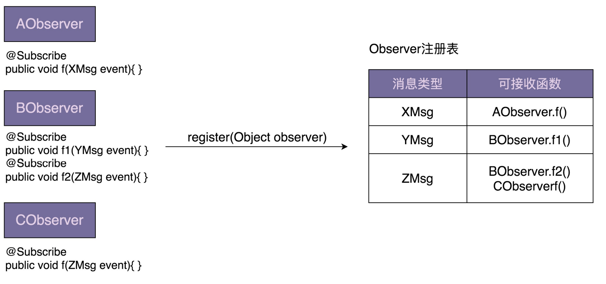
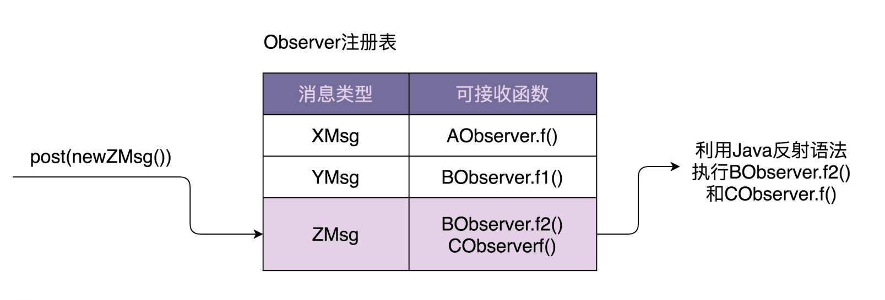

# 一、观察者模式

创建型设计模式主 要解决“对象的创建”问题，结构型设计模式主要解决“类或对象的组合或组装”问题，那 行为型设计模式主要解决的就是“类或对象之间的交互”问题。

在实际的开发中用得比较多的一种模式：观察者模式。根据应用场景的不同，观察者模式会对应不同的代码实现方式：有同步阻塞的实现 方式，也有异步非阻塞的实现方式；有进程内的实现方式，也有跨进程的实现方式。

## 1、原理及应用场景剖析

观察者模式（Observer Design Pattern）也被称为发布订阅模式（Publish-Subscribe Design Pattern）。在对象之间定义一个一对多的依赖，当一个对象状态改变的时候，所有依 赖的对象都会自动收到通知。一般情况下，被依赖的对象叫作被观察者（Observable），依赖的对象叫作观察者 （Observer）。在实际的项目开发中，这两种对象的称呼是比较灵活的，有各种不 同的叫法，比如：Subject-Observer、Publisher-Subscriber、Producer-Consumer、 EventEmitter-EventListener、Dispatcher-Listener。不管怎么称呼，只要应用场景符合 刚刚给出的定义，都可以看作观察者模式。

实际上，观察者模式是一个比较抽象的模式，根据不同的应用场景和需求，有完全不同的实 现方式。先来看其中最经典的一种实现方式。

```java
public interface Subject {
    void registerObserver(Observer observer);
    void removeObserver(Observer observer);
    vodi notifyObservers(Message message);
}

public interface Observer {
    void update(Message message);
}

public class ConcreteSubject implements Subject {
    private List<Observer> observers = new ArrayList<Observer>();
    
    public void registerObserver(Observer observer) {
        observer.add(observer);
    }
    
    public void removeObserver(Observer observer) {
        observer.remove(observer);
    }
    
    public void notifyObservers(Message message) {
        for (Observer observer : observers) {
            observer.update(message);
        }
    }
}

public class ConcreteObserverOne implements Observer {
    public void update(Message message) {
        // 获取消息通知，执行自身逻辑
    }
}
public class ConcreteObserverTwo implements Observer {
    public void update(Message message) {
        // 获取消息通知，执行自身逻辑
    }
}

public class Demo {
    public static void main(String[] args) {
        ConcreteSubject subject = new ConcreteSubject();
        subject.registerObserver(new ConCreteObserverOne());
        subject.notifyObservers(new Message());
    }
}
```

上面的代码算是观察者模式的“模板代码”，只能反映大体的设计思路。在真实的 软件开发中，并不需要照搬上面的模板代码。观察者模式的实现方法各式各样，函数、类的 命名等会根据业务场景的不同有很大的差别，比如 register 函数还可以叫作 attach， remove 函数还可以叫作 detach 等等。不过，万变不离其宗，设计思路都是差不多的。

假设我们在开发一个 P2P 投资理财系统，用户注册成功之后，我们会给用户发放投资体验 金。

```java
public class UserController {
    private UserService userService; // 依赖注入
    private PromotionService promotionService; // 依赖注入
    public Long register(String telephone, String password) {
        //省略输入参数的校验代码
        //省略userService.register()异常的try-catch代码
        long userId = userService.register(telephone, password);
        promotionService.issueNewUserExperienceCash(userId);
        return userId;
    }
}

```

如果需求频繁变动，比如，用户注册成功之后，不再发放体验金，而是改为发放优惠 券，并且还要给用户发送一封“欢迎注册成功”的站内信。这种情况下，我们就需要频繁地 修改 register() 函数中的代码，违反开闭原则。而且，如果注册成功之后需要执行的后续操 作越来越多，那 register() 函数的逻辑会变得越来越复杂，也就影响到代码的可读性和可维护性。

```java
public interface RegObserver {
    void handleRegSuccess(long userId);
}

public class RegPromotionObserver implements RegObserver {
    private PromotionService promotionService; //依赖注入
    public void handleRegSuccess(long userId) {
        promotionService.issueNewUserExperienceCrash(userId);
    }
}

public class RegNotificationObserver implements RegObserver {
    private NotificaitonService notificationService;
    public void handleRegSuccess(long userId) {
        notificationService.sendInboxMessage(userId, "welcom...");
    }
}

public class UserController {
    private UserService userService;
    private List<RegObserver> regObserver = new ArrayList<>();
    
    public void setRegObservers(List<RegObserver> observers) {
        regObservers.addAll(observers);
    }
    
    public Long register(Stirng telephone, String password) {
        long userId = userService.register(telephone, password);
        
        for (RegObserver observer : regObservers) {
            observer.handleRegSuccess(userId);
        }
        return userId;
    }
}
```

需要添加新的观察者的时候，比如，用户注册成功之后，推送用户注册信息给大数据 征信系统，基于观察者模式的代码实现，UserController 类的 register() 函数完全不需要 修改，只需要再添加一个实现了 RegObserver 接口的类，并且通过 setRegObservers() 函数将它注册到 UserController 类中即可。

当我们把发送体验金替换为发送优惠券的时候，需要修改 RegPromotionObserver 类中 handleRegSuccess() 函数的代码，这还是违反开闭原则 呀？你说得没错，不过，相对于 register() 函数来说，handleRegSuccess() 函数的逻辑要 简单很多，修改更不容易出错，引入 bug 的风险更低。

设计模式要干的事情就是解耦。创建型模式是将创建和使用代码解耦，结构型模式是将不同功能代码解耦，行为型模式是将不同的行为代码解耦，具体到观察者模式，它是将观察者和被观察者代码解耦。

## 2、基于不同应用场景的不同实现方式

观察者模式的应用场景非常广泛，小到代码层面的解耦，大到架构层面的系统解耦，再或者 一些产品的设计思路，都有这种模式的影子，比如，邮件订阅、RSS Feeds，本质上都是观 察者模式。

不同的应用场景和需求下，这个模式也有截然不同的实现方式，有同步阻塞的实现方式，也有异步非阻塞的实现方式；有进程内的实现方式，也有跨进程的实现方式。

之前讲到的实现方式，它是一种同步阻塞的实现方式。观察者和被观察者代码在同一个线程内执行，被观察者一直阻塞，直到所有的观察者代码都执行完成之后，才执行后续的代码。对照上面讲到的用户注册的例子，register() 函数依次调用执行每个观察者的 handleRegSuccess() 函数，等到都执行完成之后，才会返回结果给客户端。

如果注册接口是一个调用比较频繁的接口，对性能非常敏感，希望接口的响应时间尽可能 短，那我们可以将同步阻塞的实现方式改为异步非阻塞的实现方式，以此来减少响应时间。 具体来讲，当 userService.register() 函数执行完成之后，我们启动一个新的线程来执行观察者的 handleRegSuccess() 函数，这样 userController.register() 函数就不需要等到所 有的 handleRegSuccess() 函数都执行完成之后才返回结果给客户端。 userController.register() 函数从执行 3 个 SQL 语句才返回，减少到只需要执行 1 个 SQL 语句就返回，响应时间粗略来讲减少为原来的 1/3。

简单一点的做法是，在每个 handleRegSuccess() 函数中，创建一个新的线程执行代码。不过，我们还有更加优雅的实现方式，那就是基于 EventBus 来实现。它可以复用在任何需要异步非阻塞观察者模式的应用场景中。

如果用户注册成功之后，我们需要发送用户信息给大数据征信系统，而大数据征信系统是一个独立的系统，跟它之间的交互是跨不同进程的，那如何实现一个跨进程的观察者模式呢？如果大数据征信系统提供了发送用户注册信息的 RPC 接口，我们仍然可以沿用之前的实现 思路，在 handleRegSuccess() 函数中调用 RPC 接口来发送数据。但是，我们还有更加优 雅、更加常用的一种实现方式，那就是基于消息队列（Message Queue，比如 ActiveMQ）来实现。

这种实现方式也有弊端，那就是需要引入一个新的系统（消息队列），增加了维护成 本。不过，它的好处也非常明显。在原来的实现方式中，观察者需要注册到被观察者中，被 观察者需要依次遍历观察者来发送消息。而基于消息队列的实现方式，被观察者和观察者解 耦更加彻底，两部分的耦合更小。被观察者完全不感知观察者，同理，观察者也完全不感知 被观察者。被观察者只管发送消息到消息队列，观察者只管从消息队列中读取消息来执行相应的逻辑。

发布-订阅模型，是一对多的关系，可以以同步的方式实现，也可以以异步的方式实现。 生产-消费模型，是多对多的关系，一般以异步的方式实现两者都可以达到解耦的作用。生产消费模型以异步形式实现，消费者之间存在竞争关系。发布订阅以同步或异步的方式实现，订阅者之间没有竞争关系。联系在于两者在流程上都有先后关系。

## 3、异步非阻塞观察者模式的实现

同步阻塞是最经典的实现方式，主要是为了代码解耦；异步非阻塞除了能实现代码解耦之 外，还能提高代码的执行效率；进程间的观察者模式解耦更加彻底，一般是基于消息队列来 实现，用来实现不同进程间的被观察者和观察者之间的交互。

有两种实现方式。其中一种是：在每个 handleRegSuccess() 函数中创建一个新的线 程执行代码逻辑；另一种是：在 UserController 的 register() 函数中使用线程池来执行每 个观察者的 handleRegSuccess() 函数。

```java
// 第一种实现方式
public class RegPromotionObserver implements RegObserver {
    private PromotionService promotionService;
    public void handleRegSuccess(long userId) {
        Thread thread = new Thread(new Runnable(){
            public void run() {
                promotionService.issurNewUserExperienceCash(userId);
            }
        });
        thread.start();
    }
}

// 第二种实现方式
public class UserController {
    private UserService userService; // 依赖注入
    private List<RegObserver> regObservers = new ArrayList<>();
	private Executor executor;
    
    public UserContorller(Executor executor) {
        this.executor = executor;
    }
    
    public void setRegObservers(List<RegObserver> observers) {
    	regObservers.addAll(observers);
    }
    
    public Long register(String telephone, String password) {
        //省略输入参数的校验代码
        //省略userService.register()异常的try-catch代码
        long userId = userService.register(telephone, password);
        for (RegObserver observer : regObservers) {
            executor.execute(new Runnable() {
                @Override
                public void run() {
                    observer.handleRegSuccess(userId);
                }
            });
        }
        return userId;
    }
}
```

对于第一种实现方式，频繁地创建和销毁线程比较耗时，并且并发线程数无法控制，创建过 多的线程会导致堆栈溢出。第二种实现方式，尽管利用了线程池解决了第一种实现方式的问 题，但线程池、异步执行逻辑都耦合在了 register() 函数中，增加了这部分业务代码的维护成本。

框架的作用有：隐藏实现细节，降低开发难度，做到代码复用，解耦业务与非业 务代码，让程序员聚焦业务开发。

## 4、EventBus 框架

EventBus 框架功能需求介绍

EventBus 翻译为“事件总线”，它提供了实现观察者模式的骨架代码。我们可以基于此框 架，非常容易地在自己的业务场景中实现观察者模式，不需要从零开始开发。Google Guava EventBus 就是一个比较著名的 EventBus 框架，它不仅仅支持异步非阻塞 模式，同时也支持同步阻塞模式。

个用户注册的例子，我们用 Guava EventBus 重新实现一下

```java
public class UserController {
    private UserService userService; // 依赖注入
    private EventBus eventBus;
    private static final int DEFAULT_EVENTBUS_THREAD_POOL_SIZE = 20;
    
    public UserController() {
        //eventBus = new EventBus(); 同步阻塞模式
        eventBus = new AsyncEventBus(Executors.newFixedThreadPool(DEFAULT_EVENTBUS_THREAD_POOL_SIZE));
    }
    
    public void setRegObservers(List<Object> observers) {
        for (Object observer : observers) {
        	eventBus.register(observer);
        }
	}
    
    public Long register(String telephone, String password) {
        //省略输入参数的校验代码
        //省略userService.register()异常的try-catch代码
        long userId = userService.register(telephone, password);
        
        eventBus.post(userId);
        return userId;
    }
}

public class RegPromotionObserver {
    private PromotionServicec promotionService;
    
    @Subscribe
    public void handleRegSuccess(long userId) {
        promotionService.issueNewUserExperienceCash(userId);
    }
}
```

利用 EventBus 框架实现的观察者模式，跟从零开始编写的观察者模式相比，从大的流程上 来说，实现思路大致一样，都需要定义 Observer，并且通过 register() 函数注册Observer，也都需要通过调用某个函数（比如，EventBus 中的 post() 函数）来给 Observer 发送消息（在 EventBus 中消息被称作事件 event）。

但在实现细节方面，它们又有些区别。基于 EventBus，我们不需要定义 Observer 接口， 任意类型的对象都可以注册到 EventBus 中，通过 @Subscribe 注解来标明类中哪个函数可以接收被观察者发送的消息。

Guava EventBus 对外暴露的所有可调用接口，都封装在 EventBus 类中。其中， EventBus 实现了同步阻塞的观察者模式，AsyncEventBus 继承自 EventBus，提供了异步 非阻塞的观察者模式。

EventBus 类提供了 register() 函数用来注册观察者。它可以接 受任何类型（Object）的观察者。相对于 register() 函数，unregister() 函数用来从 EventBus 中删除某个观察者。

EventBus 类提供了 post() 函数，用来给观察者发送消息。当我们调用 post() 函数发送消息的时候，并非把消息发送给所有的观察者，而是发送给可匹配的观察者。所谓可匹配指的是，能接收的消息类 型是发送消息（post 函数定义中的 event）类型的父类。

每个 Observer 能接收的消息类型是在哪里定义的呢？我们来看下 Guava EventBus 最特别的一个地方，那就是 @Subscribe 注解。EventBus 通过 @Subscribe 注解来标明，某个函数能接收哪种类型的消息。

EventBus 通过 @Subscribe 注解来标明，某个函数能接收哪种类型的消息。具体的使用代 码如下所示。在 DObserver 类中，我们通过 @Subscribe 注解了两个函数 f1()、f2()。

```java
public DObserver {
    //...省略其他属性和方法...
    @Subscribe
    public void f1(PMsg event) { //... }
    @Subscribe
    public void f2(QMsg event) { //... }
}

```

当通过 register() 函数将 DObserver 类对象注册到 EventBus 的时候，EventBus 会根据 @Subscribe 注解找到 f1() 和 f2()，并且将两个函数能接收的消息类型记录下来（PMsg- >f1，QMsg->f2）。当我们通过 post() 函数发送消息（比如 QMsg 消息）的时候， EventBus 会通过之前的记录（QMsg->f2），调用相应的函数（f2）。

## 5、实现一个 EventBus 框架

EventBus 中两个核心函数 register() 和 post() 的实现原理。





最关键的一个数据结构是 Observer 注册表，记录了消息类型和可接 收消息函数的对应关系。当调用 register() 函数注册观察者的时候，EventBus 通过解析 @Subscribe 注解，生成 Observer 注册表。当调用 post() 函数发送消息的时候， EventBus 通过注册表找到相应的可接收消息的函数，然后通过 Java 的反射语法来动态地 创建对象、执行函数。对于同步阻塞模式，EventBus 在一个线程内依次执行相应的函数。 对于异步非阻塞模式，EventBus 通过一个线程池来执行相应的函数。

框架的代码实现包括 5 个类：EventBus、 AsyncEventBus、Subscribe、ObserverAction、ObserverRegistry。

### 1）Subscribe

注解，用于标明观察者中哪个函数可以接受消息

```java
@Retention(RetentionPolicy.RUNTIME)
@Target(ElementType.METHOD)
@Beta
public @interface Subscribe {}
```

### 2）ObserverAction

ObserverAction 类用来表示 @Subscribe 注解的方法，其中，target 表示观察者类， method 表示方法。它主要用在 ObserverRegistry 观察者注册表中。

```java
public class ObserverAction {
    private Object target;
    private Method method;
    public ObserverAction(Object target, Method method) {
        this.target = Preconditions.checkNotNull(target);
        this.method = method;
        this.method.setAccessible(true);
    }
    public void execute(Object event) { // event是method方法的参数
    try {
    	method.invoke(target, event);
    } catch (InvocationTargetException | IllegalAccessException e) {
    	e.printStackTrace();
    	}
    }
}
```

### 3）ObserverRegistry

ObserverRegistry 类就是前面讲到的 Observer 注册表，是最复杂的一个类，框架中几乎 所有的核心逻辑都在这个类中。这个类大量使用了 Java 的反射语法。

一个比较有技巧的地方是 CopyOnWriteArraySet 的使用。 CopyOnWriteArraySet，顾名思义，在写入数据的时候，会创建一个新的 set，并且将原始数据 clone 到新的 set 中，在新的 set 中写入数据完成之后，再用新的 set 替换老的 set。这样就能保证在写入数据的时候，不影响数据的读取操作，以此来解决读写并发问题。除此之外，CopyOnWriteSet 还通过加锁的方式，避免了并发写冲突。

```java
public class ObserverRegistry {
  private ConcurrentMap<Class<?>, CopyOnWriteArraySet<ObserverAction>> registry = new ConcurrentHashMap<>();

  public void register(Object observer) {
    Map<Class<?>, Collection<ObserverAction>> observerActions = findAllObserverActions(observer);
    for (Map.Entry<Class<?>, Collection<ObserverAction>> entry : observerActions.entrySet()) {
      Class<?> eventType = entry.getKey();
      Collection<ObserverAction> eventActions = entry.getValue();
      CopyOnWriteArraySet<ObserverAction> registeredEventActions = registry.get(eventType);
      if (registeredEventActions == null) {
        registry.putIfAbsent(eventType, new CopyOnWriteArraySet<>());
        registeredEventActions = registry.get(eventType);
      }
      registeredEventActions.addAll(eventActions);
    }
  }

  public List<ObserverAction> getMatchedObserverActions(Object event) {
    List<ObserverAction> matchedObservers = new ArrayList<>();
    Class<?> postedEventType = event.getClass();
    for (Map.Entry<Class<?>, CopyOnWriteArraySet<ObserverAction>> entry : registry.entrySet()) {
      Class<?> eventType = entry.getKey();
      Collection<ObserverAction> eventActions = entry.getValue();
      if (postedEventType.isAssignableFrom(eventType)) {
        matchedObservers.addAll(eventActions);
      }
    }
    return matchedObservers;
  }

  private Map<Class<?>, Collection<ObserverAction>> findAllObserverActions(Object observer) {
    Map<Class<?>, Collection<ObserverAction>> observerActions = new HashMap<>();
    Class<?> clazz = observer.getClass();
    for (Method method : getAnnotatedMethods(clazz)) {
      Class<?>[] parameterTypes = method.getParameterTypes();
      Class<?> eventType = parameterTypes[0];
      if (!observerActions.containsKey(eventType)) {
        observerActions.put(eventType, new ArrayList<>());
      }
      observerActions.get(eventType).add(new ObserverAction(observer, method));
    }
    return observerActions;
  }

  private List<Method> getAnnotatedMethods(Class<?> clazz) {
    List<Method> annotatedMethods = new ArrayList<>();
    for (Method method : clazz.getDeclaredMethods()) {
      if (method.isAnnotationPresent(Subscribe.class)) {
        Class<?>[] parameterTypes = method.getParameterTypes();
        Preconditions.checkArgument(parameterTypes.length == 1,
                "Method %s has @Subscribe annotation but has %s parameters."
                        + "Subscriber methods must have exactly 1 parameter.",
                method, parameterTypes.length);
        annotatedMethods.add(method);
      }
    }
    return annotatedMethods;
  }
}
```


### 4）EventBus

MoreExecutors.directExecutor() 是 Google Guava 提供的 工具类，看似是多线程，实际上是单线程。之所以要这么实现，主要还是为了跟 AsyncEventBus 统一代码逻辑，做到代码复用。

```java
public class EventBus {
    private Executor executor;
    private ObserverRegistry registry = new ObserverRegistry();
    public EventBus() {
    	this(MoreExecutors.directExecutor());
    }
    protected EventBus(Executor executor) {
        this.executor = executor;
    }
    public void register(Object object) {
    	registry.register(object);
    }
    public void post(Object event) {
    	List<ObserverAction> observerActions = registry.getMatchedObserverActions(e
    	for (ObserverAction observerAction : observerActions) {
    		executor.execute(new Runnable() {
                @Override
                public void run() {
                    observerAction.execute(event);
                }
    		});
    	}
    }
}

```


### 5）AsyncEventBus

有了 EventBus，AsyncEventBus 的实现就非常简单了。为了实现异步非阻塞的观察者模 式，它就不能再继续使用 MoreExecutors.directExecutor() 了，而是需要在构造函数中， 由调用者注入线程池。

```java
public class AsyncEventBus extends EventBus {
	public AsyncEventBus(Executor executor) {
		super(executor);
	}
}

```

