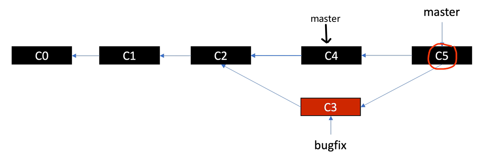
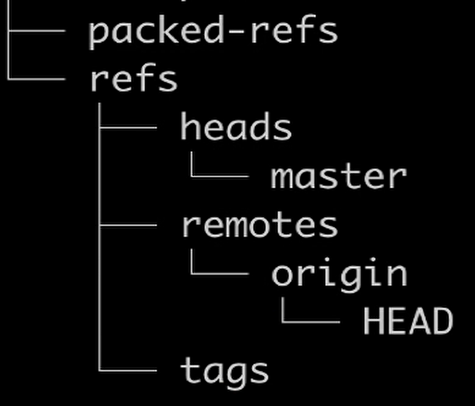

# Git 命令

```bash
// 代码仓库本地配置文件
.git/config
// 全局配置文件
~/.gitconfig

// 修改本地配置文件
git config user.name "demo"
git config user.email "demo@demo.com"

// 查看配置文件
git config -l
git config --global -l

// linux
tree .git 

// 把文件状态提交到index区，生成blob对象
git add 

// 比较工作区和索引区差异
git diff
// 比较索引区和代码仓库的不同
git diff --cached

// 查看文件类型
git cat-file -t 8d0e41
// 查看文件内容
git cat-file -p 8d0e41
// 查看文件大小
git cat-file -s 8d0e41

// 列出索引区文件
git ls-files
// 列出索引区文件及信息
git ls-files -s

// 添加远程仓库地址
git remote add origin https或ssh
// push 到远程 origin 仓库的 master 分支

git remote //显示远程仓库的名字
git remote -v //打印远程仓库origin的url（fetch、push）
git remote show origin //连接网络，检查远程仓库分支和本地分支的关联情况

```


```bash
// 查看分支
git branch
git branch -r // 查看远程仓库分支
git branch -a // 查看本地和远程分支

// 创建分支
git branch 分支名

// 切换分支
git checkout 分支名
// 创建并切换分支
git checkout -b 分支名
// Head 指向该commit，配合git checkout -b可以恢复误删的分支
git checkout 某个commit

// 删除分支（强制）
// 删除分支只是删除了指向该分支的指针，本身 commit、tree、blob 对象还在，称垃圾对象。git add 多次，只有最后一次，commit的时候，blob 对象会被引用。
git branch --delete 分支名

// 删除分支（没合并的话会提示）
git branch --delete 分支名

// 把之前操作 log 下来
git reflog

// 对当前仓库的对象进行压缩


```


```bash
ls -la

// 创建文件并写入内容
echo "hello git">hello.txt

// 查看文件大小
du -h
ls -lh
```


HEAD：理解成指针，永远指向当前工作分支，并且指向当前工作分支最新的一次commit

# Git 对象 (objects)

哈希值存储文件内容，对象类型。不存储文件名。哈希值 = 上一个文件夹名称 + 文件名。

哈希值计算（SHA1）：对象类型 文件内容长度\0文件内容

git add 产生 blob 对象	

git commit 产生 commit、tree 对象

## blog 对象

存储的是文件内容的压缩

git add 多次修改一个文件，最后只commit最新的，其他的blob对象都是垃圾对象（未引用）。


# Git Merge

## Fast Forward

```bash
// 创建新分支后，master 不动，合并新分支实质是让 master 移动指针指向新分支的 commit。先切换回 master 分支再 merge
git merge 新分支
```


## 3 way merge



3 way merge 会产生一个merge commit。如果 C3、C4 修改了同一个文件，merge 会有冲突，需要人工介入解决

## 3 way merge with conflict

如果 C3、C4 修改了同一个文件，merge 会有冲突，需要人工介入解决

## git rebase

git rebase master 同步master的commit，把dev分支的commit进行重写，sha1哈希值改变

# 本地分支和远程分支

git clone 之后，refs下面有remotes，远程分支被压缩在packed-refs。



查看：cat .git/packed-refs

head -> master, origin/master, origin/HEAD 表示本地分支和远程分支代码（clone时候的远程分支）是同步的

git fetch 检查本地远程仓库分支情况，并对每个分支进行代码同步，但不能删除本地有而远程分支没有的。要同步删除的话要用 git fetch --prune

git fetch （-v 详细信息）后 refs/remotes/origin 下多出一个master，这个是最新的。packed-refs 是滞后的。产生 .git/FETCH_HEAD （给 git pull 使用），使用fetch命令的分支提到最前面。

git branch -vv 查看本地分支和远程仓库分支的关联状态

git merge origin/master 同步本地远程分支到本地master分支

git pull 等于 git fetch 加 git merge origin/master，多产生一个 .git/ORIG_HEAD 方便回滚。哈希是当前分支merge之前的状态。


git gc 对象压缩


git push 使用前提是本地分支和远程分支已经关联

git push origin 新建分支

// 推送新建分支到远程仓库并关联

git push -u origin 新建分支 


# git hook 略

git 有很多操作，在这些操作之前或之后，可以触发特定的hook做特定的事情（如检查）。

Non blocking hook

Blocking hook,skippable

Blocking hook


#  略略略

- 标签Tag
- submodule
- worktree
- 30 / 35
- Git Pro

# 参考链接

- [简单对比git pull和git pull --rebase的使用 - 简书 (jianshu.com)](https://www.jianshu.com/p/478d912946df)
